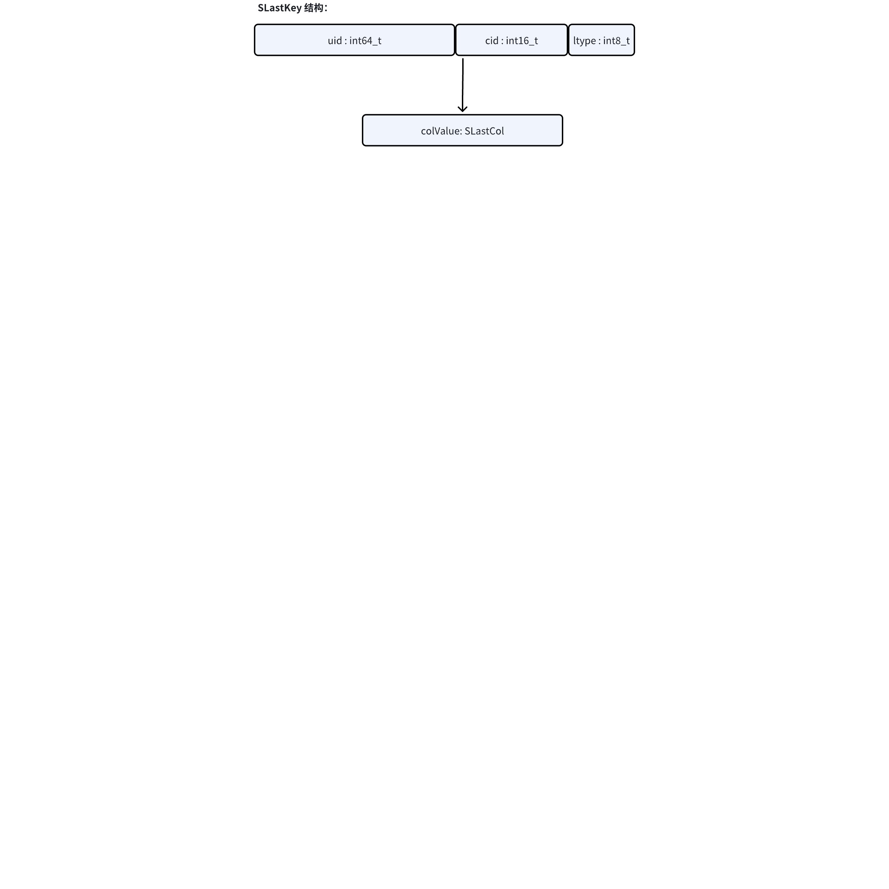
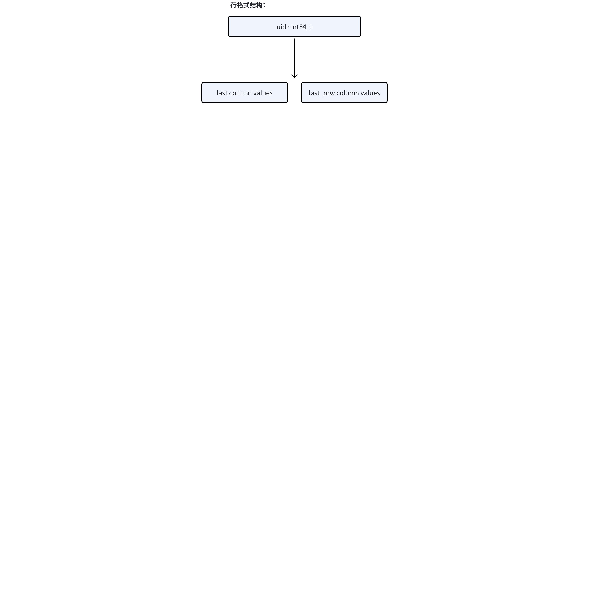

# 缓存行格式评估

## 1. 概述

目前缓存对每表每列的 last/last_row 值都需要在 LRU, RocksDB 里存储，所以在查询写入多列时，需要 LRU 进行多次哈希，每个列都需要一次；如果是写入线程，每个列需要两次（last, last_row 各一次）。
```cpp
enum {
  LFLAG_LAST_ROW = 0,
  LFLAG_LAST = 1,
};

typedef struct {
  tb_uid_t uid;
  int16_t  cid;
  int8_t   lflag;
} SLastKey;
```




如果修改为行格式结构，同一个表所有列所有类型的更新查询，只需要一次哈希。


## 2. POC 验证

使用数组存储 last/last_row 列值模拟常见情况下行格式的更新及查询逻辑。
查询使用 taosBenchmark 10 个线程，10 万次 last_row 子表查询，每表 68 列。
验证过程需要的执行的命令如下：
```cpp
POC 分支：git checkout fix/TD-32972
查询命令：taosBenchmark -f ~/TDengine/test/script/api/benchmark-json/last-query.json
写入一万表：taosBenchmark -f ~/TDengine/test/script/api/benchmark-json/insert.json.both.b1
写入十万表：taosBenchmark -f ~/TDengine/test/script/api/benchmark-json/insert.json.both.b2
```

### 2.1 一万表

Interlace = 1， vgroups = 1, subtable count = 10000, rows/table = 1000
百分比为：（3.0 分支数值 - poc 分支数值）/ 3.0 分支数值

| # | 3.0 | poc | % |
| --- | --- | --- | --- |
| 写入 | 325.56s | 193.80s | 67.98% |
| 查询 | 113.43s | 109.63s | 3.35% |

### 2.2 十万表

Interlace = 1， vgroups = 1, subtable count = 100000, rows/table = 100

| # | 3.0 | poc | % |
| --- | --- | --- | --- |
| 写入 | 3192.67s | 697.01s | 78.17% |
| 查询 | 108.19s | 103.02s | 4.78% |

## 3. 结论

查询：对查询延迟影响有限，CPU 占用降低 10%。
写入：表或列多时，对写入提升明显。
设计文档中需要考虑增删列场景，由一个中间索引数组完成 cid 到列值获取，需要多一次间接引用及多一个数组，无缓存直接查询加载部分列或列 ID 不连续时使用索引数组。需要考虑直接索引和间接索引的转换。
