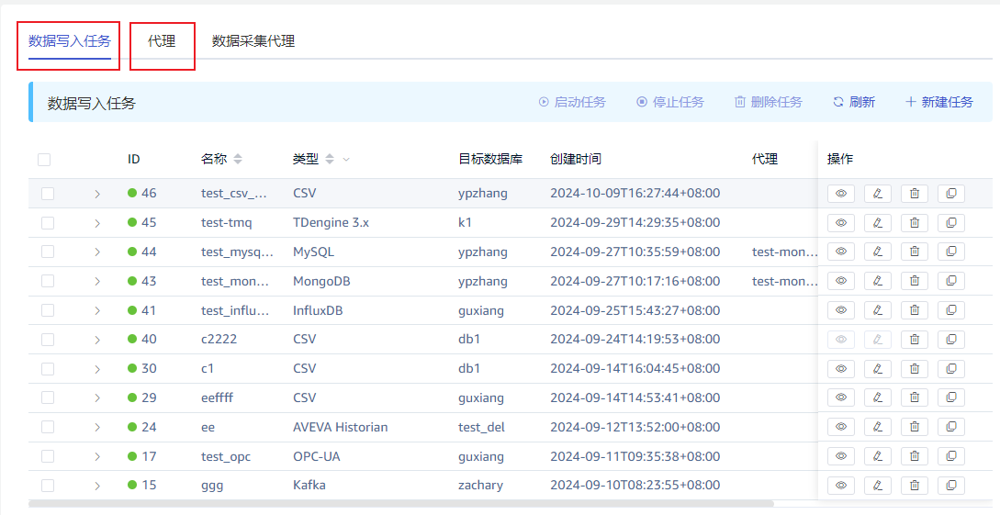
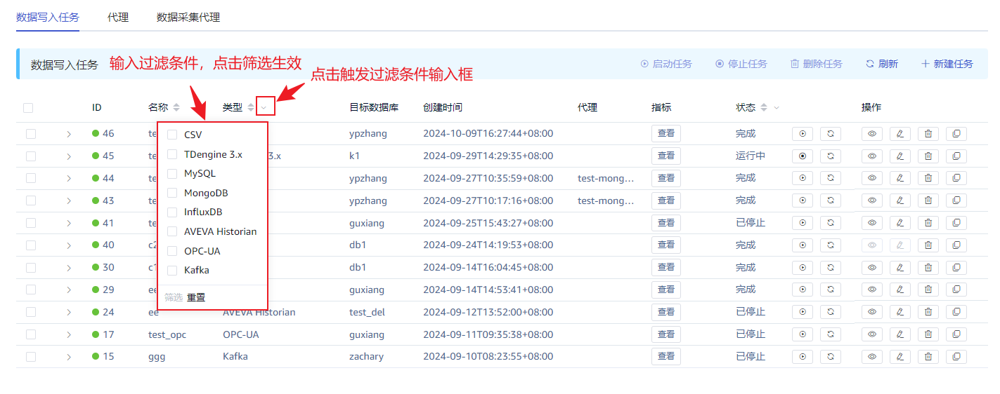
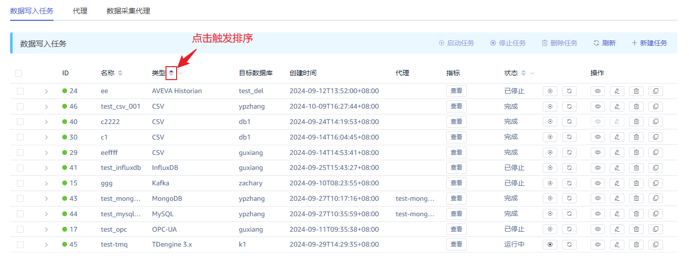

# Explorer 数据写入任务列表显示优化

## 1. 背景

Explorer 在一个页面中显示`数据写入任务`和`代理`列表，上下各占半屏，在可视区域只能显示几个数据写入任务，对于有几十个和上百个任务的场景，查看浏览非常麻烦。
交付组提出需求，希望改善此页面的交互体验：
1. 窗口可调节，可通过拖动控制窗口大小
2. 可对任务名称、状态等信息进行排序、过滤

TS-5322

## 2. 变更历史

| 日期 | 版本 | 负责人 | 主要修改内容 |
| --- | --- | --- | --- |
| 2024/10/09 | 0.1 | 周营昭 | 初稿 |
| 2024/10/10 | 0.2 | 周营昭 | 1. 规范用词 1. 调整部分 过滤、排序 规则 |

## 3. 定义 

**无**。

## 4. 行为说明

### 4.1 拆分数据写入任务列表和代理列表

使用不同 tab 页分别显示数据写入任务列表和代理列表，如下图所示。

### 4.2 数据写入任务列表过滤

设置过滤条件如下图所示：

支持过滤条件的列有类型、状态
1. 支持多选；
2. 多个列上设置的过滤条件叠加生效，and 关系。
3. 过滤条件输入框有`筛选`和`重置`按钮，选择过滤项后点击`筛选`触发过滤，点击`重置`清除当前列过滤条件。

### 4.3 数据写入任务列表排序

支持排序的列有：名称、类型、状态
1. 三个排序规则可相互叠加，按照操作顺序设置排序优先级，最近操作的列优先排序；
2. 按字段的显示值排序；
3. 可以选择正序或者倒序。

## 5. 性能

无。

## 6. 兼容性

无。

## 7. 运维

无。

## 8. 使用场景

1. 数据写入任务中有多个时，使用过滤条件，筛选关注的任务。比如只查看运行中的任务。

## 9. 约束和限制

无。

## 10. 常见错误和排查

无。

## 11. 可观测性

无。

## 12. 安装和卸载

无。

## 13. 文档

企业版文档修改数据源列表页面的说明。

## 14. 参考文档

无。
