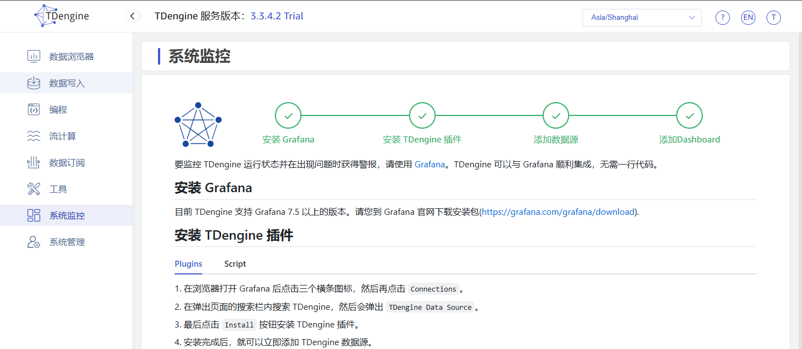
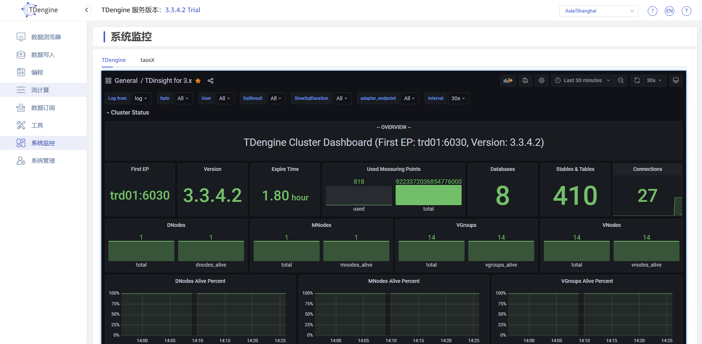
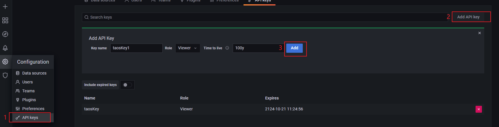
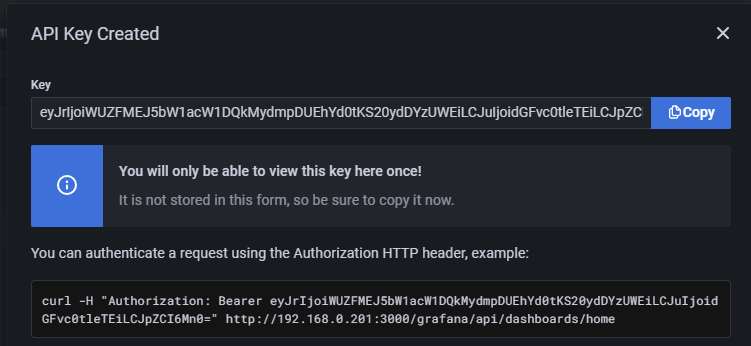
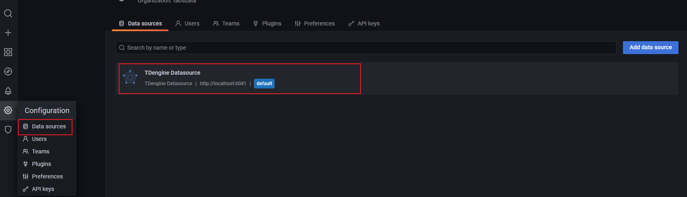
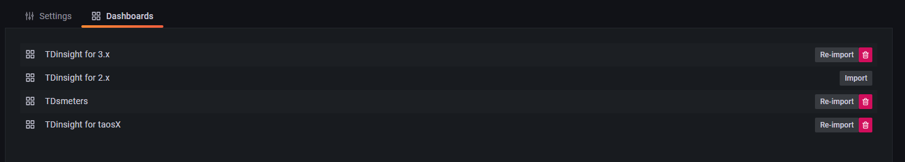
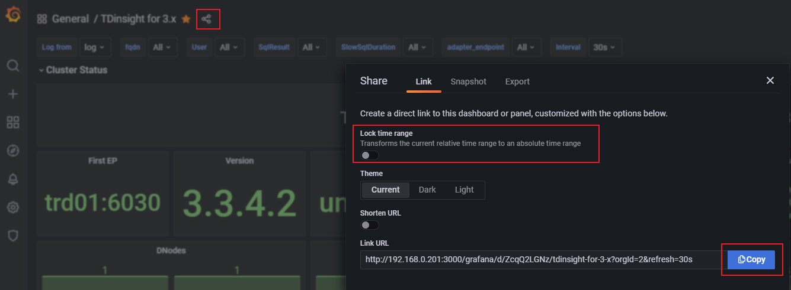

# Explorer 集成 grafana

## 1. 背景

在和玉溪卷烟厂的交流过程中，客户提出监控的两个问题，见 [TX-192](https://jira.taosdata.com:18080/browse/TX-192)：
1. 安全问题：grafana 自身的漏洞；
2. 用户需要登录多个系统才能看到监控。
为满足此需求，考虑使用 explorer 一站式管理 TDengine，将 grafana 集成到 explorer 中，免二次登录可查看 TDengine 相关运行情况；同时集成之后，利用 explorer 反向代理和运维手段解决安全问题。
**关联 jira**: 
TS-5583

## 2. 变更历史

| 日期 | 版本 | 负责人 | 主要修改内容 |
| --- | --- | --- | --- |
| 2024/11/18 | 0.1 | 周营昭 | 初稿 |

## 3. 定义

**反向代理**：反向代理服务器位于用户与目标服务器之间，但是对于用户而言，反向代理服务器就相当于目标服务器，即用户直接访问反向代理服务器就可以获得目标服务器的资源。同时，用户不需要知道目标服务器的地址，也无须在用户端作任何设定。

## 4. 行为说明

### 4.1 调整菜单

如图将 “数据浏览器” 在最前面；原 “面板” 菜单调整到系统管理上面，名称修改为 “系统监控”。


### 4.2 系统监控页面

TODO: 企业版，增加说明 如何配置内置 grafana.
如果没有配置 monitor 时，则系统显示原页面，引导用户去安装使用 grafana。如果配置了集成方式，则显示集成监控页面。下面展示集成 grafana 监控页面的具体步骤：
1. 在 explorer.toml 文件的 monitor / monitor.grafana 模块下增加配置项 `tdengine` 和 `taosx`。
```toml {wrap}
[monitor]
[monitor.grafana]
api_key = "XXXXX-YYYYYY"
tdengine = "http://ip:3000/d/ZcqQ2LGNz/tdinsight-for-3-x?orgId=2&refresh=30s&kiosk=tv"
taosx = "http://ip:3000/d/aCz_hYGHz/tdinsight-for-taosx?orgId=2&refresh=30s"
```

api_key 为在 grafana 系统中申请的 API keys。
tdengine 为 grafana 数据源 TDinsight 导入的 “TDinsight for 3.x” dashboard 的 link url。
taosx 为 grafana 数据源 TDinsight 导入的 “TDinsight for taosX” dashboard 的 link url。
配置数据来源参考 [7.1 获取 grafana 配置信息](https://taosdata.feishu.cn/wiki/GTeowSpabiYccUkKJ49crIJenUg#share-UmavdQT8DoS9YExGn9icR40KnEb)。
1. 监控页面展示


如图，根据配置的 tdengine 和 taosx 显示对应的监控 tab 页，每个 tab 页内加载配置的 dashboard url。

### 4.3 安装过程

安装过程中，询问是否内嵌 grafana: **TODO: 环境变量，供外部一键安装脚本控制下面的 y/n**
<quote-container>
Do you want to install the embedded grafana (y/n)? 
</quote-container>

默认为 n；如果选择 y，则安装内置的 grafana，并在启动之前对初装的 granfana 做以下默认配置：
1. Grafana 的安装路径为 /usr/local/taos/grafana
2. 添加 tdengine-datasource 到 grafana plugins 目录 `/usr/local/taos/grafana/plugins`。
3. 复制 grafana 配置文件 grafana.ini 至 `/etc/taos/grafana.ini`，并做以下修改：
```toml
[server]

## 5. If you use reverse proxy and sub path specify full url (with sub path)

root_url = http://${fqdn}:3000/grafana

## 6. Serve Grafana from subpath specified in `root_url` setting. By default it is set to `false` for compatibility reasons.

serve_from_sub_path = true

[security]

## 7. set to true if you want to allow browsers to render Grafana in a <frame>, <iframe>, <embed> or <object>. default is false.

allow_embedding = true

[paths]

## 8. Directory where grafana will automatically scan and look for plugins

plugins = /usr/local/taos/grafana/plugins
```

开启 sub path 的目的是方便 explorer 根据路径做反向代理，grafana 不再对外暴露服务端口，安全性在此体现。
1. 修改 start-all.sh/stop-all.sh 脚本，包含启动/停止 grafana 的指令 
```toml
grafana-server --config=/etc/taos/grafana.ini
```

## 9. 性能

无。

## 10. 兼容性

无。

## 11. 运维

### 11.1 获取 grafana 集成信息

安装完成后，如果要使集成 grafana 生效，必须通过以下运维过程才能生效。
1. 需要访问 `http://${fqdn}:3000/grafana` 来登录 grafana，创建只读的 API Key




将创建好的 Key, 配置在 explorer.toml 中
1. 从 TDengine datasource 引入 dashboards。






获取 dashboard link, 配置在 explorer 中。
<callout emoji="rocket" background-color="light-orange" border-color="light-orange">
此步骤可以省略，可以直接调用 api 接口来导入 dashboard，可以拿到 dashboard 的 uid，通过 uid 来组装 link url 即可，但是此时需要一个 非只读的 api_key，降低系统安全性。
</callout>

### 11.2 安全性增强

1. 启动 grafana 前可以修改默认的管理员名称和密码
2. 配置防火墙，拒绝外部访问 3000 端口 / 监听地址限制为 127.0.0.1
3. API Key 配置为只读

## 12. 使用场景

1. 安装 TDengine 内置的 grafana
   - 安装过程，同意安装内置的 grafana
      - 配置数据源连接
      - 配置 dashboard
   - 启动 TDengine, start-all.sh
   - 使用默认的用户名密码登录 grafana创建支付 API Key，配置到 explorer.toml 中
   - 导入 TDinsight 3.x for td3 和 TDinsight for taosx，获取 link url, 配置到 explorer.toml 中
2. 集成已有的 grafana
   - 安装过程，不安装内置的 grafana
   - 访问现有的 grafana，创建 API Key，配置到 explorer.toml 中
   - 添加 TDengine datasource，
   - 导入 TDinsight 3.x for td3 和 TDinsight for taosx，获取 link url, 配置到 explorer.toml 中

## 13. 约束和限制

无。

## 14. 文档

需要修改企业版文档，增加配置的说明。

## 15. 常见错误及排查

### 15.1 服务器已有 grafana，但是有安装了内置的 grafana

### 15.2 Grafana 未正常启动

## 16. 附录

总的实现思路是使用 explorer 作为反向代理服务器，将 `/grafana` 开头的请求转发到本地端口为3000的grafana服务，需要支持 http/ws 请求转发。在转发时添加 header `Authorization`。
