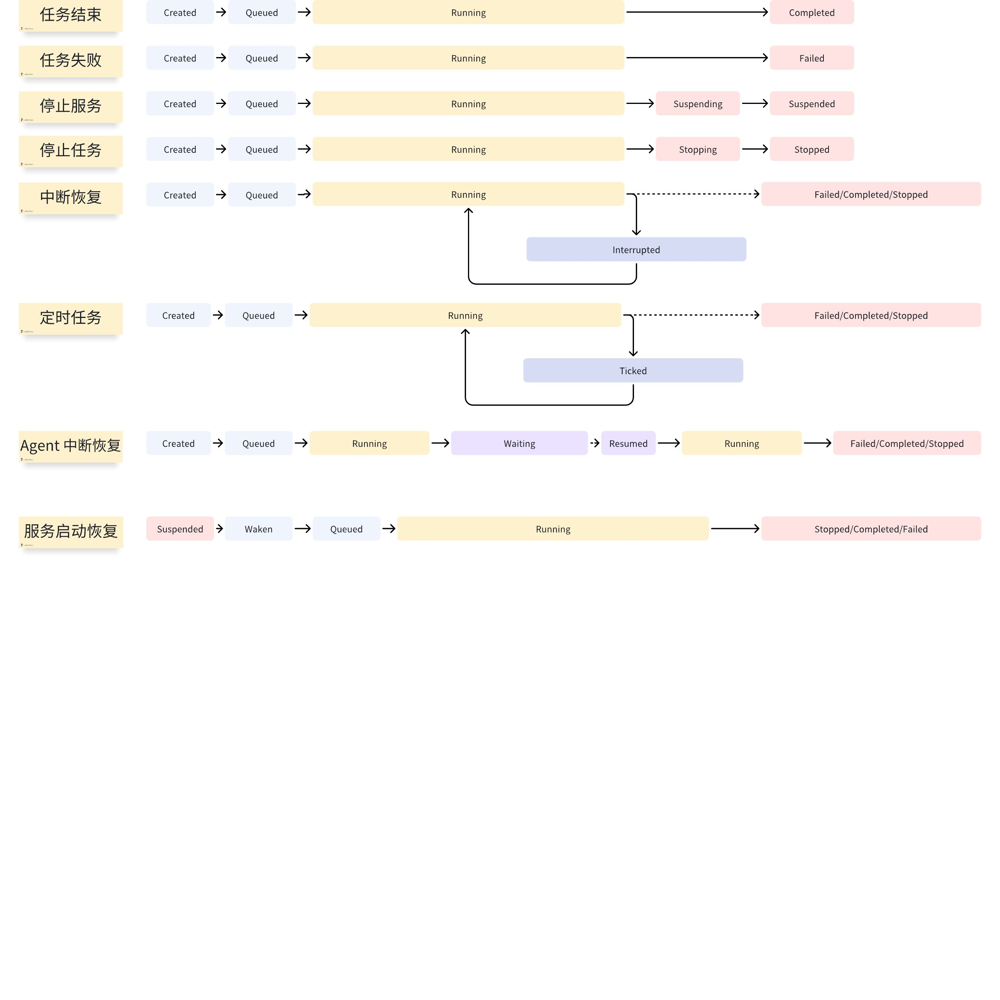
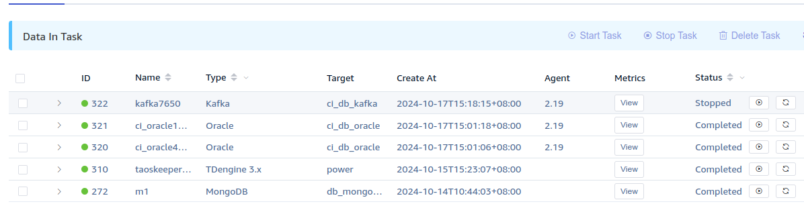

# FS - taosX 数据源任务状态优化

## 1. 背景

中提出，当环境异常，如 taosd 异常，taosadpter 异常，数据源异常，taosx 和 taosadpter 网络异常时，期望能有更合适的状态描述。
TD-31906

### 1.1 当前任务状态说明

taosX 使用 tokio-cron-scheduler 调度器进行任务计划和状态管理。
当前支持配置三种任务类型：
- 单次执行（oneshot）任务：CSV 导入属于单次执行的任务类型。
- 循环执行（repeated）任务：即使发生异常，仍然重试执行不中断。MQTT、Kafka 等数据源写入，都属于永久执行任务，期间发生任何形式的异常，均会重启。
- 计划（sheduled）任务：根据一定的周期执行的特定任务，如备份。
根据任务执行需要，在当前实现中，总计有 14 种任务状态，按类型分为以下几种：
- **初始状态**：
  - `created`，每个任务创建时，其初始状态为 `created`。
  - `waken`：当任务从上次 t aosx 服务停止后恢复时，`suspended` （当前数据库中运行状态的任务也被视为 suspended）状态的任务首先进入 `waken` 状态，之后排队进入调度器。
- **运行状态（**或称**调度状态）**：
  - `queued`，当一个任务进入任务调度器后，其后续状态由任务调度器进行管理，任务调度器的起始状态为 `queued`，从第一次进入调度器后，任务将在运行状态和结束状态中轮转，不会再进入初始状态。
  - `running`：一个任务被调度器触发执行，此时任务真正开始运行。
  - `ticked`：在一个定时任务或重复任务中，执行当前任务结束且无错误，标记为 `ticked`。此时任务仍然由调度器进行管理，在达到下一次触发条件后进入 `running` 状态。
  - `interrupted`：在一个定时任务或重复任务中，执行当前任务失败并报错，标记为 `interrupted`。此时任务仍然由调度器进行管理，在达到下一次触发条件后进入 `running` 状态。
  - `waiting/resumed`：仅用于使用 Agent 的任务，用于指示 Agent 断开与恢复。
  - `stopping`: 任务被前端停止运行，任务首先进入 `stopping` 状态。
  - `suspending`：有两种情况任务会被挂起，
      - 任务从其他运行时态被 Ctrl-C 或 systemctl stop 中止运行，状态立即转为 `suspending` 状态，并迅速进行资源清理等其他优雅中止操作，结束后状态转为 `suspended`。
      - 在任务执行过程中，企业版授权或连接器授权过期，任务也将被挂起。
  `stopping` 和 `suspending` 状态比较特殊，是任务清理时的中间状态，此后任务将进入结束状态，不再进行调度。
- **结束状态**：任务在结束状态下，表示已被移出调度器，在没有人工干预情况下，状态不会改变。
  - `completed`：单次任务或可结束的任务执行成功且不报错。
  - `failed`：单次任务或可结束的任务执行失败并报错。
  - `stopped`：任务被前端停止运行，在资源清理和后台任务执行完毕后，进入 `stopped` 状态。
  - `suspended`：任务从运行状态授权过期，或被 Ctrl-C / systemctl stop 中止运行。
通常情况下，由 taosx 服务停止产生的 suspending/suspended 状态不会持续（因为服务停止后前端也不会再获得状态变更），在前端观察到的 suspending/suspended 状态都是由授权检查错误引起的。
结束状态下，必须由用户手动启动任务，任务才能再次进入调度器，从 `queued` 状态开始进行轮转。
`suspended` 的任务，会在下次服务启动时自动恢复运行，即使挂起原因是授权过期，但在授权未更新情况下，任务仍然会回归 `suspended` 状态。
常见任务状态轮转场景包括：


#### 1.1.1 需要注意的情况

1. Stopping/stopped 状态总是由前端触发的。
2. 前端可见的 Suspending/suspened 状态的原因是授权过期。
3. 结束状态都可以被启动。
4. 运行状态除 `stopping`/`suspending` 这两个中间状态外都可以被停止。

### 1.2 本次优化要解决的问题

本着异常“早发现、早提示”的原则和应对用户对于数据写入链路中各组件异常的识别要求，本次优化主要解决调度状态中显示为运行中（running），但实际上某个组件已经发生了异常的**用户感知**问题。
参考 Kubernetes 等成熟软件的做法，我们将在 taosX 调度器中增加 “**任务健康状态**” 组件，提供异常观测能力，并打通告警流程（基于 taosKeeper）。因为我们当前无法把任务运行中但组件异常这种组合作为一种调度时状态，在任务状态这个范畴内修复需要花费难以预料的时间和精力，甚至可能仍然无法彻底解决问题。引入健康状态组件，可以将任务的调度和执行分离，使其作为调度时状态的有效补充，同时避免歧义。

## 2. 变更历史

注：版本变更规则，初始版本为 0.1，中间若经过几次较大修改要增加版本号为 0.2， 0.3，最后定稿时的版本号为 1.0，以下为示例

| 日期 | 版本 | 负责人 | 主要修改内容 |
| --- | --- | --- | --- |
| 2024/10/22 | 0.1 | 霍琳贺 | 初稿 |
| 2024/12/25 | 1.0 | 霍琳贺 | 增加 Active 和 Pending 状态 |
|  |  |  |  |
|  |  |  |  |

## 3. 定义

- **任务调度器**：负责管理和控制自动化任务的执行顺序和时间。主要功能包括：任务调度、依赖管理、错误处理、资源管理、日志和审计 、性能监控等。
- **任务状态**：调度器负责将不同功能如数据源写入、备份、同步等进行任务调度，并提供任务状态、运行指标等可观测项。本文档后续优化所涉及的任务状态集中在**调度状态，**即在调度器中管理的任务状态。

## 4. 行为说明

### 4.1 健康状态

taosX 支持的数据源类型和连接方式多种多样，为了兼容所有数据源，我们将健康状态分为可枚举的模式和描述两部分：
- 模式：健康状态包含以下模式：
  - Inital：初始化，表示任务启动但尚未进行数据源和目标端健康检查。
  - Ready：数据源和目标端健康检查通过，可以进行数据读取和写入。
  - Active: 表示有数据写入。
  - Idle：表示最近一段时间内（可配置）无数据处理（没有数据进入处理流程）。
  - Pending: 表示最近一段时间内有数据处理，但没有实际入库数据，出现这个状态可能意味着目标端问题。
  - Busy：表示写入队列已满（超出一定阈值，表示写入繁忙，在一定程度上意味着当前可能存在性能瓶颈，需要调整参数或配置等来进行改善，但并不说明存在错误）。
  - Bounce：数据源和目标端均正常，但在写入过程中存在错误，可能意味着存在非正常数据或正在发生数据丢失。
  - SourceError: 数据源错误导致无法进行读取。此时工作负载将尝试重连数据源。
  - SinkError：写入端错误导致无法进行写入。此时工作负载将尝试重连数据库，并恢复状态。
  - Fatal：无法恢复的错误，此时数据写入任务将退出。调度器进入 Interrupting 状态（新增），待本次执行资源清理完毕后，任务进入 Interrupted 状态，等待下一次任务调度（根据数据源的执行策略，可能需要手动执行或在一段时间或继续执行任务）。
  以上状态在同时发生时，其优先级为 SinkError > SourceError > Bounce > Busy=Active=Idle > Ready > Initial。除 Initial 和 Ready 之外，各模式之间没有先后顺序。
- 描述：描述当前模式下的原因，如不同的数据源错误类型、不同的写入错误类型等。

### 4.2 Explorer 数据源健康状态

在 Data-In Task 页面，Status 当前状态显示页面，调度状态之后增加健康状态显示，如 `Running(SinkError: Connection timeou``d``t for 1m)`，显示优先级最高的状态。任务 ID 前使用新的颜色状态（见健康状态模式中定义）标识任务健康状态。
新增一列，将各种异常作为标签展示。


TODO2: 展开任务，展示健康检测时段内的活动记录。

### 4.3 Explorer 新增数据源高级选项列表添加健康状态监测项

- 健康监测时段：可选项，表示对最近多长时间的任务状态进行统计，输入内容格式为 Duration。单位为秒。此时段对健康状态各种模式统一生效。
- Busy 状态阈值：百分比，表示写入队列中入队元素数量与队列长度之比，默认 100%。API 中对应的值使用小数，将百分比转为 0-1 之间的小数数值表示，如 12% -> 0.12, 100% -> 1.0 。
- 写入队列长度：表示一个 IPC 连接对应的写入队列长度最大值。
- 写入错误阈值：数值类型，表示健康监测时段中允许写入错误的数量。超出阈值，则报错。

### 4.4 ~~Explorer 任务新增指标~~

- `~~health~~`~~: 健康状态的模式对应的数值表示（在实现时添加此列表）。~~

## 5. 性能

本次优化不影响性能。

## 6. 兼容性

本次优化不产生破坏性修改。

## 7. 运维

无变化。

## 8. 使用场景

1. ~~通过 Health 指标计算连续异常的时间窗口，以便在 Grafana 等监控平台展示或告警。~~
  ```sql {wrap}
  taos> select _wstart, _wend, health, count(*) from (select _c0, cast(health as int) as health from taosx_task_tdengine3 where task_id = 310) state_window(health);
           _wstart         |          _wend          |   health    |       count(*)        |
  ==========================================================================================
   2024-10-15 15:23:15.076 | 2024-10-15 15:23:35.076 |           0 |                     3 |
  Query OK, 1 row(s) in set (0.002024s)
  
  ```

## 9. 约束和限制

无。

## 10. 常见错误和排查

1. `Idle`: 在监测时段内没有数据处理（读取或写入），如果这是异常情况需确认数据源有可用数据，网络等组件正常。
2. `SinkError：Create new object timedout`：建立数据库连接超时。
3. `SourceError: Kafka operation timeout`: 数据源操作超时，等待重建订阅客户端。

## 11. 可观测性

见 4. 

## 12. 安装和卸载

无变化。

## 13. 文档

需要修改企业版文档

## 14. 参考文档

### 14.1 API 变更

1. 扩展 Task 对象的 trigger 字段如下，增加 `health` 对象进行配置：
  ```json
  {
    "id": 1,
    "name": "null",
    "from": "tmq:///test",
    "to": "local:/path/to/backup/test",
    "last_modified_at": "2024-12-12T12:37:35.285Z",
    "status": "string",
    "trigger": {
      "health": {
        "health_check_window_in_second": 60,
        "health_check_interval_in_second": 5,
        "busy_threshold": 1,
        "max_queue_length": 1000,
        "max_errors_in_window": 10,
        "repeat_errors": false,
        "broadcast_capacity": 64
      },
      "schedule": null
    }
  }
  ```

1. 扩展 Activities 对象，`status` 字段增加 `health` ，对应的 `activity` 字段为当前的 健康状态：
  ```json
  {
    "at": "2024-12-12T12:53:11.020Z",
    "context": "string",
    "id": 0,
    "level": "error",
    "activity": "prepare",
    "status": "health"
  }
  ```

**Note: 用户手册中尽量不出现设计方案或实现相关的内容。**
