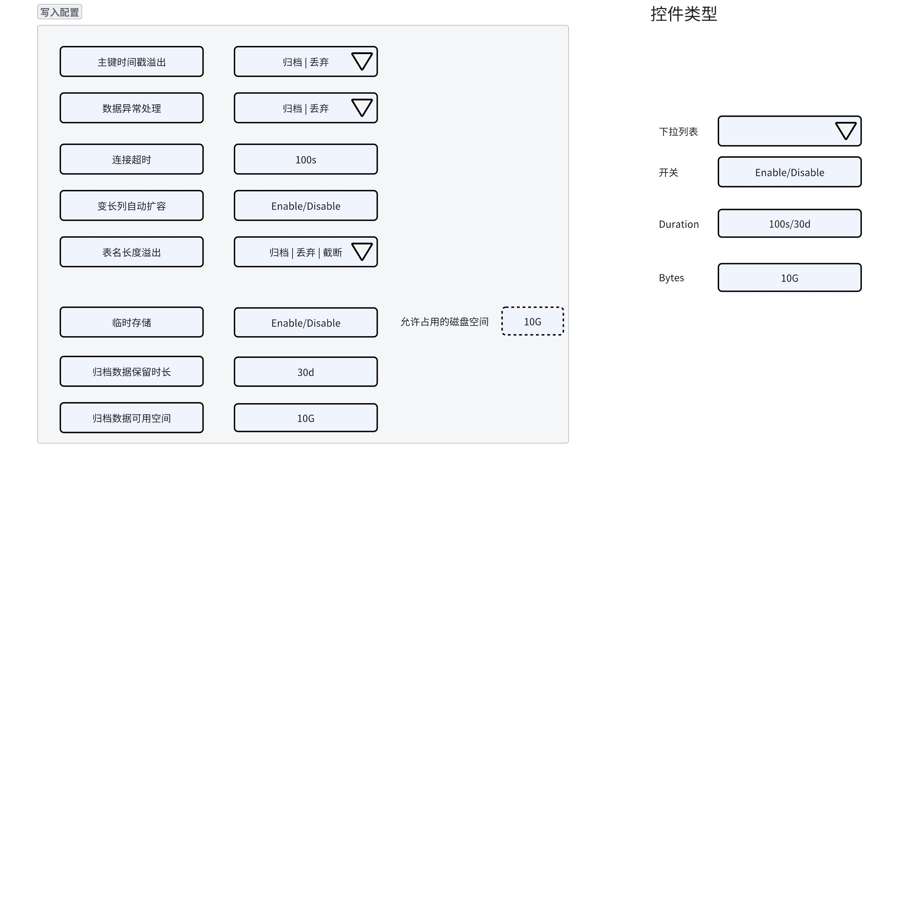
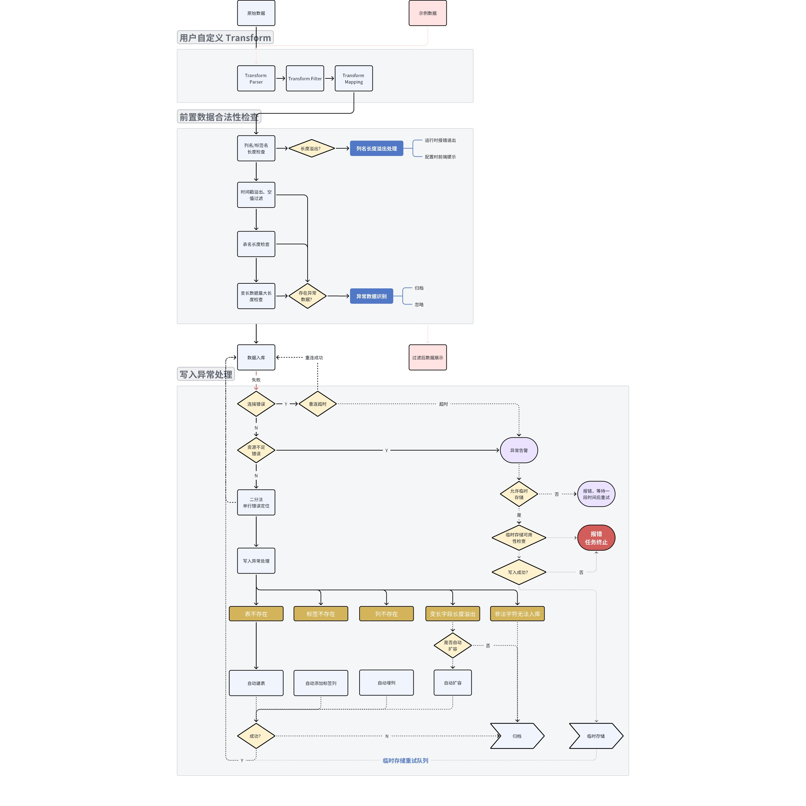

# FS - 写入异常处理

## 1. 背景

随着 taosX 被越来越多的客户使用，taosX 中 ETL 属性中缺失或不足的部分逐渐暴露和引起重视，客户对 taosX 的稳定性和数据完整性等也提出了要求（比如在河北电力、一汽红旗、中科创达等客户中，均存在写入异常，对于异常数据的处理当前是丢弃整批，这是不可接受的）。
本文档提出 taosX 中异常数据写入的处理方案，主要解决以下问题：
- 对于不符合入库条件的数据（如时间戳异常等），应可归档、提示或丢弃。
- 对于写入失败的数据（如表名超长、数据超长等），应可归档和提取。
  - 对于以上数据异常导致的写入失败，应对当前批次进行数据处理，正常数据仍然入库，仅对其中异常的数据进行归档、提示。
- 对于因目标数据库无法连接或内存、磁盘不足而写入失败的情况，提供临时存储选项并告警，在连接恢复后继续写入。
  - 任务停止时应当进行持久化，在任务恢复后继续写入。
  - 是否进行临时存储应当由数据源特性决定，但可由前端配置。如：
    - Kafka 数据源默认不进行临时存储，目标库无法写入时告警。
    - MQTT 数据源默认进行存储，否则会造成数据丢失。
当前方案不尝试解决的问题：
1. 因断电、强制退出等问题导致的（可能的）数据丢失、数据不完整等情况。
2. 因写入精度、重复时间戳等造成的数据丢失或覆盖，需要通过使用更高精度的数据库、调整数据模型或使用复合主键等解决。
3. 因入库模型所设置的类型转换造成的数据丢失，如非数值字符串数据入库列配置为数值类型等（转换结果为 空）。

## 2. 变更历史

注：版本变更规则，初始版本为 0.1，中间若经过几次较大修改要增加版本号为 0.2， 0.3，最后定稿时的版本号为 1.0，以下为示例

| 日期 | 版本 | 负责人 | 主要修改内容 |
| --- | --- | --- | --- |
| 2024/10/16 | 0.1 | 霍琳贺 | 初稿 |
|  |  |  |  |
|  |  |  |  |
|  |  |  |  |

## 3. 定义

- ETL：ETL 代表提取（Extract）、转换（Transform）和加载（Load），是组织将多个系统中的数据合并到单个数据库、数据存储区、数据仓库或数据湖中的传统方法。ETL 可用于存储旧数据，也可用于汇总数据以进行分析并制定业务决策（这是如今更为常见的用途）。  taosX 正在向可靠的 TDengine ETL 方向努力。
- 时间戳异常：TDengine 每个数据库都有允许写入时间戳限制，由参数 KEEP 决定。keep 参数有 keep1/keep2/keep3 三个结果，taosX 使用 now - keep1 作为允许的最早时间戳。最大时间戳是 now + 100years。即一个数据库允许写入时间戳为：(now - keep1, now + 100y) 开区间。
- 精度：来源数据的时间戳精度不确定，通常情况下为毫秒、纳秒，taosX 支持所有精度的元数据时间（如日期、时、分、秒等，个别情况需要配置 Transform 进行解析）。目标 TDengine 数据库支持毫秒、微秒、纳秒。taosX 在入库时将时间戳转换为数据库精度，如果源数据精度更高，可能造成数据覆盖、丢失。
- 数据限制：taosX 数据写入受限于 TDengine 自身。
  - 表名最大长度为 192 字节，不包括数据库名前缀和分隔符**：超出长度无法入库**。
  - 每行数据最大长度 48KB（从 3.0.5.0 版本开始为 64KB） （注意：数据行内每个 BINARY/NCHAR 类型的列还会额外占用 2 个字节的存储位置）**：超出长度无法入库**。
  - 列名最大长度为 64 字节：**通过 UI 创建则是确定的**。
  - 最多允许 4096 列，最少需要 2 列，第一列必须是时间戳：**通过 UI 创建则是确定的**。
  - 标签名最大长度为 64 字节：**通过 UI 创建则是确定的**。
  - 最多允许 128 个，至少要有 1 个标签，一个表中标签值的总长度不超过 16KB**：超出长度无法入库**。

## 4. 行为说明

### 4.1 Transform UI 增加写入策略

Transform 添加多项写入策略配置选项（默认整体折叠，在高级选项之后）：


包括：
1. **主键时间戳溢出**：表示时间戳溢出时的操作，可选：归档、丢弃、报错。默认：归档。
2. **主键时间戳空值**：表示时间戳为空时的操作，可选：使用当前时间、归档、丢弃、报错。默认：归档。
3. **复合主键列空值**：表示复合主键列为空时的操作，可选：归档、丢弃、报错。默认：归档。
4. **数据异常处理**：因数据本身无法入库导致失败时的数据行为，当前支持 归档 、丢弃、**报错** 三种。默认：归档。
5. **连接超时**：目标数据库连接超时，默认为 30s。
6. **变长列自动扩容**：启用时，VARCHAR/VARBINARY/NCHAR 列自动扩容到可入库的长度。默认为 true 。
7. **变长列长度溢出**：表示变长列长度溢出时的操作，当前支持截断、归档、截断及归档、丢弃、**报错**。默认：归档。当变长列自动扩容启用时，长度限制为 65531 （二进制长度），不启用时，为当前表结构中的设定长度。变长列操作对标签列和普通列均生效。
8. **表名长度溢出**：表示当表名长度溢出时的操作，当前支持 归档、丢弃、截断、截断及归档、**报错**。默认：归档。
9. **表名非法字符**：表示当表名包含非法字符时（如 `.` ）的处置策略，可选：替换为指定字符或字符串、丢弃、归档、**报错**。默认：替换为 `_`。
10. **表名模板变量空值**：表示当表名模板中变量为空时的处置策略，可选：替换为指定字符串、留空、丢弃整行。 默认：替换为 `NULL`。
11. **临时存储**：启用时，需配置允许占用的磁盘空间，最小为 1G，最大为 65535 G，配置为 0 表示无限制。默认无限制。默认路径是 ： `$DATA_DIR/tasks/:id/cache`
12. **归档数据保留时长**：配置以上操作配置为 归档 时，归档文件的最大保留时长。默认 30 天。配置为 0 表示无限制。
13. **归档数据可用空间**：归档文件的最大可用磁盘空间，最小为 1G，最大为 65535G，配置为 0 表示无限制。默认无限制。默认路径：`$DATA_DIR/tasks/:id/archived`
14. **归档数据写入失败**：删除旧文件、报错或丢弃**。**
当前不支持，可在后续优化中继续添加其他有用的配置项，例如：
1. 表名区分大小写。默认打开，表示区分大小写（区分大小写是当前行为）。
2. 列名区分大小写。默认打开，表示区分大小写（列名区分大小写是当前行为）。
3. 标签名区分大小写。默认打开，表示区分大小写（标签名区分大小写是当前行为）。
4. SQL 写入并发数。
5. 写入策略。如仅 SQL、STMT、STMT2 、RawBlock 等。默认为自动选择合适的写入策略。
<callout emoji="bread" background-color="light-orange" border-color="light-orange">
NOTE：临时存储方案可能无法在 1231 版本完成。
</callout>

### 4.2 默认写入行为



如上图所示，异常数据处理模块分为两部分：**前置数据合法性检查**和**写入异常处理**。

#### 4.2.1 前置数据合法性检查

包括：
1. 列名/标签名检查（使用 UI 创建可以忽略此步骤，因为列名和标签名是提前建好的，命令行则不可忽略）。
2. 时间戳检查：时间戳溢出（超出最大或最小允许写入的时间戳）或空值（主键时间戳不可为空）。
3. 表名长度检查：表名长度受限，需要根据配置策略做不同的处理，如截断、忽略、归档等。在 Transform 创建过程中出现的表名长度溢出
4. 变长数据长度检查：变长数据长度受限，需要根据配置策略做不同处理。

#### 4.2.2 写入异常处理

写入异常指的是在写入过程中的错误，包括数据库连接异常、数据库资源不足或状态异常导致无法写入及其他数据写入错误。
1. 数据库连接异常：包括   | 0xE002 | 0xE003 | 0xE004 | 0x000B 错误码，表示当前无法连接到 TDengine。
2. 数据库状态异常：包括 0x000C | 0x0022 | 0x0126 | 0x0102 | 0x0101 | 0x0105 | 0x012E | 0x03B1 等，包括 Out of memory（dnode out of memory 等内存错误）、No enough disk space（Out of disk space、No disk space for tsdb 等磁盘空间不足错误）、RPC 错误（rpc open too many session）、VGroup 错误（sync is not leader）等。
3. 数据格式不符：
   - 数据库不存在：发生删除时，写入可能报数据库不存在，此时写入报错。
   - 超级表不存在：包括 0x2603 0x0618 0x2662 等错误码，此时应当自动建表。
   - 表不存在：此时应当自动建表。
   - 标签列不存在：此时应当自动创建标签列。
   - 标签列值超出设定长度：此时应当根据用户自定义入库策略 **变长列自动扩容** 选项决定扩容或归档等。
   - 标签列已存在，但类型不匹配：根据 **数据异常处理 **策略配置，归档或忽略，并告警。
   - 普通列不存在：此时应当自动加列。
   - 列值超出设定长度：此时应当根据用户自定义入库策略 **变长列自动扩容** 选项决定扩容或归档等。
   - 列类型不匹配：根据 **数据异常处理 **策略配置，归档或忽略，并告警。

## 5. 性能

1. 一批数据中如果存在异常数据且批次行数较大，查找异常数据的过程会比较耗时，如果每批都有异常数据，会显著降低写入性能，建议这种情况下对数据源提前进行过滤（在源端或者 Transform 过滤器中配置）。
2. 异常数据归档也可能导致写入性能降低。
   - taosX 与 TDengine 共享资源时，写入会互相影响。
   - 本地磁盘性能变差时或 IO 高时， taosX 也会受到影响。

## 6. 兼容性

无。

## 7. 运维

### 7.1 磁盘空间

归档存储和临时存储均会导致磁盘空间占用增加。

## 8. 使用场景

### 8.1 Kafka 数据同步，允许下游不可达时暂停消费

用户配置不允许临时存储，taosX 使用 AtLeastOnce 的写入方式，在下游不可达（连接中断、资源不足等）时报错提示用户任务异常，暂停消费等待下游恢复。

### 8.2 MQTT 无持久化存储，依赖 taosX 临时存储避免数据丢失

MQTT 下需要依赖 taosX 的临时存储，在下游不可达时写入临时存储以避免产生数据丢失。

## 9. 约束和限制

### 9.1 类型转换

taosX 中的类型转换是隐式完成的，即：对于允许转换的类型，如果数据中包含不可转换为目标类型的数据，直接转为空值。taosX 中允许转换的类型包括：

| 源类型 | 数据库类型 | 转换结果 | 备注 |
| --- | --- | --- | --- |
| bool | 字符串类型 | `true` => `‘1’` `false` => `'0'` |  |
| String | bool | `true` | `yes` | `on` | `1` => `true` `false` | `no` | `off` | `0` => `false` |  |
|  | 数值类型 | `123` 整数可以转为整型和浮点类型，溢出为 NULL `1.23` 浮点数可以转为浮点类型，溢出为 NULL `1e1` 科学计数法可以转换为 float/double 但不可以转为整型 |  |
|  | 时间戳 | - 可以自动识别 RFC3339 字符串格式 - 可以自定义格式化字符串识别特殊字符串格式时间戳，如 `19/02/28 18:00:59` strformat |  |
| 数值类型 | 字符串类型 | 转为数值类型的 `{}` 默认格式化形式 |  |
|  | 其他数值类型 | 强制转换，可能发生精度丢失 |  |
|  | bool | 1 => `true`, 0 => `false`, else => NULL |  |
|  | 时间戳 | 仅整型可转换为时间戳，根据整型大小作为秒、毫秒、微秒或纳秒转换为对应数据库精度的时间戳。可能存在精度丢失或非预期的精度。 > 1000 * 1000 * 1000 * 86400 * 365: 视为纳秒 > 1000 * 1000 * 86400 * 365: 视为微秒 > 1000 * 86400 * 365: 视为毫秒 其他情况均视为秒 | 阈值在 arrow-cast-guess-precision 中可查 |
| 时间戳 | 字符串 | RFC3339 格式，0 时区 |  |
|  | 数值类型 | 时间戳先转为 i64，再转为其他数值类型 |  |

## 10. 常见错误和排查

1. 连接超时错误：检查 taosX -> TDengine 链路中各组件的服务状态。
2. HTTP 500 错误：websocket 连接无法访问，通常是负载均衡组件错误。
3. 其他错误类型参考 [FS-写入异常处理](https://taosdata.feishu.cn/wiki/TY2vwP511ikOkfkQL0zcHscknJf)4.2.2

## 11. 可观测性

1. 增加一个指标用于归档行数。
  ```yaml {wrap}
  archived_rows: 本次执行归档数据行数。
  total_archived_rows: 当前任务归档数据总行数。
  ```

## 12. 安装和卸载

无影响。

## 13. 文档

修改企业版文档

## 14. 参考文档

- [命名与边界 | TDengine 文档 | 涛思数据](https://docs.taosdata.com/reference/taos-sql/limit/#%E4%B8%80%E8%88%AC%E9%99%90%E5%88%B6)
- [cast_ with_ options](https://docs.rs/arrow/latest/arrow/compute/fn.cast_with_options.html)

## 15. 附录

### 15.1 配置项及可选参数

新增配置见下方 json 中的标记内容：
```json
{
    "parse": {
        "payload": { "json": ["value::double"] },
        "ts": { "as": "timestamp(ns)", "with": "%F %T%.f", "tz": "UTC" }
    },
    "mutate": [
        { "filter": ["a > b && c != 0"] },
        { "map": { "new1": { "sum": ["a","b"], "as": "INT" }, "new2": { "join": ["a","b"], "with":"&&" } } },
        { "extract": { "payload": { "json": "" } } }
    ],
    "model": {
        "name": "{topic}",
        "using": "mqtt",
        "tags": ["topic"],
        "columns": ["ts", "value", "qos"]
    },
    "global": {
        "identifier_case_insensitive": false,
        "replace_dot_in_table_name": "_",
        "written_protocol": "auto",
        "written_method": "concurrent",
        "written_concurrent": 4,
        "workers_per_vgroup": 4,
        "null_values": "null",
        "database_connection_error": "cache",
        "database_not_exist": "archive",
        "table_not_exist": "archive",
        "primary_timestamp_overflow": "break",
        "primary_timestamp_null": "use_current_time",
        "primary_key_null": "break",
        "table_name_length_overflow": "truncate",
        "table_name_contains_illegal_char": {"replace_to": "_"},
        "variable_not_exist_in_table_name_template": "leave_blank",
        "field_name_not_found": "break",
        "field_name_length_overflow": "truncate",
        "field_length_extend": true,
        "field_length_overflow": "truncate_and_archive",
        "ingesting_error": "archive",
        "connection_timeout_in_second": 10,
        "cache": {
            "max_size": 1024,
            "location": "/cache",
            "on_fail": "skip"
        },
        "archive": {
            "keep_days": 10,
            "max_size": 1024,
            "location": "/archive",
            "on_fail": "delete_old_files"
        }
    }
}
```

配置项可选参数：

| **配置项** | **中文释义** | **默认值** | **可选参数** |
| --- | --- | --- | --- |
| database_connection_error {color="LightGreenBackground"} | 目标库连接超时 | “cache” | archive：归档 skip：丢弃 break：报错 cache: 缓存 |
| database_not_exist | 目标库不存在 | "break" | archive：归档 skip：丢弃 break：报错 |
| table_not_exist | 表不存在 | "retry" | archive：归档 skip：丢弃 break：报错 retry: 重试，自动建表 |
| primary_timestamp_overflow | 主键时间戳溢出 | "archive" | archive：归档 skip：丢弃 break：报错 |
| primary_timestamp_null | 主键时间戳空 | "archive" | archive：归档 skip：丢弃 break：报错 use_current_time：使用当前时间 |
| primary_key_null | 复合主键空 | "archive" | archive：归档 skip：丢弃 break：报错 |
| table_name_length_overflow | 表名长度溢出 | "archive" | archive：归档 skip：丢弃 break：报错 truncate：截断 truncate_and_archive：截断且归档 |
| table_name_contains_illegal_char | 表名非法字符 | {"replace_to": "_"} | archive：归档 skip：丢弃 break：报错 replace_to("")：非法字符替换为指定字符串 |
| variable_not_exist_in_table_name_template | 表名模板变量空值 | {"replace_to": "NULL"} | skip：丢弃 leave_blank：留空 replace_to("")：变量替换为指定字符串 |
| field_name_not_found | 列名不存在 | "add_field" | archive：归档 skip：丢弃 break：报错 add_field：重试，自动增加缺失列 |
| field_name_length_overflow | 列名长度溢出 | "archive" | archive：归档 skip：丢弃 break：报错 truncate：截断 truncate_and_archive：截断且归档 |
| field_length_extend | 列自动扩容 | true | true：是 false：否 |
| field_length_overflow | 列长度溢出 | "archive" | archive：归档 skip：丢弃 break：报错 truncate：截断 truncate_and_archive：截断且归档 |
| ingesting_error | 数据异常 | "archive" | archive：归档 skip：丢弃 break：报错 |
| connection_timeout_in_second | 连接超时 | 30 | 单位“秒”取值范围 1~600 |
| cache.max_size | 临时存储可用空间 | 0 | 单位：GB 0~65535，其中 0 表示无限制 |
| cache.location | 临时存储文件位置 | "cache" | "cache"：实际生效位置 $DATA_DIR/tasks/:id/cache "/cache"：实际生效位置 /cache |
| cache.on_fail | 临时存储失败处理策略 | "skip" | skip：丢弃 break：报错并停止任务 |
| archive.keep_days | 归档数据保留天数 | 30 | 非负整数，0 表示无限制 |
| archive.max_size | 归档数据可用空间 | 0 | 0~65535，其中 0 表示无限制 |
| archive.location | 归档数据文件位置 | "archived" | "archived"：实际生效位置 $DATA_DIR/tasks/:id/archived "/archived"：实际生效位置 /archived |
| archive.on_fail | 归档数据失败处理策略 | "rotate" | rotate：删除旧文件，如果删除旧文件后仍然无法写入，则报错并停止任务 skip：丢弃 break：报错并停止任务 |
