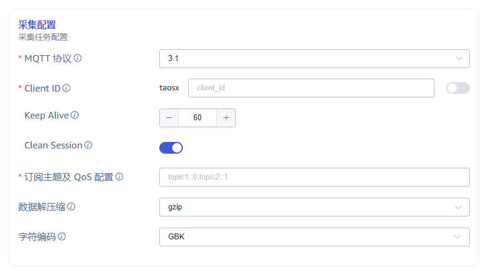
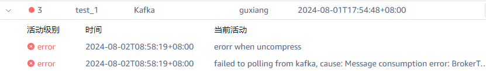

# MQTT 和 Kafka 数据接入任务支持配置解压缩算法和字符编码

## 1. 背景

1. 为了节省带宽，Nevados 期望能够对 mqtt 消息进行压缩处理，但是 mqtt 协议没有消息压缩相关约定，所以需要在消息发送端和接收端约定压缩算法，客户应用程序作为发送端负责压缩数据并将压缩后的数据发送到 mqtt broker, taosX作为接收端从 mqtt broker 拉取数据并解压缩。

TS-4676

1. 在为鞍钢集团实施 taosx 时，遇到消息无法正常解析的问题；经核查是由于字符编码不是默认的 utf8 编码。需要在创建任务时指定消息的字符编码格式，以便可以正确解析消息。

TD-30238

## 2. 变更历史

| 日期 | 版本 | 负责人 | 主要修改内容 |
| --- | --- | --- | --- |
| 2024/08/01 | 0.1 | 周营昭 | 初稿 |

## 3. 定义

无。

## 4. 行为说明

### 4.1 Explorer 配置说明

如下图，在采集配置中设置数据的`解压缩算法`和`字符编码`。
数据解压缩 `compression`的可选项有 none、gzip、snappy、lz4 和 zstd，默认值为 none。
字符编码 `char_encoding` 的可选项有 "UTF_8", "GBK", "GB18030", "BIG5"，默认值为 utf8。
<quote-container>
注：kafka 无需配置 compression，kafka topic 会配置 compression，taosX 作为消费端自动适配。
</quote-container>



### 4.2 异常处理

#### 4.2.1 错误的压缩算法

1. 在获取示例数据时，解压缩失败时提示用户错误消息：
   - 中文：数据解压缩错误
   - 英文：data decompress error
2. 在任务运行过程中，连续三次遇到解压缩异常问题，则任务进入异常状态，并提示用户。


#### 4.2.2 错误的字符编码

1. 如果解析出正确的结构，只是部分字符乱码，结果会正常入库乱码数据。
2. 如果无法解析出正确结构，则提示用户错误
   - 中文：原始消息解析失败
   - 英文：raw message parse error

## 5. 性能

使用解压缩对 CPU 要求较高，在 CPU 不高情况下整体吞吐率不会有大的变化。

## 6. 兼容性

解压缩算法默认值为 none / 字符编码默认值为 utf8，在不配置这两个参数的情况下，其行为与过往版本完全相同，能够兼容已有的任务。

## 7. 运维

无。

## 8. 使用场景

1. Mqtt 消息压缩：消息生产者将压缩后的数据发送到 mqtt broker，taosX 从 MQTT broker 获取压缩后的消息并依据所配置的解压缩算法对消息解压。
2. Kafka 消息压缩：在 kafka 消息发送端配置指定的压缩算法，发送消息；taosX 从 Kafka 获取压缩后的消息并依据所配置的解压缩算法对消息解压。
3. Kafka 字符编码：在 kafka 消息发送端使用 GBK 编码的字符串，taosX 中创建传输任务时要相应地指定 GBK 字符编码，taosX 在从 Kafka 拉取到数据后用指定的 GBK 字符编码进行解析。

## 9. 约束和限制

无。

## 10. 常见错误和排查

无。

## 11. 可观测性

无。

## 12. 安装和卸载

无。

## 13. 文档

需要修改企业版文档，增加采集配置的说明。

## 14. 参考文档

## 15. 附录

### 15.1 实现思路

1. Mqtt 需要在连接器中实现解压缩处理和读取消息的编码处理；
```java
let mut decoder = GzDecoder::new(data_stream)?;
let mut s = String::new();
decoder.read_to_string(&mut s, "utf8")?;
```

1. Kafka 客户端可以配置压缩算法。
```java
kafkaClientConfig.set("compression.type", "gzip");
```
