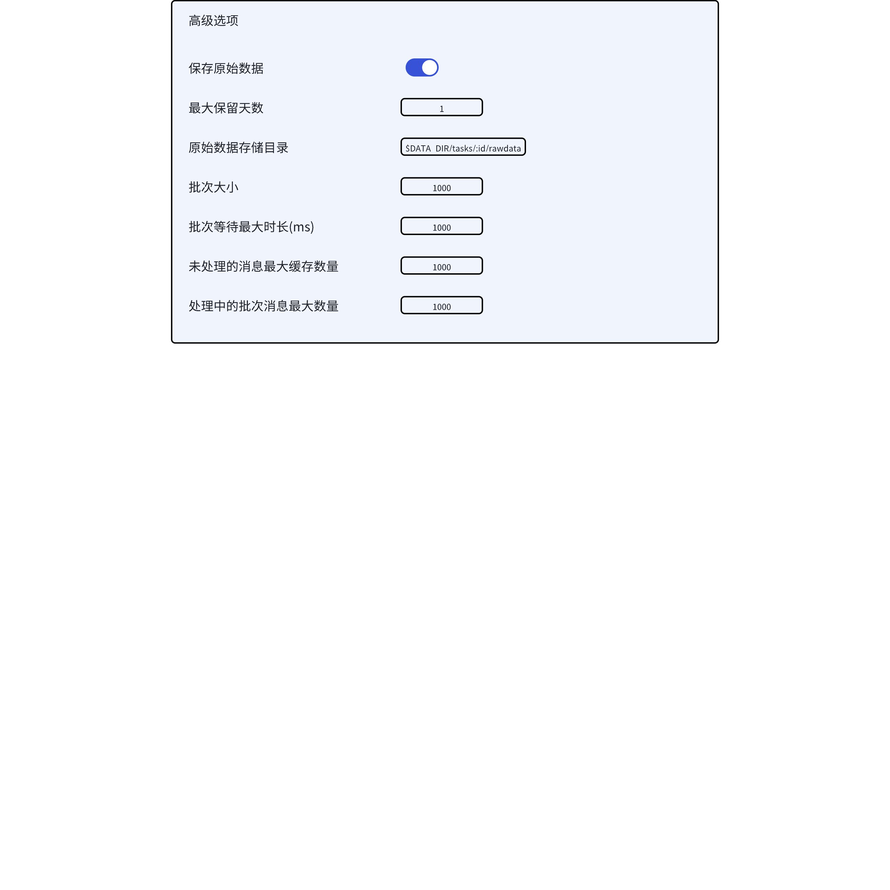
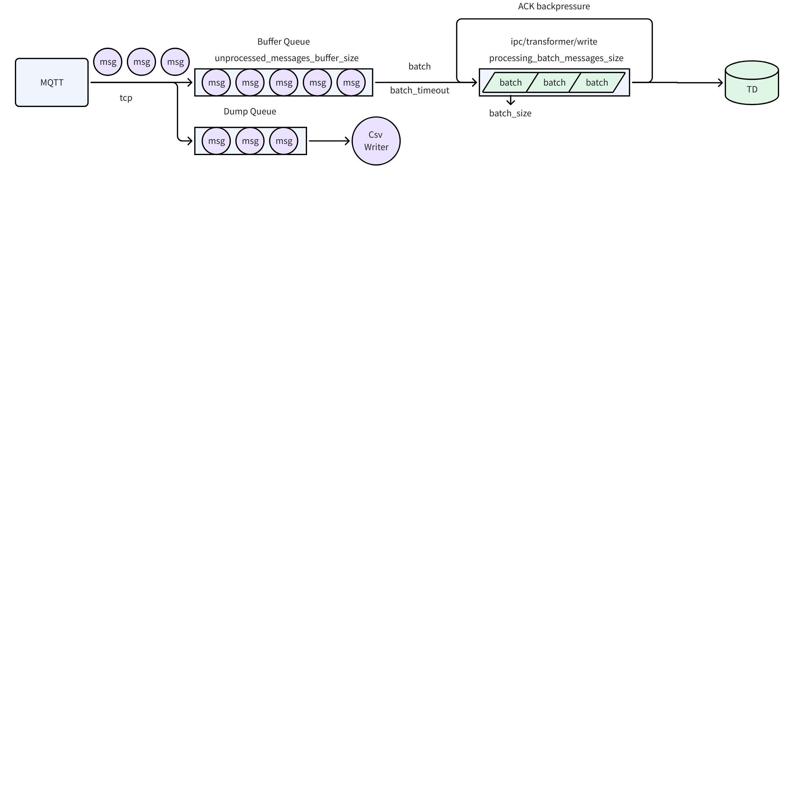

# MQTT 重构为内置数据源

## 1. 背景

TD-31253

当前 MQTT 为外部数据源，使用 Golang 语言编写，在维护过程中暴露出一些问题
1. 这个连接器最初由同事谭雪峰编写，每次出了问题都需要请外援，大量占用了雪峰的时间
2. taosx 本身是由 Rust 语言编写的，而 MQTT 作为外部数据源，每次任务启动时需要创建一个子进程 taosx-mqtt，并使用进程间通信相关技术做数据交换，代码复杂化不好管理
3. 内置数据源日志打印到 taosx 的日志文件中，便于排查问题和管理
4. 内部数据源性能提升（待测试）

## 2. 变更历史

| 日期 | 版本 | 负责人 | 主要修改内容 |
| --- | --- | --- | --- |
| 2024/08/15 | 0.1 | @闫宇星 | 初稿 |

## 3. 定义

无

## 4. 行为说明

**注：旧有实现中已经支持的参数，如果本文档中未提及，则仍然支持且行为不变**

### 4.1 任务创建/修改/复制界面

1. 删除参数：由于 MQTT 不再写入单独的日志文件，所以删除`日志级别`参数
2. 新增参数：
   - `批次大小`：每次等待一批数据量达到指定大小后，再发给下个阶段处理，最小为1，默认 1000
   - `批次等待最大时长(ms)`：如果超过此最大时长仍没有达到批次大小数据量，则直接处理已到达的数据，默认500ms，此参数如果设置太大，等不到数据会造成已到达数据处理的延迟；设置的太小，会造成没有等待到批次大小指定数据量即开始处理；需要根据实际生产端情况进行调节
   - `未处理的消息最大缓存数量`：缓存在队列中还没来得及处理的消息的最大数量，用于控制内存占用，当队列满时，新到达的数据会直接丢弃。最小为 0，即不缓存，默认 50000
   - `处理中的批次消息最大数量`：允许在处理中还没有等到 ACK 回复的最大批次数量，没有到达此阈值时，会从缓存队列中取出一个批次的数据发送到 ipc 进行处理；当到达最大数量后，不再处理新数据，缓存队列中的消息会开始积压。此配置用于背压机制防止对下游造成太大写入压力。最小为1，即等待上一个处理完再处理下一个，默认 100


## 5. 性能

目标：至少要优于旧版 MQTT 数据源，压测用例见附录

## 6. 兼容性

1. 对于删除的参数，已创建任务中后端仍会在接口中的 from dsn 中保留，但前后端都不会再使用此参数，旧任务的运行没有影响
2. 对于新增的参数，已创建任务展示默认值即可，对旧任务的运行没有影响

## 7. 运维

无

## 8. 使用场景

1. 推荐对每一个 MQTT topic 创建一个任务，即启动一个客户端进行消费
2. 对于大数据量场景，可以使用 MQTTv5.0 支持的共享 topic 进行消费 $share/<group>/<topic>（主流 MQTT broker 实现如 EMQX，HiveMQ，Mosquitto 均已支持），使用一个 taosx 甚至多个机器上的 taosx 进行多客户端共享消费，分担消费压力
3. 为保证不丢数据， QoS 可以设置为 1，即最少一次传递，但最终 QoS 还取决于发送端指定的 QoS 值，broker 会取两者最小值

## 9. 约束和限制

无

## 10. 常见错误和排查

无

## 11. 可观测性

1. 添加相关 metrics

| 指标名称 | 所属类别 | 描述 | 值类型 |
| --- | --- | --- | --- |
| fetched_messages | 累计指标 | 本次任务启动开始消息拉取总数量 | u64 |
| processed_batches | 累计指标 | 本次任务启动开始已处理的批次数（接收到的 ACK 总数） | u64 |
| dumped_messages | 累计指标 | 本次任务启动开始已 dump 的消息数 | u64 |
| ack_fails | 累计指标 | 本次任务启动开始 ACK 失败总次数 | u64 |
| unprocessed_messages | 本次运行 | 缓存队列中当前消息数量 | u64 |
| processing_batches | 本次运行 | 正在处理中的批次数量 | u64 |
| ~~processed_avg_delay_ms~~ | ~~本次运行~~ | ~~下游每个批次消息处理的平均延迟(ms)~~ | ~~f64~~ |

1. 添加日志
定时日志每隔 5s 合并为一条打印，使用 kv 对区分

| 日志描述 | 级别 | 触发条件 |
| --- | --- | --- |
| ~~接收到消息总数~~ | ~~debug~~ | ~~每隔 5 秒打印一次~~ |
| ~~队列中缓存的消息数~~ | ~~debug~~ | ~~每隔 5 秒打印一次~~ |
| 缓存队列已满 | warn | 消息入队失败时打印 |
| ~~已发送的批次总数~~ | ~~debug~~ | ~~每隔 5 秒打印一次~~ |
| ~~正在处理中的批次数量~~ | ~~debug~~ | ~~每隔 5 秒打印一次~~ |
| 触发背压 | warn | 向下游发送批次触发背压时打印 |
| 接收 MQTT 消息报错 | error | 接收 MQTT 消息报错时打印 |
| ACK 返回错误 | error | ACK 返回错误时打印 |
| 向 ipc 发送批次失败 | error | 向下游发送批次消息失败时打印 |
| Dump 队列满 | warn | Dump 队列满时打印 |
| ~~已 dump 的消息数~~ | ~~debug~~ | ~~每隔 5 秒打印一次~~ |
| Dump 写入失败 | error | Dump 写文件失败时打印 |

## 12. 安装和卸载

1. 打包脚本：删除有关 taosx-mqtt 编译和打包相关逻辑
2. 安装/卸载脚本：
   - 安装：不再安装 taosx-mqtt 二进制文件
   - 卸载：考虑到用户可能安装的是旧版本，所以 taosx-mqtt 相关卸载逻辑保留，删除时如果文件不存在则忽略，不报错

## 13. 文档

需要修改企业版文档

## 14. 参考文档

1. [[中科创达] MQTT 问题结论 0806](https://taosdata.feishu.cn/wiki/SjfowEk4Xi4UvMkNiK6cOjk9ndf)

## 15. 附录

### 15.1 数据流



### 15.2 配置参数

```plaintext
batch_size=1000
batch_timeout=500
unprocessed_messages_buffer_size=50000
processing_batch_messages_size=100
maximum_processing_batch=100
```

根据 ACK 返回值动态调整 maximum_processing_batch 大小

### 15.3 压测建议

1. 单条消息大小对性能的影响：在 1MB 以下选取多个，如 50B，1KB，100KB等，不同消息大小需要选择不同配置，比如，单条消息过大，那么批次大小可以适当选小一点，否则一次写入 TDengine 的 SQL 太大会导致失败
2. 部署方式对性能的影响：MQTT服务器，taosx，TDengine 分别部署在不同节点
3. 任务配置不同类型的 topic 和任务数对性能的影响：
   - 单 topic 单任务
   - 单 topic 单 taosx 多任务（共享订阅）
   - 单 topic 多 taosx 多任务（共享订阅）
4. 任务配置不同 QoS 对性能的影响
5. 开启 Dump 对性能的影响
6. 不同 MQTT broker 实现对性能的影响：EMQX/HiveMQ/Mosquitto
