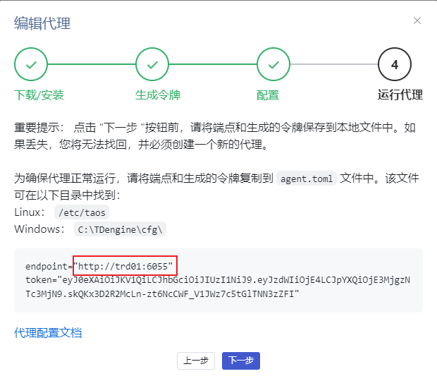
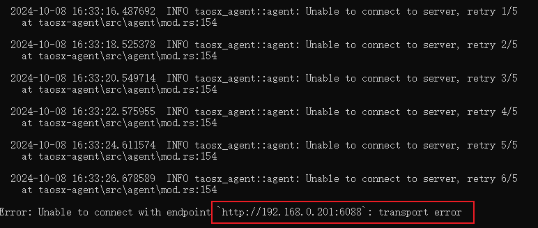
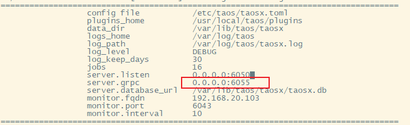

# taosX GRPC 端口配置

## 1. 背景

taosX 中 grpc 端口目前用于 taosX agent 连接。
taosX 中硬编码 grpc 监听端口为 6055，一旦此端口被其他应用占用，taosX 将无法正常启动；同一台服务器上也无法同时部署两个 taosX 应用。所以需要将 grpc 监听端口配置化，部署 taosX 时可以修改默认的端口。

TD-28741

## 2. 变更历史

| 日期 | 版本 | 负责人 | 主要修改内容 |
| --- | --- | --- | --- |
| 2024/10/08 | 0.1 | 周营昭 | 初稿 |
| 2024/10/08 | 0.2 | 周营昭 | 1. 调整环境变量 GRPC 为 TAOSX_GRPC 1. 补充 explorer 配置说明 1. 增加常见错误 |
| 2024/10/10 | 0.3 | Wade | 优化配置文件中的注释及文档中的描述 |
| 2024/10/10 | 0.4 | 霍琳贺 | 修改 taosx/explorer 配置说明 |

## 3. 定义

**gRPC: **由 google 开源的高性能的 RPC 框架。它是由google的Stubby这样一个内部的RPC框架演化出来，gRPC 2015 年开源，目前是在云原生时代的一个 RPC 的标准。

## 4. 行为说明

### 4.1 taosX 配置说明

1. 在 taosx.toml 文件的`serve`模块下增加配置项`grpc`。
```toml {wrap}
[serve]

## 5. listen to ip:port address

#listen = "0.0.0.0:6050"

## 6. GRPC listen address，use ip:port like `0.0.0.0:6055`.

##

## 7. When use this in explorer, please set explorer grpc configuration to **Public** IP or

## 8. FQDN with correct port, which might be changed exposing to Public network.

##

## 9. - Example 1: "http://192.168.111.111:6055" 

## 10. - Example 2: "http://node1.company.domain:6055" 

##

## 11. Pleae also make sure the above address is not blocked if firewall is enabled.

##
#grpc = "0.0.0.0:6055"

## 12. database url

#database_url = "sqlite:taosx.db"

## 13. default global request timeout which unit is second. This parameter takes effect for certain interfaces that require a timeout setting

#request_timeout = 30

```

1. 命令行启动支持参数 `-g` 或者 `--grpc`。
```shell
taosx serve -g 0.0.0.0:6055
```

1. 支持环境变量 `TAOSX_``GRPC`。
2. 默认值 `0.0.0.0:6055`。
配置优先级为`命令行参数` > `环境变量` > `配置文件` > `默认值`。

### 13.1 Explorer 配置及展示

explorer 所配置的 grpc 实际为引用 taosX 的 grpc 配置以为将来创建 Agent 时使用，所以它们必须一致。
1. 配置文件 explorer.toml 中配置项 `grpc`
```toml {wrap}

## 14. Place taosX GRPC endpoint here.

##

## 15. Please set this to **Public** IP or FQDN with correct port, 

## 16. which might be changed exposing to Public network.

##

## 17. - Example 1: "http://192.168.111.111:6055" 

## 18. - Example 2: "http://node1.company.domain:6055" 

##

## 19. Pleae also make sure the above address is not blocked if firewall is enabled.

##

## 20. grpc = "http://trd01:6055"

```

1. 命令行启动支持参数 `-g` 或者 `--grpc`。
2. 支持环境变量 `EXPLORER_GRPC`。
3. 默认值`http://localhost:6055`。
配置优先级为`命令行参数` > `环境变量` > `配置文件` > `默认值`。
配置完成后，在 explorer 创建 taosx agent 时，如下图所示页面上给出的推荐 endpoint 来自 explorer grpc 配置。


<callout emoji="bulb" background-color="light-orange" border-color="light-orange">
1. Explorer 配置是已有功能，为了方案完整性补充此小节。
2. Explorer 的 grpc 端口配置需要和 taosX 端口一致。
</callout>

## 21. 性能

无。

## 22. 兼容性

无。

## 23. 运维

修改 **taosX** grpc 配置后，需要重启 taosX 才能生效。
**Explorer **配置文件 explorer.toml 也需要修改 `grpc` 的配置。 
如果有连接此 taosX 的 **agent**，agent 配置文件中的 `endpoint` 也需要做对应修改并重启。

## 24. 使用场景

1. 部署 taosx 时， 6055 端口已被其他应用占用。
2. 同一台服务器上部署 2 个 taosX 应用。

## 25. 约束和限制

无。

## 26. 常见错误和排查

### 26.1 taosX grpc 配置端口被占用

taosX 配置已被占用的端口则无法正常启动，查看** journal 日志**，可以看到对应的错误信息如下所示：
```toml
Error: Start HTTP server error: Address already in use (os error 98) (addr: 0.0.0.0:6055)
```

### 26.2 Agent 配置错误的 endpoint

启动时，查看启动日志，可看到对应的重试和错误信息，如下图所示：


排查方法：
1. 检查对应 taosX 是否正常启动；
2. 如果正常启动，检查启动日志中的配置项是否和 agent endpoint 配置一致。


## 27. 可观测性

无。

## 28. 安装和卸载

无。

## 29. 文档

需要修改企业版文档，增加配置的说明。

## 30. 参考文档

无。
