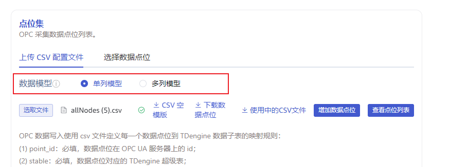
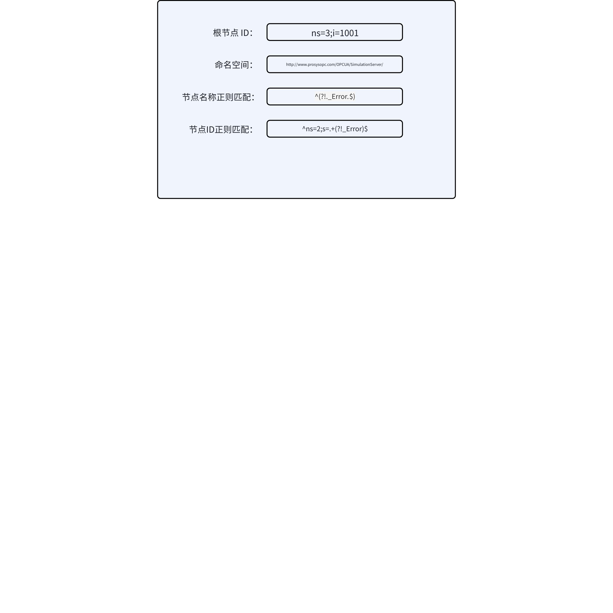

# taosX OPC 数据写入任务配置校验优化

## 1. 背景

OPC 配置文件中 tag列[tag::int::groupid] 配置值为字符串类型`abc`就无法成功创建子表，在写入 SQL 时就会有 “Table does not exist” 的错误；或者如果 value 字段配置不正确(比如将采集的 int 类型数据配置为写入 float 类型字段)，也无法正确写入。局部的错误 SQL 会造成整个批次的 SQL 无法写入，而且不容易定位问题。
所以考虑在配置 OPC 任务时加强校验，尽可能避免配置错误造成潜在的写入错误。

TD-31908

TD-31926

## 2. 变更历史

| 日期 | 版本 | 负责人 | 主要修改内容 |
| --- | --- | --- | --- |
| 2024/10/17 | v0.1 | 周营昭 | 初稿 |
| 2024/11/06 | v0.2 | @杨志宇 | 增加4.3 、4.4、4.5 节 |
|  |  |  |  |

## 3. 定义

**OPC**：OPC 是工业自动化领域和其他行业中安全可靠地交换数据的互操作标准之一。
**OPC UA：** OPC 规范的下一代标准，是一个平台无关的面向服务的架构规范，集成了现有 OPC Classic 规范的所有功能，提供了一条迁移到更安全和可扩展解决方案的路径。
**OPC DA：**一种经典的基于COM的规范，仅适用于Windows。尽管OPC DA不是最新和最高效的数据通信规范，但它被广泛使用，一些旧设备只支持OPC DA。

## 4. 行为说明

本章节行为适用于 OPC UA 和 OPC DA 数据源。

### 4.1 tag 校验：类型和值

对 csv 中配置的 tag 列及其值做如下校验：
1. opc ua 模板 tag 列命名符合规则 `tag::{``tag_``type}::{``tag_``name}`。
2. `tag_``type` 对应 TDengine 的数据类型，要校验 csv 中每行的 `tag_value` 是否为合法的`tag_type`：
  - bool： true 或 false
  - tinyint：合法的 i8
  - tinyint unsigned：合法的 u8
  - smallint：合法的 i16
  - smallint unsigned：合法的 u16
  - int：合法的 i32
  - int unsigned：合法的 u32
  - bigint：合法的 i64
  - bigint unsigned：合法的 u64
  - float：合法的 f32
  - double：合法的 f64
  - varchar(n)/ binary(n)/ nchar(n)：字符串长度不超过 n
  - nchar/ binary/ varchar ：字符串长度不超过 128
1. UI 在“上传 csv 文件”以及“新增 CSV 点位”时，进行校验。

### 4.2 schema 校验：和数据库表的 schema 是否冲突

#### 4.2.1 UI

使用“上传 CSV 配置文件”，选择`单列模型`或者`多列模型`；默认值为`单列模型`。

提示文字如下：
<quote-container>
单列模型可以使用字符串模板配置超级表名，一个点位对应一张子表；
多列模型必须提前建表，在模板中配置具体的超级表名、子表名和要写入的 value 列名，多个点位可以写入一个子表的不同列。
</quote-container>

<quote-container>
In a single column model, string templates can be used to configure super table names, with each point corresponding to a sub table;
In a multi column model, tables must be created in advance. Stable name, sub table name, and value column name must be configured with string. Multiple points can be written into different columns of a sub table.
</quote-container>

#### 4.2.2 配置参数

在 opc DSN 中增加下面的参数：

| **参数(explorer)** | **说明** | **值域** | **必填** |
| --- | --- | --- | --- |
| model_type | 数据模型的类别，单列或多列 | - single_column：单列模型 - multi_column：多列模型 | 当使用“上传 csv 配置文件”配置点位时，必填。 |

#### 4.2.3 单列模型的校验规则

1. 超级表名（stable）含有参数，例如：超级表名`opc_{type}`，无论子表名是否含有参数，均不校验。
2. 超级表名不含有参数，子表名含有参数。例如：超级表名`metrics`，子表名`t_{ns}_{id}`，校验以下规则：
   - 如果 database 中的超级表不存在，不校验。
   - 如果 database 中的超级表已存在，则：
      - CSV 中的 tag 集合为 U1，database 的超级表的 tag 集合为 U2，则 U2 必须包含 U1，且 U1 的 tag type 必须与 U2 的一致。
      - CSV 中 `val_col`、`ts_col`、`received_ts_col`、`quality_col` 列，如果有值，则必须在 database 中存在；否则，校验失败。
3. 超级表名和子表名都不含参数，例如：超级表名`metrics`，子表名`tb_3_1001`，校验以下规则：
   - 超级表、子表在 database 中已经存在；否则，校验失败。
   - 子表属于超级表；否则，校验失败。
   - CSV 的超级表的 tag 集合为 U1，database 的超级表的 tag 集合为 U2，则 U2 必须包含 U1，且 U1 的 tag type 必须与 U2 的一致。
   - CSV 中 `val_col`、`ts_col`、`received_ts_col`、`quality_col` 的值，必须在 database 中存在；否则，校验失败。

#### 4.2.4 多列模型的校验规则

1. 超级表名或者子表名中不允许含有参数，即：使用多列模型，必须提前建表。
2. 超级表、子表在 database 中已经存在；否则，校验失败。
3. 子表属于超级表；否则，校验失败。
4. CSV 中的 tag 集合为 U1，database 的超级表的 tag 集合为 U2，则 U2 必须包含 U1，且 U1 的 tag type 必须与 U2 的一致。
5. CSV 中 `val_col`、`ts_col`、`received_ts_col`、`quality_col` 的值，必须在 database 中存在；否则，校验失败。

### 4.3 pattern 支持负向前瞻正则

#### 4.3.1 背景

支持
TS-5566

#### 4.3.2 概念

- 地址空间（address space）：是 OPC UA server 的逻辑结构，包括所有 Node。地址空间是所有 NodeId 的集合。
- 节点标识符（NodeId）：节点在地址空间中的唯一标识符。NodeId 由两部分组成： namespace index 和 identifier。例如：`ns=3;i=1001`，表示 namespace index 为 1，节点标识符为 1001 。
  - 命名空间索引（namespace index）：命名空间内的唯一的**整数索引。**
  - 标识符（identifier）：在特定 namespace 中的唯一标识。标识符可以有不同的类型。
    - i：表示整数标识符，例如：`ns=3;i=1001`
    - s：表示字符串标识符，例如：`ns=2;s=MyNode`
    - g：表示 GUID，例如：`ns=2;g=12345678-1234-1234-1234-123456789abc`
    - o：表示 Opaque（通常用于特定的应用场景）
- 命名空间（namespace）：用来帮助开发者和用户理解和识别 Node 的名称。
  - 命名空间索引（namespace index）：命名空间内的唯一的**整数索引。**
  - 命名空间名称（namespace name）：通常是一个 URI，描述 namespace 的来源或用途。例如：`http://www.example.com/ua/example`。
- 节点的浏览名称（Browse Name）：Node 的可读名称，用于在地址空间中浏览和查找 Node。通常是一个字符串，提供了对 Node 的直观理解。

#### 4.3.3 “选择数据点位”的 Node 过滤条件

使用“选择数据点位”时，可以通过 3 个参数来过滤 Node
- 根节点ID（Root Node ID）：从该节点开始遍历所有子节点。
- 命名空间（Namespace of Node）：通过根节点 ID 遍历后，保留符合选中的 namespace 下的 Node。namespace 支持多选。
- 正则匹配（Regex pattern）：现在 taosx-opc 处理 pattern 参数的逻辑：`BrowseName pattern || NodeId Pattern`。
- 节点名称正则匹配（BrowseName Pattern）：通过根节点 ID 遍历后，保留 BrowseName 符合 BrowseName Pattern 的 node。
- 节点ID正则匹配（NodeId Pattern）：通过根节点 ID 遍历后，保留 NodeID 符合 NodeID Pattern 的 node。

#### 4.3.4 配置参数

| **参数(explorer)** | **参数（taosx-opc）** | **说明** | **值域** | **必填** |
| --- | --- | --- | --- | --- |
| browse_name_pattern | regex_name | 节点名称正则匹配。不填表示不用 pattern 过滤。 | 合法的正则表达式。前端校验正则合法性。 | 否 |
| node_id_pattern | regex_id | 节点ID正则匹配。不填表示不用 pattern 过滤。 | 合法的正则表达式。前端校验正则合法性。 | 否 |
| pattern | regex | 兼容之前 taosX 的 pattern 行为。相当于 browse_name_pattern 或 node_id_pattern | 合法的正则表达式。前端校验正则合法性。 | 否 |

#### 4.3.5 UI

#### 4.3.6 兼容性

新版本的 explorer 按以下规则处理 task：
1. 旧任务的 pattern 参数不为空，则修改时 UI 只显示 pattern；
2. 旧任务的 pattern 参数为空，则修改时 UI 只显示 browse_name_pattern 和 node_id_pattern；
3. 前端保证 pattern、browse_name_pattern、node_id_pattern 三个参数不会同时存在；
4. 新任务在创建、编辑时，都只显示  browse_name_pattern 和 node_id_pattern。

### 4.4 stable 校验：只能配置 {type} 参数

csv 配置 stable 时，包含一下新增的校验规则：
1. stable 只支持使用`{type}`作为参数。`type` 表示点位的数据类型。

### 4.5 tbname 校验：只能配置 {ns}/ {id}/ {tag_name} 参数

csv 配置 tbname 时，包含一下新增的校验规则：
1. OPC UA 只支持使用`{ns}` 和 `{id}` 作为参数，`ns` 表示点位的 namespace，`id`表示点位的 id；例如：point_id 为`ns=3;i=1001`，则：`{ns}`为3，`{id}`为1001。
2. OPC DA 只支持使用 `{tag_name}`作为参数。`tag_name`表示点位的tag_name，和csv 中的 tag_name 列相同。
3. 修复：中 UI 的错误。
  TS-5590

## 5. 性能

这个 FS 的功能是对 CSV 文件的前置校验，在任务配置阶段生效。因此，对写入性能无影响。

## 6. 兼容性

现存配置无论实际上是单列模型还是多列模型，都会被当成是单列模型处理；写入完全不受影响。
修改已有配置时，多列模型会被默认标记为单列模型，但是由于符合校验规则，依然可以作为单列模型保存；也可以修改为多列模型配置。
现有配置的带参数超级表名或者子表名的任务，修改时保持选择数据模型为单列模型则不做校验，完全兼容；如果修改为多列模型，由于带参数，则校验不通过，无法保存成功。

## 7. 运维

无。

## 8. 使用场景

1. OPC csv 模版中，tag 列名中的数据类型和 tag 值不匹配时，校验不通过；
2. 模板中配置具体超级表名、子表名、字段名，在 TDengine 数据库中不存在或者不匹配，则校验不通过。

## 9. 约束和限制

无

## 10. 常见错误和排查

Value 列类型和实际的点位采集的数据类型不一致时，taosX 会将错误的数据拼入 SQL 并尝试写入，执行失败时，根据 [FS-写入异常处理](https://taosdata.feishu.cn/wiki/TY2vwP511ikOkfkQL0zcHscknJf) 中的策略处理。

## 11. 可观测性

无。

## 12. 安装和卸载

无。

## 13. 文档

需要修改企业版文档，增加数据模型配置的说明。

## 14. 参考文档

[OPC 校验讨论稿](https://taosdata.feishu.cn/wiki/AAP8wF6Fliq621kPu3HcTkfFnvb)
