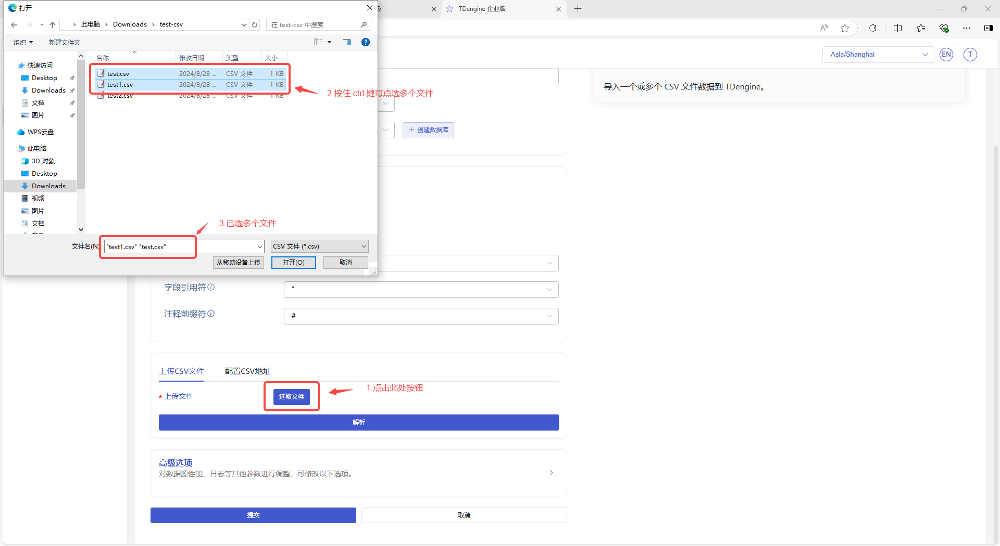
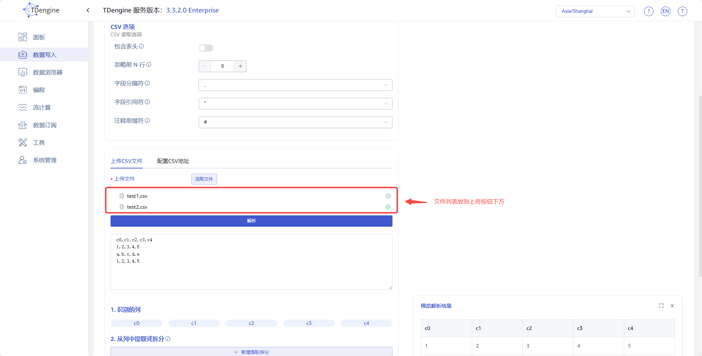
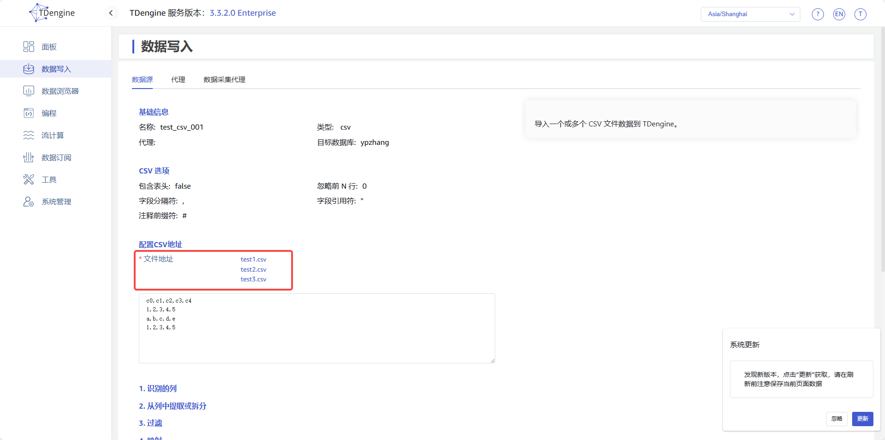
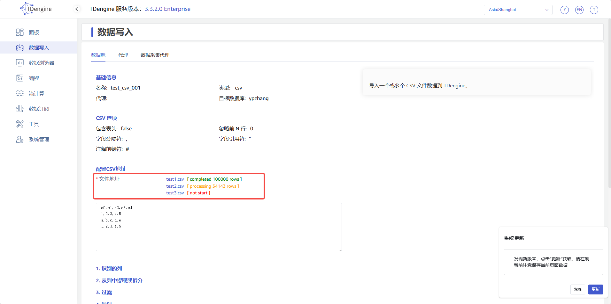
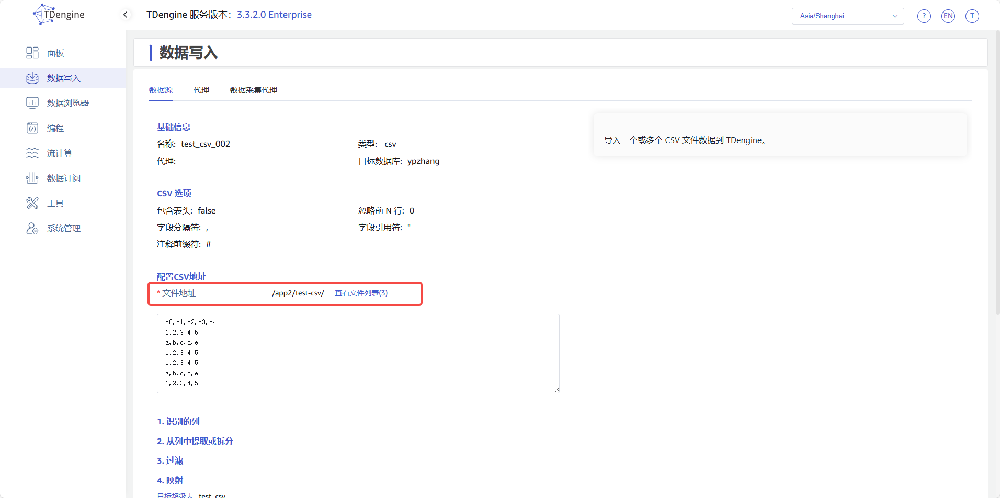
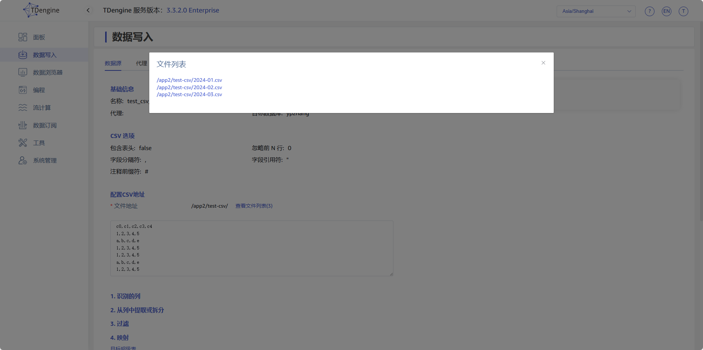
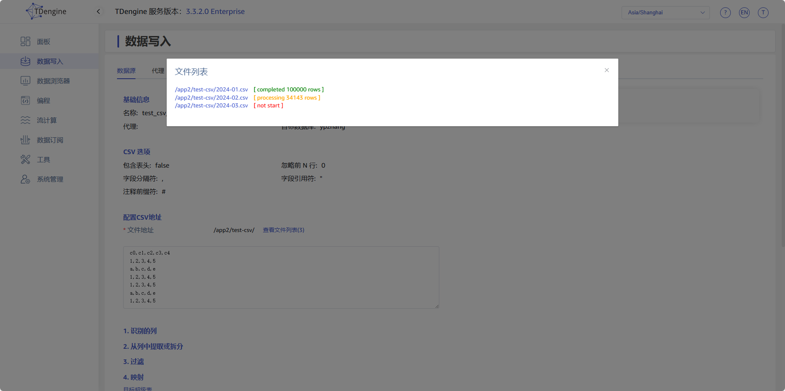
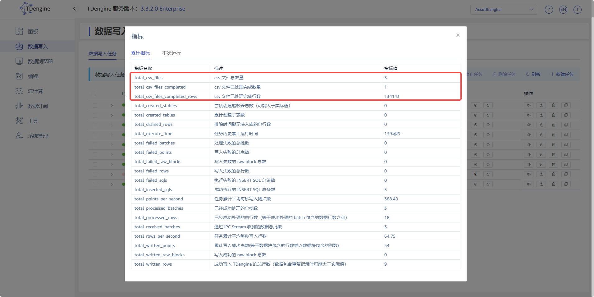
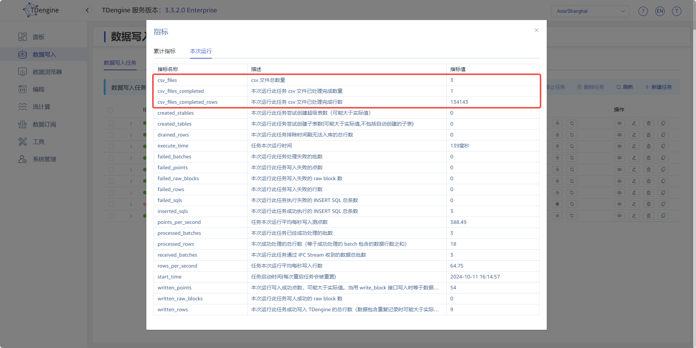
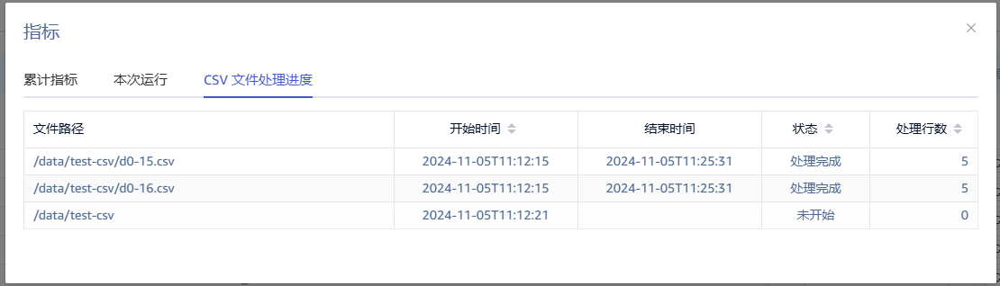

# taosX 优化 csv 数据源任务配置

## 1. 背景

taosx/taos-explorer 中 csv 数据源任务配置较简单，不能满足复杂的业务应用场景，根据产品组意见，需要对其进行优化升级，主要包括以下几项：
1. 上传文件方式：
   - 支持上传多个文件
   - 查看回显时仅显示文件名，且点击文件名可下载原始文件
2. 配置目录方式：
   - 目录支持通配符过滤文件名
   - 支持配置定时扫描目录中的新文件，任务永不停止
   - 支持配置读文件的并发数（已实现）
   - 支持文件排序
   - 支持文件级断点续传
3. 通用：
   - 读文件前检测文件是否正在被打开，避免处理不完整的文件（可行性未验证）
   - 支持可观测项：已处理文件列表
以上内容相关 jira 及需求文档如下：

TD-30916


TS-5088

[需求说明：taosX 支持定时导入 CSV 目录并可设置并行度](https://taosdata.feishu.cn/wiki/A0HMwHXA9iE88Rk7TPWcka8gnSd)

## 2. 变更历史

| 日期 | 版本 | 负责人 | 主要修改内容 |
| --- | --- | --- | --- |
| 2024/10/11 | 0.1 | @张元湃 | 初稿 |
| 2024/10/14 | 0.2 | @张元湃 | 1. 增加章节 4.1.3 1. 增加附录 15.1 1. 删除与行为无关的文字描述 1. 修改截图，修复截图中的拼写错误 |
| 2024/10/15 | 0.3 | @张元湃 | 1. 删除章节 4.1.3，内容合入 4.1.1 1. 修改章节 4.1.2 1. 增加章节 4.3 与 4.4，对任务的编辑与复制做简单说明 1. 修改运行指标名并替换截图 1. 修改断点文件格式 |
| 2024//10/16 | 1.0 | @张元湃 | 优化部分细节，定稿 |
| 2024/10/24 | 1.1 | @张元湃 | 修改 4.1.1 中的文件处理顺序 |
| 2024/10/28 | 1.2 | @张元湃 | 增加附录 15.2 |

## 3. 定义

- 上传文件方式：在 explorer 页面的 csv 数据源页面，通过上传控件将用户本地的文件上传到服务器，以此作为数据源创建任务的方式
- 配置目录方式：创建 csv 任务时，填写 taosx 所在服务器上的文件/目录地址作为数据源创建任务的方式，它等同于 “配置CSV地址” 方式

## 4. 行为说明

本次功能优化的修改项在产品行为上表现在创建任务、查看任务、查看运行指标与断点文件的变化，同时对编辑任务与复制任务也需要特殊说明，以下将分别进行介绍。

### 4.1 创建任务

#### 4.1.1 上传文件方式

- **支持****上传多个文件**
如下图所示，上传文件弹框中支持选择多个文件：
<quote-container>
选择多个文件时，处理顺序**按照文件名字典排序**的先后顺序。如果在多次选择中出现重名文件，前端给出提示。
</quote-container>



- **显示文件列表位置更改**
如下图所示，将上传文件成功后的文件列表显示到上传按钮下方：


- **增加对已处理完成文件的处理策略**
如下图所示，增加配置选项，选择是否在服务器端保留已处理完成的文件：


新增配置项说明如下：

| **ID** | **Name** | **Description** | **Type** | **Choices** |
| --- | --- | --- | --- | --- |
| keep_processed_files | 保留已完成文件 Keep Processed Files | 是否在服务器端保留已处理过的上传文件 | boolean | 默认 false true：保留 false：删除，注意：如果不保留上传文件的副本，则该文件的下载功能不可用 |

#### 4.1.2 配置目录方式

- **支持配置匹配模式过滤文件**
目前 “配置CSV地址” 方式支持配置服务器上的目录路径或文件路径，仅支持明确的路径，本次优化增加了文件匹配规则，以实现按规则过滤文件的目的，如下图所示：


- **任务是否监听新文件**
本次优化增加了配置项，可配置任务永不停止且定期监听新增文件，而且增加了断点续传功能，任务重启时仅处理未处理完成的文件，如下图所示：
- 关闭监听新文件，行为与当前一致（创建任务时的所有文件被处理完成后结束任务）


- 开启监听新文件，同时设置监听间隔，任务将持续运行并且定期监听新增文件进行处理


断点续传功能将在 [4.4](https://taosdata.feishu.cn/wiki/VmibwCTeli32yikScgvcbXDwnuc#share-WJhydd9dood8frx73YMcb3P0n5e) 节进行详细说明。
- **文件排序选项**
目前系统处理目录中多个文件时没有排序，而实际应用场景中有排序需求，本次优化增加了配置项，默认按照文件名正序处理，如下图所示：


新增配置项说明如下：

| **ID** | **Name** | **Description** | **Type** | **Choices** |
| --- | --- | --- | --- | --- |
| file_pattern | 匹配模式 File Pattern | 文件名匹配规则，使用通配符定义匹配规则筛选目录中文件列表 | string | - |
| new_file_notify | 监听新文件 New File Notify | 系统是否监听目录下的新增文件，开启后任务将持续运行 | boolean | 默认 false true：开启监听新文件 false：关闭监听新文件 |
| notify_interval | 监听间隔 Notify Interval | 监听新增文件的时间间隔，开启监听新文件后生效 | duration | 非必填项，默认 1 分钟 时间单位包括：毫秒 Millisecond、秒 Second、分钟 Minute |
| sort | 文件排序 Sort | 系统处理文件列表的先后顺序，对初始文件列表和同一批次监听到的新增文件列表有效，不同监听批次按照时间先后顺序处理。 如果监听目录下存在子目录，则同级目录下先处理文件后处理目录 | int | 非必填项，默认 1 1：文件名正序 2：文件名倒序 |

### 4.2 查看任务

#### 4.2.1 上传文件方式

- **仅显示文件名、文件可下载**
如下图所示，将文件列表修改为仅显示文件名，且点击文件名可下载原始文件：
<quote-container>
如果文件已被删除，点击下载时报错。
</quote-container>



- **显示文件处理状态及数据量**
如下图所示，在文件右侧显示文件处理状态（处理完成、正在处理、未开始）：


#### 4.2.2 配置目录方式

- **查看文件列表**
如下图所示，在用户配置的路径右侧添加查看文件列表的按钮：


查看任务详情的接口数据中增加文件数量统计值，前端在文件路径右侧添加按钮，点击后弹框显示文件列表，如下图所示：


- **显示文件处理状态及数据量**
弹框内容修改如下图所示：


### 4.3 编辑任务

#### 4.3.1 上传文件方式

此类型的任务作为一次性任务，不可编辑，直接在任务列表中禁用编辑按钮。

#### 4.3.2 配置目录方式

编辑任务时，监听目录与匹配模式两个配置不允许修改，其他三个配置可修改，如下图所示：


编辑后任务将重新启动，处理断点中记录的已完成文件之外的所有文件。

### 4.4 复制任务

复制任务时复用所有配置内容（包含上传文件方式的已上传文件），同时自动执行一次文件解析，如果文件已被删除，需要提示并清空 transform 中 parse 结果。**用户应该注意修改任务配置为期望的内容后再提交任务**。

### 4.5 查看运行指标

#### 4.5.1 累计指标

如下图所示，增加三个统计指标：


1. csv 文件总数量：任务上传的文件总数量或指定目录下的文件总数量（包括已处理完成但被移除的文件）
2. csv 文件已处理完成数量：任务中已明确处理完成的文件数量（断点记录数量）
3. csv 文件已处理完成行数：包含已处理完成的文件中的 csv 记录行数，它是原始行数，不一定等于表格中 total_processed_rows 值（经过 transform 后的数据量）

#### 4.5.2 本次运行

如下图所示，增加三个统计指标：


1. csv 文件总数量：与累计指标中的指标项相同，仅为方便查看
2. 本次运行此任务 csv 文件已处理完成数量：本次运行处理完成的文件数量
3. 本次运行此任务 csv 文件已处理完成行数：本次运行处理完成的 csv 记录行数

#### 4.5.3 CSV 文件处理进度

如下图所示，CSV task 任务额外增加一个 tab 页：


1. 文件路径： CSV 文件路径
2. 开始时间： 开始读取的时间
3. 结束时间： 处理完成的时间
4. 状态： 处理状态，有未开始(Not Start) / 正在处理(Processing) / 处理完成(Completed)。
5. 处理行数：从 CSV 中读取的行数。

### 4.6 断点文件

csv 数据源任务目前没有断点信息，任务重启后会重新处理所有文件，改动后将在任务目录下生成断点文件，保存已处理完成的文件的信息，用于记录任务处理进度，并且用于任务重启后的断点续传。断点文件格式如下：
```json
{
    // 文件相对路径:文件记录条数，处理完成才会记录，列表排序规则与任务配置相同
    "2024-08.csv": 10000
    "2024-09.csv": 10000
    "2024-10.csv": 10000
    "subdir/2024-10.csv": 10000
}
```

## 5. 性能

1. 任务支持上传多个文件、支持配置模糊路径，能够在一个任务中处理一类文件，而不必人为拆分目录或为每个文件单独创建任务，提高了工作效率；
2. 任务重启后仅从断点处开始处理文件，而不必重新处理所有文件，提高了任务执行效率；
3. 任务支持动态新增文件，而不必重新创建任务，提高了工作效率。

## 6. 兼容性

无。

## 7. 运维

无。

## 8. 使用场景

1. 用户上传本地多个 csv 文件时使用，在旧版本中，用户只能通过配置服务器目录或配置多个任务的方式实现导入多个 csv 文件，功能升级后可以直接上传多个文件；
2. 用户使用上传文件方式创建任务，创建完成后想要下载数据文件，在旧版本中不能直接下载，功能升级后可以在查看任务时进行下载；
3. 用户使用配置路径方式创建任务时，只想导入目录中的一部分文件，在旧版本中无法做到，功能升级后可以通过使用例如`/root/files/ab_*.csv`格式的路径实现；
4. 用户使用配置路径方式创建任务，在旧版本中不能处理后续增加的文件，功能升级后可以通过参数配置实现定期扫描增加的文件；
5. 用户使用配置路径方式创建任务时，想要对目录中文件的处理顺序做排序，在旧版本中无法做到，功能升级后可以通过配置实现按文件名排序；
6. 用户想要观测 csv 任务的更多运行指标，例如已处理文件数等，功能升级后增加了文件总数量、已处理文件数量及各文件处理状态等指标。

## 9. 约束和限制

无。

## 10. 常见错误和排查

1. 下载文件时报错 Failed to download the specified file：
   - 检查文件路径是否正常，如果不正常则是系统问题，需要开发修复
   - 检查文件是否已在服务器中删除，默认路径 /var/lib/taos/taosx/files/xxx，已删除的文件不能被下载
2. 文件处理完成的行数与实际行数不一致：
   - 检查文件是否存在空行、注释行或错误行（列数不一致），如果不存在则是其他问题
   - 单独创建一个仅包含此文件的任务，重新运行，观察行数是否与上次执行一致，如果一致则是其他问题，需要开发排查

## 11. 可观测性

任务运行指标有变化，已在 [4.3](https://taosdata.feishu.cn/wiki/VmibwCTeli32yikScgvcbXDwnuc#share-DS9OdTN07oYZYuxdoNqcjs8MnIe) 节中进行介绍。

## 12. 安装和卸载

无。

## 13. 文档

需要修改企业版文档。
不需要修改官网文档。

## 14. 参考文档

https://docs.rs/glob/0.3.1/glob/struct.Pattern.html

## 15. 附录

### 15.1 匹配模式字段中通配符使用规则

使用正则表达式对文件名进行匹配过滤。

~~*通配符支持根据 Unix shell 样式模式匹配文件路径，支持以下符号：*~~
- `~~*?*~~`~~* 匹配任意单个字符*~~
- `~~***~~`~~* 匹配任意长度的字符串（包括空字符串）*~~
- `~~****~~`~~* 匹配当前目录与子目录*~~
- `~~*[...]*~~`~~* 匹配方括号内的任何字符，还可以指定 Unicode 顺序的字符范围，例如 *~~`~~*[abc]*~~`~~*、*~~`~~*[1-9]*~~`
- `~~*[!...]*~~`~~* 匹配不在方括号内的任何字符（不包括符号*~~`~~*!*~~`~~*）*~~
- ~~*字符 *~~`~~*?*~~`~~* *~~`~~***~~`~~* *~~`~~*[*~~`~~* *~~`~~*]*~~`~~* 可以通过使用方括号进行表示，例如 *~~`~~*[?]*~~`~~*、*~~`~~*[*]*~~`~~*、*~~`~~*[[]*~~`~~*、*~~`~~*[]]*~~`
~~*示例如下：*~~
```bash

## 16. 不配置匹配模式

## 17. 监听目录：/app2/test-csv/

## 18. 匹配结果

/app2/test-csv/2024-01.csv
/app2/test-csv/2024-02.csv
/app2/test-csv/2024-03.csv
/app2/test-csv/subdir/2024-04.csv

## 19. 配置匹配模式

## 20. 监听目录：/app2/test-csv/

## 21. 匹配模式：*-01.csv

## 22. 匹配结果

/app2/test-csv/2024-01.csv
```

### 22.1 监听文件

1. 通过 xftp 上传文件：Create(File)、Modify(Data(Any))、Access(Close(Write))
2. 通过 xftp 重命名：Create(File)、Remove(File)
3. 同目录 mv 重命名：Modify(Name(From))、Modify(Name(To))、Modify(Name(Both))
4. 同目录 cp 复制文件：Create(File)、Modify(Data(Any))、Access(Close(Write))
5. 其他目录 mv 复制文件：Modify(Name(To))
6. 其他目录 cp 复制文件：Create(File)、Modify(Data(Any))、Access(Close(Write))
7. touch 新建文件：Create(File)、Modify(Data(Any))、Access(Close(Write))
8. vi 新建文件：Create(File)、Modify(Data(Any))、Access(Close(Write))、其他 swp & swx 文件操作信息
9. echo 新建文件：Create(File)、Modify(Data(Any))、Access(Close(Write)) 
10. 通过 xftp 上传 200M 文件：Create(File)、Modify(Data(Any)) * 7842、Access(Close(Write))
11. 通过 scp 远程复制文件：Create(File)、Modify(Data(Any))、Access(Close(Write))
综合以上情况，程序将监听`Create(File)`、`Access(Close(Write))`、`Modify(Name(To))`三类事件。
