# taosX 增量备份和恢复

## 1. 背景

根据 [需求说明：基于文件中转进行自动增量备份与恢复](https://taosdata.feishu.cn/wiki/VrRVwPJ01iRnFlkPVbocT1WAnnh)，taosX 支持基于文件的数据备份和恢复，进行自动增量数据同步。正向网闸环境的数据同步，是基于增量数据备份和恢复的数据同步的一个使用场景。

## 2. 变更历史

| 日期 | 版本 | 负责人 | 主要修改内容 |
| --- | --- | --- | --- |
| 2024-08-22 | v0.1 | @张玮绚 | 初稿 |
| 2024-08-28 | v0.2 | @杨志宇 | taosX 增量备份和恢复 |
| 2024-10-11 | v0.3 | @杨志宇 | taosX 备份恢复和数据复制 |
| 2024-10-15 | v0.4 | @杨志宇 | 根据线下 Review 意见修改 |
| 2024-10-17 | v1.0 | @杨志宇 | 定稿 |

## 3. 定义

- 数据备份：将指定的 TDneigne 3.x 中的数据备份为文件。
- 逻辑备份：以数据自身的时间戳为时间轴，备份一定时间范围内的数据，如 2024-8-1 至 2024-8-31 时间范围内的数据。
- 增量备份：通过数据订阅的方式，将数据库自上次备份时起的所有变更备份为文件。
  - 初始备份：增量备份情况下，我们也把第一次备份的结果称为初始备份（相对于增量备份而言）。
  - 全量备份：每次备份结束之后，之前的所有备份文件（初始备份 + 增量备份）可以逐个文件地恢复出源数据库的全部数据，这种行为称为**全量**备份和恢复，可以把全量理解成一个结果而不是行为。
  - 备份计划：按时间计划和指定的备份配置，多次执行备份任务。
  - 备份点：备份计划每启动一次增量备份，视为一个备份点。**备份点****使用时间戳进行标记。**
本文后续所说明的数据备份与恢复行为均基于增量备份。下面是一个增量备份的例子：
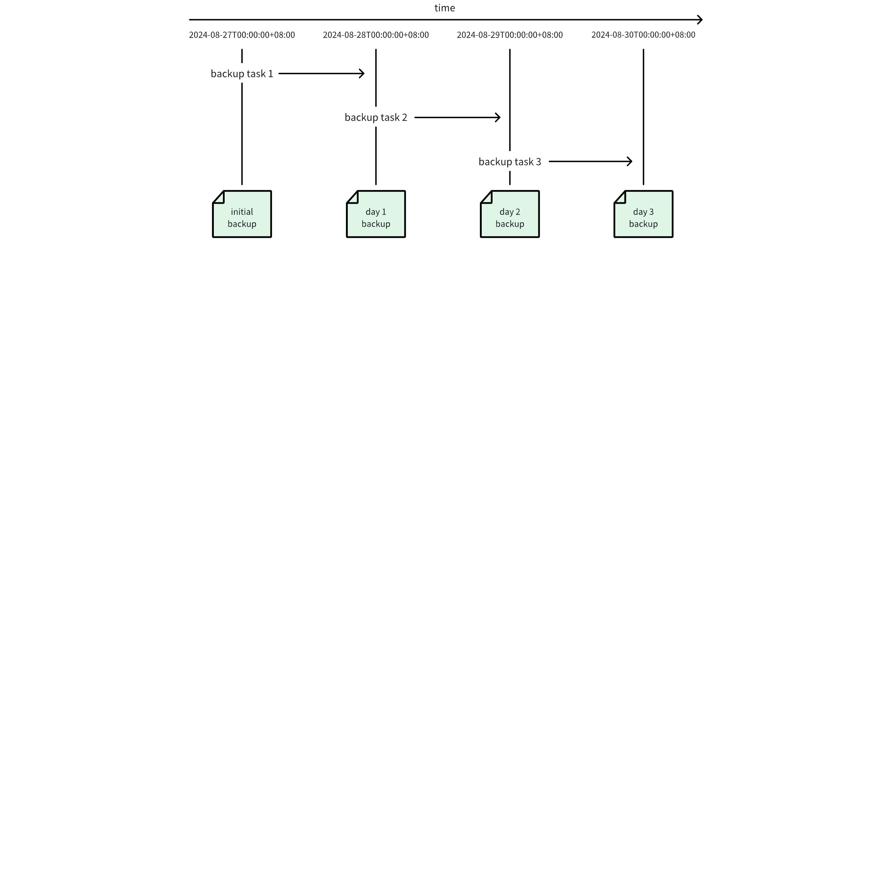

8/27 之前写入的数据备份在初始备份中；8/27 之后，每天生成一个增量备份，每个增量备份中包含一天之内的全部变化。从8/27开始的一系列备份任务，是一个备份计划。init + day1 的备份文件构成一个全量备份，对应一个备份点（2024-08-28T00:00:00+08:00）。
- 数据恢复：使用备份文件，将数据库恢复到指定的时间点。例如：使用 init + day1 的备份文件可以将数据库恢复到备份点（2024-08-28T00:00:00）。
- 数据复制：使用 Cluster A 产生的备份文件，在 Cluster B 上执行数据恢复，这种行为称为**数据复制**。

## 4. 行为说明

### 4.1 备份计划

#### 4.1.1 备份计划的执行策略

备份计划由 taosX 调度，执行策略如下：
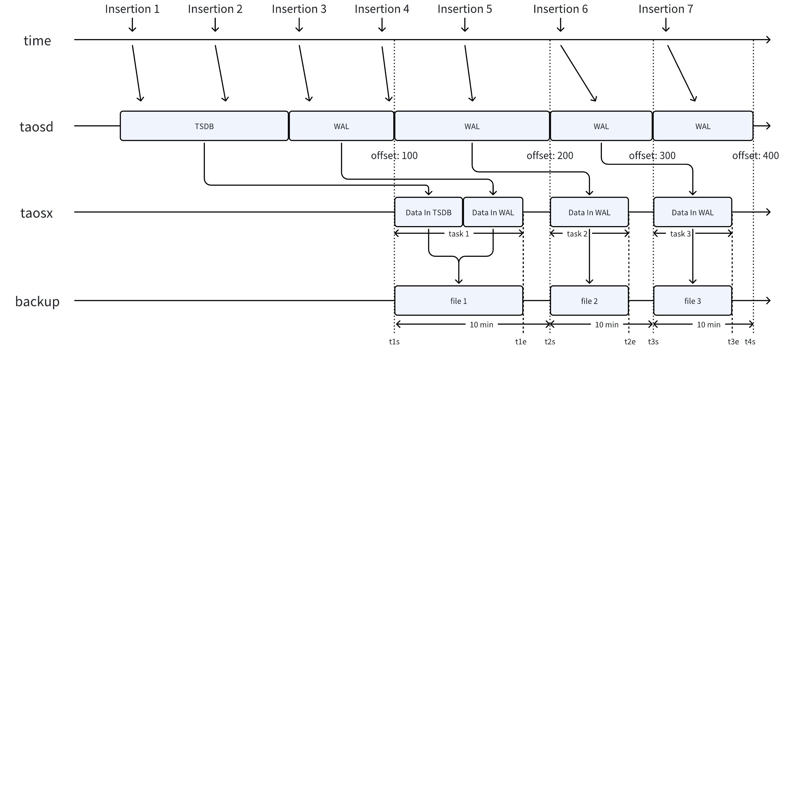

1. 第一条时间轴（time）是数据产生的时间线；
2. 第二条时间轴（taosd）是数据写入 TDengine 的时间线。可以看到：有一部分数据（Insertion1、2）已经写入到了 TSDB 中；另一部分数据（Insertion3、4）写入到了 WAL 中；还有一部分数据（Insertion5、6、7）是将要写入到 WAL 中的。
3. 第三条时间轴（taosx）是执行数据备份任务的时间线。观察这张图时，taosX 正处在第一次执行备份任务（task1）的时刻：t1s。此时，taosX 会先获取到 WAL 中的 latest offset: 100，task1 持续拉取数据。当 `experiment.snapshot.enable = true`时，先拉取 TSDB 中的数据。之后，拉取 WAL 中的数据，直到offset 达到 100 结束。接着，等待下次任务调度，触发 task2 执行。也就是说，taosX 的备份任务，由定时器周期触发开始，拉取数据，在达到任务开始时刻的 offset 后结束。
4. 第四条时间轴（backup）是备份文件生成的时间线。task1 拉取的所有数据，形成一组数据文件，对应的时间戳为 t1s；task2 的备份文件对应时间戳 t2s。也就是说，使用任务的开始时间戳，作为备份点的时间戳。
5. 数据恢复时，用户想要将数据库恢复到时间 t1s，则重放备份文件 file1；同理，要恢复到时间点 t2s，则重放 file1 + file2。
6. 数据复制时，用户实时重放备份计划下的所有备份文件。

#### 4.1.2 备份计划的规则

1. 备份计划的对象是：数据库或超级表。这意味着，用户可以按照超级表拆分备份计划，以提高备份的并发。
2. 同一个备份计划必须使用唯一的 consumer group_id，group_id 由备份计划自动生成。
3. 备份计划，由一系列备份任务组成，当满足备份计划的触发条件时，备份任务开始。同一时刻，只有一个备份任务在运行。
4. 当消费到本次任务开始时的 latest offset 时，备份任务结束。
5. 备份任务（不包括首次任务）开始前，比较 WAL 的 earliest offset、latest offset、当前任务的 current offset（上次任务结束时的 offset）。
   - 如果`current < earliest`，说明上次任务和本次任务之间，被订阅的 WAL 已经不一致，会产生数据丢失，必须在日志中记录告警，在活动日志中提示用户当前备份计划已经产生了数据不连续。
   - 如果 `earliest <= current < latest`，则备份任务从 current 开始，继续备份； 
6. 备份计划必须指定一个备份任务的调度周期`period`，且`period` < `WAL_RETENTION_PERIOD`。否则，一定会产生数据丢失。
7. 任务重叠：如果当前的备份任务已经触发，但之前的备份任务没有完成，则产生了任务重叠。如果出现任务重叠，按照以下规则处理：
   - 当前任务等待上次任务完成，上次任务完成后，立即开始当前任务，且之后的任务顺延。
   - 当前任务等待上次任务的时间，不能超过`WAL_RETENTION_PERIOD`-`period`。如果超过，会产生数据丢失，因此，当前任务等待上一个的时长达到`WAL_RETENTION_PERIOD - period - 5 s`时，当前任务要主动停止上一个任务，并开始前任务。
   - 出现任务重叠时，必须在日志中告警。任务重叠意味着`period`划分太短、或者处理备份的性能不够，需要管理员调整。
8. 备份计划可以被用户停止。执行停止时，保存当前任务的 offset，形成一个完整的备份点。备份计划不再调度任务，只有人工执行 start 操作，备份计划才会恢复，恢复后，任务等待重新被调度。
9. 备份计划可以被用户删除。执行删除时，用户可以选择是否删除关联的备份文件。

#### 4.1.3 备份计划的状态流转

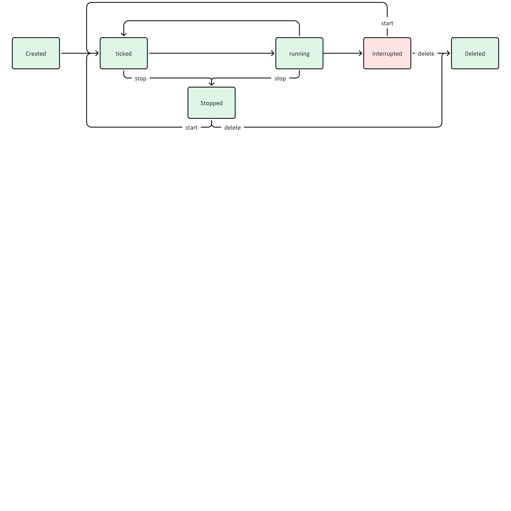

- created ：备份计划已创建，未运行。created 状态对用户是不可以见，备份计划创建成功后，为 created 状态，之后，自动进入 ticked 状态。
- ticked：没有运行任何备份任务，等待备份任务到达触发条件的状态。用户执行 start 操作后，变为 ticked 状态。ticked 状态下，用户可以执行 stop 操作。
- running：正在执行备份任务。任务执行条件触发后，自动变为 running。本次备份任务执行成功后，再自动回到 ticked 状态，等待下次调度。running 状态下，用户可以执行 stop 操作。 
- failed：任务出错失败。备份计划执行过程中，遇到不可修复的错误，自动由 running 变为 failed。failed 状态下，通过人工修复后，可以重新执行 start 操作，恢复备份计划。failed 状态下，用户可以执行 delete 操作。
- stopped：任务被停止/暂停，备份计划不再调度任务。备份计划执行过程中，用户主动执行 stop 操作，进入 stopped 状态。stopped 状态下，用户可以执行 start 操作，恢复备份计划；也可以执行 delete 操作，删除备份计划。
- Deleted：备份计划已删除。用户在 failed 和 stopped 状态，可以执行 delete 操作，进入 deleted 状态。

#### 4.1.4 异常处理

除了任务重叠可能导致备份任务失败外，还有其他因素也可能导致异常。包括：
1. 任务创建时，无效的配置参数，例如：备份路径不存在，任务失败。
2. 任务开始时，订阅的对象（数据库/超级表）不存在或已被删除，任务失败。
3. 任务执行过程中，数据库连接失败，一直尝试重连。重试由`error.retry.max`和`error.retry.interval`2个参数控制。
   - 重试可以恢复：继续执行；
   - 重试后仍然不能恢复的：日志记录错误，任务失败。
4. 任务执行过程中，磁盘满或磁盘损坏，写文件失败等不可恢复的错误：任务失败。

#### 4.1.5 备份计划列表

用户点击“系统管理”的“备份”标签，能够查看“备份计划列表”：
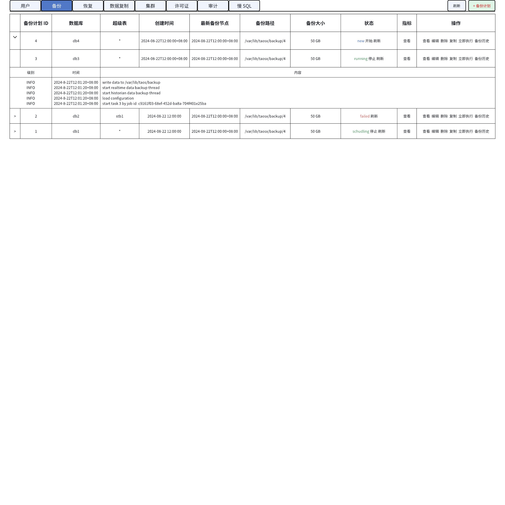

说明：
1. 备份计划的列包括：
  - 备份计划 ID：系统自动生成的 ID，正整数，从1开始，自增。
  - 数据库：备份的数据库名称；
  - 超级表：备份的超级表名称，如果为全部，显示 *；
  - 创建时间：备份计划的创建时间；
  - 最新备份点：最后一次备份任务对应的备份点的日期时间。
  - 备份大小：整个备份计划形成的备份文件的总大小，单位：字节。以人类友好形式显示。
  - 状态：备份计划的当前状态，以及开始/停止/刷新的操作按钮。
  - 指标：点击查看，可以显示整个备份计划的统计指标。
  - 操作：可以进行的操作。
1. 备份计划列表，按照 ID，逆序排列。

#### 4.1.6 创建备份计划

创建备份计划时，需要用户设置的参数包括：

| **参数** | **说明** | **值域** | **必填** |
| --- | --- | --- | --- |
| database | 要备份的数据库，必选，有且仅有一个 | 不包含 information_schema 和 performance_scheam 的所有 database | 是 |
| stable | 数据库中的超级表，全选/选一个。 | database 对应的所有超级表 | 否 |
| upcoming | 下次执行任务的日期时间。 创建计划时，需要校验这个时间，应该比 taosX 当前时刻更新 | 符合 rfc3339 格式的日期时间 | 是 |
| interval | 两次任务执行之间的时间间隔。单位是：分钟。 1. 用户可以选择单位：分钟/ 小时/ 天，单位为“分钟”时。 1. 需要校验，如果`interval >= WAL_RETENTION_PERIOD`报错，要求用户修改。 | 正整数 | 是 |
| max_retry | 最大错误重试次数。默认为：10 | 整数，>= 0 | 否 |
| retry_interval | 错误重试的间隔，单位：秒。默认为 5s。 | 正整数，>= 5s | 否 |
| local://$path/ | 备份文件的存储路径。 1. 如果不指定，使用默认值 $data_dir/backup/$plan_id，这个路径是 taosx 自动创建。 1. 如果指定，应该是一个存在的空目录，否则，报错，提示用户修改。 | 有效的目录 | 否 |
| backup_max_size | 单个备份文件的最大字节数，默认值为：1 GB。 1. 用户可以选择单位，GB/ MB/ KB /B | 大于 1024 的正整数，单位为 Byte，最小是1 K | 否 |
| compression_level | 备份文件的压缩等级，默认为 fastest。 | - fastest：压缩最快。 - best：压缩最好 - balanced：兼具速度和压缩率 | 否 |

点击“+ 备份计划”，弹出下面的表单，填写配置参数后，点击“确定”，创建数据备份计划。
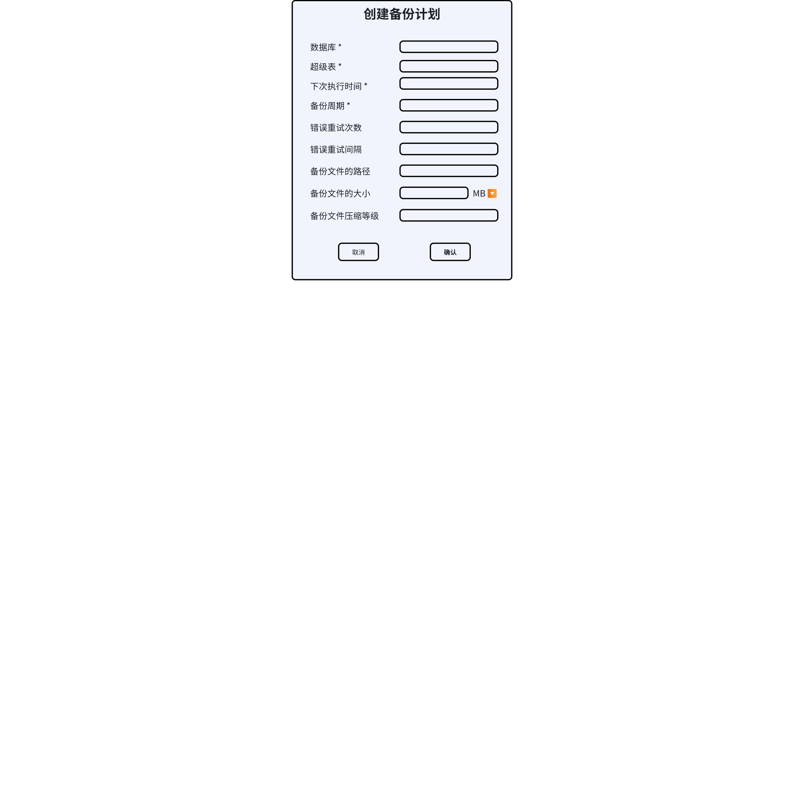

备份计划创建成功后，在“备份计划列表”中添加一行，备份计划立即开始执行。

#### 4.1.7 查看备份计划

备份计划一旦创建成功，在没有被删除之前，备份计划在任何状态，都可以被查看。
在“备份计划列表”中，选择备份计划，在操作中点击“查看”，弹出下面的表单。
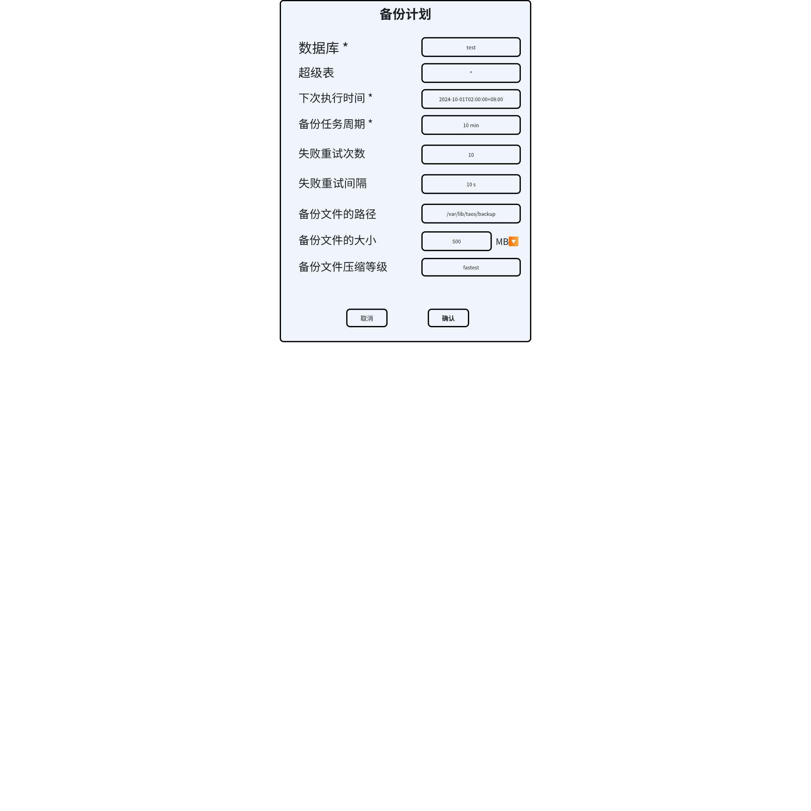

注意，下次执行时间的显示：
1. 在 Scheduling 和 Running 状态，显示下次任务开始执行的日期时间；
2. 在 Failed 和 Stopped 状态，显示任务停止之前，下次任务执行的日期时间。

#### 4.1.8 编辑备份计划

备份计划在 Stopped 和 Failed 状态下，可以编辑。
在“备份计划列表”中，选择备份计划，在操作中点击“编辑”，弹出编辑表单。编辑表单和查看备份计划的表单一样。
说明：
1. 数据库、超级表不能修改，即：备份的对象不能修改，其他配置项可以修改。
2. 点击确定后，提示“确定修改备份计划的配置并立即开始备份？”，用户确定后，提交修改。

#### 4.1.9 复制备份计划

在“备份计划列表”中，选择备份计划，在操作中点击“复制”，弹出和创建备份计划相同的表单。
除了数据库和超级表被置为空外，其他配置项和被复制的计划相同。
用户点击“确认”后，创建一个新的备份计划，之后，跳转到“备份计划列表”并刷新。

#### 4.1.10 删除备份计划

备份计划在 Stopped 和 Failed 状态下，可以删除。
在“备份计划列表”中，选择备份计划，点击“删除”，弹出下面的提示。
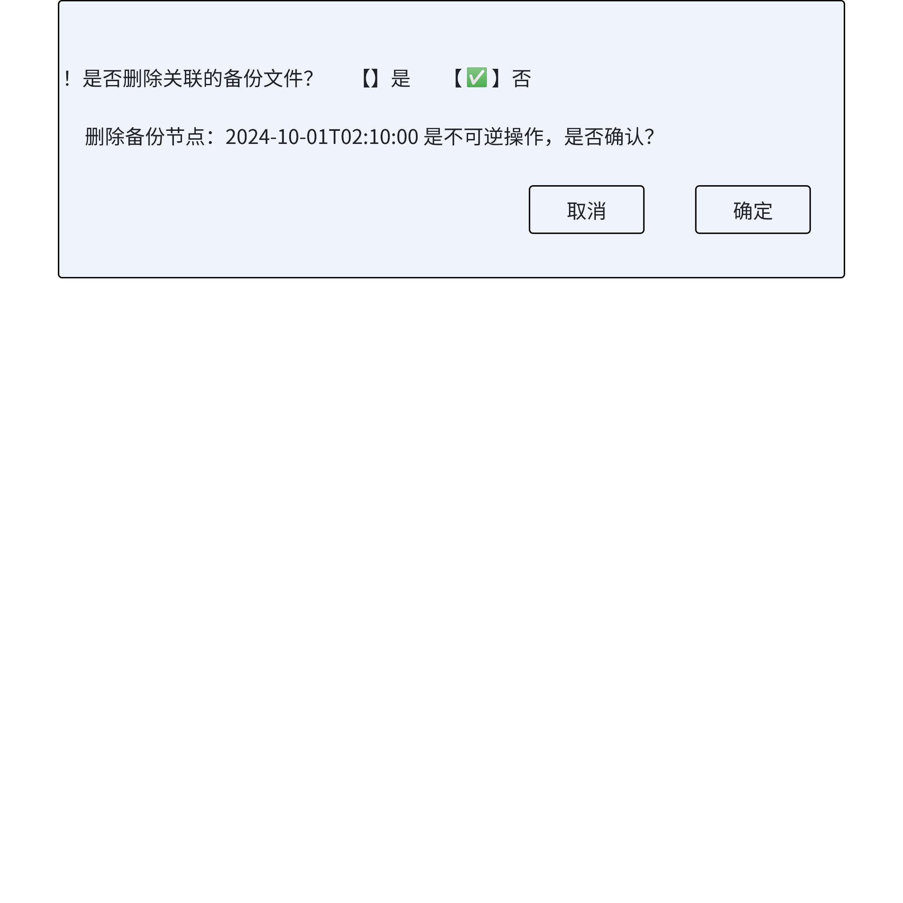

用户选择是否删除关联的备份文件，默认为不删除，点击“确定”后，删除备份计划相关的配置、状态。

#### 4.1.11 立即执行备份计划

在“备份计划列表”中，选择备份计划，在操作中点击“立即执行”。立即执行一次备份任务是指：
1. Scheduling 状态下，忽略“下次执行时间”，立即执行本次任务，任务结束后，计划变为 Stopped 状态。
2. Running 状态下，停止当前任务，形成一个备份点，并立即执行一次新的任务。任务结束后，计划变为 Stopped 状态。
3. Stopped 状态下，立即开始一次备份任务，任务结束后，计划变为 Stopped 状态。
4. Falied 状态下，立即执行一次备份任务，任务结束后，计划变为 Stopped 状态。
用户点击“立即执行”操作时，提示用户：
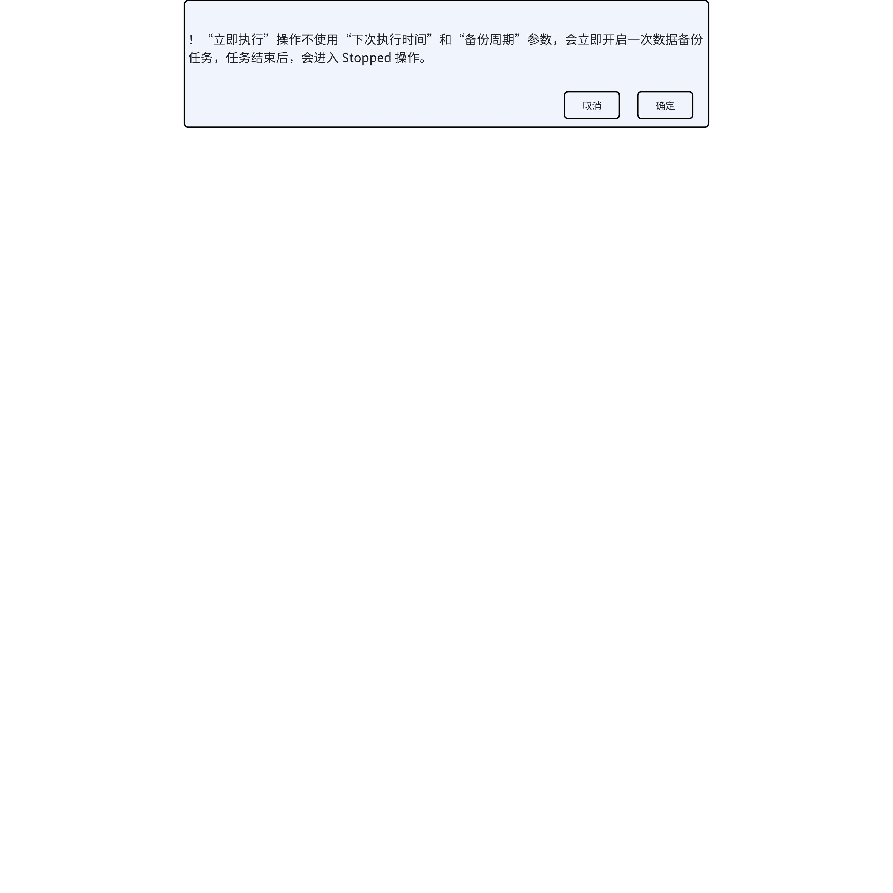

#### 4.1.12 备份历史

在“备份计划列表”中，选择备份计划，点击“备份历史”，弹出下面的备份点列表，显示详细信息。
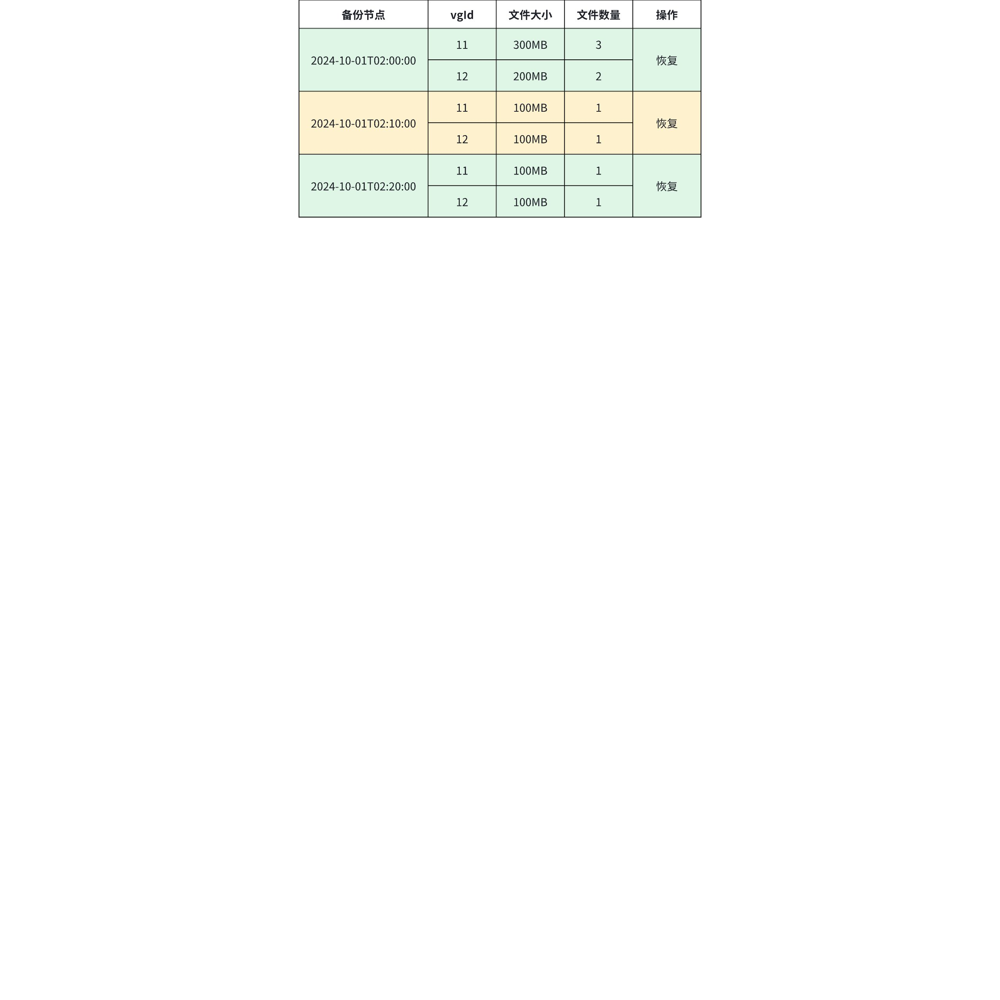

前端按照备份点对应的时间戳，逆序排序，分页展示。

#### 4.1.13 备份计划的统计指标

在“备份计划列表”中，选择备份计划，点击指标下的“查看”，显示以下统计信息：
- backup.written.files: 生成的备份文件数量
- backup.written.bytes：生成的备份文件的总字节数
- backup.written.rows: 备份数据的总行数
- backup.written.current：备份的最后一条记录的时间戳
备份计划 metrics 的 UI 和 DataIn 任务的一样。

### 4.2 手动备份

#### 4.2.1 手动备份和备份计划的区别

使用 taosX 命令行执行 tmq 到 local 的备份任务，是一次性的手动备份。
手动备份和备份计划的区别在于：
1. 手动备份只能形成一个单独的备份点，用户只能恢复到这个备份点对应的时间戳；而备份计划形成的是一系列备份点，用户可以在这些备份点选择要恢复到的时间戳。
2. 手动备份依靠 timeout 来结束任务，当 timeout > 数据写入间隔，或者 timeout = never 时，任务无法停止；而备份计划通过判断 current offset = 任务开始时刻的 latest offset 来结束任务，备份计划的任务一定会停止。
3. 手动备份是对应一个备份任务；而备份计划对应一组备份任务。
4. 手动备份使用任务结束时间戳标识备份点；而备份计划使用任务的开始时间戳标识备份点。
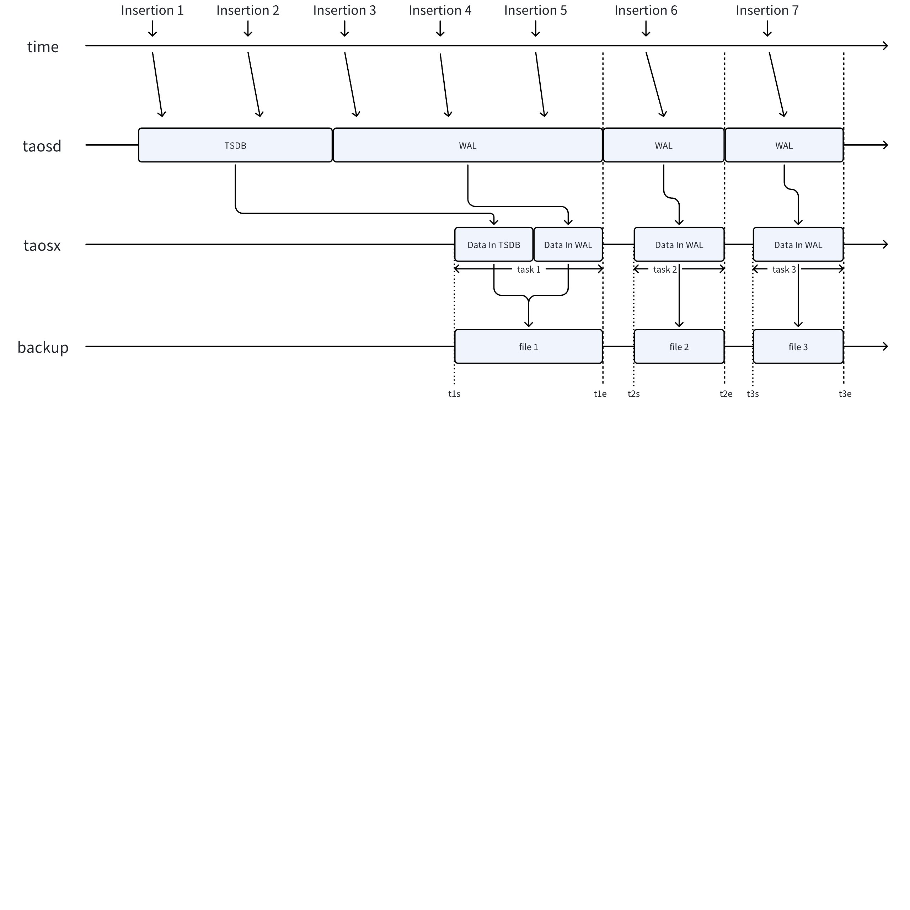

#### 4.2.2 手工备份的规则

1. 手动备份的对象是数据库或超级表，和备份计划的备份对象一样。
2. 手动备份必须指定`group_id`参数。如果使用相同的`group_id`，执行2次手动备份，则第二次备份的是基于第一次的增量备份。
3. 手动备份必须指定`timeout`参数。
   - 当拉取数据超过`timeout`没有数据返回时，任务停止。
   - 当`timeout = never` 时，手动备份任务永不停止，会不断生成备份文件。但不建议用户如此设置，因为无法确定任务产生的备份点时间戳。
4. 手动备份以任务结束时的时间戳作为备份点的时间戳。
5. 手动备份运行中，遇到 TDengine 连接失效，或可以通过重试恢复的错误：使用`error.retry.max`和`error.retry.interval`参数进行重试。

#### 4.2.3 配置参数

taosX 命令行执行手工备份，使用方法如下：
```toml {wrap}
taosx run -f "tmq<+ws>://<topic_dsn><?args>" -t "local:/path/to/dir<?args>"
```

配置参数如下：

| **参数** | **说明** | **值域** | **参数归属** | **是否必填** |
| --- | --- | --- | --- | --- |
| group_id | tmq 的 group_id。 | 合法的 tmq group_id | tmq | 是 |
| timeout | 超过 timeout 没有拉取到新数据，任务停止。如果不设置，使用默认值 5s | never：永不停止 | tmq | 否 |
| database | 要备份的数据库名。如果数据库不存在，则 | 合法的数据库名 | tmq | 是 |
| stable | 要备份的超级表，不填表示备份整个数据库。 | 合法的超级表名 | tmq | 否 |
| error.retry.max | 错误的最大重试次数。默认为 10。 | 正整数 | tmq | 否 |
| error.retry.interval | 出错重试的间隔，单位：秒。默认为 5 s。 | 正证书 | tmq | 否 |
| backup.path | 备份文件的存储路径。如果文件路径不存在，失败报错。 | 合法的文件路径 | local | 是 |
| backup.max.size | 单个备份文件的大小，和备份计划中的说明一致。单位：B，默认为 1 GB。 | 正整数 | local | 否 |
| backup.comp.level | 备份文件的压缩等级，和备份计划中的说明一致。 | 默认为 fastest | local | 否 |

下面是一个手动备份的示例：
```shell {wrap}
taosx run -f "tmq+ws://192.168.0.201:6041/test?" -t "local:/tmp"
```

#### 4.2.4 异常处理

1. 配置参数不合法、备份文件路径不存在或无效：任务失败报错，记录日志，退出。
2. 任务运行中，遇到 TDengine 或 taos-adapter 故障，或者可以依靠重试修复的错误，使用`error.retry.max`和`error.retry.interval`参数进行重试。
   - 重试可以解决，则继续进行。
   - 重试仍然错误，日志中记录错误，任务停止。
3. 任务运行中，遇到授权过期、磁盘满，或其他不可以恢复的错误：在日志中记录错误，任务失败，退出。

### 4.3 备份文件的存储结构

#### 4.3.1 目录结构和文件名规则

备份文件在文件系统中的存储为用户可见行为，存储在用户指定的路径。
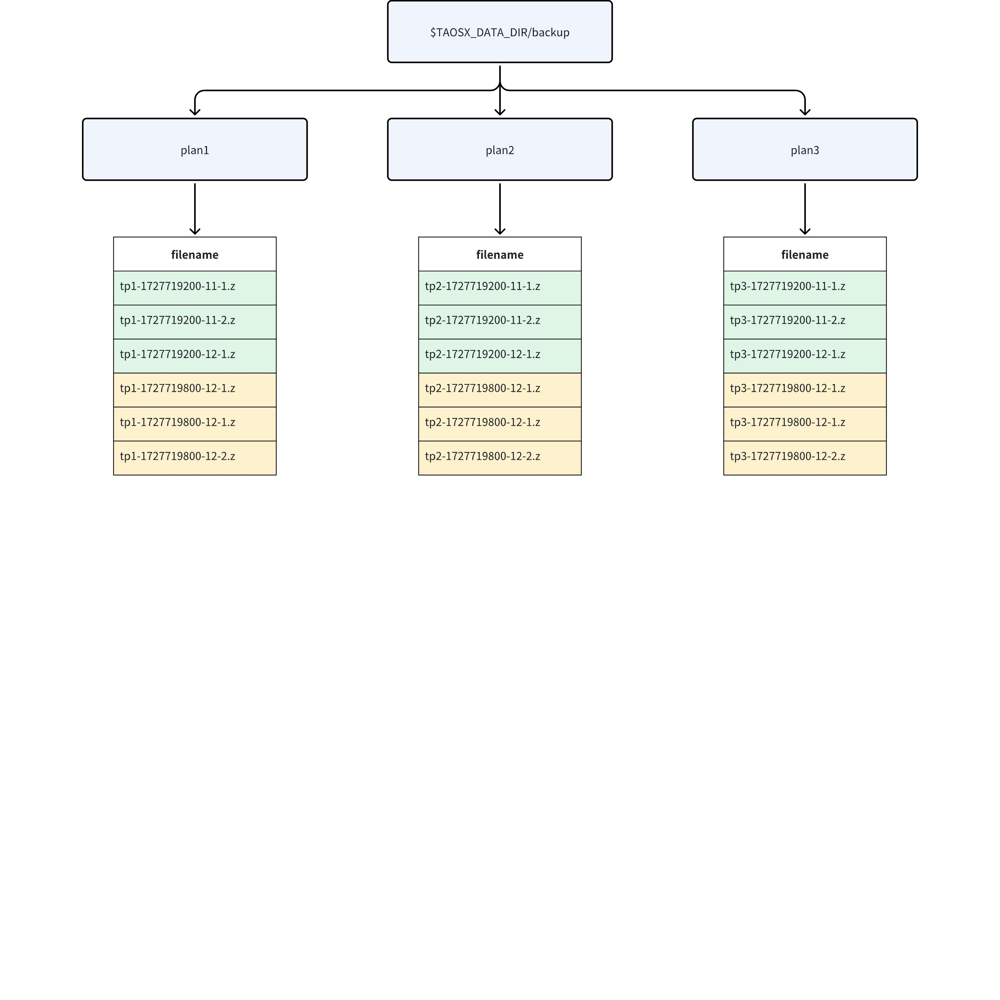

1. 默认情况（用户创建备份计划时，不指定 `backup.path`），根目录是`$TAOSX_DATA_DIR/backup`；根目录下，按照备份计划划分，每个备份计划一个目录；备份计划目录下，包含所有备份任务形成的文件。
2. 创建备份计划或执行手动备份时，用户指定了`back.path`，则直接使用用户指定的`backup.path`作为备份文件的存储路径。
3. 备份任务文件名为`<backup_object>-<vgId>-<datetime>-<N>.z` ，其中：
  - backup_object：备份的对象。如果是数据库，写成`database`；超级表，则写成`database.stable`；
  - datetime：任务形成的备份点的时间戳。
  - vgId：备份文件对应的 vgroup id；
  - N：为从 1 开始单调递增的整数，备份文件达到`backup.max.size`后关闭，并创建新的文件，N 加一。

#### 4.3.2 备份文件的内部结构

数据文件内部结构对用户不可见，此处仅作逻辑上的描述以指导具体实现。
Header 部分

| **字段** | **长度（B)** | **值** | **说明** |
| --- | --- | --- | --- |
| 文件标识 | 4 | b"TAOSZ" | 备份文件的标识 |
| 文件版本 | 2 | 0o10，八进制字面量，版本`1.0` | 对应 x.y 形式的版本号，当前版本号为 1.0，共两个历史版本： - `0.0`: 初始版本 - `1.0`: Header 格式增加来源版本号；消息体内容不包含 blocks - `1.1`：当前版本号 |
| API 版本 | 40 | 740e3d85f4fee12c077042d0448a25da9570c7dc | taosx 的版本，git commit id |
| Server 版本 | 40 | 740e3d85f4fee12c077042d0448a25da9570c7dc | TDengine Server 的版本，git commit id |
| 备份对象 | 变长（u8 + str_len） | `database.stable` | 备份对象的名称 |
| 时间戳 | 8 | 1728914582000 | 毫秒精度的时间戳，int64，与备份点对应 |
| vgId | 1 | 11 | Vgroup Id，int 8， |
| 文件序号 | 4 | 1 | 文件序号，uint 32，自增 |
| Body 部分 | 变长（u8 + str_len） |  | 数据 Body 部分 |
| Body 校验和 | 4 | 93ED4753 | 校验和，CRC32 |

Body 部分

| **字段** | **长度（B)** | **值** | **说明** |
| --- | --- | --- | --- |
| Block 类型 | 1 | 1/ 2/ 3 | 数据类型： 1. Data only 1. Meta only 1. Meta + Data |
| 消息长度 | 4 | u32 | tmq_raw_data -> raw_len ```cpp typedef struct tmq_raw_data { void *raw; uint32_t raw_len; uint16_t raw_type; } tmq_raw_data; ``` |
| 消息类型 | 2 | u8 | tmq_raw_data-> raw_type |
| 消息体 | len | [] | 消息内容 |

### 4.4 恢复任务

#### 4.4.1 恢复任务的规则

1. 用户通过 exploer 创建数据恢复任务，用户可以选择要恢复到哪个数据库/超级表。
   - 如果目标不存在，则创建新库新表。
   - 如果目标已经存在，则恢复的数据会覆盖旧数据。
   - 恢复任务是不可逆操作，恢复任务会回放包括删除在内的数据操作，可能造成删除旧数据的风险。因此，在旧库上恢复，必须提示用户风险。
   - 恢复任务的最佳实践为：将数据恢复到空的数据库中。
2. 一个备份计划中包含多个备份点，恢复任务只能选择其中的某个备份点。
3. 假设要恢复到备份点 ts(N)，则需要的备份文件为：ts(N-1) 到 ts(N) 之间的增量备份 + 备份点 ts(N-1) 的备份文件。也就是说，需要回放全部 ts4 之前的全部备份文件。
4. 恢复任务必须按照备份点的顺序，依次恢复。
5. 同一个备份点内，备份文件按照 vgId 进行了划分，恢复时可以按照 vgId 并发。
6. 同一个 vgId 内，备份文件按照序列号 N 的顺序进行恢复。
7. 恢复任务，遇到可以通过重试恢复的错误，使用`error.retry.max`和`error.retry.interval`规则重试。

#### 4.4.2 状态转移

恢复任务的状态如下图所示。
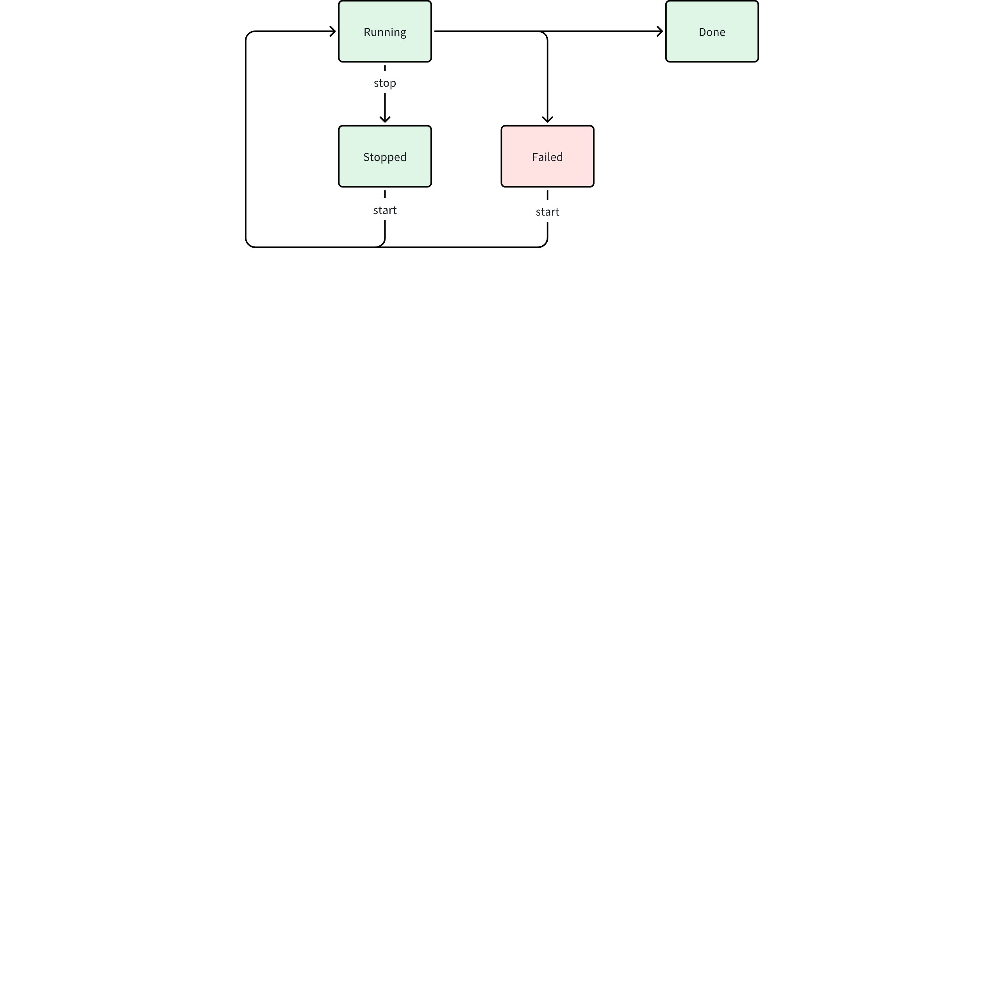

- Running：任务运行中。
  - 用户选择要恢复的备份点并确认后，恢复任务被创建并启动，进入Running 状态。
  - 用户可以通过执行 start 操作，将 Stopped 或 Failed 状态的任务，重新开启，进入 Running 状态。
  - Running 状态下，用户可以执行 stop 操作。
- Stopped：任务中断。
  - 用户手动执行 stop 操作时，任务进入 Stopped 状态。
  - Stopped 状态下，用户可以执行 start 操作。
- Failed：任务中断。
  - 任务发生了不可恢复的错误，任务停止。
  - Failed 状态，用户可以执行 start 操作。
- Done：任务已正常结束。

#### 4.4.3 异常处理

1. 任务启动前，备份文件路径错误、找不到指定备份点：任务失败。
2. 任务运行中，TDengine 或 taos-adapter 连接失效：一直重连，直到 TDengine 连接恢复，任务不退出。
3. 任务运行中，遇到可以通过重试修复的错误：用`error.retry.max`和`error.retry.interval`规则重试。
   - 重试可以恢复的：任务继续执行。
   - 重试仍然报错的：写入到`error.store.path`，日志记录报错信息，跳过当前数据，任务继续执行。
4. 任务运行中，遇到不可恢复的错误：日志记录报错，任务失败。
5. 任务运行中，备份文件的文件损坏、校验和错误等：日志记录报错，跳过当前文件。

#### 4.4.4 创建恢复任务

1. 在“系统管理”的“备份”中，选择某个备份计划，点击“备份历史”；UI 见“4.1.5 备份计划列表”。
2. 在弹出的“备份点列表”中，选择要恢复的备份点，在“操作”列表中点击“恢复”。UI 见“4.1.12 备份历史”。
3. 点击“恢复”操作，弹出下面的表单。
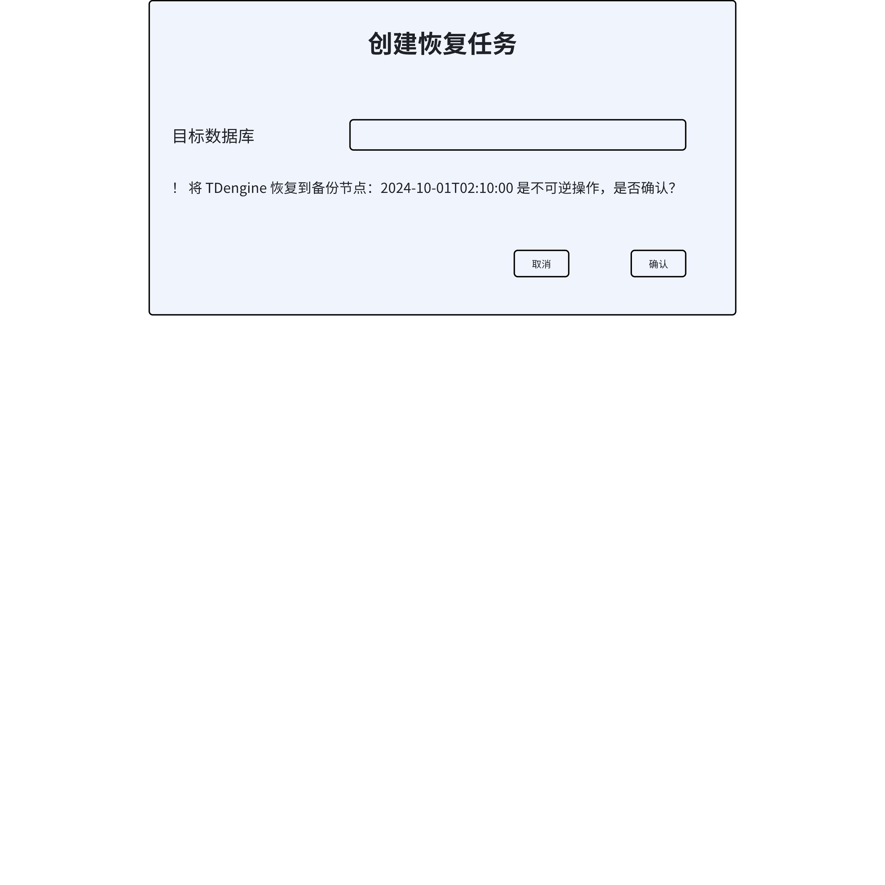

1. 点击“确认”后，创建恢复任务，跳转到“恢复”标签。

#### 4.4.5 恢复任务列表

恢复任务列表中，显示当前 taosX 正在进行所有恢复任务。
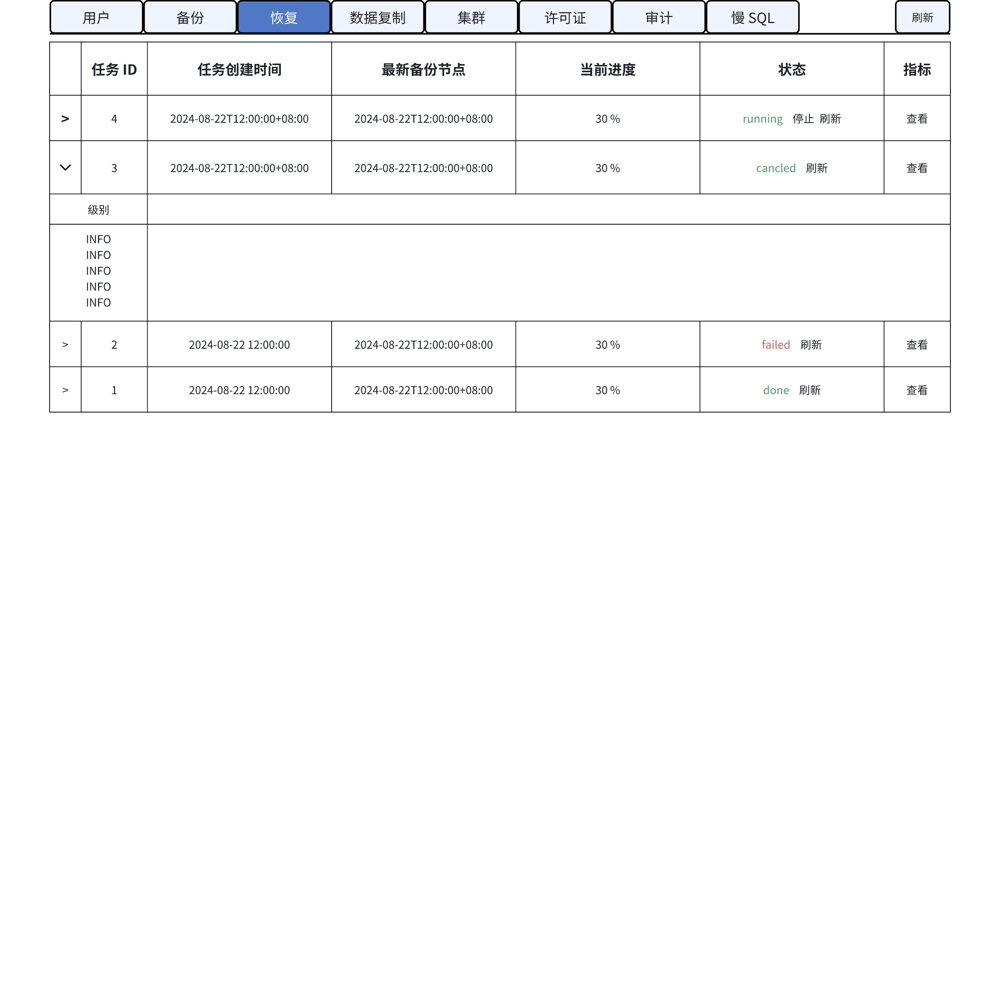

说明：
1. 恢复任务列表，按照任务创建时间（即：任务ID），倒序排列。
2. 包括以下列：
  - 任务 ID：系统生成的 ID，正整数，自增。
  - 任务创建时间：任务被创建的时间。
  - 最新备份点：正在读取的数据备份点对应的日期时间，格式为 rfc3339。
  - 当前进度：已经读完的备份文件数量 / 全部备份文件数量。
  - 状态：恢复任务的状态，“停止”和“刷新”操作的按钮。
  - 指标：点击“查看”，可以查看恢复任务的统计信息。

#### 4.4.6 恢复任务的统计指标

在恢复任务列表中，选择要备份任务，点击“指标”的“查看”，显示以下统计信息：
- backup.processed.files: 处理过的文件数量
- backup.processed.bytes：处理过的文件的总字节数
- backup.processed.rows：处理过的数据行数
- backup.processed.current：处理成功的最后一条记录的时间
- backup.failed.rows: 处理过但失败的数据行数，backup.processed.rows - backup.failed.rows 即为恢复成功的数据行数

### 4.5 手动恢复

#### 4.5.1 手动恢复的规则

1. 手动恢复会回放备份文件内的所有增量操作，包括删除。如果目标数据库已存在且不为空，可能会发生删除旧数据。请用户在操作前，将旧库做好备份。
2. 手动恢复会扫描`backup.path`下的所有文件，根据文件名称进行过滤，用户不可修改备份文件的原始名称。
3. 手动恢复通过`from`和`to`参数，指定要恢复的备份点的范围。例如，指定`from=3，to=10`，且存在备份文件`1,3,5,7,9,11`，则恢复`3,5,7,9`。
4. 手动恢复的必须指定备份文件的对象：数据库或超级表，且只能指定一个。
5. 手动恢复运行中，遇到 TDengine 或 taosadapter 断连，一直重试，直到恢复。遇到可以依靠重试恢复的错误，用`error.retry.max`和`error.retry.interval`规则重试，重试仍然失败，要记录到`error.store.path`目录下的出错数据文件中。

#### 4.5.2 配置参数

taosX 命令行使用方法如下：
```toml
taosx run -f "local://<backup.path><?args>" -t "taos<+ws>://host:port/database<?args>"
```

配置参数如下：

| **名称** | **描述** | **值** | **参数归属** | **必填** |
| --- | --- | --- | --- | --- |
| backup.path | 备份文件的目录。需要校验，合法的目录路径 | 合法且存在的目录路径 | local | 是 |
| backup.obj | 在备份路径下，指定要恢复的备份对象。备份任务会根据文件名过滤。 | 合法的备份对象，数据库/超级表 | local | 是 |
| start.from | 指定从哪个备份点对应的时间戳开始恢复。如果不指定，从文件中最早的时间戳开始。 | 日期时间，rfc3339格式 | local | 否 |
| stop.at | 指定到哪个备份点对应的时间戳结束恢复。如果不指定，会持续检查文件路径下的新文件，恢复任务永不停止。 | 日期时间，rfc3339格式 | local | 否 |
| error.store.path | 恢复任务发生错误时，转存到出错数据目录下。 | 合法且存在的目录路径 | local | 是 |
| error.retry.max | 最大出错重试次数。默认值：10 | 正整数 | taos | 否 |
| error.retry.interval | 出错重试间隔。默认值：5s | 正整数 | taos | 否 |
| host | 目标集群的 host | 合法的 sink host | taos | 是 |
| port | 目标集群的 port | 合法的 sink port | taos | 是 |
| database | 目标集群的 database | database 在目标数据库中必须存在 | taos | 是 |

下面是一个恢复任务的示例：
```http {wrap}
taosx run -f "local:/tmp" -t "taos+ws://192.168.0.201:6041/test2"
```

#### 4.5.3 异常处理

1. 配置参数不合法：报错，任务退出。
2. 任务开启时，备份文件路径不存在、TDengine 连通性失败：报错，任务退出。
3. 任务运行中，遇到 TDengine 或 taosadapter 断连，或其他可以自动恢复的错误：一直重试，直到连接恢复。
4. 任务运行中，遇到可以依靠重试解决的错误：使用`error.retry.max`和`error.retry.interval`处理。
   - 重试可以解决的，继续执行；
   - 重试仍不能解决的，记录到`error.stroe.path`下的出错数据文件中。
5. 任务运行中，遇到不可解决，但可以跳过的错误：记录到`error.store.path`的出错数据文件，日志报错，跳过，任务继续。
6. 任务运行中，遇到授权过期、 TDengine core 等，不可以恢复，且不能继续执行的错误：在日志中记录错误，任务退出。

### 4.6 出错数据文件的存储结构

#### 4.6.1 目录结构和文件名规则

1. 默认情况下，出错数据文件的目录为`$TAOSX_DATA_DIR/backup/err_restore`。出错数据目录下，没有子目录，所有恢复任务的出错数据文件都在同一个目录下。
2. 出错数据文件的命名：<backup_file_name>.bakerr。出错数据文件使用备份数据文件的文件名，只是将文件后缀改为`.bakerr`。

#### 4.6.2 出错数据文件的内部结构

出错数据文件和备份文件的格式一样，但只包含了出错的数据。

### 4.7 备份文件删除

备份与恢复任务是完全解耦的，多个恢复任务可以由从同一存储位置向不同 TDengine 集群恢复相同或不同的 DB，因此数据恢复任务不能自动删除任何数据备份文件，而应由运维人员根据备份和恢复任务的结果判断哪些备份文件可以安全删除。
删除备份文件的方法：
1. 在“4.1.10 删除备份计划”中，在用户选择删除计划时，会提示用户是否删除关联的备份文件。如果选“是”，则删除备份计划时，一同删除备份文件。
2. 运维人员，在 taosX 所在服务器，手工执行删除命令。

## 5. 性能

可能的性能问题包括：
1. 订阅 TSDB 数据慢
问题：tmq 订阅开启`experimental.snapshot.enable`，拉取 TSDB 数据的效率可能没有查询快。
解决方法：考虑用逻辑备份产生初始备份，然后再开启增量备份。
1. 数据复制的网络限制
问题：相比本地备份恢复，数据复制还有网络传输的性能消耗。特别的，在有网闸的情况，性能受网络设备的限制。
解决方法：提高网络硬件的吞吐能力，将备份文件的压缩等级设置为`best`

## 6. 兼容性

鉴于数据备份和恢复功能并未被某个客户实际使用，不考虑兼容性问题。
1. 旧的数据备份和恢复任务与新版本不兼容，taosX 升级后，需要删除旧任务再重建新任务。
2. 如果要使用旧版本的备份文件，需要使用旧版本的 taosX 恢复。

## 7. 运维

依据可观测性一节所描述的输出，判断旧的数据备份文件是否可以删除，由运维人员决定。程序不会自动删除旧文件。

## 8. 使用场景

### 8.1 备份恢复

#### 8.1.1 用 explorer 备份恢复

一个 TDengine 实例，使用 explorer 指定备份计划，生成备份文件。通过 explorer ，将数据库恢复到指定要恢复的备份点。

#### 8.1.2 用 taosx 命令行备份恢复

一个 TDengine 实例，使用 taosX 命令行启动备份任务，生成一个备份点。使用 taosX 命令行，将数据库恢复到备份点。

### 8.2 数据复制

#### 8.2.1 数据复制的架构

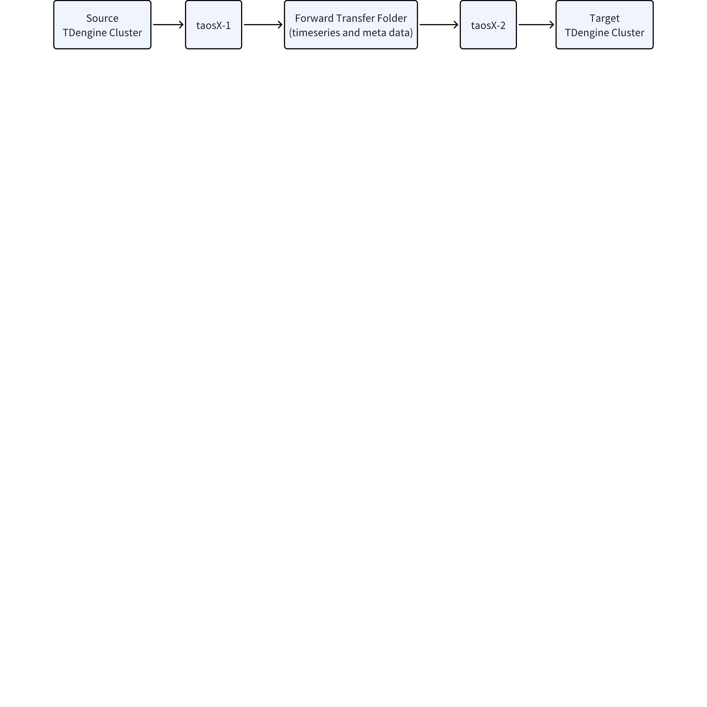

本质上，数据复制 = 备份 + 恢复，但备份和恢复在不同集群上进行。
数据复制满足以下规则：
1. 数据复制不支持在 taos-explorer 中操作，数据复制按照“4.3.2. 复制的操作流程”进行。
2. 从 Cluster A 到 Cluster B 进行数据复制，需要保证 Cluster B 能够访问到 Cluster A 的备份文件。

#### 8.2.2 数据复制的操作流程

1. 在 Cluster A 和 B 上搭建文件同步环境。
2. 在 Cluster A 上创建备份，可以使用备份计划生成，也可以使用 taosX 命令行 + 脚本生成。
3. 在 Cluster B 上，使用 taosX 命令行模式恢复，设置 `stop.at` 参数不填，即：恢复任务不停止，持续恢复新的备份文件。

#### 8.2.3 跨网闸的数据同步

有网闸的情况，两个 TDengine 集群互相无法通过网络通信，也没有共享存储。这种情况下，可以使用数据复制，完成集群间的数据同步。Cluster A 执行备份，由网闸传输工具将备份文件搬运到网闸另一侧，在 Cluster B 上恢复数据。
参考：[【中核】跨网闸数据同步](https://taosdata.feishu.cn/wiki/OKVNwU0jiiq8INkCAwzcdTCFnsb)

## 9. 约束和限制

无

## 10. 常见错误和排查

无

## 11. 可观测性

无

## 12. 文档

无

## 13. 参考文档

无

## 14. 附录1: API

通过 swagger 生成，详情查看：http://192.168.0.201:6050/swagger-ui/

## 15. 附录2: 集群间的文件同步

可能的方式：
1. rsync：文件同步工具，可以通过 SSH 进行安全传输；
2. 网络共享存储：在 Cluster B 上搭建 NFS 服务器，在 Cluster A 上挂在 NFS 共享；
3. 云存储；
4. 其他文件同步工具

## 16. 附录3: 最佳实践

1. 备份计划的并发：一个 database 可以按照 stable 划分成多个备份计划，每个备份计划备份一个 stable 的数据。
2. vgroup 并发：每个备份任务都按照 vgroup 做了划分，一个 consumer 对应一个 vgroup。
