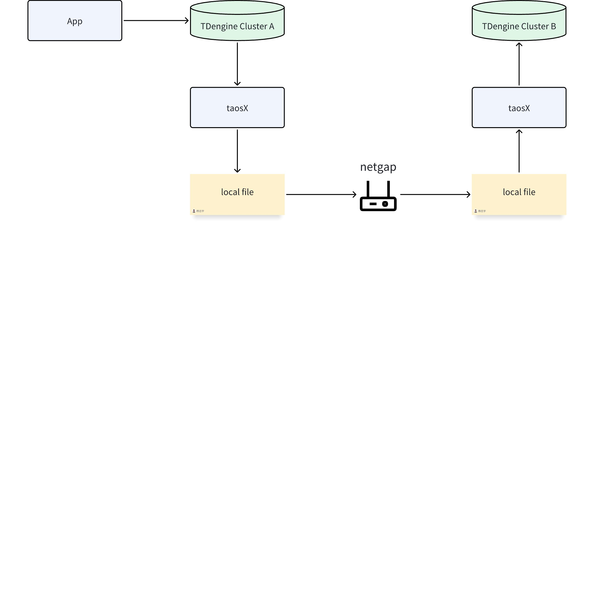
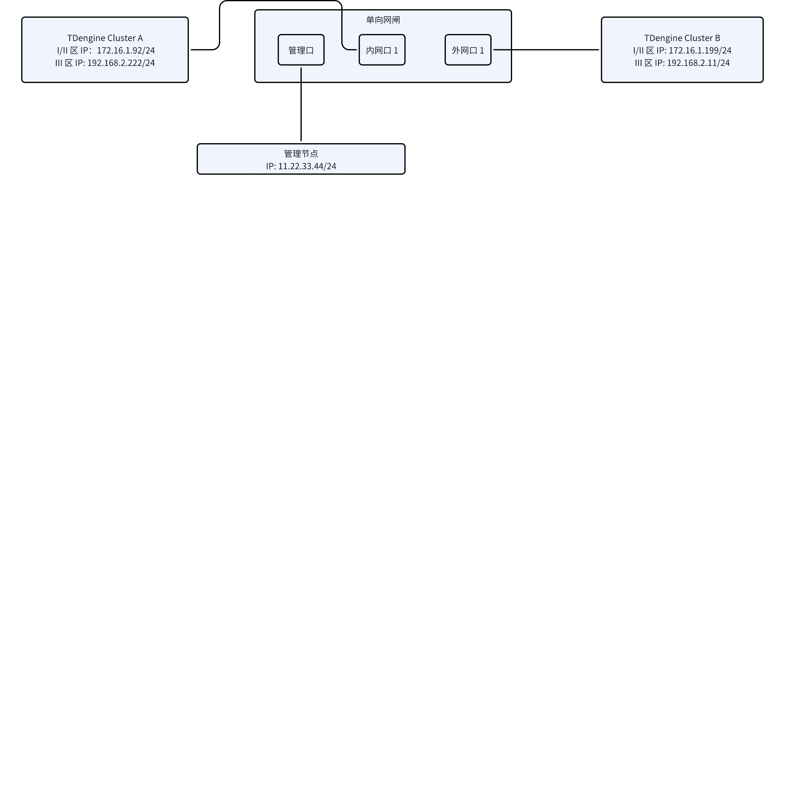
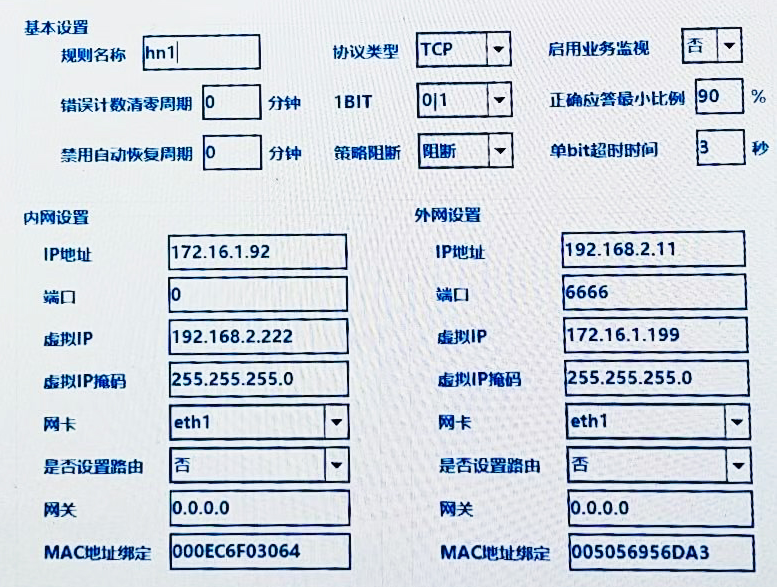
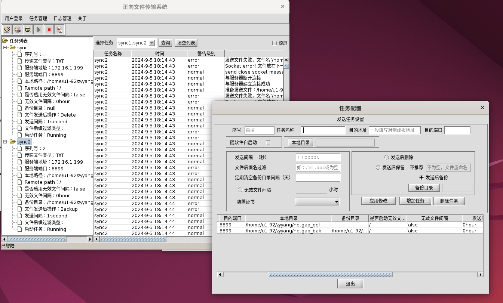
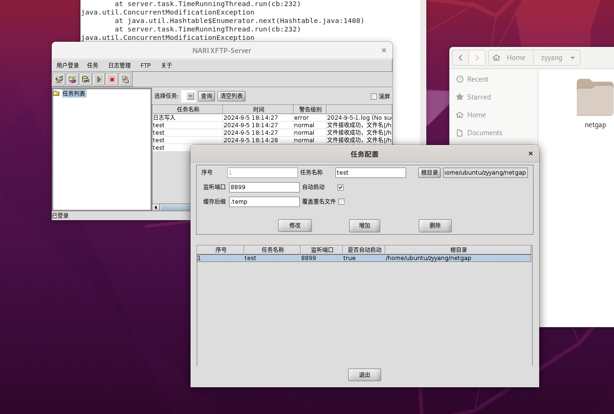

# TDengine 跨网闸数据同步指南

## 1. 编写目的

本文档是对跨单向网闸进行 TDengine 实例之间数据同步的使用说明，旨在介绍“基于 taosX 增量备份和恢复的 TDengine 跨单向网闸数据同步方案”的基本原理，指导用户部署单向网闸环境，说明如何在跨网闸的 TDengine 实例间进行数据复制。
第 2 节介绍 TDengine 跨网闸数据同步的原理；第 3.1 节介绍如何部署单向网闸环境；第 3.2 和 3.3 节，介绍如何验证 taosX 的跨网闸功能。

## 2. 基本原理

TDengine Enterprise 通过[增量数据备份和恢复](https://taosdata.feishu.cn/wiki/VwpywqMkviooHYkhqbccUQrqnnh)的功能，实现跨单向网闸传输数据的功能。


如上图所示：
（1）TDengine Cluster A 为发送端，TDengine Cluster B 为接收端，二者由单向网闸设备进行隔离；
（2）数据写入程序 App 将实时数据写入TDengine Cluster A；
（3）taosX 通过 TDengine 的订阅接口，拉取实时数据，转化为增量备份文件，写入本地文件系统；
（4）借助网闸厂商提供的单向网闸的文件传输软件(例如：南瑞NARI XFTP)，可以将增量备份文件摆渡到 TDengine Cluster B 所在的文件系统中；
（5）taosX 通过增量备份文件恢复，将数据写入到 TDengine Cluster B 中。

## 3. 软硬件环境

### 3.1 部署网闸硬件

按照《SysKeeper-2000 网络安全隔离装置（正向单比特版）用户手册》，将单向网闸部署在机房中，通过内网接口和外网接口，分别与内网和外网相连。 
按照下图所示，将 TDengine 的 2 个集群和网闸设备进行连接。


1. 按照“二次安全防护”的要求，**数据采集的部分称为 I/II 区（内网）**，TDengine Cluster A 位于 I/II 区，通过网线连接到网闸设备的内网口 1 上。同时，在 I/II 区为 Cluster A 和 B 分配合适的 IP 地址，例如：Cluster A 使用 172.16.1.92/24，Cluster B 使用 172.16.1.199/24。
2. **数据汇聚的部分称为 III 区（外网）**，TDengine Cluster B 位于 III 区，通过网线连接到网闸设备的外网口 1 上。在 III 区为 Cluster A 和 Cluster B 分配合适的 IP 地址，例如：Cluster A 使用 192.168.2.222/24，Cluster B 使用 192.168.2.11/24。
3. 需要使用一台 Windows 主机，安装配置软件 SysKeeper-2000，主机通过网线连接到网闸的管理口。Windows 主机设置成`11.22.33.43/24`（这款网闸必须使用这个 IP 地址），通过配置软件 SysKeeper-2000 访问网闸的管理口，地址`11.22.33.44/24`（这款网闸必须使用这个 IP 地址）。

### 3.2 配置网闸

完成硬件设备的部署后，在 Windows 主机上安装配置软件 SysKeeper-2000，并按照 SysKeeper-2000 用户手册进行配置。配置截图如下：


<callout emoji="exclamation" background-color="light-orange" border-color="light-orange">
**注意事项：**
1. 使用管理节点配置网闸需要 windows 电脑，运行配置软件。依赖 java 环境。
2. SysKeeper-2000配置软件，不允许安装在 C 盘下，需要在 D 盘下安装。
3. 配置管理节点时，SysKeeper-2000 网闸要求 IP 设置为 11.22.33.43/24，访问：11.22.33.44/24。
</callout>

### 3.3 配置文件传输工具

SysKeeper-2000 包含文件传输工具 NARI XFTP，能够完成文件的单向传输。按照《SysKeeper-2000 使用说明》进行安装配置。
发送端的配置：


接收端的配置：


<callout emoji="exclamation" background-color="light-orange" border-color="light-orange">
**注意**：启动 UI 界面后，需要先**用户登录**，直接点击确认即可，不需要输入密码。
</callout>

### 3.4 检查文件跨网闸传输

配置完成后，检查文件传输工具是否成功。步骤如下：
1. 在内网的发送文件夹下创建一个文件，例如：
```http {wrap}
echo "hello" > /home/u1-92/zyyang/netgap/test.txt
```

1. 在外网的接收文件夹下，查看是否能够收到文件。
```http {wrap}
ls -al /home/u2-11/netgap
```

1. 如果收到，说明网闸正常；如果失败，请查看文件传输工具的日志，并检查配置。

## 4. 数据同步

### 4.1 模拟数据写入

1. 登录到 TDengine Cluster A
```shell {wrap}
ssh root@192.168.1.92
```

1. 模拟写入
```shell {wrap}
taosBenchmark -t 1000 -n 100000 -y
```

### 4.2 启动数据同步

目前，taos-explorer 没有可以导入外部备份文件的入口。因此，验证跨网闸数据同步时，只支持 taosX 命令行。

#### 4.2.1 启动数据备份

在 TDengine Cluster A 上，使用 taosx 启动备份任务
```shell {wrap}
taosx run --from 'tmq://192.168.1.92:6030/test?upcoming=now&interval=1s&self.repeat=true' --to 'local:/home/u1-92/zyyang/backup?move.to=/home/u1-92/zyyang/netgap' -v
```

--from 的参数说明：
1. upcoming：下一次执行备份任务的时间。有效值为一个 rfc3339 合适的日期时间，也可以为 now，表示立即开始。
2. interval：每次备份任务之间的间隔。例如：interval=60s，表示两次备份任务之间间隔 60 秒。
3. self.repeat：是否持续重复。self.repeat = true，表示持续重复调度备份任务，命令行下不退出。
--to 的参数说明：
1. move.to：一个备份文件写入完成后，移动到指定的目录。

#### 4.2.2 启动数据恢复

在 TDengine Cluster B 上，使用 taosx 启动恢复任务
```shell {wrap}
taosx run --from 'local:/home/u2-11/netgap' --to "taos://192.168.2.11:6030/test" -v
```

### 4.3 验证同步结果

数据写入完成后，检查 TDengine Cluster A 和 TDengine Cluster B 的数据条数是否一致，选取最近 100 行数据与源数据进行比对，看是否一致。
