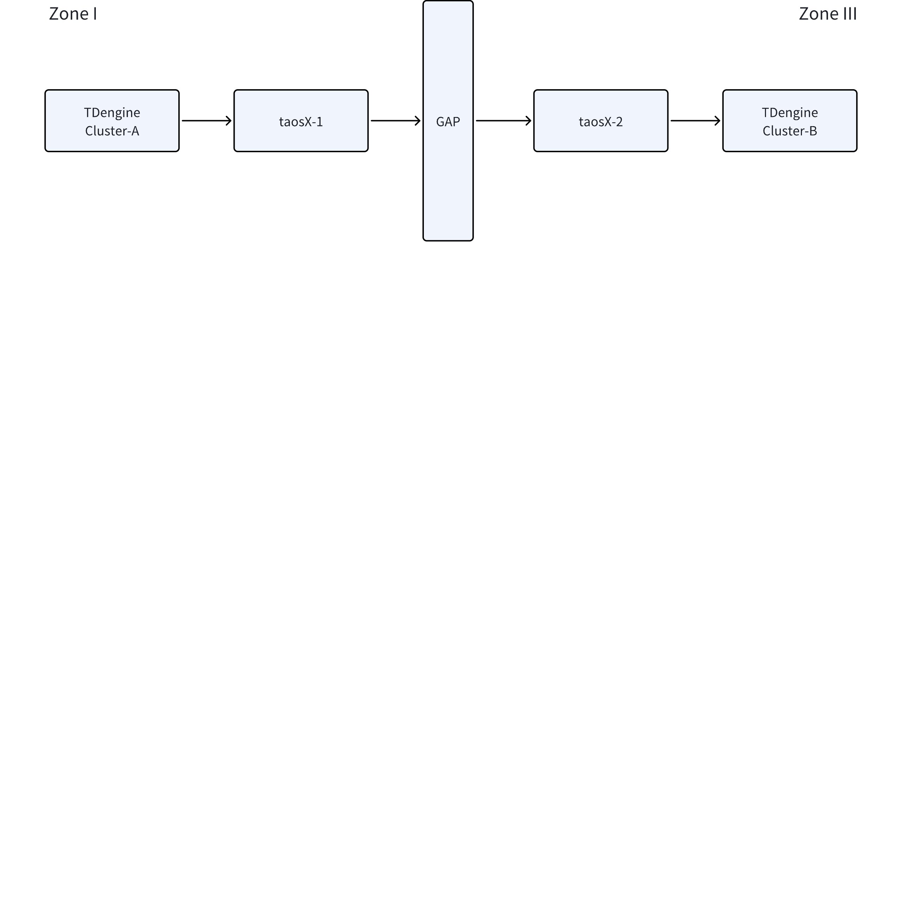
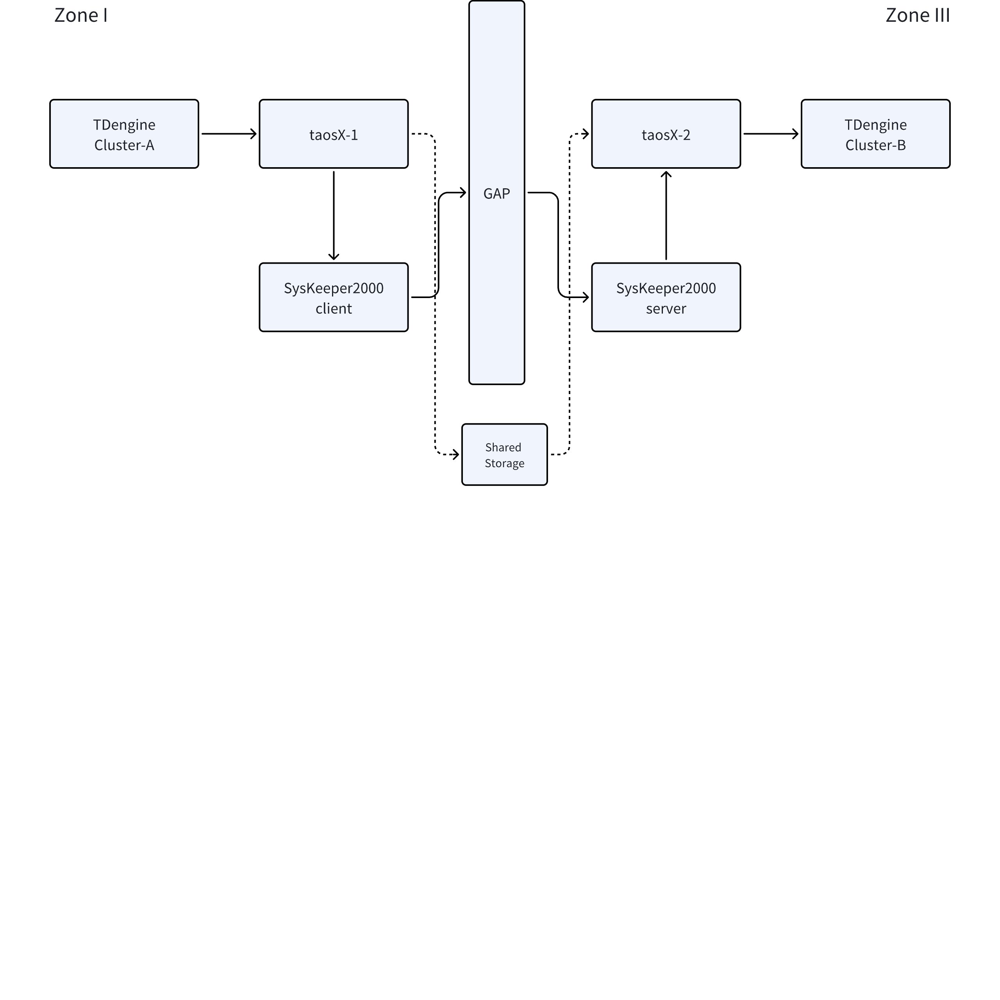

# 【已废弃】taosX 跨正向网闸传输的方案设计

## 1. 背景

中核研究院项目，PoC 测试用例 1.17 要验证 TDengine 跨单向网闸传输功能，即：验证 2 个被网闸设备隔离的 TDengine 集群之间的数据同步能力。为此，需要为 taosX 增加跨正向网闸的功能。
JIRA 任务： 
TS-5041

## 2. 变更历史

| 日期 | 版本 | 负责人 | 主要修改内容 |
| --- | --- | --- | --- |
| 2024-07-08 | v0.1 | @杨志宇 | 初稿 |
| 2024-07-12 | v0.2 | @杨志宇 | 根据线上 Review 意见修改 |
| 2024-07-15 | v0.3 | @杨志宇 | 对比文件备份恢复方案 |
| 2024-07-15 | v0.4 | @张玮绚 | 纠正文档中的错误和不足 |

## 3. 定义

- **正向网闸**：符合二次安全防护要求的网络隔离设备。简单来说，通过正向网闸连接的网络设备，只能从 1 区向 3 区发送数据，反之不能。常见的设备有：
  - [南瑞 Syskeeper-2000  电力网络安全隔离装置 正向（ 百兆型）](https://cdn065.yun-img.com/static/upload/fortuneever/download/20200503092831_90184.pdf)
  - [北京科东 StoneWall-2000FG/6.0 横向安全隔离装置](http://www.wanjudianqi.com/uploads/file/20220504/1651649992.pdf)
- 一区：生产控制大区安全区 I/II 
- 三区：管理信息大区安全区 III  

## 4. 方案设计

### 4.1 ACK + 本地 WAL 方式

#### 4.1.1 部署方式



1. TDengine Cluster A 部署在 1 区，TDengine Cluster B 部署在 3 区，中间通过正向网闸设备连接；
2. taosX-1 订阅 Cluster A 中的数据，通过网闸发送给 taosX-2；
3. taosX-2 接收 taosX-1 发送的数据，写入到 Cluster B；
taosX-1 和 taosX-2 之间采用 TCP 连接。注意，这里的 TCP 连接有单向传输控制。

#### 4.1.2 数据一致性

在跨网闸传输过程中，要保证 TDengine Cluster A 和 Cluster B 的数据一致性，方案如下：
1. 数据处理流程
   - taosX-1 从 Cluster A 拉取数据，发送数据、等待 ACK、执行 Commit；为了提升并发度，taosX-1 可以根据所消费的 topic 所在 DB vgroup 数量来设置并发线程数，每个并发线程同步执行完全相同的逻辑，但对应不同 vgroup。
   - taosX-2 从 taosX-1 接收数据，将数据写入本地 WAL、返回 ACK （线程一）
   - taosX-2 中异步线程处理 WAL 中的数据将其写入下游的处理队列 （线程二）
   - taosX-2 中异步线程在写入 TDengine Cluster B 成功后，在内存中记录 WAL 中的处理位置 （线程三）
   - taosX-2 中异步线程根据上面记录的处理位置定时清除 WAL 中已经成功写入目标集群的数据 （线程四）
   - 上述异步线程在实现时线程二、三、四可以视情况合并
2. taosX-1 异常退出后，重启 taosX-1，从已经在 TDengine Cluster A 提交的 offset 开始拉取数据；
3. taosX-2 异常退出后，重启 taosX-2，线程一开始接收数据，线程二、三和四完全异步地处理 WAL 中的数据，对线程一完全透明。
注意：
1. 为保证 taosX-1 能消费到完整的数据并具有一定的容错能力，必须为 TDengine Cluster A 设置足够大的 WAL_RETENTION_PRERIOD 参数，比如 2 天
2. taosX-2 的本地 WAL 不设保留上限，凡是未写入目标集群成功的数据都不能删除，但一旦写入成功后其删除应该在合理的时间（比如30分钟）内，这种策略是为了应对只有目标集群出问题且较长时间宕机的情况，在一切正常的情况下 taosX-2 的本地 WAL 只会保存很有限的数据量（取决于 WAL 删除的延时）。taosX-2 的本地 WAL 应该模仿 taosd 按 vgroup 来组织。
3. taosX-2 在收到第一条来自 taosX-1 的数据时，应该基于本地 WAL 中的 offset 检查该数据的有效性，本地 WAL 中的最大 offset 应该大于等于该数据的 offset （均以 taosd 中的 offset 作为统一坐标）。

#### 4.1.3 数据校验和重传

1. taosX-1 发送 payload 前，计算 payload 的 hash，Append 到数据尾部；
2. taosX-2 对 payload 重新计算 hash，确认数据的完整性，正确返回 ACK （全 1），错误返回 ACK（全 0）；
3. taosX-1 收到 ACK（全 1）发送下一条；收到 ACK（全 0）重发当前条。

#### 4.1.4 启动

创建**跨正向网闸的 TDengine 集群同步任务，**操作流程如下：
1. 在 3 区创建 taosX 任务，建立到 3 区 TDengine 的连接，监听网闸地址，接收数据后，写入 TDengine 集群。命令如下：
```bash

## 5. 三区，destinantion

taosx run --from "netgap://192.168.1.208:8899" --to "taos://Cluster_b:6041"
```

1. 在 1 区创建 taosX 任务，建立到三区 taosX 的 TCP 连接，订阅 TDengine 的数据，写入到 socket 中。
```bash

## 6. 一区，source

taosx run --from "tmq://Cluster_a:6041" --to "netgap://192.168.1.208:8899"
```

#### 6.0.1 查看统计信息

##### 6.0.1.1 查看任务列表

`taosx run --list`
1. 在连接源端的 taosX-1 上运行
```sql
+----+----------------------+------------------------------+
| id | from                 | to                           |
+----+----------------------+------------------------------+
| 0  | tmq://Cluster_0:6041 | netgap://192.168.1.199:8899/ |
+----+----------------------+------------------------------+
```

1. 在连接目标端的 taosX-2 上运行
```sql
+----+-----------------------------+----------------------------+
| id | from                        | to                         |
+----+-----------------------------+----------------------------+
| 0  | netgap://192.168.1.199:8899 | taos://cluster_b:6041/     |
+----+-----------------------------+----------------------------+
```

##### 6.0.1.2 查看指定任务的统计信息

`taosx run --status <id>`
1. 在连接源端的 taosX-1 上运行，展示如下统计信息：
```sql
+----+---------+--------+-----------+-----------+--------------+--------------------+----------------+
| id | time    | bytes  | packages  | rows      | rate(MB/sec) | rate(packages/sec) | rate(rows/sec) |
+----+---------+--------+-----------+-----------+--------------+--------------------+----------------+
| 0  | 30.123s | 100000 | 100000000 | 123456789 | 10000        | 10.88              | 1000000        |
+----+---------+--------+-----------+-----------+--------------+--------------------+----------------+

```

1. 在连接目标端的 taosX-2 上运行：
```sql
+----+---------+--------+-----------+-----------+--------------+--------------------+----------------+
| id | time    | bytes  | packages  | rows      | rate(MB/sec) | rate(packages/sec) | rate(rows/sec) |
+----+---------+--------+-----------+-----------+--------------+--------------------+----------------+
| 0  | 30.123s | 100000 | 100000000 | 123456789 | 10000        | 10.88              | 1000000        |
+----+---------+--------+-----------+-----------+--------------+--------------------+----------------+
```

#### 6.0.2 配置参数

将网闸设备作为一种数据源，dsn 如下：
```plaintext {wrap}
netgap://ip:port?<args>
```

其中，ip 为 网闸 的地址，port 是 网闸 的端口，args 是配置参数；

##### 6.0.2.1 Server 参数

`netgap://`作为`--from`参数时，表示 taosX 作为 server 接收网闸传入的数据。包含以下`args`：

| ** 参数** | **描述** | **必填** | **默认值** |
| --- | --- | --- | --- |
| ack | 在 Server 端接收到数据后，是否回复 1 Byte 的 ACK（全 0 或 全 1） | 否 | true |

##### 6.0.2.2 Client 参数

`netgap://`作为`--to`参数时，表示 taosX 作为 client 向网闸发送数据。包含以下`args`：

| ** 参数** | **描述** | **必填** | **默认值** |
| --- | --- | --- | --- |
| channels | 发送数据的通道数量，每个 channel 创建一个线程，线程创建一个 TCP 连接 | 否 | 当前 CPU 核数 * 2 |
| ~~msg_length~~ | ~~每条消息的长度，单位是 Byte~~~~。最大：996~~ | ~~否~~ | ~~996~~ |
| skip_breakpoints_check | 跳过断点检查 | 否 |  |

### 6.1 文件备份和恢复方式

#### 6.1.1 部署方式



1. TDengine Cluster A (Source) 部署在 I 区，TDengine Cluster B (Sink) 部署在 III 区，中间由网闸隔离；
2. taosX-1 部署在一区，订阅 Cluster A 中的数据，定时将数据写入到指定文件；
3. taosX-2 部署在三区，周期查看指定目录下的文件，将新文件中的数据写入 Cluster B 中
4. taosX-1 和 taosX-2 之间的文件共享，有两种部署方式：
   - 所在服务器之间有共享存储，不依赖第三方组件可以直接共享文件，如图中的虚线所示；
   - 所在服务器之间没有共享存储，但依赖于第三方组件将文件穿越网闸从一区传输到三区
5. 上面的两种部署方式对 taosX 的实现透明，**但在使用第三方穿网闸工具的部署情况下，需要第三方工具能够自动删除穿越网闸传输成功的文件**

#### 6.1.2 数据一致性

使用文件备份方式，保证数据一致性的方案如下：
1. 数据处理流程
   - taosX-1 从 Cluster A 拉取数据，将数据的 Vnode ID、Offset、payload 追加写入 <vnode_id>.temp 文件中，.temp 文件实际上是源端积攒数据为一批的缓存
   - 当 temp 文件的大小指定阈值，或从其创建时间到当前时间达到 另一指定阈值时，将 .temp 文件另存为 <vnode_id>_<offset>.data 文件，并创建新的 .temp 文件；执行 commit offset；.data 文件命名规则为所对应的 vnode 已提交的 offset
   - taosX-2 读取 <vnode_id>_<offset>.data 文件，将数据写入 TDengine，写入成功后，将文件删除。写入不成功保持重试，data 文件不删除。
2. taosX-1 异常退出后重启，从 TDengine Cluster A 记录的offset 开始重新拉取数据。
3. taosX-2 异常退出后重启，按生成的时间顺序处理 data 文件，继续写入 TDengine Cluster B。

#### 6.1.3 数据校验和重传

1. taosX-1 在将 temp 文件另存为 data 文件时，计算文件内容的 hash，Append 到 data 文件；
2. taosX-2 在读取 data 文件后，重新计算文件 payload 的 hash，和 data 文件中的 hash 值比较，判断当前文件是否被损坏。**如果损坏，taosX-2 无法通知 taosX-1 重传****，只能记录错误日志人工处理。**

#### 6.1.4 使用方式

1. 在连接源端的 taosX-1 上执行：
```plaintext
taosx run --from "tmq://cluster_a:6041/topic_name" --to /data/dir/path
```

1. 在连接目标端的 taosX-2 上执行：
```plaintext
taosx run --from /data/dir/path --to "taos://cluster_b:6041/dbname"
```

#### 6.1.5 配置参数

| ** 参数** | **描述** | **必填** | **默认值** |
| --- | --- | --- | --- |
| temp_file_period | 当 .temp 文件的创建时间到当前时间超过该参数所指定的时长时，将 .temp 转换为 .data 文件 | 否 | 1 hour |
| temp_file_size | 当 .temp 文件的大小超过该参数所指定的大小时，将 .temp 转换为 .data 文件 | 否 | 16M |

### 6.2 方案对比

对比“ACK + 本地WAL” 和 “文件备份和恢复”这两种跨网闸传输的方案：

| **对比项** | **ACK + 本地 WAL** | **文件备份** |
| --- | --- | --- |
| 通用性 | 不依赖第三方工具 | 依赖第三方的文件传输工具或共享存储 |
| 复杂度 | 高，taosX-2 需要实现 WAL 机制 | 低 |
| 数据校验和重传 | 有数据校验和重传，可靠性高 | 只有文件校验，但无法重传。 - 如果依赖第三方文件传输组件，则可靠性略低； - 如果直接依赖共享存储，则可靠性较高 |
| 断点续传 | 支持 | 支持 |

### 6.3 异常处理

|  |
|  |
| **ACK + WAL** | **文件备份和恢复** |
| 1 | 启动 taosX-1 或 taosX-2 时，TDengine 无法建立连接。 例如：taosd 没有启动 / 端口不通 / 密码错误等； |
| 2 | 运行中，TDengine Cluster A 订阅异常。 例如：TDengine Cluster A 数据文件损坏报错等 |
| 3 | 运行中，TDengine Cluster B 写入失败。 例如：写 rawdata block 报错 / SQL Syntax 错误 / 表不存在 / 有错误的数据等； |
|  |
| Cluster A 离线会导致 taosX-1 中的不再有新数据发送给 taosX-2，数据同步不受影响。 | Cluster A 离线会导致没有 data 文件生成，数据同步不受影响。 |
|  |
| Cluseter B 离线会导致 taosX-2 阻塞写操作，导致本地 WAL 文件不断增长 | Cluster B 离线不会影响 taosX-1 的文件传输，需要处理的 data 文件会堆积 |
| 6 | 运行中，taosX-1 / taosX-2 异常退出 例如：taosX-1 被认为 Kill 掉 / taosX 所在机器掉电等。 |
| 7 | 启动 taosX 时，存在错误的配置参数 例如：无效 dsn 参数 / 参数超出范围 / 错误的 TCP 端口 等； |

## 7. 性能

按照中核研究院项目 PoC 测试数据集中的要求，跨正向网闸需要满足以下性能要求：
1. 网络流量不高于 27 MB/sec；数据速率不超过 100W row/sec，测点速率不超过 900W point/sec；
2. 稳定运行 30 min 以上；
3. 延迟在 10 sec 以内；

## 8. 使用场景

### 8.1 跨单向网闸传输 

测试步骤：
1. 拷贝实时数据集到测试环境，校验该数据集哈希值。
2. 设置发送端到接收端的数据镜像。
3. 执行数据写入程序，按照实时数据的变化频率将实时数据集写入待测数据库，采用无损压缩。
4. 数据写入完成后，检查发送端中的数据条数是否与源数据条数一致，并选取最近 10 秒数据与源数据进行比对。
5. 检查接收端中的数据条数是否与源数据条数一致，并选取最近 10 秒数据与源数据进行比对。
预期结果：
1. 测试环境正常可用，待测数据库部署成功，实时数据集哈希校验成功。
2. 完成数据写入，数据库稳定运行无报错。
3. 发送端中的数据与源数据条数一致，最近 10 秒数据一致。
4. 接收端中的数据与源数据条数一致，最近 10 秒数据一致。

### 8.2 断点续传

#### 8.2.1 taosX-1 退出

1. 创建跨网闸传输任务
2. 强制 kill 掉 taosX-1，taosX-2 不再收到新的数据
3. 重启 taosX-1，从断点开始重新同步；
4. 完成数据写入后，数据库稳定运行无报错。
5. 发送端中的数据与源数据条数一致，最近 10 秒数据一致。
6. 接收端中的数据与源数据条数一致，最近 10 秒数据一致。

#### 8.2.2 taosX-2退出

1. 创建跨网闸传输任务
2. 强制 kill 掉 taosX-2，taosX-1 不再收到 taosX-2 的ACK，进入一直重试的状态；
3. 重启 taosX-2，从断点开始重新同步；
4. 完成数据写入后，数据库稳定运行无报错。
5. 发送端中的数据与源数据条数一致，最近 10 秒数据一致。
6. 接收端中的数据与源数据条数一致，最近 10 秒数据一致。
