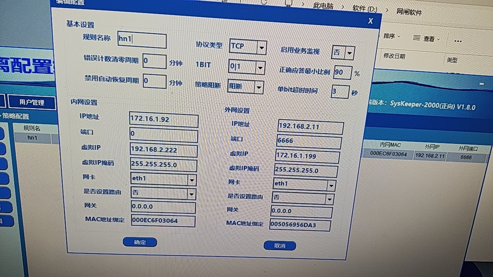
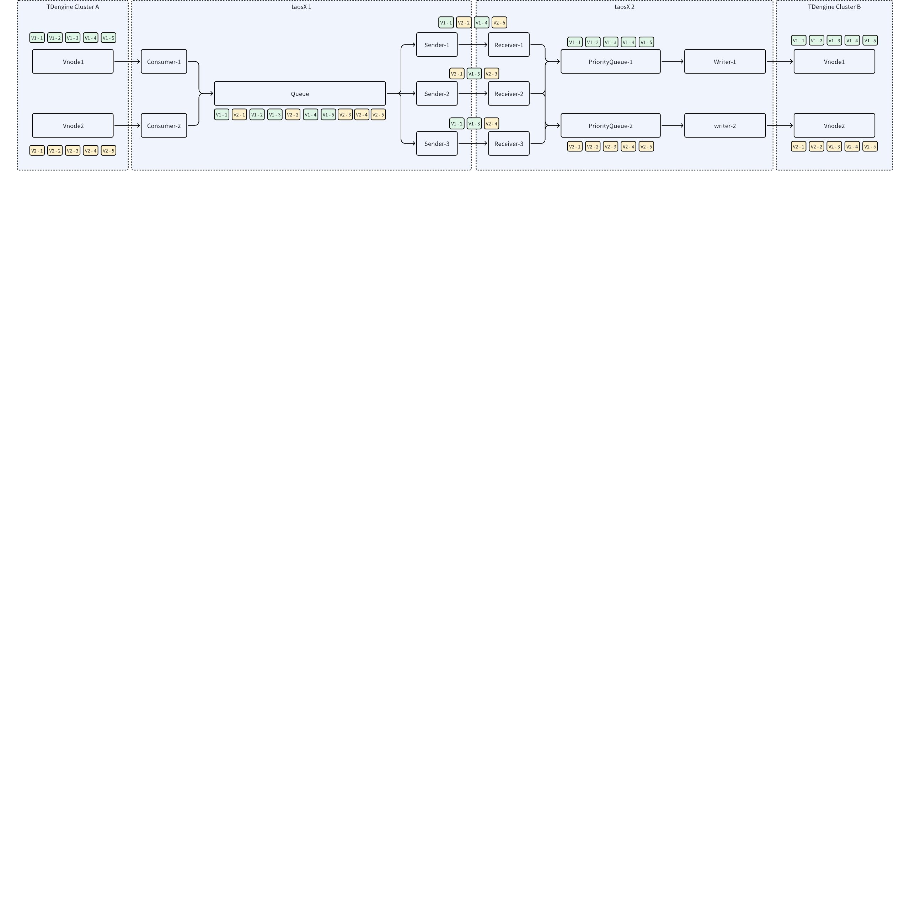

# 【已废弃】中核 PoC 测试 taosX 跨网闸数据同步

## 1. 网闸环境

172.16.1.92(192.168.1.92) -> 192.168.2.11
端口：8899


测试文件传输
```bash

## 2. 创建一个 1MB 的文件

dd if=/dev/zero of=test.data bs=1M count=1
```

## 3. 南瑞 SysKeeper2000 - 应用软件跨网络安全隔离装置的设计建议

按照二次安全防护的要求，SysKeeper-2000 网络安全隔离装置实现了 TCP 数据的单向传输控制：反向的 TCP 应答禁止携带应用数据，应用层的应答字节数最多为 1 个字节。所以经过隔离装置进行数据传输的应用软件，应遵守以下一 些编程原则来进行应用程序的改造：
1、 I/II 区与 III 区之间的应用程序禁止采用 SQL 命令访问数据库和基于 B/S 方式的双向数据传输。 
2、 I/II 区与 III 区之间的数据通信，传输的启动端由内网发起，反向的应答报文不容许携带数据，应用层的应答报文最多为 1 个字节，并且 1 个字 节为全 0 或者全 1 两种状态。 
3、 按照隔离装置的使用规定进行 API 编程。 
说明：为了减少客户二次安全防护系统改造的工作量，本公司在 SysKeeper-2000 网络安全隔离装置平台上，设计开发了满足二次安全防护要求的 “SysKeeper-2000 文件传输软件”和“ST-3000 数据传输平台”，客户可根据自身 的需求选用，寻求详细的技术支持请与本公司联系。

## 4. 南瑞 SysKeeper2000 - 网闸实验环境搭建

https://jira.taosdata.com:18090/pages/viewpage.action?pageId=37585028

## 5. 网闸 ACK 功能验证和传输性能的测试

结论：
1. 南瑞 Syskeeper2000 的 TCP 连接支持 ACK，即：3 区可以给 1 区回复报文，应答报文最多为 1 个字节，并且 1 个字 节为全 0 或者全 1 两种状态；
2. 使用 iperf3 测试，网闸的最大传输速率为为 **94.0 Mbits/sec**；
3. 使用 netgap_demo 示例代码测试，netgap_demo 开启 ACK（每个 package 都会回复 ACK），最大传输速率为 **10.83 MB/s**。

## 6. 网闸的配置



## 7. 架构



1. taosX-1 以 TDengine Cluster A 的 vnode 数创建 consumer，每个 consumer 消费一个 vnode 中的数据，将 vnode id 和 offset 添加到数据的 Header 中，写入到 Queue 中；
2. taosX-1 创建`channels`个 Sender 线程，每个线程建立一个到 taosX-2 的 TCP 连接；
3. taosX-2 监听指定端口，每个 TCP 连接创建一个 Receiver 线程，收到数据后，按照数据 Header 的 vnode ID 将数据写入不同的 PriorityQueue；
4. Sender 和 Receiver 之间有数据校验和重试；
5. taosX-2 创建 PriorityQueue 数量个 Writer，每个 Writer 写数据到 TDengin

## 8. 测试写入

### 8.1 初始化环境

1 区，清空文件路径和数据库
```bash {wrap}

## 9. 登录到 192.168.1.92

ssh u1-92@192.168.1.92

## 10. 进入目录

cd /home/u1-92/zyyang

## 11. 清空 文件 和 数据库

rm -f /home/u1-92/zyyang/netgap_bak/* && rm -f /home/u1-92/zyyang/bak/* && taos -s "drop topic if exists netgap; drop database if exists netgap;" 
```

3 区，清空文件路径和数据库
```bash

## 12. 登录到 192.168.2.11

ssh ubuntu@192.168.2.11

## 13. 进入目录

cd /home/ubuntu/zyyang

## 14. 清空文件路径和数据库

rm -f /home/ubuntu/zyyang/netgap/* && taos -s "drop database if exists netgap"
```

### 14.1 建表

```bash {wrap}

## 15. 登录到 1.65

ssh ubuntu@192.168.1.65

## 16. 进入目录

cd /data/go/src/rtdb_writer/writer

## 17. 建表, 实时快采点

/data/go/src/rtdb_writer/writer/rtdb_writer static_write --plugin=/data/go/src/rtdb_writer/plugin_taos/libcwrite_plugin.so --static_analog=/data/go/src/rtdb_writer_data/test_fast_static_analog.csv --static_digital=/data/go/src/rtdb_writer_data/test_fast_static_digital.csv --unit_number=1 --type=0 --magic=10 --param=static_write

## 18. 建表，实时普通点

/data/go/src/rtdb_writer/writer/rtdb_writer static_write --plugin=/data/go/src/rtdb_writer/plugin_taos/libcwrite_plugin.so --static_analog=/data/go/src/rtdb_writer_data/test_normal_static_analog.csv --static_digital=/data/go/src/rtdb_writer_data/test_normal_static_digital.csv --unit_number=1 --type=1 --magic=10 --param=static_write
```

### 18.1 开启 taosx 同步脚本

1 区启动 taosx 同步脚本
```bash

## 19. 启动同步

sudo /home/u1-92/zyyang/sync_client.sh 99999 1

## 20. 启动同步，后台模式

sudo nohup /home/u1-92/zyyang/sync_client.sh 99999 1 1>/home/u1-92/zyyang/sync_client.log 2>&1 &

## 21. 查看日志

tail -f /home/u1-92/zyyang/sync_client.log
```

sync_client.sh
```bash {wrap}
#!/bin/bash

if [[ $# != 2 ]]; then
  echo "Usage: sync_client.sh [count] [sleep]";
  exit 1;
fi

COUNT=$1
SLEEP=$2

echo "sync client create topic"
taos -s "DROP TOPIC IF EXISTS netgap" && sleep 2 && taos -s "CREATE TOPIC  netgap WITH META AS DATABASE netgap"

echo "sync client start"
for i in $(seq 1 $COUNT); do
  sudo /home/u1-92/zyyang/taosx/target/debug/taosx run -f "tmq+ws://192.168.1.92:6041/netgap" -t "local:/home/u1-92/zyyang/myback" -vv && mv -f /home/u1-92/zyyang/myback/* /home/u1-92/zyyang/netgap_bak && sleep $SLEEP
  #echo $i && sleep $SLEEP;
done

echo "sync clinet exit"
```

3 区启动 taosx 同步脚本
```bash {wrap}

## 22. 启动同步

sudo /home/ubuntu/zyyang/sync_server.sh 99999 1

## 23. 启动同步，后台模式

sudo nohup /home/ubuntu/zyyang/sync_server.sh 99999 1 1> /home/ubuntu/zyyang/sync_server.log 2>&1 &

tail -f /home/ubuntu/zyyang/sync_server.log
```

sync_server.sh
```bash {wrap}
#!/bin/bash

if [[ $# != 2 ]]; then
  echo "Usage: sync_server.sh [count] [sleep]";
  exit 1;
fi

COUNT=$1
SLEEP=$2

echo "sync server start"
for i in $(seq 1 $COUNT); do
  sudo /data/zyyang/taosx/target/debug/taosx run -f "local:/home/ubuntu/zyyang/netgap" -t "taos+ws://192.168.2.11:6041" -y
  sleep $SLEEP
  #echo $i && sleep $SLEEP
done

echo "sync server exit"
```

### 23.1 开启写入

```bash {wrap}

## 24. 登录到 1.65

ssh ubuntu@192.168.1.65

## 25. 进入目录

cd /data/go/src/rtdb_writer/writer

## 26. 写入

/data/go/src/rtdb_writer/writer/rtdb_writer rt_fast_write --plugin=/data/go/src/rtdb_writer/plugin_taos/libcwrite_plugin.so --rt_fast_analog=/data/go/src/rtdb_writer_data/test_fast_analog.csv --rt_fast_digital=/data/go/src/rtdb_writer_data/test_fast_digital.csv --rt_normal_analog=/data/go/src/rtdb_writer_data/test_normal_analog.csv --rt_normal_digital=/data/go/src/rtdb_writer_data/test_normal_digital.csv --unit_number=1 --mode=0 --random_av=false --magic=10 --parallel_writing=true --param=rt_fast_write
```
