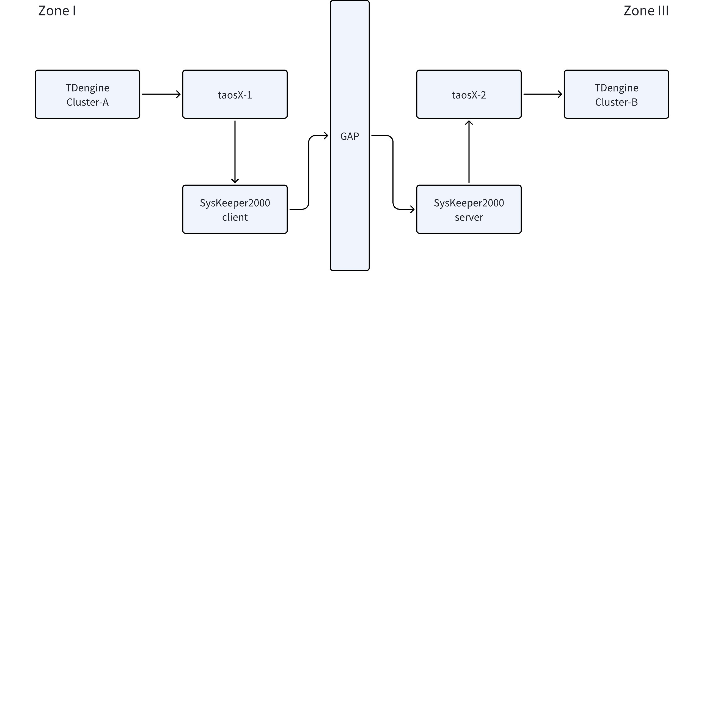

# 调研：跨正向网闸传输方案

## 1. 背景

中核研究院项目的测试用例 1.17 要验证 TDengine 跨单向网闸传输功能。测试用例本质上是：**验证 2 个被网闸设备隔离的 TDengine 集群之间的数据同步能力**。
测试用例如下：

| 测试编号 | 1.17 |
| --- | --- |
| 测试项目 | 跨单向网闸传输 |
| 测试目的 | 验证数据库跨单向网闸传输功能 |
| 测试环境要求 | 测试环境为单向网闸测试环境 |
| 预置条件 | 1）具备测试环境。 2）待测数据库部署成功。 3）其中 1 个数据库实例设置为发送端、另 1 个数据库实例设置为接收端，设置发送端到接收端的单向网闸。 4）具备预先生成的实时数据集，计算该数据集的 sha256 哈希值。 |
| 测试步骤 | 1）拷贝实时数据集到测试环境，校验该数据集哈希值。 2）设置发送端到接收端的数据镜像。 3）执行数据写入程序，按照实时数据的变化频率将实时数据集写入待测数据库，采用无损压缩。 4）数据写入完成后，检查发送端中的数据条数是否与源数据条数一致，并选取最近 10 秒数据与源数据进行比对。 5）检查接收端中的数据条数是否与源数据条数一致，并选取最近 10 秒数据与源数据进行比对。 |
| 预期结果 | 1）测试环境正常可用，待测数据库部署成功，实时数据集哈希校验成功。 2）完成数据写入，数据库稳定运行无报错。 3）发送端中的数据与源数据条数一致，最近 10 秒数据一致。 4）接收端中的数据与源数据条数一致，最近 10 秒数据一致。 |

**正向网闸**：符合二次安全防护要求的网络隔离设备。简单来说，通过正向网闸连接的网络设备，只能从 1 区向 3 区发送数据，反之不能。常见的设备有：
- [南瑞Syskeeper-2000  电力网络安全隔离装置 正向( 百兆型)](https://product.suning.com/0000000000/12167004894.html)
- [北京科东StoneWall-2000FG/6.0 横向安全隔离装置](http://www.wanjudianqi.com/uploads/file/20220504/1651649992.pdf)

## 2. 方案

### 2.1 tSync

#### 2.1.1 tSync 简介

之前，在华能清能院项目中，用 Java 开发一个 tSync 工具。tSync 实现了 TDengine 集群之间的数据同步功能，支持网闸隔离设备。
项目地址：https://github.com/taosdata/tsync/blob/main/tq/readme.md
架构：https://jira.taosdata.com:18090/display/DEV/User+Guide+of+Tsync
tSync 基于 TDengine 2.6 的 TQ 功能实现 TDengine 集群间的数据同步。从架构上来说，tSync 支持 2 种方式：双写（double write）和单写（single write）。
tSync 的工作流程：
1. 应用程序将需要同步的实时数据写入 TDengine Cluster-A 内置的消息队列 TQ；
2. tsyncConsumer 消费 TQ 中的数据，写入到 TDengine Cluster-A 的表中；
3. tSyncClient 消费 TQ 中的数据，通过正向网闸，发送给 tSyncServer；
4. tSyncServer 接收来自 tSyncClient 的所有数据，写入到 TDengine Cluster-B 中。
TDengine 2.6 的 TQ 功能请参考：
- [TQ 的功能设计](https://jira.taosdata.com:18090/pages/viewpage.action?pageId=30278098)
- [TQ 的 C 接口](https://jira.taosdata.com:18090/pages/viewpage.action?pageId=31097092)

#### 2.1.2 tSync 的改造

在 tSync 基础上，需要做 3.0 的适配，存在以下问题：
1. tSync 是基于 TDengine 2.6 版本开发的，订阅的接口和 TDengine 3.0 完全不一样，tSync 改动很大；
2. tSync 中，不能订阅整个数据库，仅可以订阅 topic，且 topic 是一张表，包含 ts、key、content、paritionid 这 4 个字段，tSync 需要解析 content 中的内容。

### 2.2 taosX 

#### 2.2.1 方案简介

在 taosX 内部开发跨网闸同步 TDengine 数据的功能。架构如下：

1. TDengine Cluster A 部署在 I 区，TDengine Cluster B 部署在 III 区，中间由网闸隔离；
2. taosX-1 订阅 Cluster A 中的数据，通过网闸发送给 taosX-2；
3. taosX-2 接收 taosX-1 发送的数据，写入到 Cluster B。
需要的改造：taosX 需要支持 TCP 单向传输控制，反向的 TCP 应答禁止携带应用数据。单向的 TCP 连接，请参考附录 1。

### 2.3 taosX + 第三方跨网闸传输工具

#### 2.3.1 方案简介

这里的第三方工具是指，提供一套接口和规范，可以让应用程序做到跨网闸传输。通过简单的调研，没有找到通用的跨网闸传输工具，只有南瑞提供了一个“SysKeeper-2000 文件传输软件”。这个工具是通过文件摆渡的方式，跨网闸传输。
文件传输工具，请参考附录2。
基于“SysKeeper-2000 文件传输软件”，架构设计如下：

1. TDengine Cluster A 部署在 I 区，TDengine Cluster B 部署在 III 区，中间由网闸隔离；
2. taosX-1 订阅 Cluster A 中的数据，定时将数据写入到指定文件；
3. taosX-2 周期查看指定目录下的文件，将新文件中的数据解析，写入 Cluster B 中。

## 3. 方案对比

下面，对比一下 2.2 和 2.3 中描述的 2 种方案。

| **对比项** | **taosX 内部** | **taosX + 第三方工具** |
| --- | --- | --- |
| 传输形式 | TCP | 文件 |
| 通用性 | 高，满足“二次安全防护要求”即可 | 低，依赖第三方工具 |
| 监控 | 如果有反向的 TCP 应答，可以监控；否则，不可以监控 | 如果文件的有无状态在一区和三区是同步的，可以进行监控 |

## 4. 附录 1：南瑞 SysKeeper2000 - 应用软件跨网络安全隔离装置的设计建议

按照二次安全防护的要求，SysKeeper-2000 网络安全隔离装置实现了 TCP 数据的单向传输控制：反向的 TCP 应答禁止携带应用数据，应用层的应答字节数最多为 1 个字节。所以经过隔离装置进行数据传输的应用软件，应遵守以下一 些编程原则来进行应用程序的改造：
1、 I/II 区与 III 区之间的应用程序禁止采用 SQL 命令访问数据库和基于 B/S 方式的双向数据传输。 
2、 I/II 区与 III 区之间的数据通信，传输的启动端由内网发起，反向的应答报文不容许携带数据，应用层的应答报文最多为 1 个字节，并且 1 个字 节为全 0 或者全 1 两种状态。 
3、 按照隔离装置的使用规定进行 API 编程。 
说明：为了减少客户二次安全防护系统改造的工作量，本公司在 SysKeeper-2000 网络安全隔离装置平台上，设计开发了满足二次安全防护要求的 “SysKeeper-2000 文件传输软件”和“ST-3000 数据传输平台”，客户可根据自身 的需求选用，寻求详细的技术支持请与本公司联系。
文档：https://cdn065.yun-img.com/static/upload/fortuneever/download/20200503092831_90184.pdf

## 5. 附录2: 南瑞 SysKeeper2000 - 网闸实验环境搭建

https://jira.taosdata.com:18090/pages/viewpage.action?pageId=37585028
