# TD-29948 - [集群] 优化并发大查询时节点之间互相拉 数据的效率 Test Spec

## 1. 测试目标

1. 验证优化对各功能项无影响
2. 验证优化后，在高并发查询时资源占用及connection占用数量降低
3. 验证后话后，在高并发查询场景下的稳定性

## 2. 变更历史

| Date | Version | Owner | Memo |
| --- | --- | --- | --- |
| 2024.10.9 | 1.0 | Charles | Init doc |
|  |  |  |  |

## 3. 测试结论

待测试完成后更新

## 4. 开发质量报告

结论：一般

| 统计指标 | 数量 |
| --- | --- |
| 提测被拒次数 （测试阻塞，无法进行） | 0 |
| 基础测试用例不通过 | 0 |
| Bug 总数 | 0 |
| 严重 Bug 总数 | 0 |

## 5. 已知问题和限制

无

## 6. 测试资源及环境

性能测试：
192.168.1.35

## 7. 测试重点

1. 高并发查询时资源及连接数占用下降
2. 长时间高压力的系统稳定性

## 8. 测试数据

<view type="1">

  > ⚠ 嵌入文件，需在飞书中查看 (token: P7xgbiBkUosymDxisFhcZiPnnLd)

</view>

<view type="1">

  > ⚠ 嵌入文件，需在飞书中查看 (token: WmXubquAioOcrOxZit2crj61nCf)

</view>

<view type="1">

  > ⚠ 嵌入文件，需在飞书中查看 (token: G532bQocvoFLTjx9GSncWw3nnab)

</view>

## 9. 测试用例

| No. | 用例名称 | 用例描述 | 期望结果 | 测试结果 | 备注 |
| --- | --- | --- | --- | --- | --- |
| 1 | 查询全量测试 | 1. 使用enh/opt-transport分支编译部署TDengine企业版 1. 运行查询全量测试 | 查询全量测试所有用例通过 | 测试通过 |  |
| 2 | 流计算全量测试 | 1. 使用enh/opt-transport分支编译部署TDengine企业版 1. 运行流计算全量测试 | 流计算全量测试所有用例通过 | 测试通过 |  |
| 3 | 资源占用测试 | 1. 使用3.0分之和enh/opt-transport分支编译部署TDengine企业版 1. 创建3节点环境 1. 使用taosBenchmark创建副本数为3的数据库，超级表，子表并写入50亿数据 1. 使用taosBenchmark执行并行查询并监控taosd的内存、cpu、网络资源，通过netstat获取taosd connection的连接数 | 1. enh/opt-transport分之对比3.0分之的cpu、内存、网络资源占用下降（10%以内） 1. enh/opt-transport分之对比3.0分之的taosd connection占用大幅下降（80%） | 测试通过（经对比，内存资源占用小幅下降；taosd connection占用下降7-% - 80%） | 2024-10-11 开发分支 15:27 - 18:07 最大connection 448 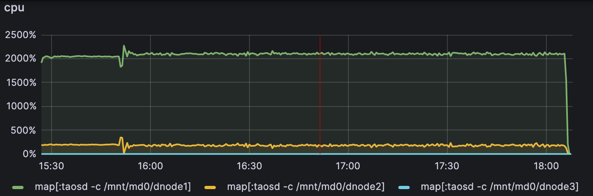 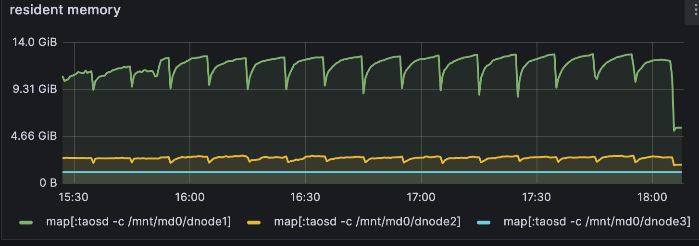 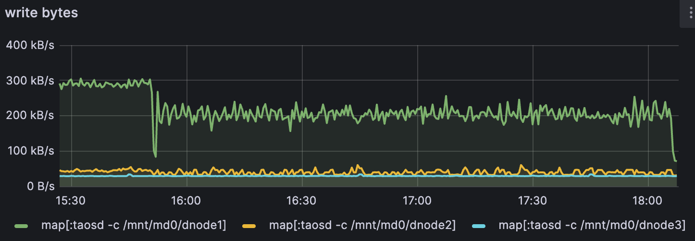 2024-10-14 开发分支 15:40 - 18:23 最大connection 500 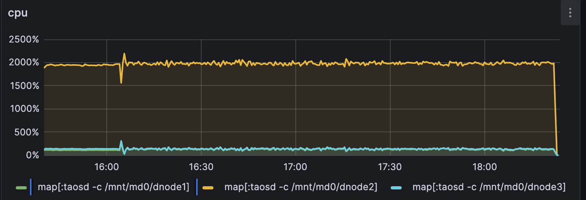 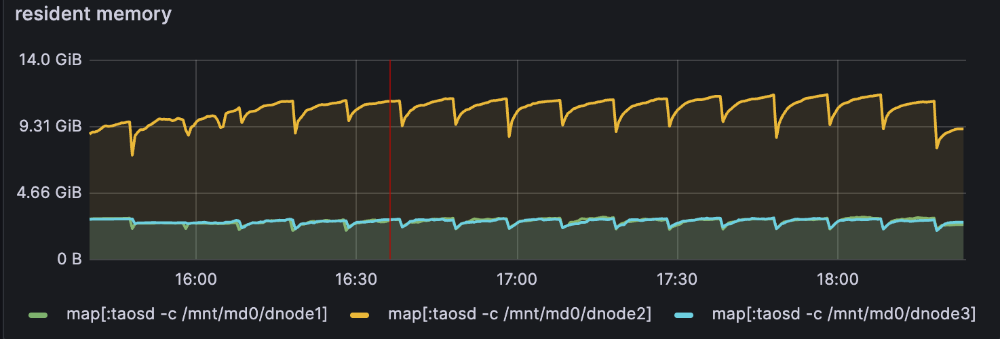 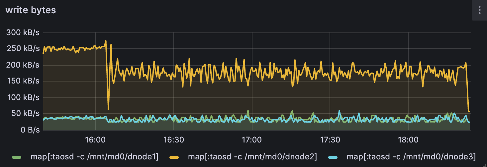 2024-10-15 开发分支 18:10 - 20:56 最大connection 1360(多次balance vgroup) 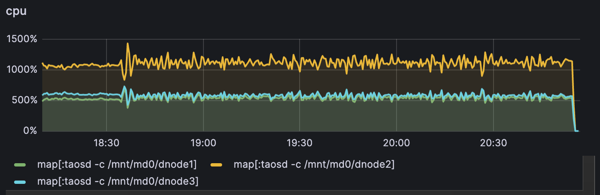 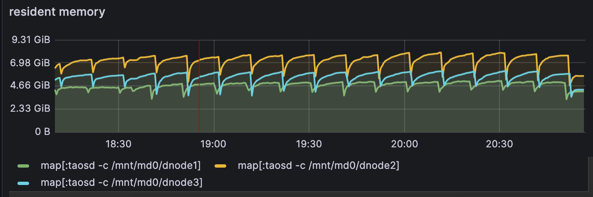 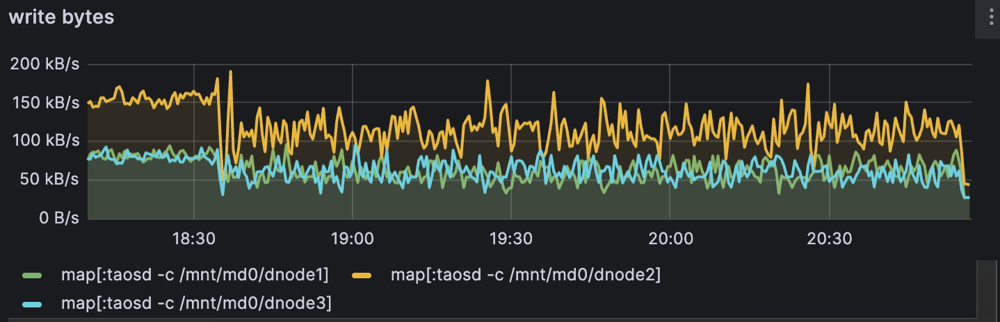 2024-10-12 3.0分支 14:52 - 17:38 最大connection 2180 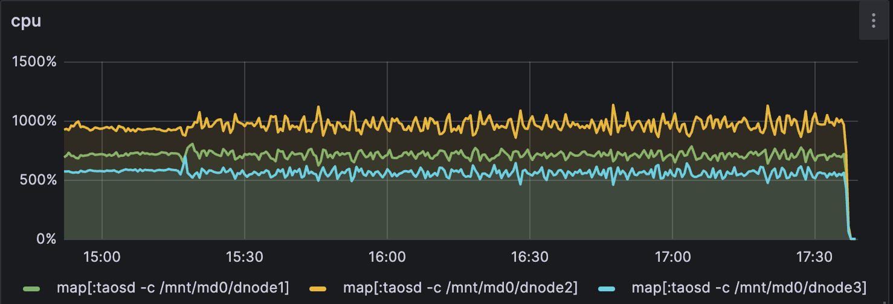 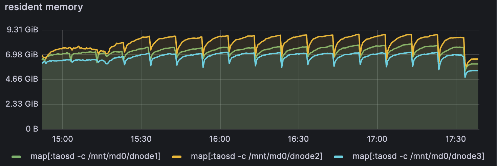 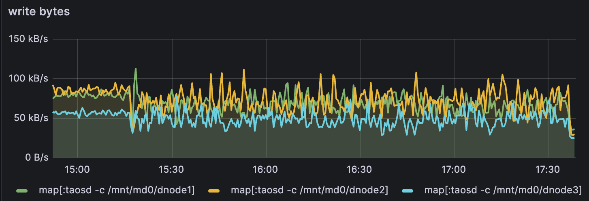 |
| 4 | 写入、查询性能测试 | 1. 使用3.0分之和enh/opt-transport分支编译部署TDengine企业版 1. 分别执行性能基线测试 | enh/opt-transport分之对比3.0分之基线性能不下降 | 测试通过 与V3.3.3.0 基线性能基本相当 | [enh/opt-transport vs V3.3.3.0 性能对比测试报告 （JNI） ](https://taosdata.feishu.cn/docx/H1jMdgfYVom9iFxfLe7cJobUnHP) |
| 5 | 稳定性测试 | 1. 使用enh/opt-transport分支编译部署TDengine企业版 1. 运行长稳查询测试 | 长稳查询测试稳定运行时间 > 3天 | 测试通过 |  |
|  |  |  |  |  |  |

## 10. Jira

| Id | Title | Commen |
| --- | --- | --- |
|  |  |  |

## 11. 测试计划 

2024-10-09 - 2024-10-？

## 12. 测试备忘 

2024-10-10 稳定性测试问题较多，环境交给研发自测并解决问题

## 13. 参考文档

[重构RPC链接管理机制](https://taosdata.feishu.cn/wiki/CeVUwP49Piky4ukWTkUcJRLMn6d)
