# TD-30837-流计算支持 interp & twa 函数 Test Spec

## 1. 测试目标

1. 确保在流计算中可以使用 interp 函数，在需求范围内，满足全部功能且数据计算完全正确。
2. 确保流计算支持 interp 的性能符合目前的需要（待确认）。
3. 时间充分时，再确保未在需求范围内的但是已经完成的功能满足预期。

## 2. 变更历史

| Date | Version | Owner | Memo |
| --- | --- | --- | --- |
| 2024.10.14 | 0.1 | 陈浩然 |  |
|  |  |  |  |

## 3. 测试范围

1. 验证流计算中可以使用 interp 函数，
- force_window_close模式下，数据结果正确。不能计算历史和过期数据。
- force_window_close模式下，sql 校验正确，不支持的都会正常返回失败，不会出现系统宕机。
- force_window_close模式下，支持三副本和多节点
- force_window_close模式下，支持数据的增删改，但是不会重新计算，不会出现系统宕机。
- force_window_close模式下，支持元数据的增删改，但是不会重新计算，不会出现系统宕机。
- force_window_close模式下，支持重复时间戳的复合主键
- force_window_close模式下，异常数据，空值，

1. 验证流计算中使用 interp 函数的性能，
2. 时间充分时，验证流计算中可以使用 interp 函数，at_once模式下，数据结果正确。计算历史，过期和都没问题。

## 4. 测试结论

## 5. 性能统计规则

## 6. 开发质量报告

结论：

| 统计指标 | 数量 |
| --- | --- |
| 提测被拒次数 |  |
| 基础测试用例不通过 |  |
| Bug 总数 |  |
| 严重 Bug 总数 |  |

## 7. 已知问题和限制

## 8. 测试环境

1. 测试平台：Linux x64
2. 测试资源：192.168.1.86（尽量使用 adress san版本运行测试用例）

## 9. 测试数据 (Optional)

时间戳列取当前时间加30s，其他列随机生成数据。

## 10. 测试用例

interp和 twa 第一期均先支持force_window_close，不支持`ignore expired`, `ignore update`，`max_delay` `fill_history`。

### 10.1 简易覆盖图

| trigger | Interp:force_window_close | twa:force_window_close |
| --- | --- | --- |
|  | (every)interval | interval |
| Partition by tbname | ✅ | ✅ |
| delete |  |  |
| update | ✅ | ✅ |
| disorder | ✅ | ✅ |
| ignore_expired | ✅ | ✅ |
| ignore_update | ✅ | ✅ |
| existed_stable | ✅ | ✅ |
| custom_tag | ✅ | ✅ |
| fill_history | ✅ | ✅ |
| snode | ✅ | ✅ |
| checkpoint | ✅ | ✅ |
| subtable | ✅ | ✅ |
| pause | ✅ | ✅ |
| resume | ✅ | ✅ |
| fill/NULL | ✅ | ✅ |
| fill/VALUE | ✅ | ✅ |
| fill/PREV | ✅ | ✅ |

### 10.2 interp 的流和批的处理逻辑

这里只处理一个超级表和一个子表的结果，数据时间范围 ts >=  1729919301156+0s and ts <=  cast(1729919301156 as timestamp)+70s：
使用 interval 的窗口计算来计算批的窗口 range 范围：
select _wstart, _wend,last(ts) from force_window_close_stb where ts >=  1729919301156+0s and ts <=  cast(1729919301156 as timestamp)+70s   partition by tbname  interval(10s) ; 
range 的范围（第一条记录的 _wstart，最后一条记录的_wend）
interp的流sql：
select irowts, table_name, isfilled, intp_c1 from force_window_close_ct1_output where irowts >= 1729920417702+0s   and irowts <= "2024-10-26 13:28:10"  order by irowts
interp的批处理sql：
select _irowts as irowts ,tbname as table_name, _isfilled as isfilled , interp(c1) as  intp_c1  from force_window_close_ct1   partition by tbname  range("2024-10-26 13:27:00","2024-10-26 13:28:10")  every(10s) fill (PREV) order by irowts
流和批的结果应该完全一致，使用这种方式来对比确认结果正确。

### 10.3 测试用例

1. 过期数据的含义是小于当前服务器时间的数据
2. 等待 stream触发完成最后一条时间记录以后，才开始对比数据，否则对比数据结果不正确。
3. force-window-close 中合法值： FILL_HISTORY 0  IGNORE UPDATE 1 IGNORE EXPIRED 1 ，stream 建立时都要带上。
4. force_window_close 简写成 fwc
| 测试功能 | 测试场景 | 用例No. | 测试用例名称 | 测试步骤 | 预期测试结果 | 测试结果及备注 |
| --- | --- | --- | --- | --- | --- | --- |
| Interp | fwc
超级表 | 1 | every + partition by tbname+查询超级表 | 1. 创建库和表，同时创建 stream， create stream itp_force_5s_pre  trigger force_window_close  into itp_5s_pre as  select _irowts,tbname,_isfilled,interp(current) from meters   partition by tbname   every(5s)   fill(prev)  ;
1. 以当前服务器机器时间为准，写入未来 30s 内的数据，查看流计算结果中 5s 的断面数据是否有断层。
2. 计算批在该时间的结果，对比批和流的结果是否一致 | 1. 批和流的结果一致 | pass |
|  |  | 3 | every + partition by tbname+查询超级表+过期数据 | 1. 创建库和表，同时创建 stream， create stream itp_force_5s_pre  trigger force_window_close  into itp_5s_pre as  select _irowts,tbname,_isfilled,interp(current) from meters   partition by tbname   every(5s)   fill(prev)  ;
1. 以当前机器时间为准，写入未来 30s 内的数据，查看流计算结果中 5s 的断面数据是否有断层。
2. 计算批在该时间的结果，对比批和流的结果。
3. 写入过期数据后，流计算结果不再更新。 | 1. 批和流的结果一致
4. 流计算结果不再更新 | pass |
|  |  | 4 | every + partition by tbname+查询超级表+更新数据 | 1. 创建库和表，同时创建 stream， create stream itp_force_5s_pre  trigger force_window_close  into itp_5s_pre as  select _irowts,tbname,_isfilled,interp(current) from meters   partition by tbname   every(5s)   fill(prev)  ;
1. 以当前机器时间为准，写入未来 30s 内的数据，查看流计算结果中 5s 的断面数据是否有断层。
2. 计算批在该时间的结果，对比批和流的结果。
3. 更新之前数据范围内的其中一条数据后，流计算结果不再更新。 | 1.批和流的结果一致
4. 流计算结果不再更新 | pass |
|  |  | 5 | every + partition by tbname+查询超级表+删除数据 | 1. 创建库和表，同时创建 stream， create stream itp_force_5s_pre  trigger force_window_close  into itp_5s_pre as  select _irowts,tbname,_isfilled,interp(current) from meters   partition by tbname   every(5s)   fill(prev)  ;
1. 以当前机器时间为准，写入未来 30s 内的数据，查看流计算结果中 5s 的断面数据是否有断层。
2. 计算批在该时间的结果，对比批和流的结果。
4  删除之前的过期数据，流计算结果不更新。 | 1. 批和流的结果一致
1. 流计算结果不再更新 | pass |
|  |  | 6 | every + partition by tbname+查询超级表过滤tag | 1. 创建库和表，同时创建 stream，子查询使用where tag=values
1. 以当前机器时间为准，写入未来 30s 内的数据，查看流计算结果中 5s 的断面数据是否有断层。
2. 计算批在该时间的结果，对比批和流的结果。 | 1. 批和流的结果一致 | pass |
|  |  | 7 | every + partition by tbname+查询超级表过滤tbname | 1. 创建库和表，同时创建 stream，子查询使用where tbname=values
1. 以当前机器时间为准，写入未来 30s 内的数据，查看流计算结果中 5s 的断面数据是否有断层。
2. 计算批在该时间的结果，对比批和流的结果。 | 1. 批和流的结果一致 | pass |
|  |  | 8 | every + partition by tbname,colum+查询超级表 | 1. 创建库和表，同时创建 stream，partition
1. 以当前机器时间为准，写入未来 30s 内的数据，查看流计算结果中 5s 的断面数据是否有断层。
2. 计算批在该时间的结果，对比批和流的结果。 | 1. 批和流的结果一致 | pass |
|  |  | 9 | every + partition by tbname,tag+查询超级表 | 1. 创建库和表，同时创建 stream，partition
1. 以当前机器时间为准，写入未来 30s 内的数据，查看流计算结果中 5s 的断面数据是否有断层。
2. 计算批在该时间的结果，对比批和流的结果。 | 1. 批和流的结果一致 | pass |
|  | fwc+子表 | 10 | every + partition by tbname+查询子表 | 1. 创建库和表，同时创建 stream，子查询查询子表
1. 以当前机器时间为准，写入未来 30s 内的数据，查看流计算结果中 5s 的断面数据是否有断层。
2. 计算批在该时间的结果，对比批和流的结果。 | 1. 批和流的结果一致 | pass |
|  | fwc+ 普通表 | 11 | every + partition by column+查询普通表 | 1. 创建库和表，同时创建 stream，子查询查询普通表
1. 以当前机器时间为准，写入未来 30s 内的数据，查看流计算结果中 5s 的断面数据是否有断层。
2. 计算批在该时间的结果，对比批和流的结果。 | 1. 批和流的结果一致 | pass |
|  | fwc
复合主键
超级表 | 12 | every + partition by tbname + column+查询超级表+pr | 1. 创建库和表，表存在复合主键列，同时创建 stream，子查询查询普通表
1. 以当前机器时间为准，写入未来 30s 内的数据，查看流计算结果中 5s 的断面数据是否有断层。
2. 计算批在该时间的结果，对比批和流的结果。 | 1. 批和流的结果一致 | pass |
|  | 写入已存在
超级表 | 13 | every + partition by tbname +查询超级表+pr | 1. 创建库和表，表存在复合主键列，同时创建 stream，子查询查询普通表
1. 以当前机器时间为准，写入未来 30s 内的数据，查看流计算结果中 5s 的断面数据是否有断层。
2. 计算批在该时间的结果，对比批和流的结果。 | 1. 批和流的结果一致 | pass |
|  | 自定义tag | 14 | every + partition by tbname +查询超级表+pr | 1. 创建库和表，表存在复合主键列，同时创建 stream，子查询查询普通表
1. 以当前机器时间为准，写入未来 30s 内的数据，查看流计算结果中 5s 的断面数据是否有断层。
2. 计算批在该时间的结果，对比批和流的结果。 | 1. 批和流的结果一致 | pass |
|  | 自定义子表名 | 15 | every + partition by tbname +查询超级表+pr | 1. 创建库和表，表存在复合主键列，同时创建 stream，子查询查询普通表
1. 以当前机器时间为准，写入未来 30s 内的数据，查看流计算结果中 5s 的断面数据是否有断层。
2. 计算批在该时间的结果，对比批和流的结果。 | 1. 批和流的结果一致 | pass |
| twa | fwc
超级表 | 1 | interval + partition by tbname+查询超级表 | 1. 创建库和表，同时创建 stream， create stream twa_force_5s_pre  trigger force_window_close  into itp_5s_pre as  select _wstart,count(c1), twa(c2),elapsed(c3) from meters   partition by tbname interval(5s)   fill(prev)  ;
1. 以当前服务器机器时间为准，写入未来 30s 内的数据，查看流计算结果中 5s 的断面数据是否有断层。
2. 计算批在该时间的结果，对比批和流的结果是否一致 | 1. 批和流的结果一致 | pass |
|  |  | 3 | interval + partition by tbname+查询超级表+过期数据 | 1. 创建库和表，同时创建 stream， create stream twa_force_5s_pre  trigger force_window_close  into twa_5s_pre as  select  _wstart,count(c1), twa(c2),elapsed(c3) from meters   partition by tbname  interval(5s)   fill(prev)  ;
1. 以当前机器时间为准，写入未来 30s 内的数据，查看流计算结果中 5s 的断面数据是否有断层。
2. 计算批在该时间的结果，对比批和流的结果。
3. 写入过期数据后，流计算结果不再更新。 | 1. 批和流的结果一致
4. 流计算结果不再更新 | pass |
|  |  | 4 | interval + partition by tbname+查询超级表+更新数据 | 1. 创建库和表，同时创建 stream， create stream itp_force_5s_pre  trigger force_window_close  into itp_5s_pre as  select _wstart,tbname,_isfilled,interp(current) from meters   partition by tbname   every(5s)   fill(prev)  ;
1. 以当前机器时间为准，写入未来 30s 内的数据，查看流计算结果中 5s 的断面数据是否有断层。
2. 计算批在该时间的结果，对比批和流的结果。
3. 更新之前数据范围内的其中一条数据后，流计算结果不再更新。 | 1.批和流的结果一致
4. 流计算结果不再更新 | pass |
|  |  | 5 | interval + partition by tbname+查询超级表+删除数据 | 1. 创建库和表，同时创建 stream， create stream itp_force_5s_pre  trigger force_window_close  into itp_5s_pre as  select  _wstart,count(c1), twa(c2),elapsed(c3) from meters   partition by tbname interval(5s)   fill(prev)  ;
1. 以当前机器时间为准，写入未来 30s 内的数据，查看流计算结果中 5s 的断面数据是否有断层。
2. 计算批在该时间的结果，对比批和流的结果。
4  删除之前的过期数据，流计算结果不更新。 | 1. 批和流的结果一致
1. 流计算结果不再更新 | pass |
|  |  | 6 | interval + partition by tbname+查询超级表过滤tag | 1. 创建库和表，同时创建 stream，子查询使用where tag=values
1. 以当前机器时间为准，写入未来 30s 内的数据，查看流计算结果中 5s 的断面数据是否有断层。
2. 计算批在该时间的结果，对比批和流的结果。 | 1. 批和流的结果一致 | pass |
|  |  | 7 | interval + partition by tbname+查询超级表过滤tbname | 1. 创建库和表，同时创建 stream，子查询使用where tbname=values
1. 以当前机器时间为准，写入未来 30s 内的数据，查看流计算结果中 5s 的断面数据是否有断层。
2. 计算批在该时间的结果，对比批和流的结果。 | 1. 批和流的结果一致 | pass |
|  |  | 8 | interval + partition by tbname,colum+查询超级表 | 1. 创建库和表，同时创建 stream，partition
1. 以当前机器时间为准，写入未来 30s 内的数据，查看流计算结果中 5s 的断面数据是否有断层。
2. 计算批在该时间的结果，对比批和流的结果。 | 1. 批和流的结果一致 | pass |
|  |  | 9 | interval + partition by tbname,tag+查询超级表 | 1. 创建库和表，同时创建 stream，partition
1. 以当前机器时间为准，写入未来 30s 内的数据，查看流计算结果中 5s 的断面数据是否有断层。
2. 计算批在该时间的结果，对比批和流的结果。 | 1. 批和流的结果一致 | pass |
|  | fwc+子表 | 10 | interval + partition by tbname+查询子表 | 1. 创建库和表，同时创建 stream，子查询查询子表
1. 以当前机器时间为准，写入未来 30s 内的数据，查看流计算结果中 5s 的断面数据是否有断层。
2. 计算批在该时间的结果，对比批和流的结果。 | 1. 批和流的结果一致 | pass |
|  | fwc+ 普通表 | 11 | interval + partition by column+查询普通表 | 1. 创建库和表，同时创建 stream，子查询查询普通表
1. 以当前机器时间为准，写入未来 30s 内的数据，查看流计算结果中 5s 的断面数据是否有断层。
2. 计算批在该时间的结果，对比批和流的结果。 | 1. 批和流的结果一致 | pass |
|  | fwc
复合主键
超级表 | 12 | interval + partition by tbname + column+查询超级表+复合主键 | 1. 创建库和表，表存在复合主键列，同时创建 stream，子查询查询普通表
1. 以当前机器时间为准，写入未来 30s 内的数据，查看流计算结果中 5s 的断面数据是否有断层。
2. 计算批在该时间的结果，对比批和流的结果。 | 1. 批和流的结果一致 | pass |
|  | 写入已存在
超级表 | 13 | interval+ partition by tbname +查询超级表+pr | 1. 创建库和表，表存在复合主键列，同时创建 stream，子查询查询普通表
1. 以当前机器时间为准，写入未来 30s 内的数据，查看流计算结果中 5s 的断面数据是否有断层。
2. 计算批在该时间的结果，对比批和流的结果。 | 1. 批和流的结果一致 | pass |
|  | 自定义tag | 14 | interval+ partition by tbname +查询超级表+pr | 1. 创建库和表，表存在复合主键列，同时创建 stream，子查询查询普通表
1. 以当前机器时间为准，写入未来 30s 内的数据，查看流计算结果中 5s 的断面数据是否有断层。
2. 计算批在该时间的结果，对比批和流的结果。 | 1. 批和流的结果一致 | pass |
|  | 自定义子表名 | 15 | interval+ partition by tbname +查询超级表+pr | 1. 创建库和表，表存在复合主键列，同时创建 stream，子查询查询普通表
1. 以当前机器时间为准，写入未来 30s 内的数据，查看流计算结果中 5s 的断面数据是否有断层。
2. 计算批在该时间的结果，对比批和流的结果。 | 1. 批和流的结果一致 | pass |
| 运维场景 | force_window_close  + subtable | 13 |  | 1. 创建库和表，同时创建 stream，建流语句使用 subtable
1. 以当前机器时间为准，写入未来 30s 内的数据，查看流计算结果中 5s 的断面数据是否有断层。
2. 查看subtable有数据写入。
3. 删除 stream，然后再新建同样的 stream，同样可以继续写入该子表 | subtable 成功创建并写入数据
可以再次写入数据 | pass |
|  | force_window_close  + pause/resume | 14 |  | 1. 创建库和表，同时创建 stream，子查询查询超级表
1. 以当前机器时间为准，写入未来 30s 内的数据，查看流计算结果中 5s 的断面数据是否有断层。
2. 写入数据过程中多次 pause/resume stream ，记录停止和恢复的时间，
3. 计算分时间批的结果，对比批和流的结果是否一致 | 1. 停止时间的断面数据不再生成。
4. 启动以后断面数据继续产生。 | pass |
|  | force_window_close  + snode | 15 |  | 1. 建 snode，创建库和表，同时创建 stream，子查询查询超级表
1. 以当前机器时间为准，写入未来 30s 内的数据，查看流计算结果中 5s 的断面数据是否有断层。
3.计算批在该时间的结果，对比批和流的结果。 | 1. 批和流的结果一致 | pass |
|  | 重启 taosd | 16 |  | 1. 创建库和表，同时创建 stream，子查询查询超级表
1. 以当前机器时间为准，写入未来 30s 内的数据，查看流计算结果中 5s 的断面数据是否有断层。
2. 写入数据过程停止 taosd，在启动 taosd，记录时间。
3. 计算批在该时间的结果，对比批和流的结果。 | 1. 停止时间的断面数据不再生成。
4. 启动以后断面数据继续产生。 | pass |
| 修改元数据 | 删列 | 19 | every + partition by tbname+列+查询超级表 | alter stable force_window_close_stb DROP COLUMN c1; | 1. 列如果被使用，则无法被删除 | pass |
|  | 删/改tag名 | 20 | every + partition by tbname+tag+查询超级表 | 1.alter stable force_window_close_stb rename tag  t1 ttt1 ;
1. alter stable force_window_close_stb DROp tag t1; | 1. tag如果被使用，则无法被删除
2. tag如果被使用，则无法被rename | 流计算暂不支持修改tag |
|  | 改tag值 | 21 | every + partition by tbname+tag+查询超级表 | 1. alter table force_window_close_ct1 set tag t1=101; | 跟研发沟通，暂时不测试，这个地方有问题。 | 流计算暂不支持修改tag |


## 11. 待讨论(Optional)

## 12. Jira

## 13. 测试计划 (Optional)

## 14. 风险评估

## 15. 性能测试

### 15.1 interp性能测试

1. 数据写入
```sql
{
    "filetype": "insert",
    "cfgdir": "/etc/taos",
    "host": "127.0.0.1",
    "port": 6030,
    "user": "root",
    "password": "taosdata",
    "connection_pool_size": 20,
    "thread_count": 20,
    "create_table_thread_count": 8,
    "result_file": "./insert_res.txt",
    "confirm_parameter_prompt": "no",
    "num_of_records_per_req": 30000 ,
    "prepared_rand": 10000,
    "chinese": "no",
    "databases": [
        {
            "dbinfo": {
                "name": "test",
                "drop": "yes",
    "wal_retention_period": 0,
    "buffer": 900,
    "stt_trigger": 1,
                "vgroups ": 10
            },
            "super_tables": [
                {
                    "name": "meters",
                    "child_table_exists": "no",
                    "childtable_count": 100000,
                    "childtable_prefix": "d",
                    "escape_character": "yes",
                    "auto_create_table": "no",
                    "batch_create_tbl_num": 10,
                    "data_source": "rand",
                    "insert_mode": "stmt",
                    "non_stop_mode": "no",
                    "insert_rows": 1200,
                    "childtable_exists":"no",
                    "childtable_limit": 0,
                    "childtable_offset": 0,
                    "start_timestamp": "now+60s",
                    "interlace_rows": 1,
                    "insert_interval": 1000,
                    "partial_col_num": 0,
                    "disorder_ratio": 0,
                    "disorder_range": 0,
                    "timestamp_step": 1000,
                    "sample_format": "csv",
                    "sample_file": "./sample.csv",
                    "use_sample_ts": "no",
                    "tags_file": "",
                    "columns": [
                        { "type": "FLOAT", "name": "current", "count": 1, "max": 12, "min": 8 },
                        { "type": "INT", "name": "voltage", "max": 225, "min": 215 },
                        { "type": "FLOAT", "name": "phase", "max": 1, "min": 0 }
                    ],
                    "tags": [
                        { "name": "groupid", "type": "INT" },
                        { "name": "location", "type": "VARCHAR", "len": 24, "values": ["BJ", "SH", "GZ"] }
                    ]
                }
            ]
        }
    ]
}

```


1. 测试场景说明：
内存使用量，优化前和优化后，没有什么变化，所以没做记录。流的相关配置参数，均采用默认值，未做配置。

1. 建流语句：
create stream stm2 trigger force_window_close into stm2  as select _irowts as ts, interp(voltage) as voltage from meters partition by tbname every(10s) fill(prev);

1. 测试数据：

|  |
|  |
| vgroup | cpu核数 | 总子表数量 | 每秒写入数据量 | vnode-stream线程 | 结果截图 | vnode-stream线程 | 结果截图 |
| 5 | 40 | 10万 | 1 | 99% 会持续99%，不会下降 | 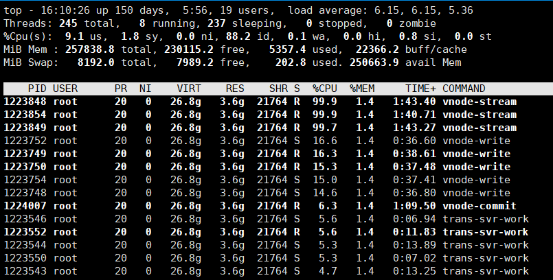 | 45% 持续时间极短，小于1秒，很快会降到0 | 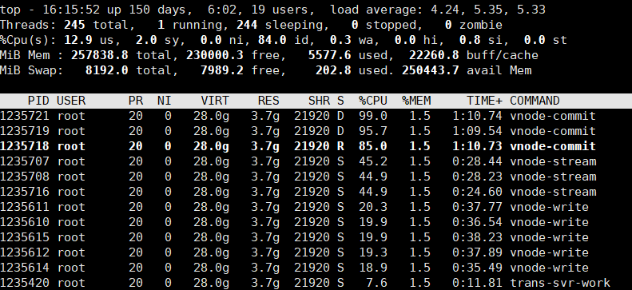 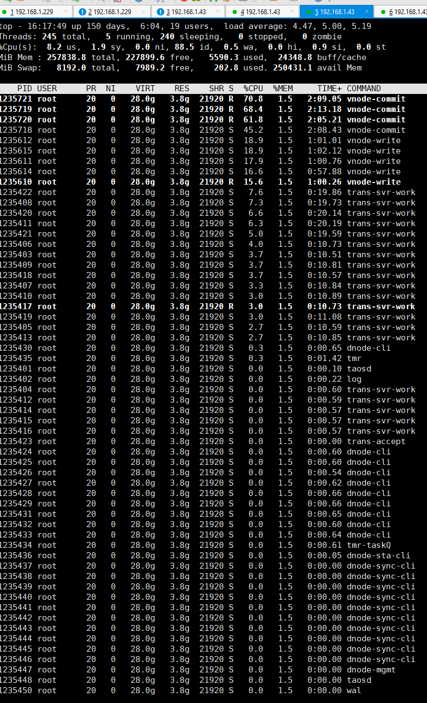 |
| 10 | 40 | 10万 | 1 | 99% 会持续99%，不会下降 | 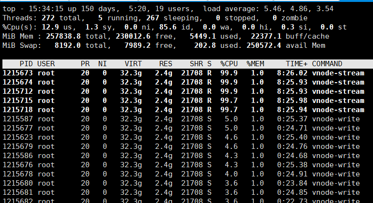 | 25% 持续时间极短，小于1秒，很快会降到0 | 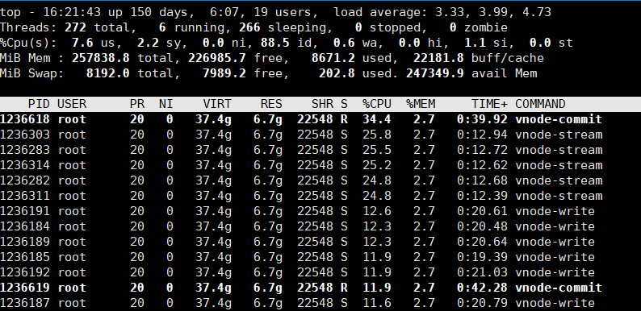 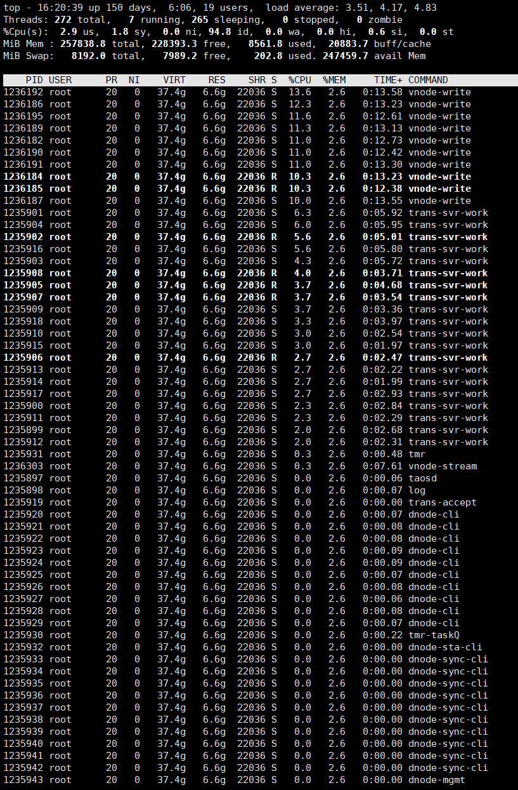 |
| 20 | 40 | 10万 | 1 | 99% 会持续99%，不会下降 | 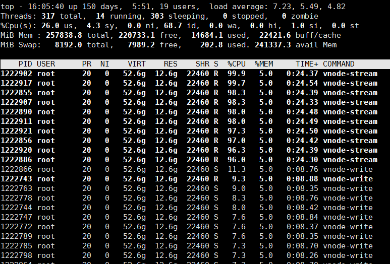 | 15% 持续时间极短，小于1秒，很快会降到0 | 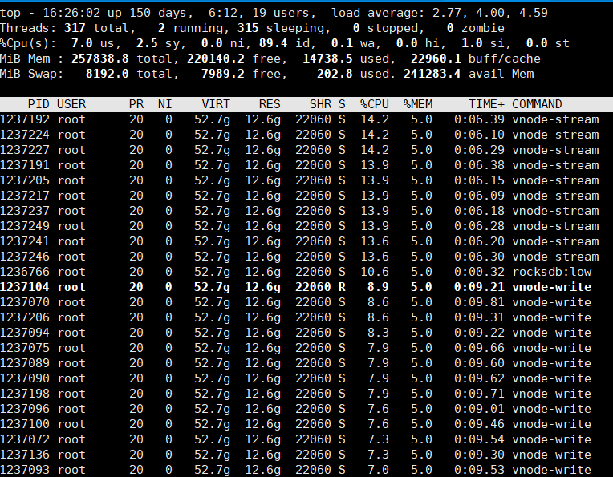 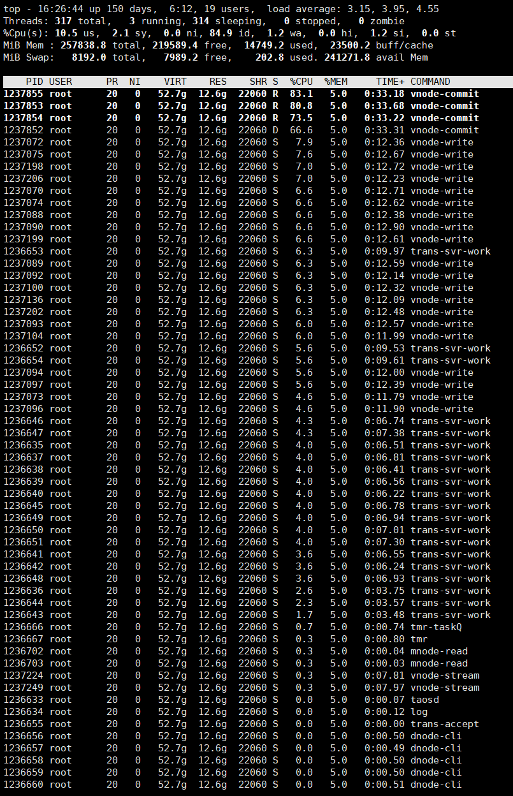 |


### 15.2 twa性能测试

1. 数据写入
```sql
{
  "filetype": "insert",
  "cfgdir": "/etc/taos",
  "host": "192.168.1.43",
  "port": 6030,
  "user": "root",
  "password": "taosdata",
  "connection_pool_size": 100,
  "thread_count": 100,
  "create_table_thread_count": 8,
  "result_file": "./insert_res.txt",
  "confirm_parameter_prompt": "no",
  "num_of_records_per_req": 100000 ,
  "prepared_rand": 100000,
  "chinese": "no",
  "databases": [
      {
          "dbinfo": {
              "name": "test",
              "drop": "yes",
  "wal_retention_period": 0,
  "buffer": 900,
  "stt_trigger": 1,
              "vgroups ": 20
          },
          "super_tables": [
              {
                  "name": "meters",
                  "child_table_exists": "no",
                  "childtable_count": 100000,
                  "childtable_prefix": "d",
                  "escape_character": "yes",
                  "auto_create_table": "no",
                  "batch_create_tbl_num": 10,
                  "data_source": "rand",
                  "insert_mode": "stmt",
                  "non_stop_mode": "no",
                  "insert_rows": 1200000000,
                  "childtable_exists":"no",
                  "childtable_limit": 0,
                  "childtable_offset": 0,
                  "start_timestamp": "now+300s",
                  "interlace_rows": 100,
                  "insert_interval": 0,
                  "partial_col_num": 0,
                  "disorder_ratio": 0,
                  "disorder_range": 0,
                  "timestamp_step": 10,
                  "sample_format": "csv",
                  "sample_file": "./sample.csv",
                  "use_sample_ts": "no",
                  "tags_file": "",
                  "columns": [
                      { "type": "FLOAT", "name": "current", "count": 1, "max": 12, "min": 8 },
                      { "type": "INT", "name": "voltage", "max": 225, "min": 215 },
                      { "type": "FLOAT", "name": "phase", "max": 1, "min": 0 }
                  ],
                  "tags": [
                      { "name": "groupid", "type": "INT" },
                      { "name": "location", "type": "VARCHAR", "len": 24, "values": ["BJ", "SH", "GZ"] }
                  ]
              }
          ]
      }
  ]
}

```


1. 测试场景说明：
流的相关配置参数，均采用默认值，未做配置。

1. 测试数据：

| vgroup | cpu核数 | 总子表数量 | 每秒写入数据量 | interval窗口时长 | Fill | vnode-stream线程 | 结果截图 | 建流SQL |
| --- | --- | --- | --- | --- | --- | --- | --- | --- |
| 20 | 40 | 10万 | 100 | 10秒 | 无Fill | 71% 持续时间极短，小于1秒，很快会降到0 | 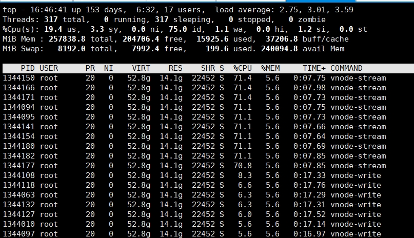 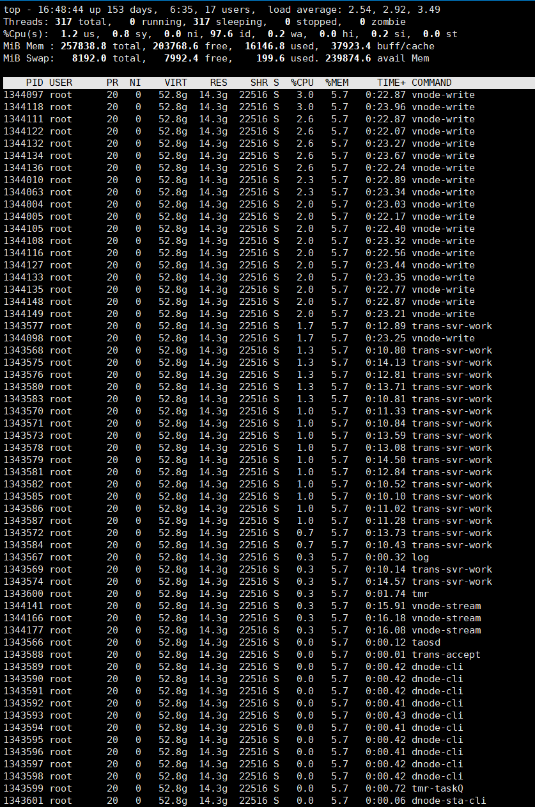 | create stream stm4 trigger force_window_close watermark 9s into stm4 as select _wstart as ts, twa(voltage) as voltage,now from meters partition by tbname interval(10s); |
| 20 | 40 | 10万 | 10 | 10秒 | 无Fill | 33% 持续时间极短，小于1秒，很快会降到0 | 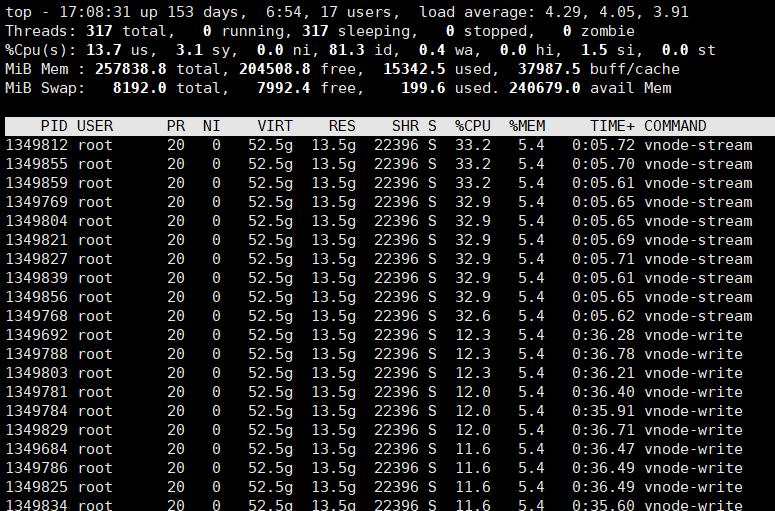 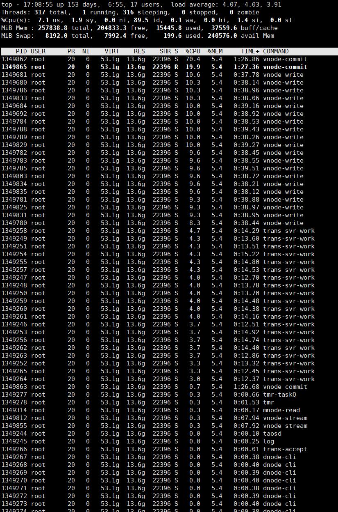 | create stream stm4 trigger force_window_close watermark 9s into stm4 as select _wstart as ts, twa(voltage) as voltage,now from meters partition by tbname interval(10s); |
| 20 | 40 | 10万 | 10 | 60秒 | 无Fill | 53% 持续时间较短，3秒左右，很快会降到0 | 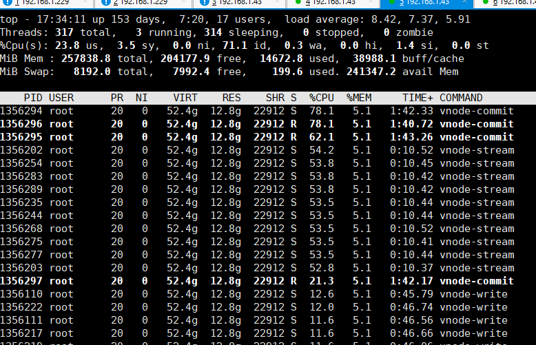 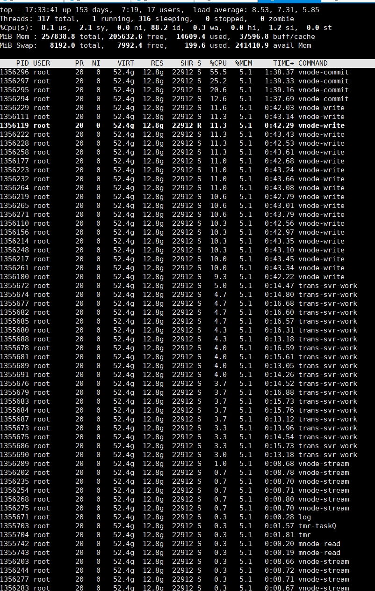 | create stream stm4 trigger force_window_close watermark 9s into stm4 as select _wstart as ts, twa(voltage) as voltage,now from meters partition by tbname interval(60s); |
| 20 | 40 | 10万 | 10 | 10秒 | Fill(prev) | 34% 持续时间极短，小于1秒，很快会降到0 | 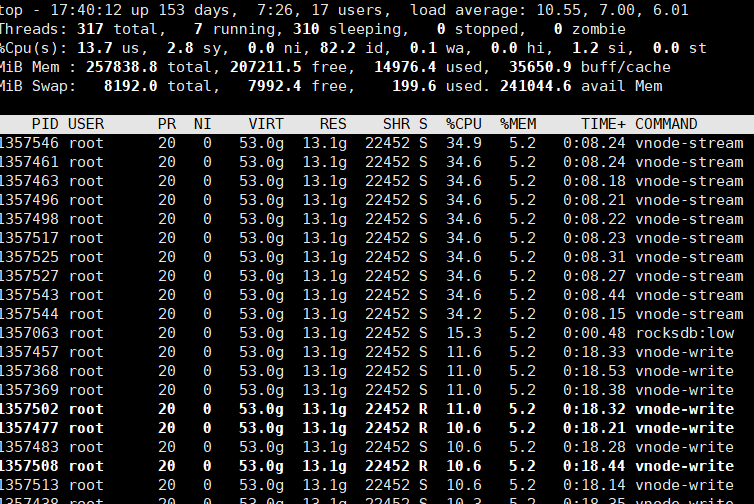 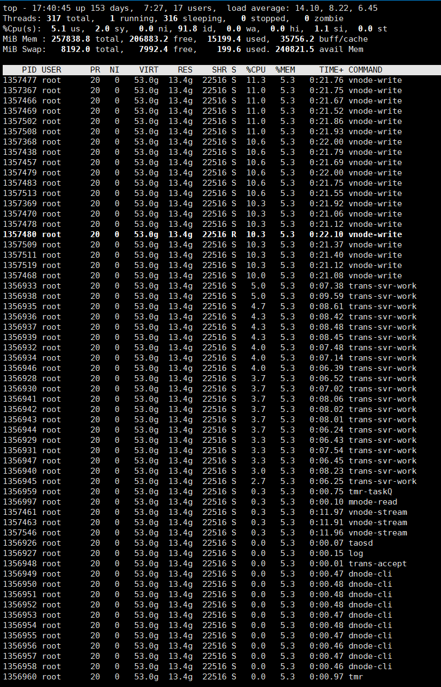 | create stream stm4 trigger force_window_close watermark 9s into stm4 as select _wstart as ts, twa(voltage) as voltage,now from meters partition by tbname interval(10s) fill(prev); |
| 20 | 40 | 10万 | 10 | 60秒 | Fill(prev) | 57% 持续时间较短，3秒左右，很快会降到0 |  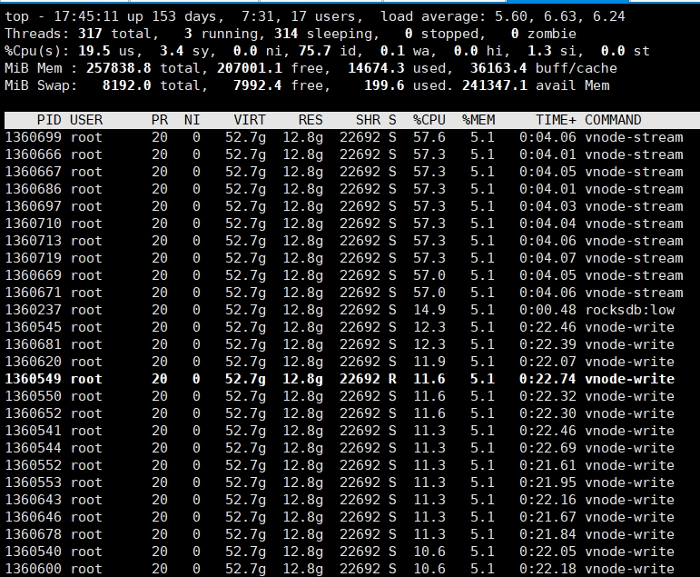 | create stream stm4 trigger force_window_close watermark 9s into stm4 as select _wstart as ts, twa(voltage) as voltage,now from meters partition by tbname interval(60s) fill(prev); |

## 16. 参考文档 (Optional)

[流计算处理时间推送结果、支持新函数](https://taosdata.feishu.cn/wiki/SwQpwIRmYiwA5CkuwD8cCG3tn2b)
