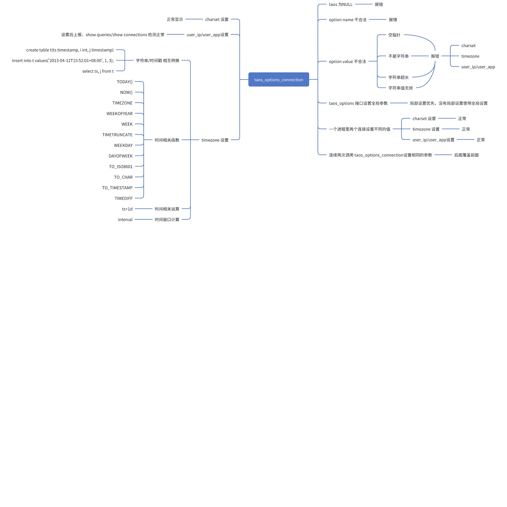

# TD-32642 - taosc 支持连接级别设置 Test Spec

## 1. 测试目标

1. 确保设置的连接级别的设置生效，包括 timezone/charset/user_ip/user_app。

## 2. 变更历史

| Date | Version | Owner | Memo |
| --- | --- | --- | --- |
| 2024.11.08 | 0.1 | 王明明 | 初稿 |
| 2024.12.06 | 0.2 | 王明明 | 更新测试结论 |

## 3. 测试范围

1. charset 测试
   - 客户端通过charset 设置字符集后写入的字符串类型可以正确的写入显示。
2. timezone 测试
   - 客户端通过timezone 设置时区后写入的时间类型可以正确的写入显示。
3. user_ip测试
   - 客户端通过user_ip 设置后通过 show queries/show connections 可以查看。
4. user_app 测试
   - 客户端通过user_app 设置后通过 show queries/show connections 可以查看。
上述四个配置，同一进程里不同连接设置的参数相互独立。

## 4. 测试结论

## 5. 性能统计规则

UT 测试：自定义实现测 localtime_rz 和系统 localtime 性能比较。通过1000万次循环调用，统计用时。
系统测试：通过 taosBenchmark 写入 1 亿条数据，设置timezone 均为 Asia/Shanghai 对比新旧版本的写入性能（其他三个配置没有性能问题）。

## 6. 开发质量报告

结论：

| 统计指标 | 数量 |
| --- | --- |
| 提测被拒次数 |  |
| 基础测试用例不通过 |  |
| Bug 总数 |  |
| 严重 Bug 总数 |  |

## 7. 已知问题和限制

## 8. 测试环境

1. 测试平台：Linux x64 / mac M1

## 9. 测试数据 (Optional)

## 10. 测试用例

### 10.1 用例思维导图



### 10.2 API 基础功能测试用例

| No. | 用例名称 | 用例描述 | 期望结果 | 测试结果 |
| --- | --- | --- | --- | --- |
| 1 | API 参数合法性测试 | 1. taos 为NULL （报错） 1. option 不合法 1. < TSDB_OPTION_CONNECTION_CLEAR 或者 > TSDB_OPTION_CONNECTION_USER_APP （报错） 1. option value 不合法 1. 不为字符串 （异常） 1. NULL （重置） 1. 空字符串 （重置） 1. 字符串超长 （截断） 1. 四个配置都需要测试 | 如描述 | 符合预期（connectionCase.setConnectionOption_Test） |
| 2 | API 配置 / 全局 API 配置优先级测试 | 1. taos_options/taos_options_connection 1. 先调用 taos_options，再调用 taos_options_connection 设置同一个配置 1. 先调用 taos_options_connection，再调用 taos_options 设置同一个配置 1. 上述两个测试只针对共用配置charset 和 timezone | taos_options_connection配置生效 | 符合预期（connectionCase.setConnectionOption_Test） |
| 3 | API 配置修改测试 | 1. 先调用 taos_options_connection，再调用 taos_options_connection 设置同一个配置 1. 四个配置都需要测试 | 第二次设置的生效 | 符合预期（connectionCase.setConnectionOption_Test） |
| 4 | API 配置重置测试 | 1. 单个配置重置测试（四个配置都需测试） 1. 全部配置重置测试 | 正确的重置 | 符合预期（connectionCase.setConnectionOption_Test） |
| 5 | 连接配置独立性测试 | 1. 一个进程里两个连接同一个配置设置不同的值，一个连接不设置值 1. 四个配置都需要测试 | 独立生效 | 符合预期（connectionCase.setConnectionOption_Test） |

### 10.3 各个配置测试用例

#### 10.3.1 charset 测试

| No. | 用例名称 | 用例描述 | 期望结果 | 测试结果 |
| --- | --- | --- | --- | --- |
| 1 | 基础功能（写入） | 1. 数据类型为 nchar，连接设置 charset 为gbk，写入字符也为 gbk字符(列和tag) | 写入正常 | 符合预期（charsetCase.charset_Test） |
| 2 | 基础功能（写入） | 1. 数据类型为 nchar，连接设置 charset 为gbk，写入字符为 utf-8字符（列和tag) | 报错 | 符合预期（charsetCase.charset_Test） |
| 3 | 基础功能（查询） | 1. 连接设置 charset 为utf-8，用例1 写入的数据做查询 （列和tag) | 显示正常 | 符合预期（charsetCase.charset_Test） |
| 4 | 基础功能（查询） | 1. 连接设置 charset 为gbk，用例1 写入的数据做查询（列和tag) | 显示正常 | 符合预期（charsetCase.charset_Test） |
| 5 | 空测试 | 1. 数据类型为 nchar，不设置连接配置 charset，写入字符 | 写入查询正常 | 符合预期（charsetCase.charset_Test） |
| 6 | 连接配置独立性测试 | 1. 数据类型为 nchar，一个进程里两个连接 charset 配置分别设置为 gbk/utf-8，一个连接不设置（默认为utf-8），写入数据/查询数据 | 写入查询都正常 | 符合预期（charsetCase.charset_Test） |
| 8 | 清空测试 | 1. 结合 10.2 里用例 4 一起测试，清空后 charset 值跟随系统 | 和系统设置一致 | 符合预期（connectionCase.setConnectionOption_Test） |

#### 10.3.2 timezone 测试

| No. | 用例名称 | 用例描述 | 期望结果 | 测试结果 |
| --- | --- | --- | --- | --- |
| 1 | 基础功能（写入） | 1. 数据类型为 timestamp，连接设置 timezone 为 UTC，写入 '2023-09-16 17:00:00' （子表和普通表） | 写入正常 | 符合预期（timezoneCase.insert_with_timezone_Test） |
| 2 | 基础功能（写入） | 1. 数据类型为 timestamp，连接设置 timezone 为 UTC ，写入 '2023-09-16 17:00:00+08:00' （子表和普通表） | 写入正常 | 符合预期（timezoneCase.insert_with_timezone_Test） |
| 3 | 基础功能（写入） | 1. 数据类型为 timestamp，连接设置 timezone 为 UTC+2，写入 1732178775133 （子表和普通表和tag） | 写入正常 | 符合预期（timezoneCase.insert_with_timezone_Test） |
| 4 | 基础功能（写入） | 1. 数据类型为 timestamp，连接设置 timezone 为 UTC+2，写入tag 分别为 '2023-09-16 17:00:00' 和 '2023-09-16 17:00:00+05:00' | 写入正常 | 符合预期（timezoneCase.insert_with_timezone_Test） |
| 5 | 基础功能（查询） | 1. 连接设置 timezone 为 UTC，用例1 写入的时间戳为条件做查询 | 查询到数据条数正确 | 符合预期（timezoneCase.insert_with_timezone_Test） |
| 6 | 基础功能（查询） | 1. 连接设置 timezone 为 UTC，用例2 写入的时间戳为条件做查询 | 查询到数据条数正确 | 符合预期（timezoneCase.insert_with_timezone_Test） |
| 7 | 基础功能（查询） | 1. 连接设置 timezone 为 UTC+9，用例1 写入的时间戳为条件做查询 | 查询到数据条数正确 | 符合预期（timezoneCase.insert_with_timezone_Test） |
| 8 | 基础功能（查询） | 1. 连接设置 timezone 为 UTC+9，用例2 写入的时间戳为条件做查询 | 查询到数据条数正确 | 符合预期（timezoneCase.insert_with_timezone_Test） |
| 9 | 基础功能（查询） | 1. 连接设置 timezone 为 UTC-2，用例3 写入的数据为条件做查询 | 查询到数据条数正确 | 符合预期（timezoneCase.insert_with_timezone_Test） |
| 10 | 基础功能（查询） | 1. 连接设置 timezone 为 UTC-2，用例4 写入的数据为条件做查询 | 查询到数据条数正确 | 符合预期（timezoneCase.insert_with_timezone_Test） |
| 11 | 空测试 | 1. 数据类型为 timestamp，不设置连接配置 timezone，用例 1 2 3 4 写入的时间戳为条件做查询 | 查询到数据条数正确 | 符合预期（timezoneCase.insert_with_timezone_Test） |
| 12 | 连接配置独立性测试 | 1. 数据类型为 timestamp，利用上面的数据，一个进程里三个连接 timezone 配置分别设置为 UTC-2 和 UTC+2，一个连接不设置，用相应的时间戳做条件查询 | 查询到数据条数正确 | 符合预期（timezoneCase.insert_with_timezone_Test） |
| 13 | 函数测试 | TIMEZONE() TIMETRUNCATE() NOW() TODAY() WEEK() WEEKOFYEAR() WEEKDAY() DAYOFWEEK() TO_ISO8601() TO_UNIXTIMESTAMP() TO_CHAR() TIMEDIFF() TO_TIMESTAMP() CAST(expr as timestamp) | 符合对应的逻辑： 每个函数做计算时，都是根据连接设置的时区来处理，然后返回相应时区的结果 | 符合预期（timezoneCase.func_timezone_Test） |
| 14 | 时间运算测试 | operator(+ 1y/1n) case when | 加上1y/1n | 符合预期（timezoneCase.func_timezone_Test） |
| 15 | 清空测试 | 结合 10.2 里用例 4 一起测试，清空后 timezone 值跟随系统 | 和系统设置一致 | 符合预期（connectionCase.setConnectionOption_Test） |
| 16 | 全局 timezone 测试 | 1. 默认加载系统的timezone (client/server) 1. 从配置文件加载的timezone (client/server) 1. 更改timezone (alter） | 1. Show 结果与系统一致 1. Show 结果与文件一致 1. client端可修改，服务端不可修改 | 符合预期（timezoneCase.func_timezone_Test） |

#### 10.3.3 user_ip 测试

| No. | 用例名称 | 用例描述 | 期望结果 | 测试结果 |
| --- | --- | --- | --- | --- |
| 1 | 基础测试 | 1. 设置user_ip参数为 xxx，执行一个耗时的查询（通过自定义 udf 可以实现），通过 show connections/show queries 查询 user_ip字段 | user_ip字段显示为 xxx | 符合预期（connectionCase.setConnectionOption_Test） |
| 2 | 空测试 | 1. 不设置user_ip参数，执行一个耗时的查询（通过自定义 udf 可以实现），通过 show connections/show queries 查询 user_ip字段 | user_ip字段显示为空 | 符合预期（connectionCase.setConnectionOption_Test） |
| 3 | 连接配置独立性测试 | 1. 结合 10.1 里用例 5 一起测试 1. 一个进程里两个连接 user_ip 配置分别设置不同的值，一个连接不设置这个配置，执行一个耗时的查询（通过自定义 udf 可以实现），通过 show connections/show queries 查询 user_ip字段 | user_ip字段显示正确 | 符合预期（connectionCase.setConnectionOption_Test） |
| 4 | 清空测试 | 1. 结合 10.1 里用例 4 一起测试。在1的基础上，清空user_ip配置（单个/全部情况都测试） | user_ip字段显示为空 | 符合预期（connectionCase.setConnectionOption_Test） |

#### 10.3.4 user_app 测试

同 user_ip 测试，只是把user_ip 替换为 user_app测试。

### 10.4 性能测试用例

1. 编写 UT 测试，执行 1000万次自实现时区函数和系统时区函数，对比性能。
2. 系统测试：通过 taosBenchmark 写入 1 亿条数据，设置timezone 均为 Asia/Shanghai 对比新旧版本的写入性能（其他三个配置没有性能问题）

## 11. 待讨论(Optional)

无

## 12. Jira

TD-32642


TS-5385

## 13. 测试计划 (Optional)

无

## 14. 风险评估

无

## 15. 性能测试结果记录 

1. UT  性能测试结论：通过
   - 测试环境：MacBook Pro M1
   - **average: localtime cost:114 ns, localtime_rz cost:107 ns**
   - **带时区的localtime_rz 函数比系统localtime 函数快 6.5%**
```java
localtime cost:1542541000 ns, run 10000000 times
localtime_rz cost:1193462000 ns, run 10000000 times

localtime cost:1166930000 ns, run 10000000 times
localtime_rz cost:1082957000 ns, run 10000000 times

localtime cost:1078339000 ns, run 10000000 times
localtime_rz cost:1057979000 ns, run 10000000 times

localtime cost:1079877000 ns, run 10000000 times
localtime_rz cost:1073433000 ns, run 10000000 times

localtime cost:1191158000 ns, run 10000000 times
localtime_rz cost:1076234000 ns, run 10000000 times

localtime cost:1082787000 ns, run 10000000 times
localtime_rz cost:1064510000 ns, run 10000000 times

localtime cost:1078486000 ns, run 10000000 times
localtime_rz cost:1064596000 ns, run 10000000 times

localtime cost:1078673000 ns, run 10000000 times
localtime_rz cost:1062108000 ns, run 10000000 times

localtime cost:1083834000 ns, run 10000000 times
localtime_rz cost:1057530000 ns, run 10000000 times

localtime cost:1079197000 ns, run 10000000 times
localtime_rz cost:1064613000 ns, run 10000000 times

average: localtime cost:114 ns, localtime_rz cost:107 ns
```

1. 系统性能测试结论（对比开发分支 和 3.0 分支）通过
   - 测试环境：linux 192.168.1.97
   通过taosBenchamr ,交叉写入模式，写入 10000 子表，每个子表写入 1000条数据。总共写入 10000000 条数据命令：taosBenchmark -B 1 -t 10000 -n 1000
   - 开发分支耗时如下：平均 47s
  ```java
  [12/06 17:56:49.048310] SUCC: Spent 46.109914 (real 45.345436) seconds to insert rows: 10000000 with 8 thread(s) into test 216873.10 (real 220529.36) records/second
  [12/06 17:56:49.048325] SUCC: insert delay, min: 21.0610ms, avg: 45.3454ms, p90: 54.0740ms, p95: 58.0250ms, p99: 91.0310ms, max: 337.3870ms
  
  [12/06 17:58:24.594623] SUCC: Spent 47.775148 (real 47.236891) seconds to insert rows: 10000000 with 8 thread(s) into test 209313.85 (real 211698.95) records/second
  [12/06 17:58:24.594643] SUCC: insert delay, min: 20.4550ms, avg: 47.2369ms, p90: 53.8580ms, p95: 57.3280ms, p99: 91.7390ms, max: 1540.0570ms
  
  [12/06 17:59:33.952669] SUCC: Spent 47.978014 (real 47.198828) seconds to insert rows: 10000000 with 8 thread(s) into test 208428.80 (real 211869.67) records/second
  [12/06 17:59:33.952683] SUCC: insert delay, min: 19.3470ms, avg: 47.1988ms, p90: 54.5950ms, p95: 58.1770ms, p99: 78.6190ms, max: 1519.7280ms
  ```

   - 3.0分支耗时如下：平均 58s
  ```java
  [12/06 18:06:17.742097] SUCC: Spent 58.167328 (real 57.617395) seconds to insert rows: 10000000 with 8 thread(s) into test 171917.82 (real 173558.70) records/second
  [12/06 18:06:17.742112] SUCC: insert delay, min: 18.4930ms, avg: 57.6174ms, p90: 68.8680ms, p95: 70.2640ms, p99: 73.8130ms, max: 953.6180ms
  
  [12/06 18:07:31.754561] SUCC: Spent 58.875842 (real 58.176592) seconds to insert rows: 10000000 with 8 thread(s) into test 169848.95 (real 171890.44) records/second
  [12/06 18:07:31.754582] SUCC: insert delay, min: 19.5680ms, avg: 58.1766ms, p90: 68.7820ms, p95: 70.3440ms, p99: 119.5560ms, max: 371.0000ms
  
  [12/06 18:09:03.953812] SUCC: Spent 59.037644 (real 58.371674) seconds to insert rows: 10000000 with 8 thread(s) into test 169383.45 (real 171315.97) records/second
  [12/06 18:09:03.953826] SUCC: insert delay, min: 19.8590ms, avg: 58.3717ms, p90: 70.4540ms, p95: 71.7240ms, p99: 75.3870ms, max: 404.3560ms
  ```

## 16. 参考文档 (Optional)

[taosc 支持连接级别设置](https://taosdata.feishu.cn/wiki/Qwo3wj1kgiRXyYk4mSEcItHQnBY)
