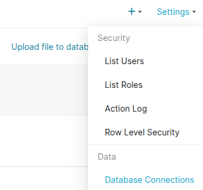
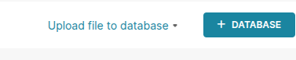
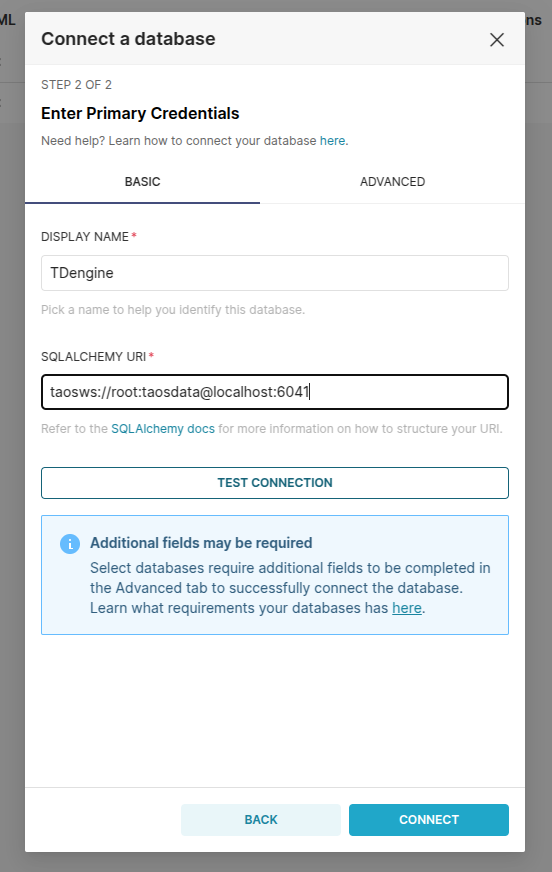
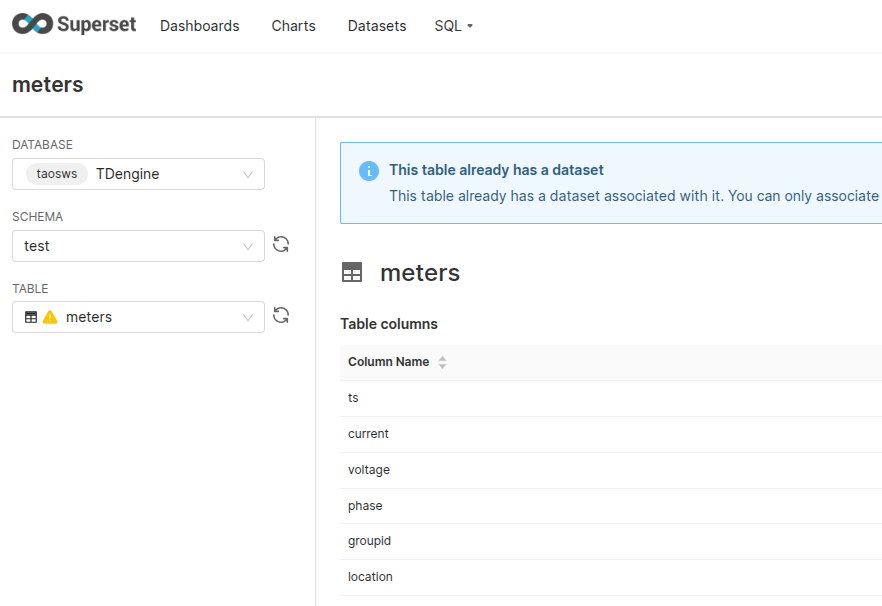
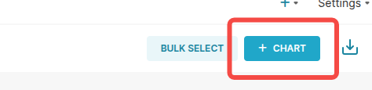
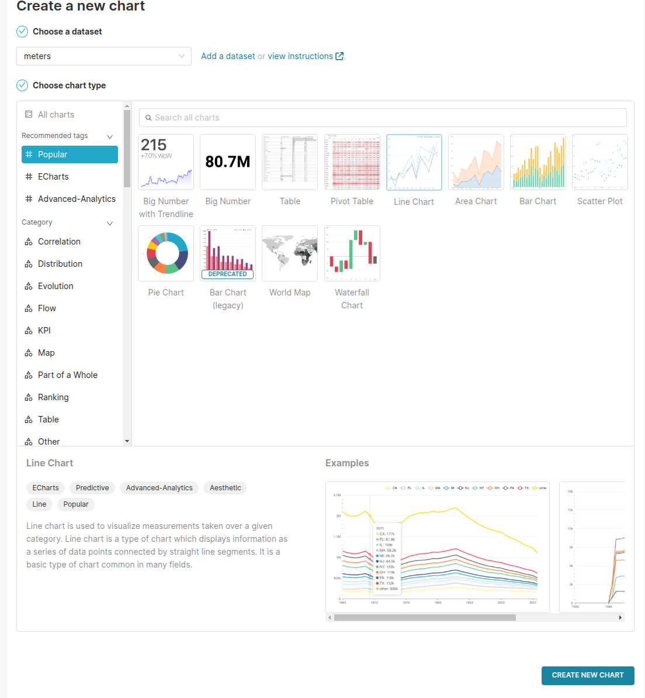
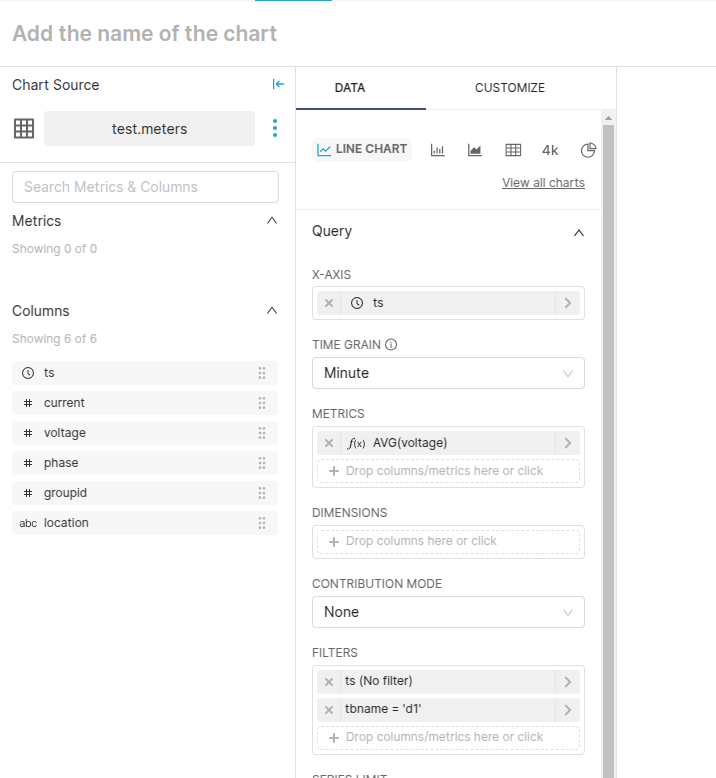
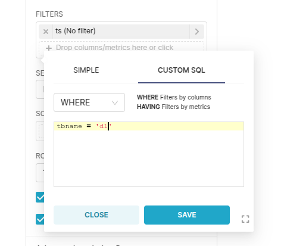
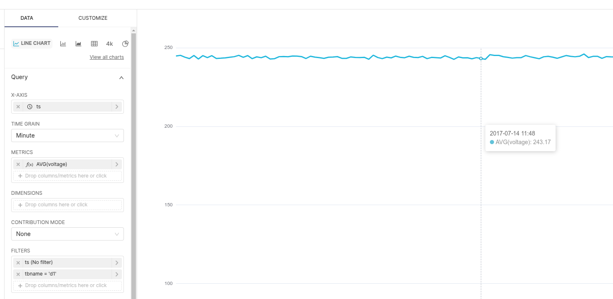
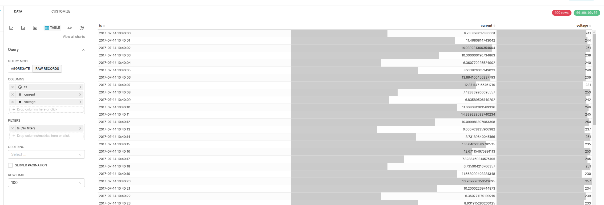

# 3.3.5.0 考试答案

#### 1. 第一部分，笔试题目，所有人回答

1. 说明 TDgpt 的技术特点
   - TDgpt 是 TDengine Enterprise 中针对时序数据提供高级分析功能的组件，通过 Anode 向 TDengine 提供运行时动态扩展的时序数据分析服务。集群中可以部署若干个 Anode，不同的 Anode 之间无同步依赖或协同的要求，Anode 注册到 TDengine 集群以后，立即就可以提供服务。
   - TDgpt 提供的高级时序数据分析服务可分为时序数据**异常检测**和时序数据**预测分析**两类，有一部分内置的算法模型，现在正在与第三方服务商适配对接，将其分析算法嵌入到 TDgpt 中。
   - TDgpt 还提供了SDK，开发者只需要按照[算法开发者指南](https://docs.taosdata.com/next/advanced/TDgpt/dev/)的步骤，可以将自己独有的时序数据预测或时序数据异常检测算法无缝集成到 TDgpt。
2. 举例说明 TDengine 和那些国产化操作系统做过适配
   - 标准 Linux 系统：银河麒麟、中标麒麟、统信 UOS、凝思磐石、华为欧拉 openEuler、龙蜥 Anolis OS
   - 实时操作系统：天脉、翼辉
3. 什么是流计算的 Force Window Close 模式，常用于什么场景
   - Force Window Close 模式是流计算增加新的触发模式，按系统时间，定时触发计算任务，支持 interp、twa函数， 不处理乱序、修改、删除的数据，不处理历史数据
   - 电力行业的断面数据场景：电力行业在未使用时序数据库时，通常在达梦数据库（关系型）中保存 1/5/15 分钟所在时刻的数据，无法保留原始数据，使用 TDengine 后，在保留明细历史数据的同时，也可以快速实现之前的断面查询需求
4. 简要描述 Last 数据缓存的技术特点
   - TDengine 用户可以灵活选择适合的缓存模式，包括缓存最新一行数据、每列最近的非 NULL 值，或同时缓存行和列的数据。这种灵活性使 TDengine 能根据具体业务需求提供精准优化，在物联网场景下尤为突出，助力用户快速访问设备的最新状态。
   - 这种设计不仅降低了查询的响应延迟，还能有效缓解存储系统的 I/O 压力。在高并发场景下，读缓存能够帮助系统维持更高的吞吐量，确保查询性能的稳定性。借助 TDengine 读缓存，用户无需再集成如 Redis 一类的外部缓存系统，避免了系统架构的复杂化，显著降低运维和部署成本。
5. 为什么需要 compact
  TDengine 面向多种写入场景，而很多写入场景下，TDengine 的存储会导致数据存储的放大或数据文件的空洞等。这一方面影响数据的存储效率，另一方面也会影响查询效率。为了解决上述问题，TDengine 企业版提供了对数据的重整功能，即 DATA COMPACT 功能，将存储的数据文件重新整理，删除文件空洞和无效数据，提高数据的组织度，从而提高存储和查询的效率。
1. Flink 连接器支持哪些功能？答出关键词就算对。
  - **Source**：支持并行拉取 TDengine 数据库中的数据。在获取数据后将其转换为用户指定的格式，为后续数据处理提供高效输入。
  - **CDC 数据订阅**：支持数据订阅功能，能实时监控 TDengine 数据库的数据变化，获取到变更后将其转换为用户指定的格式，以并行方式分发到后续任务，使用检查点提交机制保证数据的一致性和完整性。
  - **Sink**：支持高效且精准地将经过 Flink 处理的数据写入 TDengine。
  - **Table SQL**：支持以 Flink SQL 语句的方式从多个不同的数据源（如 TDengine、MySQL、Oracle 等）中提取数据， 分发给后续任务，然后将处理后的结果写入到目标数据源（如 TDengine、Mysql 等）中。
1. taosX 跨网闸数据同步使用什么方案实现？
   - 基于订阅的增量文件备份和恢复。
2. CSV 文件目录监听适用于什么场景？
  - CSV 离线数据文件导入数据库
  - 当前未支持的数据源通过写入 CSV 文件进行数据同步

#### 2. 第二部分，笔试题目，售前交付回答

1. 以智能电表数据模型为例，编写 SQL 语句，使用 arima 算法进行预测，每 10 个采样点是一个周期，返回置信区间是 95% 的上下边界
```sql {wrap}
SELECT _frowts, FORECAST(voltage, "algo=arima,alpha=95,period=10,start_p=1,max_p=5,start_q=1,max_q=5") from db.metrics
```

1. 以智能电表数据模型为例，编写 SQL 语句，使用 iqr 算法进行异常检测，寻找电流异常窗口内的电流最大值和电压最大值
```sql {wrap}
SELECT _wstart, _wend, max(current), min(voltage)
FROM db.metrics
ANOMALY_WINDOW(current, "algo=iqr");
```

1. 以智能电表数据模型为例，编写 SQL 语句，创建一个 **Force Window Close 的流计算，计算 5 分钟的断面电压**
```sql {wrap}
create stream voltage_5m 
trigger force_window_close 
into voltage_5m_stb as 
  select _irowts, tbname,_isfilled, interp(voltage) from meters 
  partition by tbname   
  every(5m)
  fill(prev);
```

1. 说明如下四个参数的含义
   - queryUseMemoryPool：查询是否使用内存控制（内存池），默认启用，当关闭时所有内存控制不生效
   - minReservedMemorySize：最小预留的系统可用物理内存数量，值越大 OOM 概率越低
   - singleQueryMaxMemorySize：单个查询在单个节点(dnode)上可以使用的内存上限，默认该功能关闭，打开时超过该上限报错
   - queryNoFetchTimeoutSec：查询中当应用长时间不 FETCH 数据时的超时时间，从最后一次响应起计时，超时自动清除任务（内部）
2. 说明 Interval 语句中，auto 关键字的含义
  INTERVAL 子句允许使用 AUTO 关键字来指定窗口偏移量，此时如果 WHERE 条件给定了明确可应用的起始时间限制，则会自动计算所需偏移量，使得从该时间点切分时间窗口；否则不生效，即仍以 0 作为偏移量。
1. 说明 Interp 函数中，有几种填充模式，解释其含义
   - Near：使用距离当前时间点最近的数据进行插值, 当前后时间戳与当前时间断面一样近时, FILL 前一行的值
   - Prev：使用前一个非 NULL 值填充数据
   - Next：使用下一个非 NULL 值填充数据
   - LINEAR：根据前后距离最近的非 NULL 值做线性插值填充
   - VALUE ：固定值填充，此时需要指定填充的数值
   - NULL：使用 NULL 填充数据
   - NONE：不进行填充
2. 客户端连接支持哪几种选项
  **时区、字符集、用户 IP，用户 APP **
1. 编写 SQL 语句，获取某 DB 的时序数据占用空间、WAL 占用空间、压缩比
```sql {wrap}
select sum(data1 + data2 + data3), sum(wal), sum(data1 + data2 + data3)/sum(raw_data) 
from information_schema.ins_disk_usage 
where db_name="dbname" 
```

1. taosX MQTT 解析支持那些压缩算法
  gzip, snappy, lz4, zstd
1. JDBC 连接器参数绑定在哪种场景下的性能得到了提升
  多表低频
1. 新增了哪个 BI 工具的支持
     Apache SuperSet
---

#### 3. 第三部分，实操题目，售前交付回答

1. 使用 taosBenchmark 默认数据模型（智能电表）写入 1 万张子表，每表 1 万条数据，模拟采样频率 1Hz 。
  ```bash
  taosBenchmark -d test -n 10000 -t 10000 -S 1000 -y
  ```

1. 部署 SuperSet（使用 WebSocket 连接）并展示如下数据：
   - 使用 Line Chart 展示 `d1` 子表的每分钟平均电压（`voltage`）。
   - 使用 Table 展示前 100 条时序电流（current）电压(voltage) 值。

部署：不限部署方式，以[ pip install 方式](https://superset.apache.org/docs/installation/pypi) 为例：
1. 准备 Linux 系统和 Python3 环境
  ## OS Dependencies
  Superset stores database connection information in its metadata database. For that purpose, we use the cryptography Python library to encrypt connection passwords. Unfortunately, this library has OS level dependencies.
  **Debian and Ubuntu**
  In Ubuntu **20.04 and 22.04** the following command will ensure that the required dependencies are installed:
  ```bash
  sudo apt-get install build-essential libssl-dev libffi-dev python3-dev python3-pip libsasl2-dev libldap2-dev default-libmysqlclient-dev
  ```

  In Ubuntu **before 20.04** the following command will ensure that the required dependencies are installed:
  ```bash
  sudo apt-get install build-essential libssl-dev libffi-dev python-dev python-pip libsasl2-dev libldap2-dev default-libmysqlclient-dev
  ```

  <callout emoji="cake" background-color="light-orange" border-color="light-orange">
  注意：不支持Ubuntu 24.04
  </callout>

  **Fedora and RHEL-derivative Linux distributions**
  Install the following packages using the `yum` package manager:
  ```bash
  sudo yum install gcc gcc-c++ libffi-devel python-devel python-pip python-wheel openssl-devel cyrus-sasl-devel openldap-devel
  ```

  In more recent versions of CentOS and Fedora, you may need to install a slightly different set of packages using `dnf`:
  ```bash
  sudo dnf install gcc gcc-c++ libffi-devel python3-devel python3-pip python3-wheel openssl-devel cyrus-sasl-devel openldap-devel
  ```

  Also, on CentOS, you may need to upgrade pip for the installation to work:
  ```bash
  pip3 install --upgrade pip
  ```

  **Mac OS X**
  If you're not on the latest version of OS X, we recommend upgrading because we've found that many issues people have run into are linked to older versions of Mac OS X. After updating, install the latest version of XCode command line tools:
  ```bash
  xcode-select --install
  ```

  We don't recommend using the system installed Python. Instead, first install the [homebrew](https://brew.sh/) manager and then run the following commands:
  ```bash
  brew install readline pkg-config libffi openssl mysql postgresql@14
  ```

  You should install a recent version of Python. Refer to the [pyproject.toml](https://github.com/apache/superset/blob/master/pyproject.toml) file for a list of Python versions officially supported by Superset. We'd recommend using a Python version manager like [pyenv](https://github.com/pyenv/pyenv) (and also [pyenv-virtualenv](https://github.com/pyenv/pyenv-virtualenv)).
  Let's also make sure we have the latest version of `pip` and `setuptools`:
  ```bash
  pip install --upgrade setuptools pip
  ```

  Lastly, you may need to set LDFLAGS and CFLAGS for certain Python packages to properly build. You can export these variables with:
  ```bash
  export LDFLAGS="-L$(brew --prefix openssl)/lib"
  export CFLAGS="-I$(brew --prefix openssl)/include"
  ```

  These will now be available when pip installing requirements.
  
1. 安装 superset: `pip install ``apache-``superset`
2. 安装 Python  连接器： 
`pip install taospy`
1. 安装 Python WebSocket 连接器： 
`pip install taos-ws-py`
1. 配置和启动 superset:
  ```bash
  export SUPERSET_SECRET_KEY=YOUR-SECRET-KEY
  export FLASK_APP=superset
  # 初始化数据库
  superset db upgrade
  # 创建管理员用户（建议使用 admin 作为管理员用户名）
  superset fab create-admin
  # 初始化
  superset init
  # 启动服务
  superset run -h 0.0.0.0 -p 8088 --with-threads
  ```

1. 打开浏览器进入 SuperSet：http://localhost:8088
2. 找到右侧菜单 Settings -> Database Connections:


1. 新建数据库连接




1. 创建后如下图所示：
  

1. 进入 DataSets 页面：
  

1. 添加 DataSet：
  

1. 添加第一个 Chart：
   - 进入 Charts 页面：
    

   - 找到添加按钮：
    

   - 在添加 Chart 对话框中，下拉搜索 `meters` 并选择 Line Chart：
    

   - Chart 编辑页面：
    

   - 自定义筛选条件为 `tbname='d1'`:
    

   - 预览结果：
    

1. 添加第二个 Chart：
   - 选择 Table 类型，选择 ts，current，voltage 三列，配置 LIMIT = 100:
  
