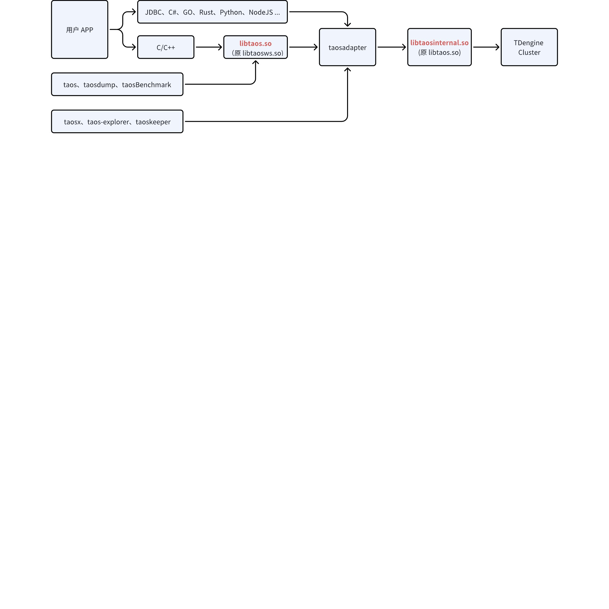
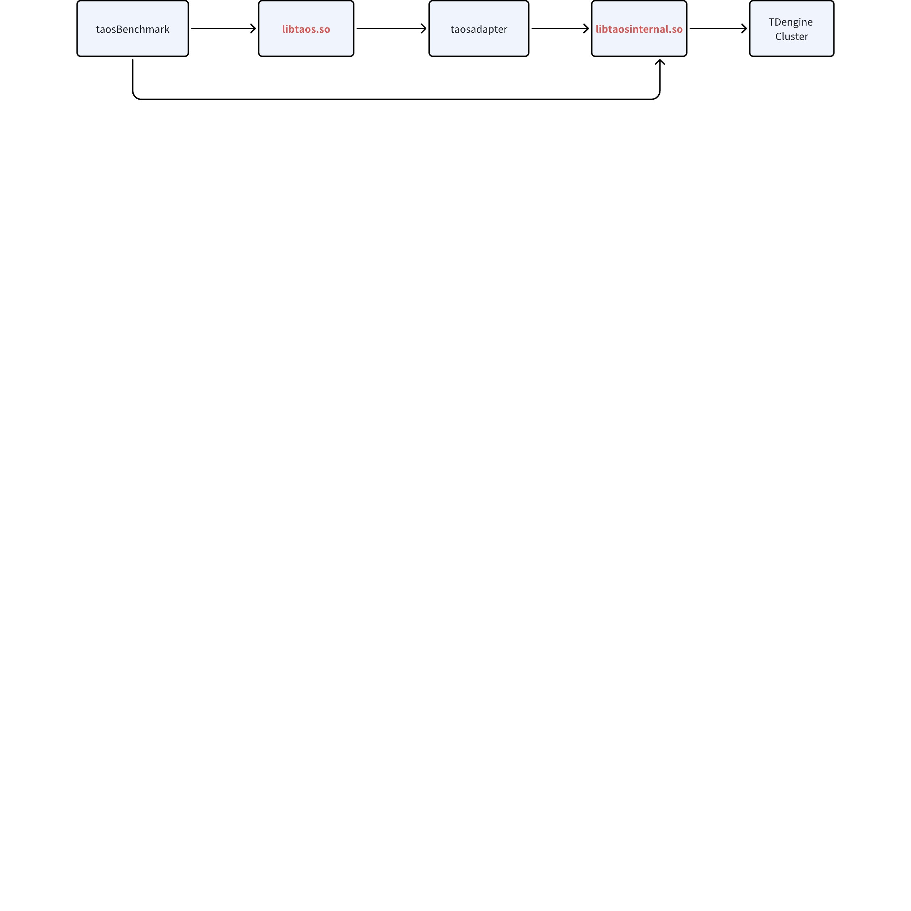

# 版本兼容方案

## 一、背景

从 1.x、2.x 到 3.x，libtaos.so 与 taosd 间的兼容性问题一直存在，且饱受诟病。交付团队在生产环境中，普遍采用 WebSocket 协议，以 taosadapter 作为中转去访问 taosd，一定程度上解决了兼容性。但仍然存在如下问题：
1. 很多故障修复和新特性上线都依赖于 libtaos.so 的升级，如果用户 APP 或者 taosadapter 调用的 libtaos.so 不做变化，尽管 taosd 完成升级，客户仍然无法享受到这些改进。
2. libtaos.so 自身某些变动或其与 taosd 间的通信协议变动，都可能导致第三位版本号发生变化，此时尽管 taosd 间的通信协议不变（可滚动升级），但 taosd 还是必须停服。

## 二、目标

仅引擎代码变动时，用户 app 无需任何动作。

## 三、方案

### 1. 部署方式

不再对外发布 Native 驱动，所有连接器的数据访问请求走 taosadapter。连接器包括 C/C++、JAVA 等所有语言。


### 2. 文件改造

1. 把 libtaosws.so 重命名为  libtaos.so，所有的 API 重命名，实现与原 libtaos.so 同样的接口与功能，确保用户使用 C/C++ 连接器的应用程序不需变化。
```shell
ws_connect  -> taos_connect
ws_close    -> taos_close
ws_query    -> taos_query
……
```

1. 取消 JDBC、C#、GO、Rust、Python、NodeJS 等连接器的 Native 调用方式。即便用户设置为 Native，内部仍然按照 WebSocket 方式通信（为兼容性考虑）
2. 把 libtaos.so 重命名为 libtaosinternal.so，在极少数特定场景下使用。

### 3. 性能测试

改造完成后，启动性能基准测试，对于性能下降超过 10% 的写入、查询进行优化。

### 4. taosBechmark

taosBenchmark 支持 Native 和 WebSocket 两种连接方式。
1. POC 场景：采用 Native 方式，性能更好
2. 性能校准场景：分别采用 Native 和 WebSocket 测试，确认 WebSocket 性能与 native 方式接近


### 5. 版本管理

严格客户端与服务端间的版本检查（每个消息都包含版本号），只要版本号不同（包括第四位），libtaosinternal.so 就报告错误，不再进行后续处理
1. taosadapter 收到版本不一致的错误时，自动重启，启动后第一个动作是拉取 libtaosinternal.so 到本地环境加载
2. taosd（或者其他链接库管理工具）提供下载  libtaosinternal.so 的方法
taosd 之间
1. 第二位版本号不变时，可以升降级
2. 第三位版本号不变时，可以滚动升降级
