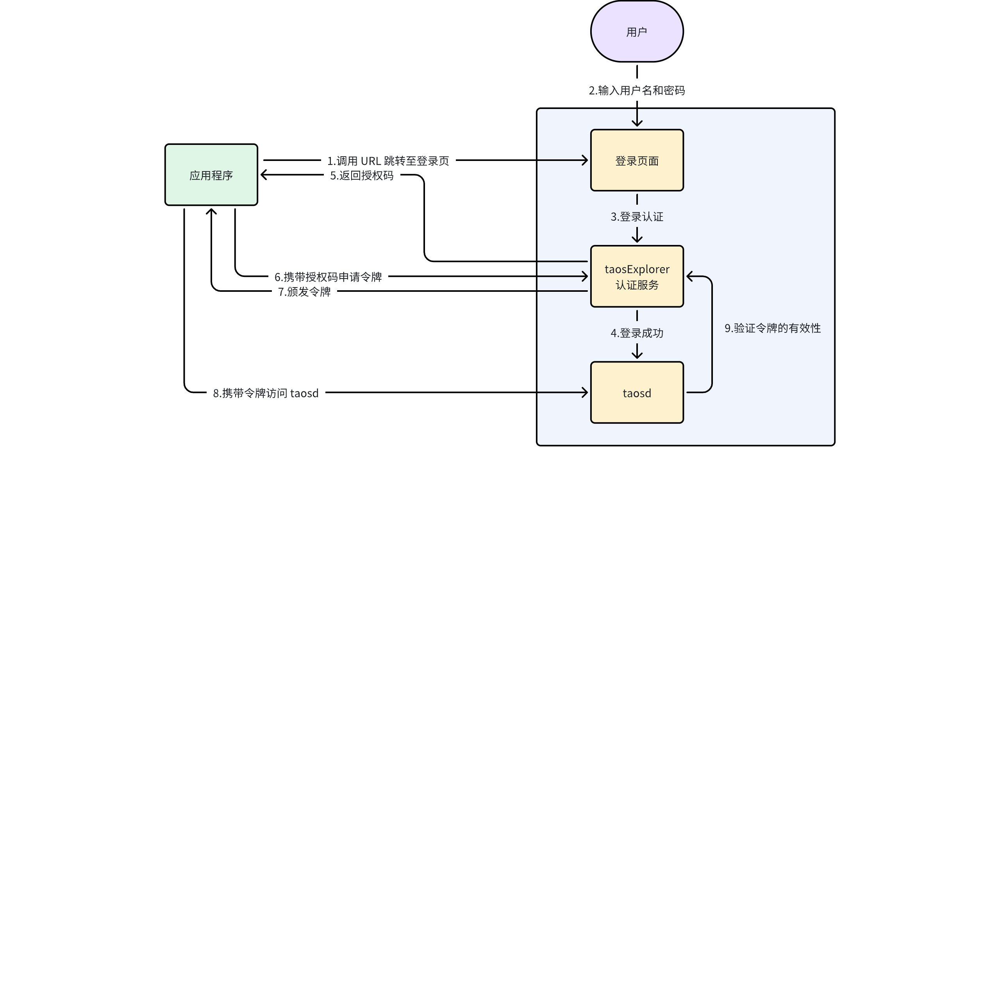

# oAuth 2.0 RS

## 1. 引言

### 1.1 术语与缩写名词

| 名词 | 描述 |
| --- | --- |
| OAuth 2.0 | 业界标准的授权协议，用于授权一个应用程序或服务访问用户在另一个应用程序中的资源，而无需提供用户名和密码。它定义了四种可以适用于各种应用场景的授权交互模式。 1. 授权码模式 1. 应用授信模式 1. 用户授信模式 1. 简化模式 |
| 资源所有者 | Resource Owner，数据的拥有者，它们可以授权其他应用程序来访问它们的资源 |
| 资源服务器 | Resource Server，保存着受保护的用户资源 |
| 授权服务器 | Authorization Server，负责验证资源所有者的身份并向客户端颁发访问令牌 |
| 应用程序 | Client，请求访问资源的应用程序 |
| 访问令牌 | Access Token，用来访问资源服务器上受保护资源的凭证，它是应用程序向授权服务器请求的，通常具有一定的时效性，应用程序使用访问令牌来证明它已被授权访问资源 |
| 授权代码 | Authorization Code，应用程序向授权服务器请求访问令牌的中间凭证，它用于在应用程序和授权服务器之间进行安全的令牌交换 |
| 客户端标识 | 应用程序在获取授权代码和访问令牌时提供 |

### 1.2 授权代码模式的工作原理

#### 1.2.1 **注册应用**

应用程序在授权服务器上注册，并获得一个客户端标识。这是为了验证客户端的身份，并确保安全性。此步骤在特定场景下有可能被省略。

#### 1.2.2 **重定向用户**

应用程序将用户重定向到授权服务器，以请求授权。资源所有者将在授权服务器上登录，并授权应用程序访问它们的资源。

#### 1.2.3 **授权授予**

一旦资源所有者同意授权，授权服务器将生成一个授权代码，并将其发送回应用程序。

#### 1.2.4 **获取访问令牌**

应用程序使用授权代码向授权服务器请求访问令牌。授权服务器验证授权代码和客户端标识，如果有效，颁发访问令牌。

#### 1.2.5 **访问资源**

应用程序使用访问令牌来请求资源服务器上的受保护资源。资源服务器验证访问令牌，如果有效，提供资源。

### 1.3 优先级要求

有用户与 Jeff 单独沟通，需要尽快排期。

### 1.4 版本要求

企业版支持，社区版不支持。

## 2. 需求目标

oAuth 2.0 的核心是仅为资源的共享者提供访问令牌，不为资源的共享者提供用户密码。访问令牌可以设置有效期和访问范围，因此可以随时修改其有效性，不影响其他的资源共享者。有三种典型的应用场景。

| 场景 | 描述 |
| --- | --- |
| 场景一 | 1. 在 TDengine 中配置能够获取授权代码的客户端标识 1. 应用程序通过 TDengine 提供的重定向 URL，打开（弹出） TDengine 提供的用户登录页面，当用户登录后，选择有效期并确认授权，应用程序随后获取授权代码 1. 应用程序使用客户端标识以及刚刚获取的授权代码，通过 TDengine 提供的 URL，获取令牌 1. 应用程序通过令牌访问 TDengine |
| 场景二 | 1. 用户登录 TDengine 提供的管理工具（taosExplorer） 1. 用户在管理界面中生成令牌 1. 将令牌提供给应用程序 1. 应用程序通过令牌访问 TDengine |
| 场景三 | 在完全受信的环境中，用户通过特定 URL 获取令牌。适用于用户提供资源给第三方，绕过 taosExplorer 的场景。 1. 用户执行 URL，提供用户名、密码，获取令牌 1. 将令牌提供给应用程序 1. 应用程序通过令牌访问 TDengine |

场景一的典型流程如下所示。


为简化实现，不再单独设计令牌的权限，令牌权限与其对应的用户权限相同，有一定的有效期。当用户权限修改时，令牌对应的权限也自动发生变化。有两个实现方案，建议采用方案二。
1. 将过期时间、用户名、用户密码以加密方式存储到令牌中，这样 TDengine 在处理通过令牌的登录请求时，不必通过 taosExplorer 认证服务，也就是省略上图中的第 9 步骤；缺点是无法动态修改过期时间。
2. TDengine 在每次处理通过令牌的登录请求时，都需要与 taosExplorer 的认证服务交互，获取令牌的有效性。

## 3. 功能需求

### 3.1 令牌管理

1. 令牌信息包括：令牌字符串、令牌对应的授权代码、令牌的有效期、令牌的创建时间
2. 支持令牌查看、获取、回收，支持修改令牌有效期
3. root 用户可以管理所有令牌，其他用户只能管理自己的令牌
注：令牌有效期用截止时间表示，不能采用时间段表示。示例：在 2024-04-01 过期，而非在 3 天后过期。

### 3.2 授权代码管理

1. 授权代码信息，包括授权代码字符串、授权用户、授权代码的生产时间、授权代码对应的客户端标识、待授权的有效期
2. 支持授权代码的查看、获取、删除，不支持修改
3. 仅 root 用户可以管理授权代码信息

### 3.3 客户端管理

1. 客户端信息包括：客户端标识、客户端录入日期、客户端名称、支持的最多令牌数目
2. 支持客户端信息的查看、获取、删除、修改
3. 仅 root 用户可以管理客户端信息

### 3.4 RestFul / Websocket 连接支持使用令牌

当应用程序通过 RestFul、Websocket 方式访问 TDengine 时，用法与访问云服务相同，例如 
```bash {wrap}
jdbc:TAOS-RS://localhost:6041?token=82bc155f0288153f1bc59e799e3c875c6ecff815
```

### 3.5 taosc 原生连接支持使用令牌

当应用程序通过 taosc 原生方式访问 TDengine 时，同样支持 token 方式连接，例如
```bash {wrap}
taos_connect_with_token(ip, port, token);
```

### 3.6 Taos Shell 支持使用令牌

Taos shell 可执行程序提供命令行参数，支持通过令牌登录数据库，例如
```bash {wrap}
taos --token=82bc155f0288153f1bc59e799e3c875c6ecff815
```

### 3.7 对外 API

1. /authorize：用于颁发授权代码，打开 Web 页面，用户登录并确认进行授权，然后返回授权代码给调用方
2. /token：用于颁发访问令牌，有两类输入参数
   - 客户端标识信息、授权代码
   - TDengine 用户名、TDengine 用户密码、有效期
3. /introspect：检查令牌的合法性
4. /revoke：回收令牌
以上 API 以 Web URL 方式提供，支持 https 方式访问。

## 4. 其他说明

授权代码模式的 oAuth 2.0 服务，是目前业界广泛应用的漏洞较少的服务，实现该模式后，质疑的人会很少。如果裁剪掉授权代码、客户端标识，虽然业务上也说得通，但就需要不断解释。
