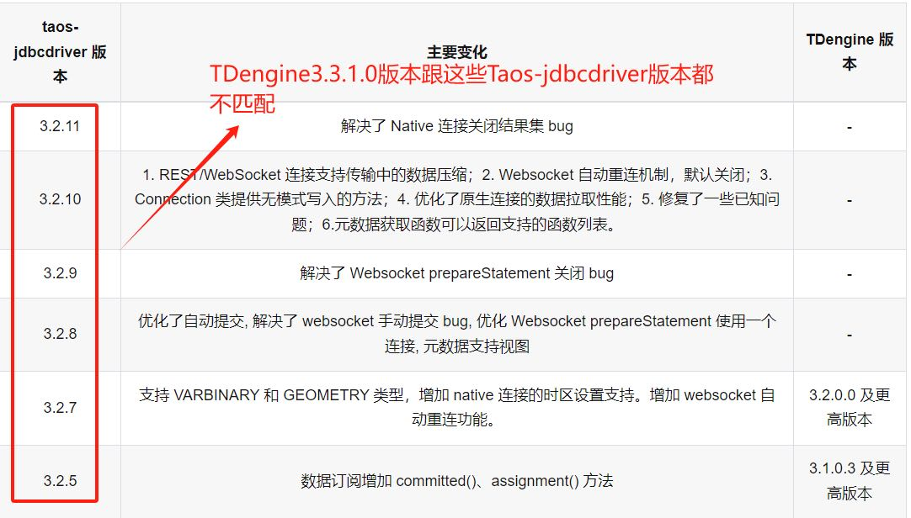
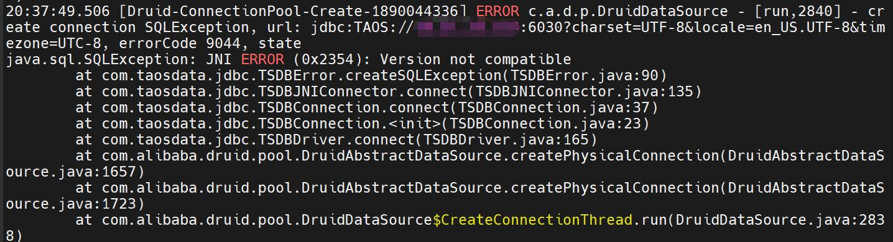

# 热更新机制解决客户端兼容性 RS

## 一、需求背景

2024-06-18，客户报告了截图所示的问题

研发部内部讨论后，存在几个观点
1. 测试方法以及流程有问题，兼容性问题没测试出来
2. 不兼容是预期的结果，因为第三位版本号升级，客户端（libtaos.so）也是要升级的
3. 文档没写清楚

## 二、需求目标

从 1.x、2.x 到 3.x，libtaos.so 与 taosd 之间的兼容性问题一直存在，且饱受诟病。各语言连接器通过 RESTFul 和 WebSocket 协议，以 taosadapter 作为中转去访问 taosd，基本解决了兼容性问题。通过 libtaos.so 访问 taosd 相比于 taosadapter 作为中转，性能更好且资源消耗更低，因此使用 libtaos.so 的用户仍然很多。彻底解决兼容性问题有两种技术路线。
1. 禁止各连接器调用 libtaos.so，必须通过 RESTFul / WebSocket 协议访问 TDengine，强制部署 taosadapter
2. 将 libtaos.so 拆分为两个：libtaos.so、libtaosImp.so，通过 libtaosImp.so 的热更新机制解决兼容性问题

## 三、实现思路

### 技术路线一

1. taosadapter 与服务端通信，自动拉取 libtaos.so
2. taosdadpter 通过 libtaos.so 与服务端通信，由 libtaos.so 自动拉取 libtaosimp.so
这种技术路线下，选择 1 就可以

### 技术路线二

libtaos.so 与 taosd 的兼容性场景有三个，通过 libtaosImp.so 的热更新能够处理后两个场景
1. libtaos.so 的 API 发生变化
2. libtaos.so 与 taosd 的通信协议发生变化
3. libtaos.so 的内部实现发生变化（包括新功能和故障修复）
简单描述一下 libtaosImp.so 热更新机制的思路
1. libtaosImp.so 和原 libtaos.so 的功能完全相同，两者 API 一一对应但名字不同，例如 taos_connect_imp，taos_query_imp
2. libtaos.so 的 API 不变，但通过调用 libtaosImp.so 的 API 实现，例如 taos_connect 调用 taos_query_imp；各连接器不需要进行任何修改，以 JDBC 接口为例，JDBC 调用 libtaos.so 中的函数时，会被中转至 libtaosImp.so 
3. libtaos.so 和 libtaosImp.so 都部署在客户端本地，程序启动后，libtaos.so 与 taosd 交换 libtaosImp.so 的版本号，当两者不一致时，libtaos.so 从 taosd 拉取相匹配的 libtaosImp.so 文件，然后采用 dlopen 等动态加载方式，加载 libtaosImp.so 中的实现函数
4. libtaosImp.so 与 taosd 之间传输的任何数据都需要包含版本号，当两者的版本号不相同时（有别于之前的第三位版本号不同），libtaosImp.so 会返回版本不一致的错误码给 libtaos.so，libtaos.so 得到版本不一致的错误码时，禁用所有对外的 API，并开始从 taosd 拉取 libtaosImp.so 库，装载到本地函数空间后，再放开所有对外的 API

### 其他

补充说明，实现时两种复杂度
1. 发现不一致，客户端服务就退出，在客户端启动时由 driver拉取
2. 发现不一致时，客户端不退出，driver 停止服务，待 driver 自动拉取后加载函数，然后重新提供服务
