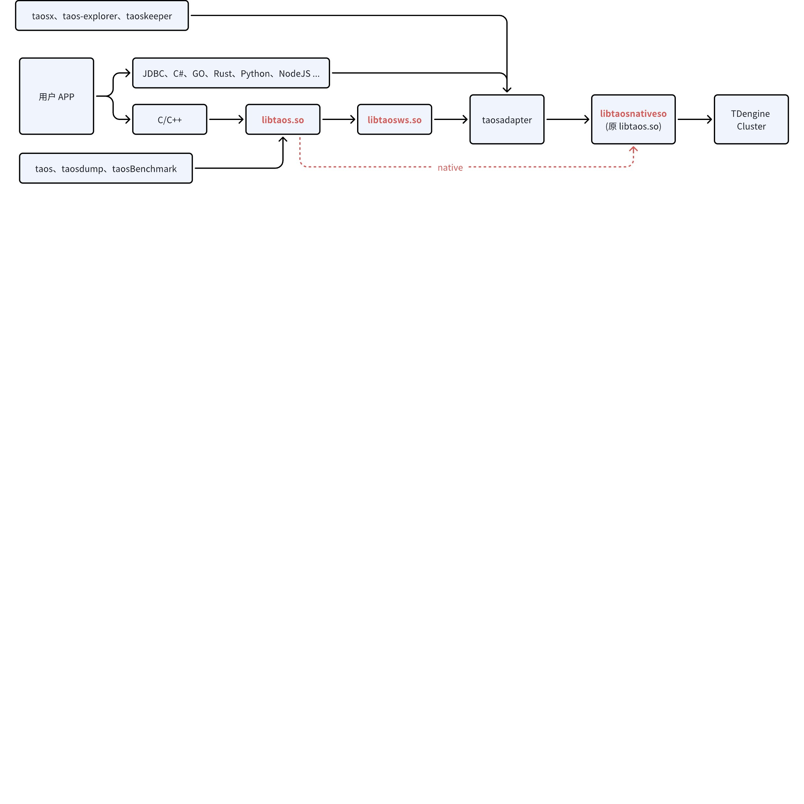

# 客户端版本兼容性解决方案

## 1. 背景

从 1.x、2.x 到 3.x，libtaos.so 与 taosd 间的兼容性问题一直存在，且饱受诟病。交付团队在生产环境中，普遍采用 WebSocket 协议，以 taosadapter 作为中转去访问 taosd，一定程度上解决了兼容性。但仍然存在如下问题：
1. 很多故障修复和新特性上线都依赖于 libtaos.so 的升级，如果用户 APP 或者 taosadapter 调用的 libtaos.so 不做变化，尽管 taosd 完成升级，客户仍然无法享受到这些改进。
2. libtaos.so 自身某些变动或其与 taosd 间的通信协议变动，都可能导致第三位版本号发生变化，此时尽管 taosd 间的通信协议不变（可滚动升级），但 taosd 还是必须停服。
本文档将版本兼容性解决方案及相关实现、用户侧变更列表于此。

## 2. 变更历史

| 日期 | 版本 | 负责人 | 主要修改内容 |
| --- | --- | --- | --- |
| 2024.11.05 | 0.1 | 霍琳贺 |  |
| 2024.11.07 | 0.2 | 霍琳贺 | Meeting Review ，增加服务发现等 |
| 2024.11.12 | 0.3 | 霍琳贺 | 端口号变更 |
| 2024.11.19 | 0.4 | 霍琳贺 | 确定使用 6041 端口，6030 端口定义保持不变。 |
| 2024.11.29 | 0.5 | 关胜亮 | 调整 libtaos.so、libtaosnative.so、libtaosws.so 关系，说明 taos、taosdump、taosbenchmark 对 libtaos.so 的依赖和调用方法，增加 show adapters 的语法 |
| 2025.01.12 | 0.6 | 关胜亮 | 重命名 libtaosnative.so 为 libtaosnative.so |
| 2025.02.28 | 0.7 | 关胜亮 | 4.2.2.1 - 3 中 WEBSOCKET 也使用 host port user password 及 taos_options 细化 |
| 2025.02.28 | 0.8 | 段宽军 | 新增 “4.2.7 客户端工具变更” 章节，汇总工具行为变更项 |

## 3. 定义

- Native 连接 / 驱动：使用 TDengine 原生客户端，即 libtaos.so、taos.dll 进行连接的方式，为原生连接，其中使用的 `libtaos.so` 动态库（不同平台文件名略有不同）及相关 API 称之为 Native 驱动。下文中的 `libtaos.so` 泛指所有平台 Native 驱动。
- WebSocket 连接 / 驱动：使用 TDengine 各语言 WebSocket 连接器，通过 taosAdapter WebSocket 接口连接 TDengine，为 WebSocket 连接。其中 C 语言特有的 libtaosws.so 称之为 WebSocket 驱动。下文中的 `libtaosws.so` 泛指所有平台 WebSocket 驱动。

## 4. 行为说明

### 4.1 部署方式

不再对外发布 Native 驱动，所有连接器的数据访问请求走 taosadapter。连接器包括 C/C++、JAVA 等所有语言。


### 4.2 变更列表

#### 4.2.1 库文件变更

1. 原有的 `libtaos.so`：重命名为 `libtaos``native``.so`
2. `libtaosws.so`：使用`WebSocket`方式提供与`libtaos``native``.so` 同名的全部 API。对比现在的原生驱动，taosws API 有少量缺失：
   - 异步接口未实现（`taos_query_a`/`taos_fetch_raw_a` 等）：添加接口并保持一致。
   - 由于兼容性原因，部分结构体大小不一致：修改并保持一致。
   - 部分接口安全性原因，参数个数不一致：添加签名完全一致的接口。
3. 新增 `libtaos.so`：运行时动态载入 `libtaosws.so`或者  `libtaosnative.so`
以`Linux`为例，安装后，会在 `/usr/local/taos/driver` 中存放 `libtaos.so` 、 `libtaosws.so` 、 `libtaos``native``.so`，并链接到 `/usr/lib` 目录：
```shell
root@u0-44:/usr/local/taos/driver# ll
libtaosnative.so.3.3.4.2*
libtaosws.so
libtaos.so.3.3.4.2* 

root@u0-44:/usr/lib# ll libtaos*
libtaos.so -> /usr/lib/libtaos.so.1*
libtaos.so.1 -> /usr/local/taos/driver/libtaos.so.3.3.4.2*
libtaosnative.so -> /usr/lib/libtaosnative.so.1*
libtaosnative.so.1 -> /usr/local/taos/driver/libtaosnative.so.3.3.4.2*
libtaosws.so -> /usr/local/taos/driver//libtaosws.so
```

#### 4.2.2 C 接口变更

##### 4.2.2.1 变更 taos_options 函数

增加一个选项`TSDB_OPTION_DRIVER`
1. 对于`libtaos.so`
   - `TSDB_OPTION_DRIVER` == "`native`",  时，载入`libtaosnative.so`
   - `TSDB_OPTION_DRIVER` == "`websocket`"，载入`libtaosws.so`
2. 对于 `libtaosnative.so` 和 `libtaosws.so`
   - 设置 `TSDB_OPTION_DRIVER` 不起作用，不会返回错误
`TSDB_OPTION_DRIVER` 的默认值
1. 未设定`WEBSOCKET`编译选项（C 程序员开发环境或部分社区用户，默认为 "`native`"）
   - `libtaos.so`默认载入`libtaosnative.so`
   - `taos shell`、`taosBenchmark`、`taosdump` 使用 `libtaos.so`
2. 设定了`WEBSOCKET`编译选项（通常是打包发布情况，社区版/企业版安装包，默认为 "`websocket`"）
   - `libtaos.so`默认载入`libtaosws.so`
   - `taos shell`、`taosBenchmark`、`taosdump`使用 `libtaos.so`
   - `taos shell`、`taosBenchmark`、`taosdump` 的默认链接方式是`native`，在自己程序逻辑实现
3. 使用 taos_connect 函数连接到云服务时，假定链接字符串为 https://gw.us-west-2.aws.cloud.tdengine.com?token=fad7a7fc8b3244cec1bef608d0360d23db20ea4f，各参数说明
   - host: gw.us-west-2.aws.cloud.tdengine.com
   - user: "token"
   - pass: "fad7a7fc8b3244cec1bef608d0360d23db20ea4f"
   - db：行为不变
   - port: 行为不变
   - 云服务连接方式判断：检测 host 是否为云服务域名
4. `TSDB_OPTION_DRIVER` 只能设置一次，一旦调用 `taos_connect` 函数之后，不能再设置 `TSDB_OPTION_DRIVER` 的值，该限制是进程范围的。

#### 4.2.3 端口号变更

当 `taos_connect` 传入的 `port` 值为 `0` 时，使用如下默认值
1. `libtaos``ws``.so` 默认使用 `6041` 端口（WebSocket 连接）
2. `libtaosnative.so` 默认使用 `6030` 端口（原生链接）
3. `libtaos.so` 使用的端口，依赖`taos_options`的设置
4. 云服务连接方式，则默认使用 `443` 端口

#### 4.2.4 可执行文件变更

`taos`、`taosdump`、`taosBenchmark` 显式依赖 `libtaos.so`，但不显示依赖 `libtaosws.so`，如下：
```shell
root@u0-44:/usr/local/taos/bin# ldd taos
        linux-vdso.so.1 (0x00007ffe76dbf000)
        libtaos.so.1 => /lib/libtaos.so.1 (0x00007f54bc87b000)
        libtaosws.so => /lib/libtaosws.so (0x00007f54bc028000)
        ……
```

新增命令行选项 `-``Z`` --``driver`：
1. 值为数字 0 或字符串 "native"  时：动态绑定 `libtaos``native``.so` 通过原生形式访问 `TDengine`；
   - 未指定 `-P` 端口时，读取 `/etc/taos/taos.cfg` 中的 `serverPort`，如未配置，使用 6030 端口；
   - 指定 `-P` 端口时，使用设定的端口。
2. 值为数字`1`或 字符串 "websocket" 时：动态绑定 `libtaos``ws``.so` 通过 websocket 访问 `TDengine`。
   - 未指定 `-P` 端口时，使用 `6041` 端口；
   - 指定 `-P` 端口时，使用设定的端口。
以 `taos` shell 命令为例，说明如下：
```shell
root@u0-44:/usr/local/taos/bin# taos --help
Usage: taos [OPTION...] 

  -v, --driver    How to access the database, 0|native for Native, 1|websocket for WebSocket, default is 0.
  -h, --host=HOST The server FQDN to connect. The default host is localhost.
  ……
```

#### 4.2.5 客户端行为变更

- 当采用 `websocket` 连接方式时，`taos.cfg` 中大部分配置项失效，保留参数：
  - `timezone`：连接默认时区；
  - `~~charset~~`~~：连接使用的字符集；~~
  - `logDir`：默认日志文件目录；
  - `~~dataDir~~`~~：客户端数据存储目录；~~
  - `~~tempDir~~`~~：客户端临时文件目录；~~
  - `debugFlag`：客户端日志级别；需要映射为 logLevel
- 新增客户端参数：
  - `adapterList`：Adapter 服务地址，支持多个（以支持 FailOver： 当任意地址可用时，保证连接可用），使用 `,` 英文半角逗号分隔， HTTP 和 HTTPS 连接可混用。如：`adapter1:6041,``https://adapter2.example.com:443`。
  - `compression`：支持 WebSocket 消息压缩，默认为 0：不压缩，可选 1：压缩。
  - 其他 WebSocket 连接参数，按需添加。
<callout emoji="bulb" background-color="light-orange" border-color="light-orange">
交付时需要向用户声明客户端内部连接方式的变更，并出具性能测试报告以减少客户的担忧。
</callout>

#### 4.2.6 用户应用变更

对于原来使用原生连接（即依赖 libtaos 动态库的）的应用，现在需要将 taosAdapter 6041 端口开放给应用。
1. 使用 C `taos_connect` API：
   - 连接端口如果配置为 0 ，则不需要修改应用代码。连接端口如果配置为 6030，则需要修改为 6041。
   - 配置文件 `taos.cfg` 按需添加 `adapterList` （在不指定 host 、port 时使用）。
2. 使用其他语言原生连接器如 JDBC 等：
   - 建议改为使用 WebSocket 连接器；
   - **不建议继续使用原生连接器。**

#### 4.2.7 客户端工具行为变更

客户端工具指 taos、taosBenchmark、taosdump 三个工具
1. 默认连接
由原来默认 Native 连接变更为 Websocket 连接
1. 增加 -v 参数
 Native 和 Websocket 模式设置参数,  详见 “4.2.4 可执行文件变更”章节中描述

#### 4.2.8 版本号变更

因为新的客户端和服务端均不兼容旧版本，所以需要更新第三位版本号。同时，这个版本更新也不支持滚动升级。

#### 4.2.9 文档变更

- 运维相关的文档需要修改，以适配接口变更。
- 移除 “原生连接” 定义及相关说明，以 `C/C++ 语言连接器` 替代。
- 添加端口变更说明。
- 添加 `taos` `taosdump` `taosBenchmark` 原生连接与 WebSocket 连接切换选项文档。
<callout emoji="bulb" background-color="light-orange" border-color="light-orange">
~~对于 6030 端口，我们讨论了另外一个对客户应用无任何影响的方案，将升级和兼容风险控制在交付和开发可控的服务端。此方案未通过讨论，仅记录在此。cc ~~~~@Tao Jianhui ~~
- ~~端口变更：~~
  - ~~TDengine 原端口 6030 不再由 taosd 之间内部使用，taosAdapter 监听此端口，并提供 WebSocket 服务（同时保留 6041 以保持旧的 WebSocket 接口兼容性）。taosAdapter 要读 ~~`~~/etc/taos/taos.cfg~~`~~ 中的 ~~`~~serverPort~~`~~来保证用户使用自定义端口时，监听用户自定义端口。~~
  - ~~Taosd 之间的 6030 端口全部转为使用 6031 ，原有的 ~~`~~serverPort~~`~~ 服务端配置项改为 ~~`~~apiPort~~`~~。~~`~~taosd~~`~~ 之间的端口变更是最大的升级风险，新的 TDengine 升级需要交付完成操作并确保新的端口工作正常（涉及防火墙安全策略、firstEp 端口设置等其他问题）。~~
</callout>

### 4.3 taosAdapter 高可用

为了平行迁移到新的 `libtaos.so` ，taosAdapter 与 taosd 之间建立简单的服务注册机制，以满足现在使用 `taos.cfg` 时 `firstEp/secondEp` 的高可用。

#### 4.3.1 taosAdapter 与 taosd 通信

为`libt``aos``native``.so` 接口增加新接口。taosAdapter 使用新增接口 `taos_register_adapter`，将可用 IP 及端口发送到 `taosd` ，并使用 `taos_list_adapters``()` 获取当前注册的 taosAdapter 列表。服务端检测心跳，当 Adapter 不再存活时，移除该 Adapter 注册信息。
```c
/**
 * Register adapters by instance name and addresses list.
 *
 * @param instance: In format `[{scheme}://]{fqdn}[:{port}]`
 *               Example:
 *                     td1.taosdata.com:6041
 *                     https://td1.taosdata.com:6041
 * @param len: `instance` string length, max 255.
 * @returns int32_t code: error code for native connection errors to taosd.
 */
int32_t taos_register_adapter(char* instance, int8_t len);

/**
 * List adapters.
 *
 * @returns char** list: adapters list with each element point to an `instance`.
 */
char**  taos_list_adapters();

/**
 * Free the list of adapters.
 */
void    taos_free_adapters(char** list);

```

其中 `instance` 字符串由 taosAdapter 获取配置协议、当前服务器 FQDN、用户自定义端口，拼接得到。当用户不启用 SSL 时，instance 可以简化为 `fqdn:port` 如 `192.168.1.20:6041`，当启用 SSL 时，需显式指定 HTTPS 访问，如`https://192.168.1.20:6041`。
为了允许使用固定的公开地址，或需要指定公开地址的情况，`taosAdapter` 增加一个配置项 `publicAddr`（对应环境变量`TAOS_ADAPTER_PUBLIC_ADDR`），格式为 `[scheme://]ip:port[:port]` 或 `[scheme://]fqdn[:port]`，当配置了此项后，使用该地址作为 `instance` 。
```toml
publicAddr = "192.168.100.11:6041" # 默认不使用该参数
```

~~在 Docker 中使用环境变量将其配置为外部 IP 和端口，如下命令，启动一个 TDengine 实例，将端口 6041 映射为 主机端口 16041，并通过环境变量配置外部访问地址（假设外部 IP 为 ~~`~~192.168.100.11~~`~~）：~~
```bash {wrap}
docker run -d \
  -p 6041:16041 \
  -e TAOS_ADAPTER_PUBLIC_ADDR=http://192.168.100.11:16041 \
  tdengine/tdengine
```

~~将 taosAdapter 发布为域名访问时，可以将外部访问域名配置为 publicAddr:~~
```bash
docker run -d \
  -e TAOS_ADAPTER_PUBLIC_ADDR=https://cluster.example.com:6041 \
  tdengine/tdengine
```

Taos Shell 支持 SQL 语法，显示已经注册的 taosAdapter
```sql
show adapters
select * from information_schema.ins_adapters
```

#### 4.3.2 客户端与`taosAdapter`通信

在客户端与 taosAdapter 建立连接后，taosAdapter 服务端主动发送服务列表并在连接过程中更新该列表（仅当有变动时）。发送内容为二进制格式：
```c
| 4 bytes | 1 byte          |      1 byte         |     N bytes     | 1 byte | N bytes |
| 'adpt'  | adapters number | the 1st adapter len | instance string | the next adapter |
```

该列表将用于后续新建的连接。

#### 4.3.3 客户端配置

`libtaos.so` 识别 `TAOS_ADAPTER_LIST` 环境变量和 `adapterList` 配置项（配置文件沿用 taos.cfg），获得初始连接的 adapters 列表，可以使用 `host:port` 或 `ip:port` 形式，可以不写端口，默认为 6041。客户端对该列表逐个尝试连接，并在连接后接收到服务列表后，增加服务列表中的地址列表（去重）后作为连接地址池，默认策略为 RoundRobin。
以下是一个示例配置：
```plaintext
secondEp http://192.168.100.11:6041,192.168.100.12:6041
```

#### 4.3.4 各语言 WebSocket 连接器

我们当前支持的各语言 WebSocket 连接器，可考虑实现自己的高可用机制（可在后续陆续发布和补充文档）：
- JDBC
- Python
- DotNet
- Rust
- Node.js

### 4.4 连接器

#### 4.4.1 使用原生连接的连接器

应用需要修改连接端口，新增支持多个 Adapter 地址的高可用。

#### 4.4.2 使用 WebSocket 连接器

无变化。

### 4.5 ~~热更新（不在此次发布中）~~

~~如果新增 libtaos.so 的接口实现有 Bug 或有新增特性，仍然需要更新客户端。这个问题可能通过特殊的 libtaos.so 设计来解决：~~
`~~libtaos.so~~`~~ 设计为实现接口的封装。建立连接时，~~~~检测服务端版本~~~~，如果服务端版本 > 本地客户端版本，则通过连接传输新的驱动到客户端，替换本地驱动，并使用 dlopen/LoadLibrary 方案实现内部驱动的热更新，并在更新完毕后逐步销毁旧连接。这需要良好的接口设计和稳定性测试。~~
~~Taosadapter 使用 native 接口不涉及热更新，与 taosd 同步。~~
~~Ref: ~~[需求说明：热更新机制解决客户端兼容性](https://taosdata.feishu.cn/wiki/Cl9zw5l9jiiC1skj6DtcLt9HnBd)~~，~~[版本兼容方案](https://taosdata.feishu.cn/wiki/MhNTw5n6miMkHYkYMwqc4sUinpd)

### 4.6 测试

TSIM 脚本：链接到 libtaosnative.so
Python 脚本：连接其中设定 taos_options 为 "native"，也可在启动框架中增加 `taos.taos_options(6, "native")`
示例如下：
```bash
mkdir -p /path/to/test/dir/newlibtaos/
cd /path/to/test/dir/newlibtaos/
ln -sf /path/to/build/lib/libtaosnative.so.1 libtaos.so.1
ln -sf /path/to/build/lib/libtaosnative.so.1 libtaos.so
export LD_LIBRARY_PATH=/path/to/test/dir/newlibtaos/

## 5. Run test command as usual

```

## 6. 性能

改造完成后，启动性能基准测试，对于性能下降超过 10% 的写入、查询进行优化。

## 7. 兼容性

- 服务端配置可能需要修改。
- 修改后第一次发布时无法进行滚动升级。

## 8. 运维

- 端口变更无法避免。
- 配置文件变更无法避免。

## 9. 使用场景

- 当 taosc 驱动有问题时，直接更新服务端即可解决。

## 10. 约束和限制

1. 使用此方案，仍然无法解决 HTTP 在某些场景下禁用问题。如果需求，仍然使用原生连接即可。

## 11. 常见错误和排查

1. 新接口的错误可能与现在的 libtaos.so 的错误码不同，需要新增错误码列表。

## 12. 可观测性

1. 增加 taosAdapter 服务发现后，可以对 taosAdapter 存活数量进行监控。

## 13. 安装和卸载

安装和卸载涉及的工作已经在 4. 行为说明中描述。

## 14. 文档

需要修改官网文档。

## 15. 参考文档

1. [需求说明：热更新机制解决客户端兼容性](https://taosdata.feishu.cn/wiki/Cl9zw5l9jiiC1skj6DtcLt9HnBd)
2. [版本兼容方案](https://taosdata.feishu.cn/wiki/MhNTw5n6miMkHYkYMwqc4sUinpd)
**Note: 用户手册中尽量不出现设计方案或实现相关的内容。**
