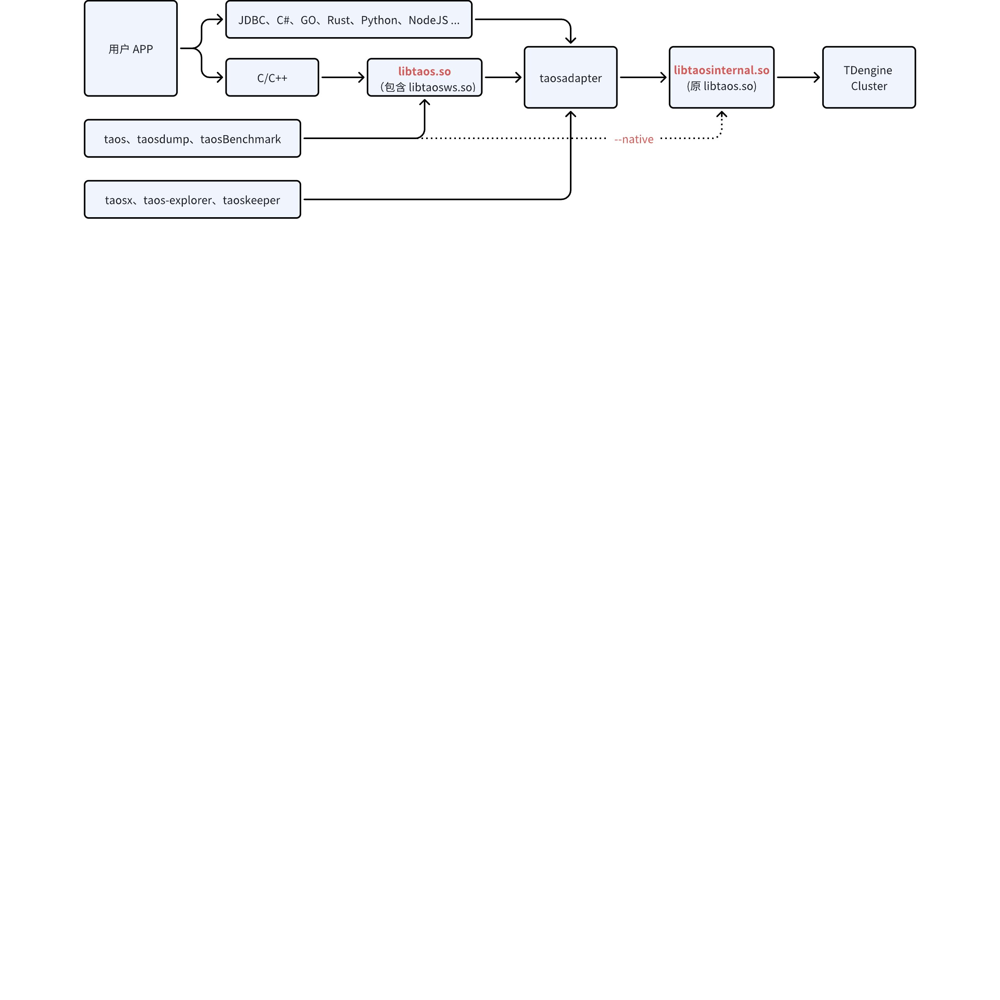

# 已弃用 - 客户端版本兼容性解决方案-不修改端口

## 1. 背景

从 1.x、2.x 到 3.x，libtaos.so 与 taosd 间的兼容性问题一直存在，且饱受诟病。交付团队在生产环境中，普遍采用 WebSocket 协议，以 taosadapter 作为中转去访问 taosd，一定程度上解决了兼容性。但仍然存在如下问题：
1. 很多故障修复和新特性上线都依赖于 libtaos.so 的升级，如果用户 APP 或者 taosadapter 调用的 libtaos.so 不做变化，尽管 taosd 完成升级，客户仍然无法享受到这些改进。
2. libtaos.so 自身某些变动或其与 taosd 间的通信协议变动，都可能导致第三位版本号发生变化，此时尽管 taosd 间的通信协议不变（可滚动升级），但 taosd 还是必须停服。
本文档将版本兼容性解决方案及相关实现、用户侧变更列表于此。

## 2. 变更历史

| 日期 | 版本 | 负责人 | 主要修改内容 |
| --- | --- | --- | --- |
| 2024.11.05 | 0.1 | 霍琳贺 |  |
| 2024.11.07 | 0.2 | 霍琳贺 | Meeting Review ，增加服务发现等 |
|  |  |  |  |
|  |  |  |  |

## 3. 定义

- Native 连接 / 驱动：使用 TDengine 原生客户端，即 libtaos.so、libtaos.dll 进行连接的方式，为原生连接，其中使用的 `libtaos.so` 动态库（不同平台文件名略有不同）及相关 API 称之为 Native 驱动。下文中的 `libtaos.so` 泛指所有平台 Native 驱动。
- WebSocket 连接 / 驱动：使用 TDengine 各语言 WebSocket 连接器，通过 taosAdapter WebSocket 接口连接 TDengine，为 WebSocket 连接。其中 C 语言特有的 libtaosws.so 称之为 WebSocket 驱动。下文中的 `libtaosws.so` 泛指所有平台 WebSocket 驱动。

## 4. 行为说明

### 4.1 部署方式

不再对外发布 Native 驱动，所有连接器的数据访问请求走 taosadapter。连接器包括 C/C++、JAVA 等所有语言。


### 4.2 变更列表

#### 4.2.1 库文件变更

- libtaos.so 重命名为 libtaosinternal.so
- 新增 libtaos.so ，使用 WebSocket 方式提供与 libtaos.so 同名的全部 API。对比现在的原生驱动，taosws API 有少量缺失：
  - 异步接口未实现（`taos_query_a`/`taos_fetch_raw_a` 等）：添加接口并保持一致。
  - 由于兼容性原因，部分结构体大小不一致：修改并保持一致。
  - 部分接口安全性原因，参数个数不一致：添加签名完全一致的接口。
- libtaosws.so 改为 libtaos.so 的软链接
以 Linux 为例，安装后，会在 `/usr/local/taos/driver` 中存放 `libtaos.so` 和 `libtaosinternal.so`，并链接到 `/usr/lib` 目录：
```shell
root@u0-44:/usr/local/taos/driver# ll
-rwxrwxrwx  1 libtaosinternal.so.3.3.4.2*
-rwxrwxrwx  1 libtaos.so.3.3.4.2* 

root@u0-44:/usr/lib# ll libtaos*
lrwxrwxrwx 1 libtaos.so -> /usr/lib/libtaos.so.1*
lrwxrwxrwx 1 libtaos.so.1 -> /usr/local/taos/driver/libtaos.so.3.3.4.2*
lrwxrwxrwx 1 libtaosws.so -> /usr/lib/libtaos.so.1*
lrwxrwxrwx 1 libtaosinternal.so -> /usr/lib/libtaosinternal.so.1*
lrwxrwxrwx 1 libtaosinternal.so.1 -> /usr/local/taos/driver/libtaosinternal.so.3.3.4.2*
```

#### 4.2.2 可执行文件变更

对于可执行文件变更，主要涉及 taosShell/Dump/Benchmark：
`taos`、`taosdump`、`taosBenchmark` 不再显式依赖 libtaos.so和 libtaosws.so，如下：
```shell
root@u0-44:/usr/local/taos/bin# ldd taos
        linux-vdso.so.1 (0x00007ffe76dbf000)
        libtaos.so.1 => /lib/libtaos.so.1 (0x00007f54bc87b000)
        libtaosws.so => /lib/libtaosws.so (0x00007f54bc028000)
        ……
```

新增命令行选项 `-v --native`：
1. 指定 `native` 选项时：动态绑定 `libtaosinternal.so` 通过原生形式访问 TDengine；
   - 未指定 `-P` 端口时，读取 `/etc/taos/taos.cfg` 中的 `serverPort`，如未进行配置，使用 6030 端口；
   - 指定 `-P` 端口时，使用设定的端口。
2. 不指定 `native` 选项时：动态绑定 `libtaos.so` 通过 websocket 访问 TDengine）。
   - 未指定 `-P` 端口时，使用 `6041` 端口；
   - 指定 `-P` 端口时，使用设定的端口。
以 `taos` shell 命令为例，说明如下：
```shell
root@u0-44:/usr/local/taos/bin# taos --help
Usage: taos [OPTION...] 

  -v, --native      Accessing server using native connection, otherwise via websocket.
  -h, --host=HOST   The server FQDN to connect. The default host is localhost.
  ……
```

#### 4.2.3 客户端行为变更

使用原生连接的应用，需要注意的行为方式变更主要有：
1. 用户应用需要使用 6041 端口替代原来的 6030 端口。
2. 对于 `taos_connect(ip,user,pass,db,port)` API ，当 `port` 为 0 时将默认使用 6041 端口。
<callout emoji="bulb" background-color="light-orange" border-color="light-orange">
交付时需要向用户声明客户端内部连接方式的变更，并出具性能测试报告以减少客户的担忧。
</callout>

#### 4.2.4 版本号变更

因为新的客户端和服务端均不兼容旧版本，所以需要更新第三位版本号。同时，这个版本更新也不支持滚动升级。

#### 4.2.5 文档变更

- 运维相关的文档需要修改，以适配接口变更。
- 移除 “原生连接” 定义及相关说明，以 `C/C++ 语言连接器` 替代。
- 社区版添加端口修改说明。
- 添加 `taos` `taosdump` `taosBenchmark` 原生连接与 WebSocket 连接切换选项文档。
<callout emoji="bulb" background-color="light-orange" border-color="light-orange">
对于 6030 端口，我们讨论了另外一个对客户应用无任何影响的方案，将升级和兼容风险控制在交付和开发可控的服务端。此方案未通过讨论，仅记录在此。cc @Tao Jianhui
- 端口变更：
  - TDengine 原端口 6030 不再由 taosd 之间内部使用，taosAdapter 监听此端口，并提供 WebSocket 服务（同时保留 6041 以保持旧的 WebSocket 接口兼容性）。taosAdapter 要读 `/etc/taos/taos.cfg` 中的 `serverPort`来保证用户使用自定义端口时，监听用户自定义端口。
  - Taosd 之间的 6030 端口全部转为使用 6031 ，原有的 `serverPort` 服务端配置项改为 `apiPort`。`taosd` 之间的端口变更是最大的升级风险，新的 TDengine 升级需要交付完成操作并确保新的端口工作正常（涉及防火墙安全策略、firstEp 端口设置等其他问题）。
</callout>

### 4.3 taosAdapter 高可用

为了平行迁移到新的 `libtaos.so` ，taosAdapter 与 taosd 之间建立简单的服务注册机制，以满足现在使用 `taos.cfg` 时 `firstEp/secondEp` 的高可用。

#### 4.3.1 `taosinternal.so` 接口变更

taosAdapter 使用新增接口 `taos_register_adapter`，将可用 IP 及端口发送到 `taosd`，并使用 `taos_list_adapters``()` 获取当前注册的 taosAdapter 列表。服务端检测心跳，当 Adapter 不再存活时，移除该 Adapter 注册信息。
```c
/**
 * Register adapters by instance name and addresses list.
 *
 * @param instance: In format `[{scheme}://]{fqdn}[:{port}]`
 *               Example:
 *                     td1.taosdata.com:6041
 *                     https://td1.taosdata.com:6041
 * @param len: `instance` string length, max 255.
 * @returns int32_t code: error code for internal connection errors to taosd.
 */
int32_t taos_register_adapter(char* instance, int8_t len);

/**
 * List adapters.
 *
 * @returns char** list: adapters list with each element point to an `instance`.
 */
char**  taos_list_adapters();

/**
 * Free the list of adapters.
 */
void    taos_free_adapters(char** list);
```

其中 `instance` 字符串由 taosAdapter 获取配置协议、当前服务器 FQDN、用户自定义端口，拼接得到。当用户不启用 SSL 时，instance 可以简化为 `fqdn:port` 如 `192.168.1.20:6041`，当启用 SSL 时，需显式指定 HTTPS 访问，如`https://192.168.1.20:6041`。
为了允许使用固定的公开地址，或需要指定公开地址的情况，`taosAdapter` 增加一个配置项 `publicAddr`（对应环境变量`TAOS_ADAPTER_PUBLIC_ADDR`），格式为 `[scheme://]ip:port[:port]` 或 `[scheme://]fqdn[:port]`，当配置了此项后，使用该地址作为 `instance` 。
```toml
publicAddr = "192.168.100.11:6041" # 默认不使用该参数
```

~~在 Docker 中使用环境变量将其配置为外部 IP 和端口，如下命令，启动一个 TDengine 实例，将端口 6041 映射为 主机端口 16041，并通过环境变量配置外部访问地址（假设外部 IP 为 ~~`~~192.168.100.11~~`~~）：~~
```bash {wrap}
docker run -d \
  -p 6041:16041 \
  -e TAOS_ADAPTER_PUBLIC_ADDR=http://192.168.100.11:16041 \
  tdengine/tdengine
```

~~将 taosAdapter 发布为域名访问时，可以将外部访问域名配置为 publicAddr:~~
```bash
docker run -d \
  -e TAOS_ADAPTER_PUBLIC_ADDR=https://cluster.example.com:6041 \
  tdengine/tdengine
```

#### 4.3.2 `taosAdapter` WebSocket 接口

在客户端与 taosAdapter 建立连接后，taosAdapter 服务端主动发送服务列表并在连接过程中更新该列表（仅当有变动时）。发送内容为二进制格式：
```c
| 4 bytes | 1 byte          |      1 byte         |     N bytes     | 1 byte | N bytes |
| 'adpt'  | adapters number | the 1st adapter len | instance string | the next adapter |
```

该列表将用于后续新建的连接。

#### 4.3.3 客户端配置

`libtaos.so` 识别 `TAOS_ADAPTER_LIST` 环境变量和 `adapterList` 配置项（配置文件沿用 taos.cfg），获得初始连接的 adapters 列表，可以使用 `host:port` 或 `ip:port` 形式，可以不写端口，默认为 6041。客户端对该列表逐个尝试连接，并在连接后接收到服务列表后，增加服务列表中的地址列表（去重）后作为连接地址池，默认策略为 RoundRobin。
以下是一个示例配置：
```plaintext
adapterList http://192.168.100.11:6041,192.168.100.12:6041
```

### 4.4 连接器

#### 4.4.1 使用原生连接的连接器

对于原来使用原生连接器的应用，需要修改端口为 6041，以配合新的修改。

#### 4.4.2 使用 WebSocket 连接器

无变化。

### 4.5 ~~热更新（不在此次发布中）~~

~~如果新增 libtaos.so 的接口实现有 Bug 或有新增特性，仍然需要更新客户端。这个问题可能通过特殊的 libtaos.so 设计来解决：~~
`~~libtaos.so~~`~~ 设计为实现接口的封装。建立连接时，~~~~检测服务端版本~~~~，如果服务端版本 > 本地客户端版本，则通过连接传输新的驱动到客户端，替换本地驱动，并使用 dlopen/LoadLibrary 方案实现内部驱动的热更新，并在更新完毕后逐步销毁旧连接。这需要良好的接口设计和稳定性测试。~~
~~Taosadapter 使用 native 接口不涉及热更新，与 taosd 同步。~~
~~Ref: ~~[需求说明：热更新机制解决客户端兼容性](https://taosdata.feishu.cn/wiki/Cl9zw5l9jiiC1skj6DtcLt9HnBd)~~，~~[版本兼容方案](https://taosdata.feishu.cn/wiki/MhNTw5n6miMkHYkYMwqc4sUinpd)

### 4.6 测试

通过环境变量 `LD_LIBRARY_PATH` 将 `libtaosinternal.so` 重定向为 `libtaos.so`/libtaos.so.1，保持原有测试框架和行为不变。
示例如下：
```bash
mkdir -p /path/to/test/dir/newlibtaos/
cd /path/to/test/dir/newlibtaos/
ln -sf /path/to/build/lib/libtaosinternal.so.1 libtaos.so.1
ln -sf /path/to/build/lib/libtaosinternal.so.1 libtaos.so
export LD_LIBRARY_PATH=/path/to/test/dir/newlibtaos/

## 5. Run test command as usual

```

## 6. 性能

改造完成后，启动性能基准测试，对于性能下降超过 10% 的写入、查询进行优化。

## 7. 兼容性

- 服务端配置可能需要修改。
- 修改后第一次发布时无法进行滚动升级。

## 8. 运维

- 端口变更和新增无法避免。
- 配置文件变更无法避免。
- 如果使用方案二，客户端与服务端之间的连接端口需要注意。

## 9. 使用场景

- 当 taosc 驱动有问题时，直接更新服务端即可解决。

## 10. 约束和限制

1. 使用方案一，仍然无法接口 HTTP 禁用问题。

## 11. 常见错误和排查

1. 新接口的错误可能与现在的 libtaos.so 的错误码不同，需要新增错误码列表。

## 12. 可观测性

1. 增加 taosAdapter 服务发现后，可以对 taosAdapter 存活数量进行监控。

## 13. 安装和卸载

安装和卸载涉及的工作已经在 4. 行为说明中描述。

## 14. 文档

需要修改官网文档。

## 15. 参考文档

1. [需求说明：热更新机制解决客户端兼容性](https://taosdata.feishu.cn/wiki/Cl9zw5l9jiiC1skj6DtcLt9HnBd)
2. [版本兼容方案](https://taosdata.feishu.cn/wiki/MhNTw5n6miMkHYkYMwqc4sUinpd)
**Note: 用户手册中尽量不出现设计方案或实现相关的内容。**
