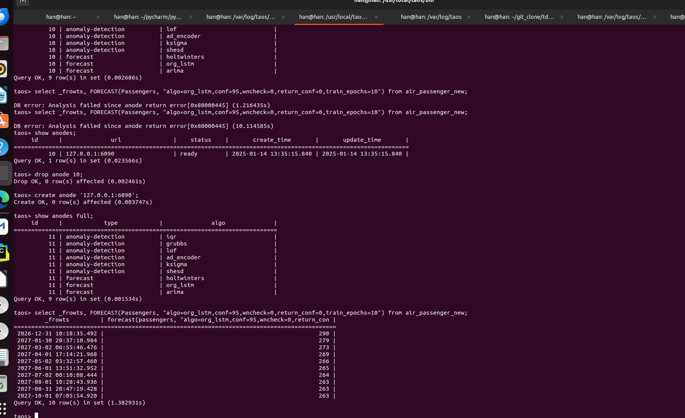
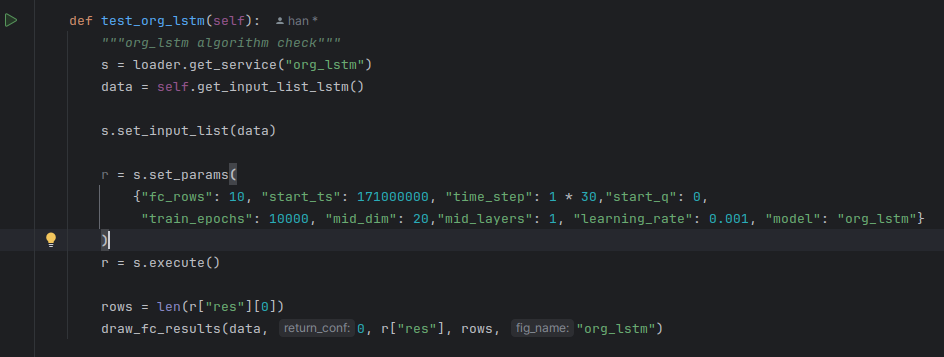
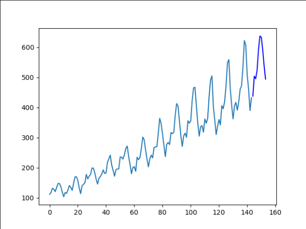

# LSTM

本节讲述LSTM算法模型的使用方法

## 1. 功能概述

LSTM模型即长短期记忆网络(Long Short Term Memory)，是一种特殊的循环神经网络，适用于处理时间序列数据、自然语言处理等任务，通过其独特的门控机制，能够有效捕捉长期依赖关系，解决传统RNN的梯度消失问题，从而对序列数据进行准确预测，不过它不直接提供计算的置信区间范围结果。

## 2. 参数

最终目标是实现用户输入数据，模型自动搜索最优超参数（网格搜索或贝叶斯搜索等），无需用户手动调试参数，暂时依然需要手动确定超参数（以下超参数默认值使模型在面对150个数据点时时表现良好）。

| 参数 | 说明 | 必填项 |
| --- | --- | --- |
| mid_dim | 中间层维度，可以理解为中间层维度越高，模型越有能力去拟合变化复杂的数据，但是需要消耗的计算资源也越大；默认值为40（一般选择10~80）。 | 选填 |
| train_epochs | 训练轮数，可以理解为训练轮数越多，模型对已有数据的拟合越贴近，但是过高的训练轮数会导致训练时间的增长，以及模型过度拟合现有数据；默认值为8000（一般选择1000~18000）。 | 选填 |
| learning_rate | 学习率，理解为模型每次训练后纠正自身的力度，学习率大可以让模型快速找到正确的训练方向，学习率小可以让模型贴合最优的训练方向；默认值为0.001（一般选择0.01~0.001）。 | 选填 |
| mid_layers | LSTM层的层数，层数越多模型越有能力去拟合变化复杂的数据，但是需要消耗的计算资源也越大；默认值为1（一般选择1~3）。 | 选填 |

## 3. 示例及结果

针对Passengers列进行数据预测，对于需要设置置信区间的参数（conf以及return_conf），暂时只需要让其有正常值不报错即可
select _frowts, FORECAST(Passengers,"algo=org_lstm,fc_rows=10,conf=95,wn_check=0,return_conf=0,mid_dim=40,train_epochs=12000,learning_rate=0.001,mid_layers=1") from air_passenger_new;

{
"fc_rows"=fc_rows,   //返回结果行数
"conf"=conf,            //置信区间，不影响模型训练结果，设置95即可，防止报错
"algo"=org_lstm,     //返回结果使用的算法，意为original_lstm，使用原始的lstm网络
}

在单元测试中，使用以下超参数对航班旅客数 数据集进行预测有不错的效果。

## 4. Reference

[1]Hochreiter S. Long Short-term Memory[J]. Neural Computation MIT-Press, 1997.
