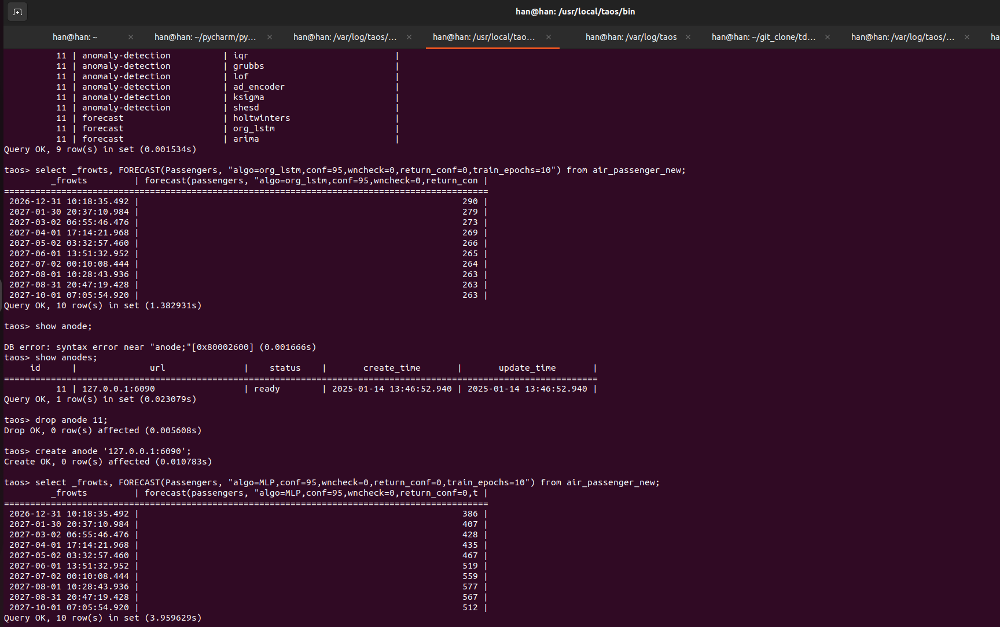
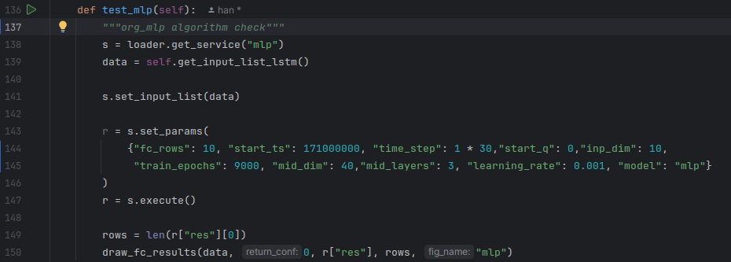
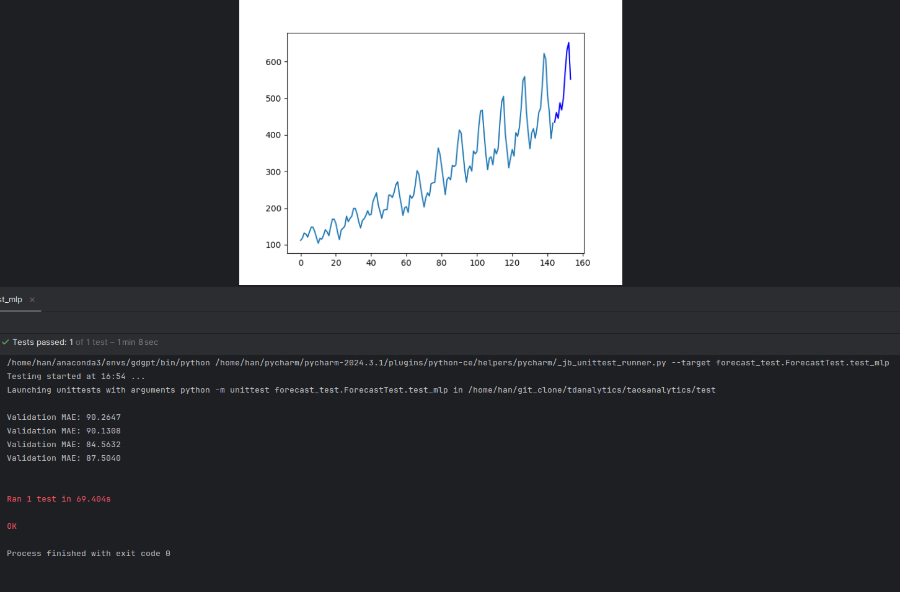

# MLP

本节讲述MLP算法模型的使用方法

## 1. 功能概述

MLP（MutiLayers Perceptron，多层感知机）是一种典的神经网络模型，能够通过学习历史数据的非线性关系，捕捉时间序列中的模式并进行未来值预测。它通过多层全连接网络进行特征提取和映射，对输入的历史数据生成预测结果。由于不直接考虑趋势或季节性变化，通常需要结合数据预处理来提升效果，适合解决非线性和复杂的时间序列问题。

## 2. 参数

最终目标是实现用户输入数据，模型自动搜索最优超参数（网格搜索或贝叶斯搜索等），无需用户手动调试参数，暂时依然需要手动确定超参数（以下超参数默认值使模型在面对150个数据点时时表现良好）。

| 参数 | 说明 | 必填项 |
| --- | --- | --- |
| mid_dim | 中间层神经元个数，可以理解为神经元个数越多，模型越有能力去拟合变化复杂的数据，但是需要消耗的计算资源也越大；默认值为60（一般选择30~80）。 | 选填 |
| train_epochs | 训练轮数，可以理解为训练轮数越多，模型对已有数据的拟合越贴近，但是过高的训练轮数会导致训练时间的增长，以及模型过度拟合现有数据；默认值为8000（一般选择1000~18000）。 | 选填 |
| learning_rate | 学习率，理解为模型每次训练后纠正自身的力度，学习率大可以让模型快速找到正确的训练方向，学习率小可以让模型贴合最优的训练方向；默认值为0.001（一般选择0.01~0.001）。 | 选填 |
| mid_layers | MLP层的层数，必须大于2，层数越多模型越有能力去拟合变化复杂的数据，但是需要消耗的计算资源也越大；默认值为4。 | 选填 |
| inp_dim | 输入的神经元单元数，建议大于需要预测的行数fc_rows；默认值为fc_rows。 | 选填 |

## 3. 示例及结果

针对Passengers列进行数据预测，对于需要设置置信区间的参数（conf以及return_conf），暂时只需要让其有正常值不报错即可
select _frowts, FORECAST(Passengers,"algo=mlp,fc_rows=10,conf=95,wn_check=0,return_conf=0,mid_dim=40,train_epochs=12000,learning_rate=0.001,mid_layers=1") from air_passenger_new;

{
"fc_rows"=fc_rows,   //返回结果行数
"conf"=conf,            //置信区间，不影响模型训练结果，设置95即可，防止报错
"algo"=mlp,             //返回结果使用的算法
}

在单元测试中，使用以下超参数对航班旅客数 数据集进行预测有不错的效果。

## 4. Reference

[1]Rumelhart D E, Hinton G E, Williams R J. Learning representations by back-propagating errors[J]. nature, 1986, 323(6088): 533-536.
[2]Rosenblatt F. The perceptron: a probabilistic model for information storage and organization in the brain[J]. Psychological review, 1958, 65(6): 386.
[3]LeCun Y, Bottou L, Bengio Y, et al. Gradient-based learning applied to document recognition[J]. Proceedings of the IEEE, 1998, 86(11): 2278-2324.
