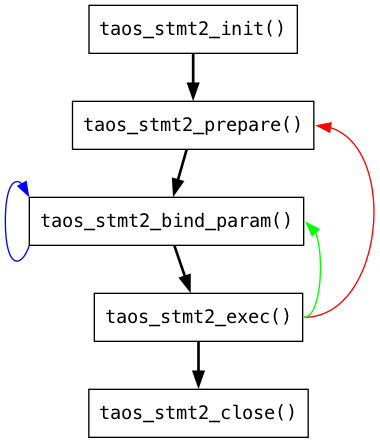

# stmt2 用户手册

## 1. 常见问题总结

1. 参数绑定优势：不需要重复解析 SQL 语句；没有单次写入条数限制；预编译防止sql注入问题
2. 如果stmt2流程中出现了错误，可能会导致整个stmt2不可用，需要close并重新init一个stmt2
3. ~~interlace模式需要将singleStbInsert和singleTableBindOnce设置为true，并且sql只支持~~`~~insert into ? values(?,?)~~`~~，目前不支持自动建表，限制比较多，后续会优化~~
4. stmt2有严格的使用顺序，如果违反顺序会报错


1. 对于sql：`insert into ? values(?,?)`，如果不绑定表名，`taos_stmt2_get_fields`无法返回其fields
2. 高效写入模式会在客户端进行列转行绑定，适用于多表少行写入的场景；非高效模式采用了列模式绑定，适用于少列多行的场景

|  | 列存 | 行存 | 比例 |
| --- | --- | --- | --- |
| tb_num:10000 row_num:100 col_num:100 | stmt2-bind: 44.759164 seconds stmt2-exec: 52.301996 seconds all: 97.083759 seconds | stmt2-bind: 105.100149 seconds stmt2-exec: 37.073974 seconds all: 142.196455 seconds | 1:2.35 1:0.7 1:1.46 |
| tb_num:10000 row_num:10 col_num:1000 | stmt2-bind: 55.165554 seconds stmt2-exec: 105.554896 seconds all: 160.730292 seconds | stmt2-bind: 105.623210 seconds stmt2-exec: 54.380580 seconds all: 160.007919 seconds | 1:1.92 1:0.51 1:1 |
| tb_num:10000 row_num:1 col_num:1000 | stmt2-bind : 22.779358 seconds stmt2-exec: 57.016699 seconds all: 79.797412 seconds | stmt2-bind: 15.738876 seconds stmt2-exec: 2.547036 seconds all: 18.286520 seconds | 1:0.69 1:0.04 1:0.23 |
| tb_num:10000 row_num:1000 col_num:1 | stmt2-bind: 21.694296 seconds stmt2-exec: 42.358962 seconds all: 64.732682 | stmt2-bind: 65.158422 seconds stmt2-exec: 51.644324 seconds all: 117.192321 seconds | 1:3 1:1.21 1:1.81 |
| num:10000 row num:1 col num:10 | stmt2-bind: 61.234944 seconds stmt2-exec: 31.623492 seconds all: 92.865225 seconds | stmt2-bind: 59.255563 seconds stmt2-exec: 19.636488 seconds all : 78.898206 seconds | 1:1 1:0.52 1:0.84 |

1. 如果使用场景不对，stmt2写入性能可能不如sql，例如：
场景：100w表，每表100行，每次写入10000表*1行数据，测试结果

| sql | stmt2 interlace=0 | stmt2 interlace=1 |
| --- | --- | --- |
| 1226.05 seconds | stmt2-bind：434.706672 seconds stmt2-exec：1568.726289 seconds | stmt2-bind：285.96 seconds stmt2-exec：1568.73seconds |

1. 行绑定：当`taos_stmt2_bind_param` 的参数col_idx为-2时，stmt2会使用行的格式进行绑定，该模式只支持非高效写入模式（高效写入必须是行绑定）。除此之外，同一个stmt实例的行绑定和列绑定不能交叉混用，要么都是行，要么都是列绑定（默认参数为-1列绑定）。行绑定适用于多列少行的场景，列数如果超过行数10倍以上的情形，建议使用行绑定或者高效写入模式（见6的表格）
2. 关于绑定信息中出现非ACSII码的情况：如果表名需要解析（形如db.tbname）且包含中文，则中文部分需要添加反引号
3. 参数绑定目前不支持同一个fields的固定值和？混合绑定，tags、cols所有的参数必须都为？或者都为固定值，后续会有改进任务[TD-33625](https://jira.taosdata.com:18080/browse/TD-33625)
4. 关于兼容STMT，taos_stmt2_bind_param可以先绑定tbname，再绑定tag，最后绑定col，但是如果分开绑定fields，只支持TAOS_STMT2_BINDV的count为1，即单个表绑定
5. 单个stmt实例不支持切换interlace和非interlace模式，需要在init的时候指定option，普通表不支持高效写入，尽量不要和超级表高效写入混用，如需切换需要重新init；同理查询语句也不要和超级表写入进行混用

## 2. C结构体参数的含义及约束

### 2.1 TAOS_STMT2_OPTION

结合 stmt2 init函数使用，选择初始化配置stmt
```c
typedef struct TAOS_STMT2_OPTION {
  int64_t           reqid;
  bool              singleStbInsert;
  bool              singleTableBindOnce;
  __taos_async_fn_t asyncExecFn;
  void             *userdata;
} TAOS_STMT2_OPTION;
```

- **reqid**：使用请求 ID 初始化参数绑定实例。
- **singleStbInsert**：是否是向单个超级表插入
- **singleTableBindOnce**：表示每个表执行之前是否只绑定一次
- **asyncExecFn**：表示异步执行的回调函数，需要异步执行的时候需要初始化该参数
  ```c
  typedef void (*__taos_async_fn_t)(void *userdata, TAOS_RES *res, int code);
  ```

  第一个参数是 TAOS_STMT2_OPTION 结构体中的`userdata`
  第二个参数 `res`表示结果集，与函数 taos_stmt2_result 返回值一样，不可使用 taos_free_result 释放
  第三个参数`code`表示异步执行的返回码
- **userdata**：异步执行回调函数的传入参数指针

### 2.2 TAOS_MULTI_BIND（STMT）&& TAOS_STMT2_BIND（STMT2）

结合stmt bind函数使用
```cpp
// stmt绑定参数
typedef struct TAOS_MULTI_BIND {
  int       buffer_type;       
  void     *buffer;         
  uintptr_t buffer_length;   
  int32_t  *length;  
  char     *is_null;        
  int       num;
} TAOS_MULTI_BIND;

// stmt绑定参数，删除了buffer_length，消除了内存空洞，其余都一样
typedef struct TAOS_STMT2_BIND {
  int      buffer_type;
  void    *buffer;
  int32_t *length;
  char    *is_null;
  int      num;
} TAOS_STMT2_BIND;
```

- **buffer_type**：绑定列的数据类型，取值范围0-21。
```c
#define TSDB_DATA_TYPE_NULL       0   // 1 bytes
#define TSDB_DATA_TYPE_BOOL       1   // 1 bytes
#define TSDB_DATA_TYPE_TINYINT    2   // 1 byte
#define TSDB_DATA_TYPE_SMALLINT   3   // 2 bytes
#define TSDB_DATA_TYPE_INT        4   // 4 bytes
#define TSDB_DATA_TYPE_BIGINT     5   // 8 bytes
#define TSDB_DATA_TYPE_FLOAT      6   // 4 bytes
#define TSDB_DATA_TYPE_DOUBLE     7   // 8 bytes
#define TSDB_DATA_TYPE_VARCHAR    8   // string, alias for varchar
#define TSDB_DATA_TYPE_TIMESTAMP  9   // 8 bytes
#define TSDB_DATA_TYPE_NCHAR      10  // unicode string
#define TSDB_DATA_TYPE_UTINYINT   11  // 1 byte
#define TSDB_DATA_TYPE_USMALLINT  12  // 2 bytes
#define TSDB_DATA_TYPE_UINT       13  // 4 bytes
#define TSDB_DATA_TYPE_UBIGINT    14  // 8 bytes
#define TSDB_DATA_TYPE_JSON       15  // json string
#define TSDB_DATA_TYPE_VARBINARY  16  // binary
#define TSDB_DATA_TYPE_DECIMAL    17  // decimal
#define TSDB_DATA_TYPE_BLOB       18  // binary
#define TSDB_DATA_TYPE_MEDIUMBLOB 19
#define TSDB_DATA_TYPE_BINARY     TSDB_DATA_TYPE_VARCHAR  // string
#define TSDB_DATA_TYPE_GEOMETRY   20 // geometry，注意stmt绑定需要是WKB二进制格式的数据，否则会报错
#define TSDB_DATA_TYPE_MAX        21

/*
变长数据类型：
  TSDB_DATA_TYPE_VARCHAR
  TSDB_DATA_TYPE_VARBINARY
  TSDB_DATA_TYPE_NCHAR
  TSDB_DATA_TYPE_JSON
  TSDB_DATA_TYPE_GEOMETRY
其余为定长数据类型
*/
```

- **buffer**：表示要绑定数据的数组，数组长度为行数num
  - STMT：用户需要手动给buffer分配的内存 = `num*buffer_length`
  - STMT2：没有内存空洞，所以null不用分配内存，变长数据只需要分配没有填充的长度，即内存大小为`lengt``h``[0]+lengt``h``[1]+...+lengt``h``[num-1]`
- **buffer_length**：变长结构体会为length中的最大值，定长结构体和length值相同
- **length**：表示第`i`个buffer的长度，数组长度为num，定长类型所有值都相同，变长类型`length[i]`为`buffer[i]`数据的长度。如果第`i`个数据为null，则`lengt``h``[i]=0`
- **is_null**：表示第`i`个buffer是否为null或者none，数组长度为num，其中0 表示 Value1 表示 NULL，2 表示 NONE。具体区别：
  TD-31428

- **num**：绑定的行数

### 2.3 TAOS_STMT2_BINDV

结合stmt bind函数使用，TAOS_STMT2_BIND类型见前文描述
```c
typedef struct TAOS_STMT2_BINDV {
  int               count;
  char            **tbnames;
  TAOS_STMT2_BIND **tags;
  TAOS_STMT2_BIND **bind_cols;
} TAOS_STMT2_BINDV;
```

- **count**：表示要绑定的表的数量
- **tbnames**：表示要绑定表名字符串数组，长度为count。非ascii字符需要用反引号```扩起来
- **tags**：表示要绑定每个表的标签的二维数组[m][n]，其中`m=count`，`n=prepare sql中要绑定标签数量，即‘？’数量`。**注意tags[*]->num=1，因为每个表只能绑定一行tags**
- **bind_cols**：表示要绑定每个表的列的二维数组[m][n]，其中`m=count`，`n=prepare sql中要绑定列数量，即‘？’数量`

### 2.4 TAOS_FIELD_ALL

stmt2 get fields返回的数据，表示每个‘？’对应的详细schema信息
```c
typedef struct TAOS_FIELD_ALL {
  char         name[65];
  int8_t       type;
  uint8_t      precision;
  uint8_t      scale;
  int32_t      bytes;
  uint8_t      field_type;
} TAOS_FIELD_ALL;
```

- **name**：表示查询表schema中的标签或者列名
- **type**：该标签或者列的数据类型，类型值见前文[stmt2 API函数使用说明](https://taosdata.feishu.cn/wiki/HTKHw4Mhpi2aTvkU49gcoTr3nKd)
- **precision**：如果类型是TSDB_DATA_TYPE_TIMESTAMP，则表示时间的精度为：，us 表示微秒，ns 表示纳秒，默认 ms 毫秒（tag和col均适用）。3.3.7更新用于decimal类型[STMT2支持decimal类型写入-FS](https://taosdata.feishu.cn/wiki/P2zFw4469ikfTvk6xRJcfAKinHd)
- **scale**：3.3.7更新用于decimal类型[STMT2支持decimal类型写入-FS](https://taosdata.feishu.cn/wiki/P2zFw4469ikfTvk6xRJcfAKinHd)
- **bytes**：数据类型大小，单位字节
- **field_type**：‘？’的类型，1表示列，2表示标签，3表示查询的谓词，4表示表名

## 3. API函数

### 3.1 taos_stmt2_init

`TAOS_STMT2 *taos_stmt2_init(TAOS *taos, TAOS_STMT2_OPTION *option);`
**接口说明**：用option初始化一个stmt2实例
**参数说明**：
- taos：taos_connect返回的数据库连接
- option：创建配置，见上文详细说明
**返回值**：TAOS_STMT2的一个实例的指针

### 3.2 taos_stmt2_prepare

`int taos_stmt2_prepare(TAOS_STMT2 *stmt, const char *sql, unsigned long length);`
**接口说明**：准备sql，不会进行sql解析（只会解析使用的database）
**参数说明**：
- stmt：stmt实例
- sql：形如insert into db.? using db.stb tags(?, ?) values(?,?)的绑定sql
- length：sql长度，如果为0会自动计算sql长度
**返回值**：如果为0则执行成功，如果非0则查阅taos错误码或者分析errorstr

### 3.3 taos_stmt2_bind_param

`int taos_stmt2_bind_param(TAOS_STMT2 *stmt, TAOS_STMT2_BINDV *bindv, int32_t col_idx);`
**接口说明**：绑定参数，可以绑定多张表，多个标签和m*n的数据
**参数说明**：
- stmt：stmt实例
- bindv：要绑定的表名、标签、数据，见上文详细描述
- col_idx：如果bindv为全列数据，则为-1。也支持一列一列的绑定（但是需要每个‘？’对对应的列都绑定才可以执行，否则报错）。如果该参数为-2，内部会使用行绑定，行绑定的情形见常见问题总结。
**返回值**：如果为0则执行成功，如果非0则查阅taos错误码或者分析errorstr

### 3.4 taos_stmt2_bind_param_a

目前并发问题较多，而且绑定只涉及本地memcpy的耗时操作，不涉及IO或者网络，不建议使用异步绑定。
`int taos_stmt2_bind_param_a(TAOS_STMT2 *stmt, TAOS_STMT2_BINDV *bindv, int32_t col_idx, __taos_async_fn_t fp, void *param);`
**接口说明**：异步执行绑定参数，功能和`taos_stmt2_bind_param`相同
**参数说明**：
- stmt：stmt实例
- bindv：要绑定的表名、标签、数据，见上文详细描述
- col_idx：如果bindv为全列数据，则为-1。也支持一列一列的绑定（但是需要每个‘？’对对应的列都绑定才可以执行，否则报错）
- __taos_async_fn_t：回调函数
  ```c
  typedef void (*__taos_async_fn_t)(void *userdata, TAOS_RES *res, int code);
  ```

  第一个参数是 `taos_stmt2_bind_param_a` 的参数`param`
  第二个参数 `res`表示结果集，与函数 taos_stmt2_result 返回值一样，不可使用 taos_free_result 释放
  第三个参数`code`表示异步执行的返回码
**返回值**：如果为0则执行成功，如果非0则查阅taos错误码或者分析errorstr

### 3.5 taos_stmt2_exec

`int taos_stmt2_exec(TAOS_STMT2 *stmt, int *affected_rows);`
**接口说明**：执行绑定完成数据的sql，可以同步或者异步，由option决定
**参数说明**：
- stmt：stmt实例
- affected_rows：如果是同步执行，则表示插入的行数；异步执行则为0
**返回值**：如果为0则执行成功，如果非0则查阅taos错误码或者分析errorstr

### 3.6 taos_stmt2_close

`int taos_stmt2_close(TAOS_STMT2 *stmt);`
**接口说明**：关闭stmt2，释放资源
**参数说明**：
- stmt：stmt实例
**返回值**：如果为0则执行成功，如果非0则查阅taos错误码或者分析errorstr

### 3.7 taos_stmt2_is_insert

`int taos_stmt2_is_insert(TAOS_STMT2 *stmt, int *insert);`
**接口说明**：判断sql是否为插入语句，会简单解析sql，不会解析schema或者查找表的元数据
**参数说明**：
- stmt：stmt实例
- insert：如果insert为1则说明sql是插入语句，为0则反之
**返回值**：如果为0则执行成功，如果非0则查阅taos错误码或者分析errorstr

### 3.8 taos_stmt2_get_fields

`int  taos_stmt2_get_fields(TAOS_STMT2 *stmt, int *count, TAOS_FIELD_ALL **fields);`
**接口说明**：获取‘？’顺序对应的数组，每个元素表示‘？’的详细schema，不支持无表名的sql，至少绑定过表名，或者把超级表/普通表/子表名写死在sql里
**参数说明**：
- stmt：stmt实例
- count：返回sql中`？`的数量
- fields：返回‘？’信息顺序对应的指针数组，数组长度为count，当sql不是insert的时候，该参数返回NULL，其他详细信息参看上文`TAOS_FIELD_ALL`结构体介绍
**返回值**：如果为0则执行成功，如果非0则查阅taos错误码或者分析errorstr

### 3.9 taos_stmt2_free_fields

`void taos_stmt2_free_fields(TAOS_STMT2 *stmt, TAOS_FIELD_ALL *fields);`
**接口说明**：释放`TAOS_FIELD_ALL`返回值的内存，一般用于`taos_stmt2_get_fields`之后
**参数说明**：
- stmt：stmt实例
- fields：要释放内存的指针
**返回值**：空

### 3.10 taos_stmt2_result

`TAOS_RES *taos_stmt2_result(TAOS_STMT2 *stmt);`
**接口说明**：返回 TAOS_RES 句柄，供查询使用，不可使用 taos_free_result 释放
**参数说明**：
- stmt：stmt实例
**返回值**：查询sql返回的结果，使用同taosquey

### 3.11 taos_stmt2_error

`char *taos_stmt2_error(TAOS_STMT2 *stmt);`
**接口说明**：返回字符串类型的错误信息
**参数说明**：
- stmt：stmt实例
**返回值**：错误信息的字符串

## 4. 使用用例

下面是一个典型的使用流程，其他更多用例可以参考单元测试：TDengine/source/client/test/stmt2Test.cpp
```c
void do_query(TAOS* taos, const char* sql) {
  TAOS_RES* result = taos_query(taos, sql);
  // printf("sql: %s\n", sql);
  int code = taos_errno(result);
  while (code == TSDB_CODE_MND_DB_IN_CREATING || code == TSDB_CODE_MND_DB_IN_DROPPING) {
    taosMsleep(2000);
    result = taos_query(taos, sql);
    code = taos_errno(result);
  }
  if (code != TSDB_CODE_SUCCESS) {
    printf("query failen  sql : %s\n  errstr : %s\n", sql, taos_errstr(result));
    ASSERT_EQ(taos_errno(result), TSDB_CODE_SUCCESS);
  }
  taos_free_result(result);
}

void checkError(TAOS_STMT2* stmt, int code) {
  if (code != TSDB_CODE_SUCCESS) {
    STscStmt2* pStmt = (STscStmt2*)stmt;
    if (pStmt == nullptr || pStmt->sql.sqlStr == nullptr || pStmt->exec.pRequest == nullptr) {
      printf("stmt api error\n  stats : %d\n  errstr : %s\n", pStmt->sql.status, taos_stmt_errstr(stmt));
    } else {
      printf("stmt api error\n  sql : %s\n  stats : %d\n  errstr : %s\n", pStmt->sql.sqlStr, pStmt->sql.status,
             taos_stmt_errstr(stmt));
    }
    ASSERT_EQ(code, TSDB_CODE_SUCCESS);
  }
}

void do_stmt(TAOS* taos, TAOS_STMT2_OPTION* option, const char* sql, int CTB_NUMS, int ROW_NUMS, int CYC_NUMS,
              bool createTable) {
  printf("test sql : %s\n", sql);
  do_query(taos, "drop database if exists stmt2_testdb_1");
  do_query(taos, "create database IF NOT EXISTS stmt2_testdb_1");
  do_query(taos, "create stable stmt2_testdb_1.stb (ts timestamp, b binary(10)) tags(t1 int, t2 binary(10))");

  TAOS_STMT2* stmt = taos_stmt2_init(taos, option);
  ASSERT_NE(stmt, nullptr);
  int code = taos_stmt2_prepare(stmt, sql, 0);
  checkError(stmt, code);
  int total_affected = 0;

  // tbname
  char** tbs = (char**)taosMemoryMalloc(CTB_NUMS * sizeof(char*));
  for (int i = 0; i < CTB_NUMS; i++) {
    tbs[i] = (char*)taosMemoryMalloc(sizeof(char) * 20);
    sprintf(tbs[i], "ctb_%d", i);
    if (createTable) {
      char* tmp = (char*)taosMemoryMalloc(sizeof(char) * 100);
      sprintf(tmp, "create table stmt2_testdb_1.%s using stmt2_testdb_1.stb tags(0, 'after')", tbs[i]);
      do_query(taos, tmp);
    }
  }
  for (int r = 0; r < CYC_NUMS; r++) {
    // col params
    int64_t** ts = (int64_t**)taosMemoryMalloc(CTB_NUMS * sizeof(int64_t*));
    char**    b = (char**)taosMemoryMalloc(CTB_NUMS * sizeof(char*));
    int*      ts_len = (int*)taosMemoryMalloc(ROW_NUMS * sizeof(int));
    int*      b_len = (int*)taosMemoryMalloc(ROW_NUMS * sizeof(int));
    for (int i = 0; i < ROW_NUMS; i++) {
      ts_len[i] = sizeof(int64_t);
      b_len[i] = 1;
    }
    for (int i = 0; i < CTB_NUMS; i++) {
      ts[i] = (int64_t*)taosMemoryMalloc(ROW_NUMS * sizeof(int64_t));
      b[i] = (char*)taosMemoryMalloc(ROW_NUMS * sizeof(char));
      for (int j = 0; j < ROW_NUMS; j++) {
        ts[i][j] = 1591060628000 + r * 100000 + j;
        b[i][j] = 'a' + j;
      }
    }
    // tag params
    int t1 = 0;
    int t1len = sizeof(int);
    int t2len = 3;
    //   TAOS_STMT2_BIND* tagv[2] = {&tags[0][0], &tags[1][0]};

    // bind params
    TAOS_STMT2_BIND** paramv = (TAOS_STMT2_BIND**)taosMemoryMalloc(CTB_NUMS * sizeof(TAOS_STMT2_BIND*));
    TAOS_STMT2_BIND** tags = (TAOS_STMT2_BIND**)taosMemoryMalloc(CTB_NUMS * sizeof(TAOS_STMT2_BIND*));
    for (int i = 0; i < CTB_NUMS; i++) {
      // create tags
      tags[i] = (TAOS_STMT2_BIND*)taosMemoryMalloc(2 * sizeof(TAOS_STMT2_BIND));
      tags[i][0] = {TSDB_DATA_TYPE_INT, &t1, &t1len, NULL, 0};
      tags[i][1] = {TSDB_DATA_TYPE_BINARY, (void*)"after", &t2len, NULL, 0};
    }

    for (int i = 0; i < CTB_NUMS; i++) {
      // create col params
      paramv[i] = (TAOS_STMT2_BIND*)taosMemoryMalloc(2 * sizeof(TAOS_STMT2_BIND));
      paramv[i][0] = {TSDB_DATA_TYPE_TIMESTAMP, &ts[i][0], &ts_len[0], NULL, ROW_NUMS};
      paramv[i][1] = {TSDB_DATA_TYPE_BINARY, &b[i][0], &b_len[0], NULL, ROW_NUMS};
    }
    // bind
    TAOS_STMT2_BINDV bindv = {CTB_NUMS, tbs, tags, paramv};
    code = taos_stmt2_bind_param(stmt, &bindv, -1);
    checkError(stmt, code);

    // exec
    int affected = 0;
    code = taos_stmt2_exec(stmt, &affected);
    if (option->asyncExecFn == NULL) {
      total_affected += affected;
    } else {
      AsyncArgs* params = (AsyncArgs*)option->userdata;
      code = tsem_wait(&params->sem);
      ASSERT_EQ(code, TSDB_CODE_SUCCESS);
      total_affected += params->async_affected_rows;
    }
    checkError(stmt, code);

    for (int i = 0; i < CTB_NUMS; i++) {
      taosMemoryFree(tags[i]);
      taosMemoryFree(paramv[i]);
      taosMemoryFree(ts[i]);
      taosMemoryFree(b[i]);
    }
    taosMemoryFree(ts);
    taosMemoryFree(b);
    taosMemoryFree(ts_len);
    taosMemoryFree(b_len);
    taosMemoryFree(paramv);
    taosMemoryFree(tags);
  }
  ASSERT_EQ(total_affected, CYC_NUMS * ROW_NUMS * CTB_NUMS);
  for (int i = 0; i < CTB_NUMS; i++) {
    taosMemoryFree(tbs[i]);
  }
  taosMemoryFree(tbs);

  taos_stmt2_close(stmt);
}

}  // namespace

int main(int argc, char** argv) {
  TAOS* taos = taos_connect("localhost", "root", "taosdata", "", 0);
  ASSERT_NE(taos, nullptr);
  // normal
  TAOS_STMT2_OPTION option = {0, true, true, NULL, NULL};
  do_stmt(taos, &option, "insert into `stmt2_testdb_1`.`stb` (tbname,ts,b,t1,t2) values(?,?,?,?,?)", 3, 3, 3, true);
}

```
