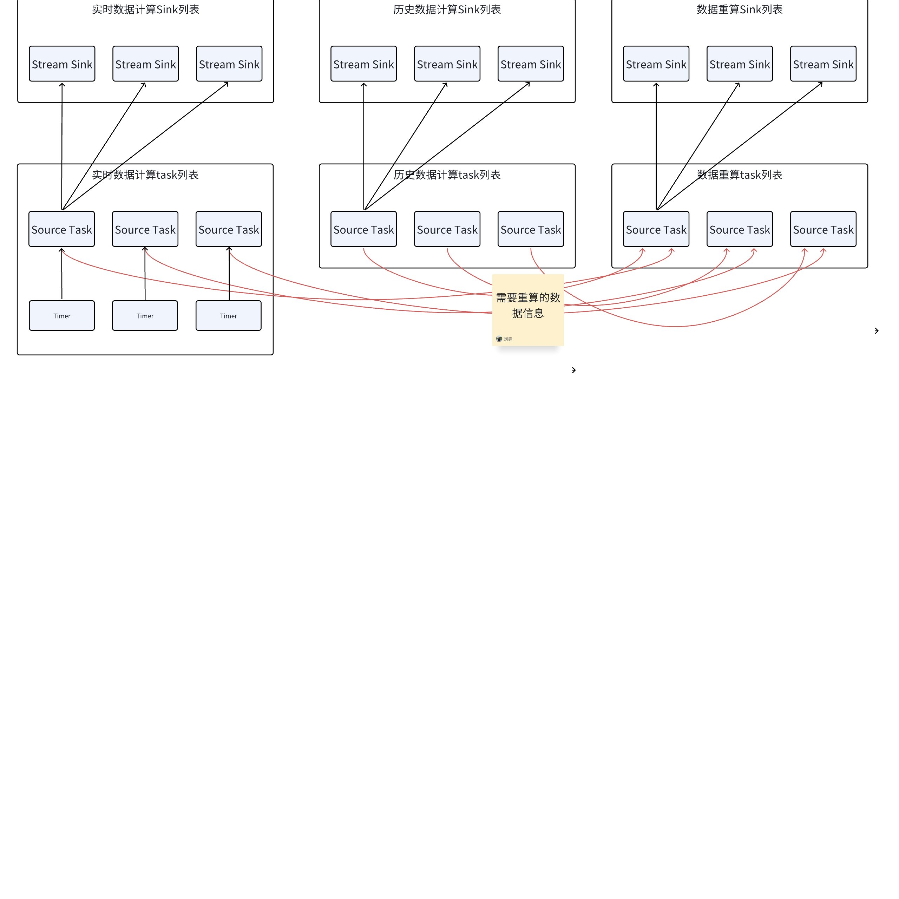
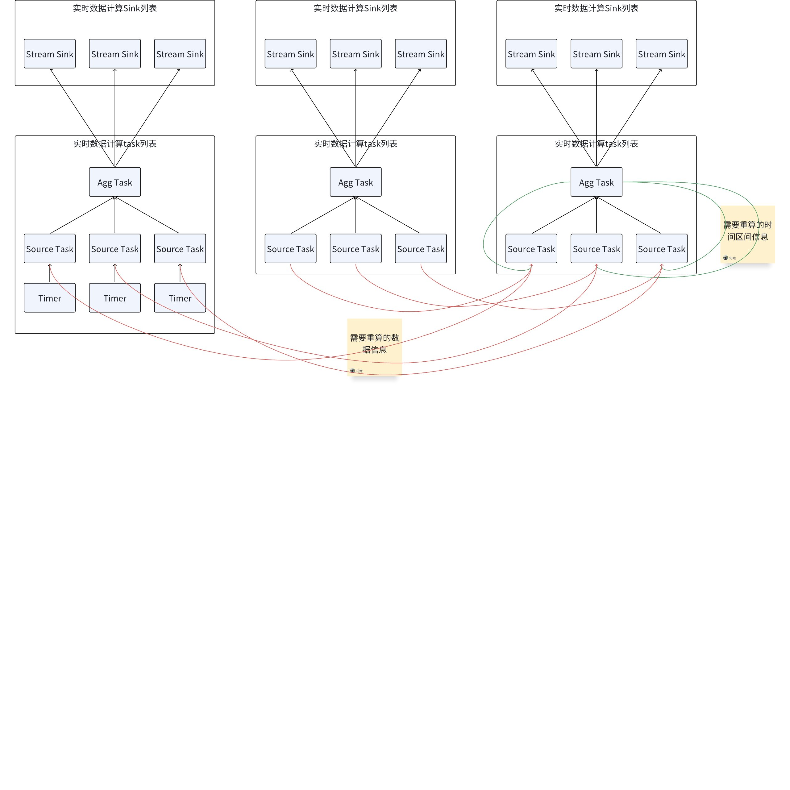

# 流计算 Interval 计算资源优化 DS

## 1. 背景

JIRA：[TS-5468](https://jira.taosdata.com:18080/browse/TS-5468)
FS：[TS-5468 [产品] 流计算计算资源优化 FS](https://taosdata.feishu.cn/wiki/OY6KwIiFhi37HqkH70RcnC12ngg)
按上次会议结论，先做 interval 窗口的设计，做完 interval 再做其他，并且不强制要求在窗口关闭时才做计算。

## 2. 变更历史

| 日期 | 版本 | 负责人 | 主要修改内容 |
| --- | --- | --- | --- |
| 2024/11/21 | 0.1 | 刘垚 | 初稿 |
| 2025/02/11 | 0.2 | 刘垚 | 添加 session、state、event、count、fill 重算的相关设计 |

## 3. 整体计算流程

1. 增加新模式，兼顾子表之间的时间不对齐的场景，不影响 FORCE_WINDOW_CLOSE 原有的功能。基于事件时间，周期性的做计算。
  ```sql
  stream_options: {
   TRIGGER        [AT_ONCE | WINDOW_CLOSE | MAX_DELAY time | FORCE_WINDOW_CLOSE |
                   CONTINUOUS_WINDOW_CLOSE time_val [recalculate rec_time_val] ]
   WATERMARK      time
   IGNORE EXPIRED [0|1]
   DELETE_MARK    time
   FILL_HISTORY   [0|1]
   IGNORE UPDATE  [0|1]
  }
  ```

   - time_val 是实时数据计算的时间间隔，如果本次计算的时间超过了 time_val，则直接开启下一次，有 interval 时，time_val 必须大于等于 interval 的时间
   - rec_time_val 是自动重算的时间间隔，必须大于等于 10 分钟
1. 物理执行计划的 task 之间的数据流向图如下。每个 task 都是单线程的，并且只在有任务时唤醒。历史数据计算、数据重算均不会阻碍实时数据计算。
   - 有 partition by tbname 时，重算数据信息会在同一个 Vnode 内的 Source task 之间传送，数据流向图如下：
  

   - 无 partition by tbname 时，重算数据信息会在同一个 Vnode 内的 Source task 之间传送，数据流向图如下：
  

## 4. 实时数据计算

### 4.1 主要计算流程

每个 VNode 记录自己的读取的 WAL 的进度信息。
1. 扫描 WAL 数据。将 WAL 数据转为 DataBlock，再进行后续计算，每次处理一批数据
2. 聚合运算
   - 有 partition by tbname 的，各个 source task 计算完毕后，输出结果，每个 partition 只缓存最后一个窗口的状态
   - 无 partition by tbname 的计算过程
      - 各个 source task 完成聚合后，输出结果并发送给 agg task；没有结果的 source task，也会输出一个特殊的 block
      - agg task 收到结果后，做最终的聚合。agg task 收到全部孩子的结果后，以本次收到的时间戳最小窗口的作为边界，清理之前的窗口状态。agg task 缓存窗口状态的数量，取决于子表之间数据不对齐的程度
3. 分析 wal 信息，以子表为单位，将乱序、删除信息发送给重算 task
   - 有 partition by tbname，各个 source task 将重算数据信息直接发送给同一个 vnode 的负责重算的 source task
   - 无 partition by tbname，各个 source task 将重算数据信息发送给 Agg task，Agg task 汇总合并后，发送给负责重算的 Agg task

### 4.2 Checkpoint

1. Scan 算子需要将各个子表的进度信息生成 CK
2. Interval 相关算子需要将缓存的窗口状态生成 CK

## 5. 历史数据计算

### 5.1 主要计算流程

1. 扫描 tsdb 数据，数据按 duration 顺序读取，读完一个duration，读下一个
2. 聚合运算，不保存窗口状态
   - 有 partition by tbname 的， 每个分区每当生成一个新的窗口，就输出之前的窗口，每个分区只缓存一个窗口
   - 无 partition by tbname 的，每个分区会临时缓存多个窗口，收到全部孩子的数据后，以全部孩子的最大时间戳中的最小时间戳为界线，清除该时间戳之前的缓存，并输出该时间戳之前的结果。
3. 扫描时间戳属于历史数据的 WAL，判断是否需要重算，如果需要重算，会记录重算信息，后续统一在数据重算时进行重算。
4. 关闭全部task释放资源。

### 5.2 Checkpoint

计算完毕后，生成 CK，用来标记历史数据已经计算完毕。

## 6. 数据重算

### 6.1 主要计算流程

每次等待 rec_time_val 长时间，开始重算，如果上次重算的时间超过 rec_time_val ，直接开始下一次重算。
1. 接收一批乱序、删除数据的信息、手动重算的信息
   - 有 partition by tbname，由 source task 接收。
   - 无 partition by tbname，由 agg task 接收。
2. 将乱序、删除数据转换为时间区间
   - interval 窗口，对于乱序数据可以直接计算出需要删除的窗口；对于删除，目前给出了删除区间，也可以计算出需要删除的窗口
   - 非 interval 窗口，需要通过 client 访问流的结果表，获取窗口信息，本次不涉及，所以不详细描述
3. 优化重算区间，优化规则见下述
4. 扫描 tsdb 并计算结果，扫描方式：按 uid 和时间区间，进行单表扫描
5. 聚合运算，输出结果，这里不存储窗口状态信息

### 6.2 优化重算区间

对于 interval 可以直接计算出需要重算的窗口；对于其他窗口，需要通过新增的 Client 模块从流的结果表中，查询需要重算的窗口信息。

#### 6.2.1 合并重算区间的规则：

1. 有 Partition tbname 的，按时间和 uid 来合并区间
2. 无 artition tbname 的，按时间来合并
3. 手动重算的区间信息与自动重算合并后，标记为手动重算

#### 6.2.2 流计算算子通过 Client 模块获取重算结果列表（session、state、event、count）

流算子将全部重算区间信息分批传给 Client 模块，流算子传递完全部重算区间信息后，再从 Client 模块获取重算结果列表，然后重算窗口结果。流结果表如果没有 _wend、groupid，那么建流时自动添加。
1. 流算子传递全部的重算区间信息给 Client 模块，给每个区间信息都包括：起始时间、结束时间、group Id。count window 的结束时间是 INT64_MAX，其他窗口是实际时间戳。
2. Client 模块将多个重算区间信息转换为一个或多个查询请求，从流的计算结果表中找到全部与重算区间有交集的计算结果。有交集，是指，计算结果的 group id 等于重算区间的 group id 相同，并且计算结果的窗口部分或者全部落在重算区间内。
  交集举例：
  对于重算区间 [2025-02-11 10:02:08.000, 2025-02-11 10:02:48.000, 12345678]。计算结果 [2025-02-11 10:01:08.000, 2025-02-11 10:02:18.000, 12345678] 与该重算区间有交集，group id 相同，窗口的后半部分落在重算区间内。计算结果 [2025-02-11 10:01:08.000, 2025-02-11 10:02:18.000, 00000] 没有交集，group id 不同。
1. Client 模块以 SSDataBlock 形式返回结果信息，结果信息包括窗口起始时间、窗口结束时间、group Id。流计算算子按上述区间合并规则合并计算结果的窗口区间，然后读取 tsdb，重算窗口。

#### 6.2.3 流计算 Fill 算子通过 Client 模块获取结果列表

流算子将当前计算结果的信息分批传给 Client 模块，每传一批，就从 Client 模块获取重算结果列表。计算结果信息包括：时间戳、group id。需要 Client 模块从流计算结果表中，找到计算结果的相邻结果。在建流时，自动在流计算结果表中添加一列，标记是否是填充结果。
1. Client 模块需要提供三种模式
   - Fill Prev，找到当前计算结果前面的非填充的结果，如果没有，不返回。（语义同批查询）
   - Fill Next，找到当前计算结果后面的非填充的结果，如果没有，不返回。（语义同批查询）
   - Fill Linear，找到当前计算结果前面和后面的非填充的结果，如果没有，不返回。（语义同批查询）
2. Client 以 SSDataBlock 形式返回结果信息，SSDataBlock 前两列是当前计算结果的时间戳、group id，后面的列是相邻结果的全部列。SSDataBlock 按前两列升序排列
3. 流计算Fill算子进行空缺结果的填充

#### 6.2.4 流计算count算子重算

框架不创建重算 task，所有计算都在 stream task 中进行。由stream task做周期性的重算，达到重算周期，框架会通知stream task，stream task停止增量计算，开始重算；未进行重算时，不管有没有删除、修改数据等，stream task都会继续做增量计算。

### 6.3 checkpoint

Scan 算子需要将还没重算的区间信息生成 CK，最近重算过的区间信息生成 CK
