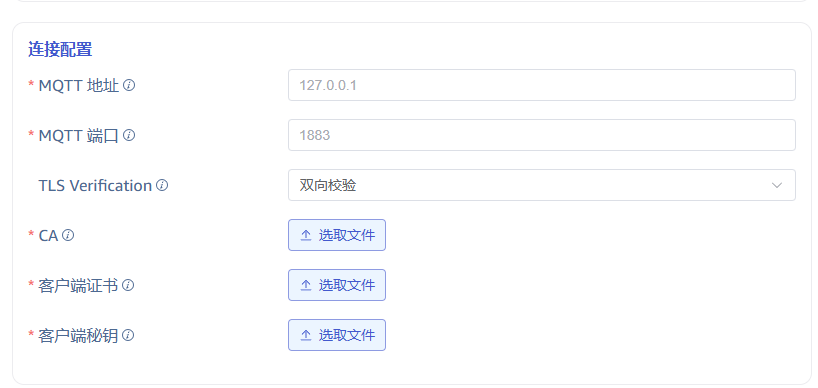

# FS - MQTT TLS 认证

## 1. 背景

TS-6064

当前 MQTT TLS 认证的问题：
1. 开启 SSL 选项后，不会进行证书校验，仅进行 TLS 加密连接
2. 应客户要求，需要在不提供证书的情况下，自动尝试 TLS 加密连接，但不校验证书

## 2. 变更历史

注：版本变更规则，初始版本为 0.1，中间若经过几次较大修改要增加版本号为 0.2， 0.3，最后定稿时的版本号为 1.0，以下为示例

| 日期 | 版本 | 负责人 | 主要修改内容 |
| --- | --- | --- | --- |
| 2025/03/12 | 0.1 | @闫宇星 |  |

## 3. 定义

无

## 4. 行为说明

在旧版本中，开启 SSL 选项后，需要上传三个证书，且都为必填项。

在新版本中，在连接配置中设置 TLS 验证，分为以下几种情况：
1. 不校验，则无需上传证书
2. 单向校验：需要上传 CA 证书，客户端会校验服务端证书（单向认证+加密）
3. 双向校验：三个证书都上传，表示开启 TLS 加密连接，此时客户端和服务端会校验对方证书（双向认证+加密）
客户端证书和密钥必须同时上传，否则按照第二种情况进行认证

## 5. 性能

无

## 6. 兼容性

由于旧版本不会进行证书校验，所以上传证书后，即使 CA 与服务端不对应也会进行成功连接，这样的任务在新版本中会连接失败，只要在配置中去掉上传的证书文件即可恢复

## 7. 运维

无

## 8. 使用场景

无

## 9. 约束和限制

无

## 10. 常见错误和排查

无

## 11. 可观测性

无

## 12. 安装和卸载

无

## 13. 文档

无

## 14. 参考文档

## 15. 附录

无
