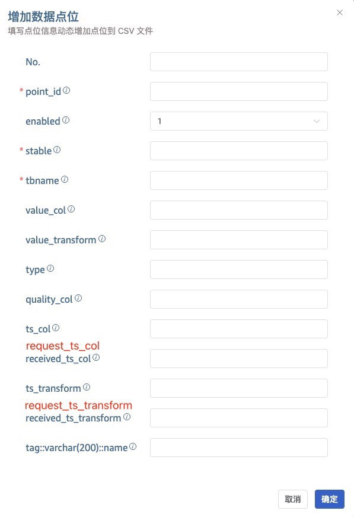
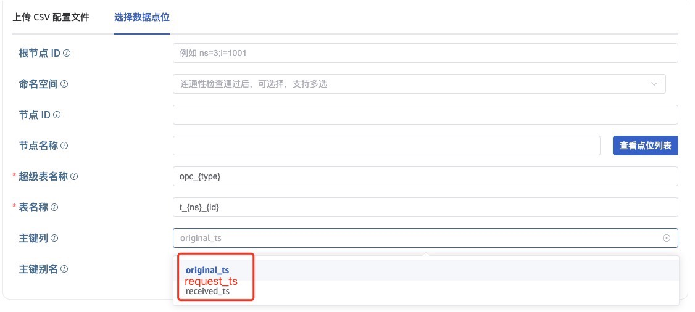

# OPC支持{id}通配符和轮询开始时间戳 - FS

## 1. 背景

客户在使用 taosX 接入 OPC DA 数据源时，提出了以下需求：
1. 支持配置完整的采集点路径。例如：Kepware 的点位通常为 `/ASSETS/AB/EDCGQ.MP706AT.PV` 这种形式，`{tag_name}`只能匹配`PV`。用户想匹配整个点位路径。
2. 对于使用 Observe 模式的 OPC DA 任务，希望上报轮询的开始时间，做 ts 主键。
相关的JIRA：

TS-5785

TS-5728

## 2. 变更历史

| **日期** | **版本** | **负责人** | **主要修改内容** |
| --- | --- | --- | --- |
| 2025/03/06 | v0.1 | @杨志宇 | 初稿 |
|  |  |  |  |

## 3. 定义

- **OPC DA 节点**：在 **OPC DA**（Data Access）规范中，并没有直接使用 “节点（Node）” 这一术语，而是通过 **标签（Item）** 和 **层次结构 **来组织数据。
- **数据项（Item）**：对应一个具体的数据采集点位。如： `PLC1.TemperatureSensor.Value`。
- **层次结构**：通过服务器（Server）、组（Group）和项（Item）的层级关系间接形成类似 “节点” 的逻辑结构。如：`/ASSETS/AB/EDCGQ`
- **OPC 任务的采集模式**：OPC UA 支持两种采集模式：Observe（轮询） 和 Subscribe（订阅）；OPC DA 只支持一种采集模式：Observe（轮询）。
- **Observe 模式**：taosx-opc 轮询的请求 OPC Server 获取点位的值。
- **Subscribe 模式**：taosx-opc 订阅 OPC 点位的变更，在变更发生时，OPC Server 向 taosx-opc 推送数据的值。
- original_ts：点位在 OPC server 中的原始时间戳。
- **request_ts**：轮询开始的时间戳，即 taosx-opc 发起查询的时间戳。subscribe 模式下，request_ts 和 received_ts 的值相同。
- **received_ts**：轮询结束的时间戳，即 OPC Server 返回的时间戳。
- **ts**：OPC 点位的采集时间戳。

## 4. 行为说明

### 4.1 OPC DA 支持 {id} 等多种通配符

在 tbname 内可以包含以下通配符：
1. {tag_name}：匹配 tag_name 中最后一个`.`之后的字符，为了兼容旧版本，其实和下面的规则2一致，是{.tag_name} 的简写。
2. {/tag_name}：匹配 tag_name 中最后一个`/`之后的字符，字符中的`.`会被`_`下划线替换。
3. {id}：匹配 tag_name 中所有字符，字符`.`会被`_`下划线替换。
4. {_id}：匹配 tag_name 中所有字符，字符`.`和`/`会被`_`下划线替换。
举例说明：

| **tag_name** | **tbname** | **对应 TDengine 中的子表名** |
| --- | --- | --- |
| /ASSETS/AB/EDCGQ.MP706AT.PV | t_{tag_name} | t_PV |
| /ASSETS/AB.CD/EDCGQ | t_{tag_name} | t_CD/EDCGQ |
| /ASSETS/AB/EDCGQ | t_{tag_name} | t_/ASSETS/AB/EDCGQ |
| /ASSETS/AB/EDCGQ.MP706AT.PV | t_{/tag_name} | t_EDCGQ_MP706AT_PV |
| /ASSETS/AB/EDCGQ.MP706AT.PV | t_{id} | t_/ASSETS/AB/EDCGQ_MP706AT_PV |
| /ASSETS/AB/EDCGQ.MP706AT.PV | t{_id} | t_ASSETS_AB_EDCGQ_MP706AT_PV |
| 02_LI7059.DACA.PV | t_{tag_name} | t_PV |
| 02_LI7059.DACA.PV | t_{/tag_name} | t_02_LI7059_DACA_PV |
| 02_LI7059.DACA.PV | t_{id} | t_02_LI7059_DACA_PV |
| 02_LI7059.DACA.PV | t_{_id} | t_02_LI7059_DACA_PV |

### 4.2 OPC 支持 reques_ts 时间列

#### 4.2.1 taosx-opc 上报 request_ts_col

无论 OPC UA 和 OPC DA，taosx-opc 都会上报 request_ts。arrow 格式的 RecordBatch 中包含`request`列。新的 schema 如下：

| **序号** | **名称** | **类型** | **说明** |
| --- | --- | --- | --- |
| 1 | id | Utf8 | 节点 ID |
| 2 | name | Utf8 | 节点名称 |
| 3 | ts | Timestamp(Millisecond, None) | OPC 采集时间戳 |
| 4 | received | Timestamp(Millisecond, None) | 请求接受的时间戳 |
| 5 | value | Float64/ Int 等 | OPC 点位的值 |
| 6 | status | Int64 | OPC 点位的 quality |
| 7 | request | Timestamp(Millisecond, None) | 请求发起的时间戳 |

#### 4.2.2 CSV 配置文件

CSV 配置文件中，每个 OPC 点位的采集值对应 3 个时间戳，以及 3 个时间戳的变换表达式。如下：

| **第 N 列** | **列名** | **描述** | **是否必填** | **默认值** |
| --- | --- | --- | --- | --- |
| 10 | ts_col | ts 在 TDengine 中对应的时间戳列，也表示 OPC server 的原始时间戳(original_ts) | 否 | ts |
| 11 | ts_transform | ts 要做的变换表达式 | 否 | 无 |
| 12 | request_ts_col | request_ts 在 TDengine 中对应的时间戳列 | 否 | qts |
| 13 | request_ts_transform | request_ts 要做的变换表达式 | 否 | 无 |
| 14 | received_ts_col | received_ts 在 TDengine 中对应的时间戳列 | 否 | rts |
| 15 | received_ts_transform | received_ts 要做的变换表达式 | 否 | 无 |

#### 4.2.3 CSV 的时间戳的主键规则

使用 CSV 文件配置点位时， 主键规则如下：
1. ts_col，request_ts，received_ts 这 3 列，在CSV 的表头中至少有一列存在。
2. ts_col，request_ts，received_ts 这 3 列，当有 2 列以上存在时，以最左侧的列作为 TDengine 中的时间戳列(首列)。
CSV 的合法性检查，应该按照上面的新规则进行检查。

#### 4.2.4 CSV 模版中增加 request_ts

点击“CSV 空模版”或“下载数据点位”，生成的 CSV 示例中，添加  request_ts_col 和 request_ts_transform 两列。request_ts_col 默认值为：qts，request_ts_transform 默认为空。
下面是一个示例：

| **point_id** | **ts_col** | **ts_transform** | **request_ts_col** | **request_ts_transform** | **received_ts_col** | **received_ts_transform** |
| --- | --- | --- | --- | --- | --- | --- |
| ns=2;s=HHFK.ADY.GY.ADY2R_CKSF | ts | ts / 1000 * 100 | qts | qts / 1000 * 100 | rts | rts / 1000 * 100 |
| ns=2;s=HHFK.ADY.GY.ADY2R_CKWD | ts | ts / 1000 * 100 | qts | qts / 1000 * 100 | rts | rts / 1000 * 100 |

#### 4.2.5 增加数据点位

“增加数据点位”的表单里，需要添加 2 列：request_ts_col 和 request_ts_transform。

#### 4.2.6 “选择数据点位”的主键列支持 request_ts

“选择数据点位”中，主键列增加一个选项：request_ts。

## 5. 性能

无

## 6. 兼容性

### 6.1 OPC DA 支持 {id} 通配符

| taosx 版本 | 是否包含 {id} 通配符 | 兼容性说明 |
| --- | --- | --- |
| < 3.3.6.0 | 否 | 旧版本的旧任务，不含 {id} 通配符，正常运行 |
| >= 3.3.6.0 | 否 | 新版本的旧任务，不含 {id} 通配符，正常运行 |
| >= 3.3.6.0 | 是 | 新版本的新任务，含 {id} 通配符，正常运行 |

### 6.2 OPC 支持 request_ts 时间列

| taosx 版本 | 是否包含配置 request_ts | taosx-agent 版本 | 兼容性说明 |
| --- | --- | --- | --- |
| < 3.3.6.0 | No | < 3.3.6.0 | 旧版本不支持 request_ts |
| >= 3.3.6.0 | No | < 3.3.6.0 | taosx-agent 不上报 request_ts，taosX 不处理 request_ts，任务兼容 |
| >= 3.3.6.0 | Yes | < 3.3.6.0 | taosx-agent 不上报 request_ts，taosX 处理 request_ts，任务不兼容，报错 |
| >= 3.3.6.0 | No | >= 3.3.6.0 | taosx-agent 上报 request_ts，taosX 不处理 request_ts，任务正常运行 |
| >= 3.3.6.0 | Yes | >= 3.3.6.0 | taosx-agent 上报 request_ts，taosX 处理 request_ts，任务正常运行 |

## 7. 运维

无

## 8. 使用场景

// 待补充

## 9. 约束和限制

无

## 10. 常见错误和排查

无

## 11. 可观测性

无

## 12. 安装和卸载

无

## 13. 文档

企业版文档
1. 支持 {id} 等通配符：https://github.com/taosdata/TDengine/pull/30026
2. 支持轮询开始时间戳：

## 14. 参考文档

1. DeepSeek R1: **OPC DA 中的 TagName（Item ID）命名原则**
  在 OPC DA 中，​**Item ID**​（即标签名，或称 TagName）用于唯一标识服务器中的一个数据点。其命名规则通常由 OPC 服务器的实现决定，但遵循以下通用原则：
   - **层次化路径结构**
  OPC DA 服务器通常以树状层次结构组织标签（类似于文件系统的目录结构），因此 **Item ID** 常采用分层路径命名，使用特定分隔符（如 `.` 或 `/`）表示层级关系。
**示例：​**
  - `Channel1.Device1.Tag1`
  - `Sensors/BuildingA/Floor2/Temperature`
  **作用：​**
  - 直观反映设备、区域或功能的分组关系。
  - 便于通过路径快速定位标签。
   - **唯一性**
    - **全局唯一**：同一 OPC DA 服务器内，每个标签的 Item ID 必须唯一。
    - **避免冲突**：通过路径层次结构（如 `PLC1.Valve1.Status` 和 `PLC2.Valve1.Status`）或命名规范保证唯一性。
   - **可读性与语义化**
    - **明确含义**：标签名应直接反映其物理意义或功能，例如：
      - `Motor1.RPM`（电机转速）
      - `Tank101.Level`（液位）
      - `Alarm.HighPressure`（高压报警）
    - **避免缩写歧义**：如使用 `Temp` 而非 `T`，`Pressure` 而非 `P`（需团队统一约定）。
   - **兼容性限制**
    - **字符限制**：某些 OPC DA 服务器可能限制字符集（如仅允许字母、数字、下划线或 `.`），需避免空格或特殊符号（如 `#`, `$`, `%`）。
    - **大小写敏感性**：部分服务器区分大小写（如 `Tag1` 与 `tag1` 不同），需统一规范。
   - **与设备/PLC标签映射**
    - **直接映射硬件地址**：部分 OPC DA 服务器的 Item ID 直接对应 PLC 寄存器地址，例如：
      - Siemens S7: `DB10.DBD20`（数据块10，双字偏移20）
      - Allen-Bradley: `N7:0/15`（整型文件N7，元素0，位15）
    - **别名优化**：通过服务器配置将硬件地址映射为友好名称（如 `TankLevel = DB1.DBD100`）。
   - **命名规范示例**
  | 层级 | 命名规则 | 示例 |
| --- | --- | --- |
| ​区域 | 车间/产线编号 | LineA, Area5 |
| ​设备 | 设备类型+编号 | Pump3, Valve101 |
| ​信号类型 | 物理量类型（温度、压力等） | Temp, Pressure |
| ​功能 | 状态、控制模式、报警等 | Status, Alarm |

  **完整示例：​**
  - `LineA.Pump3.Temperature`
  - `Area5.Valve101.Status`
  ---

   - **特殊场景处理**
    - **批量标签**：使用通配符或数组索引（需服务器支持），例如：
      - `Motor[*].RPM`（所有电机转速）
      - `Tank[1-10].Level`（1~10号罐体液位）
    - **版本控制**：若标签定义变更，通过添加后缀（如 `_V2`）或新增路径区分：
      - `Legacy.Tank1.Level`
      - `Updated.Tank1.Level`
  ### **注意事项**
   - **服务器实现差异**：不同 OPC DA 服务器对 Item ID 的命名规则可能不同（如分隔符、路径深度限制），需参考具体文档。
   - **性能优化**：避免过深或过长的路径（如 `Area1.Building2.Floor3.Room4.Device5.Tag6`），可能影响遍历效率。
   - **文档化**：维护标签命名表，包含 Item ID、物理意义、硬件地址映射等。
  ### **总结**
  OPC DA 的 TagName（Item ID）命名需结合 **设备硬件地址**、**层次化路径** 和 **可读性** 设计，核心原则是：
  - **唯一性**：确保标签全局唯一。
  - **可追溯性**：通过路径快速定位物理设备或功能。
  - **兼容性**：符合服务器实现限制。
  实际项目中，建议与自动化设备团队共同制定规范，确保一致性！
  
## 15. 附录

无
