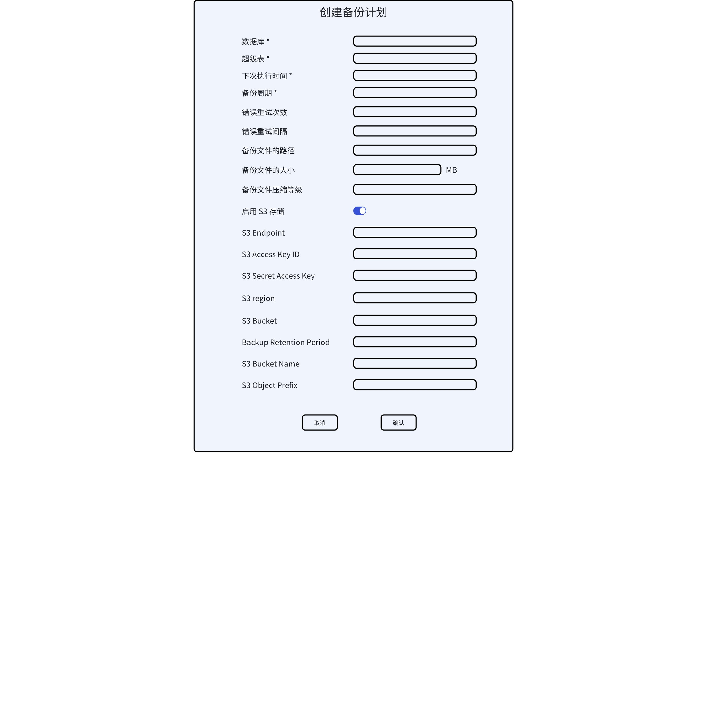

# taosX 增量备份恢复支持 S3 - FS

## 1. 背景

taosX 的增量备份恢复通过 TMQ 订阅备份数据库的变更，存储在本地备份目录。我们需要有个配置，容许一天（可配置时长）的增量数据备份到 S3, 以减小备份数据的存储成本。

TS-5806

## 2. 变更历史

| 日期 | 版本 | 负责人 | 主要修改内容 |
| --- | --- | --- | --- |
| 2025/1/17 | 0.1 | @杨志宇 | 初稿 |
|  |  |  |  |

## 3. 定义

无

## 4. 行为说明

### 4.1 备份文件转储 S3 的规则

备份文件转储 S3 的规则如下：
1. 如果不开启 S3 转储，则全部备份文件保留在本地；
2. 如果开启 S3 转储，taosX 根据参数`backup_retention_period`和`backup_retention_size`来判断哪些文件需要上传；
   - 如果`backup_retention_period = None 且 backup_retention_size = None`，则所有数据都保留在本地，不上传 S3。
   - 如果`backup_retention_size = None 且 backup_retention_period > 0`，则所有早于`now - backup_retention_period`的文件都需要上传；
   - 如果`backup_retention_period = None 且 backup_retention_size > 0`，则本地只保留最新的`backup_retention_size`个备份文件；
   - 如果`backup_retention_period > 0 且 backup_retention_size > 0`，则所有早于`now - backup_retention_period`的文件都需要上传，同时，本地只保留最新的`backup_retention_size`个备份文件。
   - 如果 `backup_retention_period = 0 或 backup_retention_size = 0`，则所有备份文件都会上传 S3，本地不保留备份文件。
3. 如果开启 S3 转储，taosX 要先将 S3 上的备份文件下载到本地，再执行本地恢复。 

### 4.2 配置参数

| **参数** | **中文名称** | **说明** | **值域** | **必填** | **默认值** | **示例** |
| --- | --- | --- | --- | --- | --- | --- |
| s3_enable | 启用 S3 存储 | 开启 s3 转储 | 布尔值 | No | false | - |
| s3_endpoint | S3 节点 | S3 服务域名 | URI encoded 字符串 | Yes when s3_enable = true | - | http://192.168.2.139:9000 |
| s3_access_key_id | 访问密钥 ID | access_key_id | URI encoded 字符串 | Yes when s3_enable = true | - | miniadmin |
| s3_secret_access_key | 访问密钥 | secret_access_key | URI encoded 字符串 | Yes when s3_enable = true | - | miniadmin |
| s3_bucket | 存储桶 | 存储桶名称 | URI encoded 字符串 | Yes when s3_enable = true | - | test |
| s3_region | 区域 | region | URI encoded 字符串 | Yes when s3_enable = true | - | us-west-1 |
| s3_object_prefix | 对象前缀 | S3 对象存储的前缀，类似于目录 | URI encoded 字符串 | No | / | taos_backup/ |
| backup_retention_period | 本地备份文件的保留时长 | 本地备份的保留时间，所有早于`now - backup_retention_period`的文件都需要上传 | 分钟/小时/天 | No | 0 | 1day |
| backup_retention_size | 本地备份文件的保留个数 | 本地备份文件的保留个数，本地只保留最新的`backup_retention_size`个备份文件 | 正整数 | No | 0 | 10 |

### 4.3 异常处理

使用 S3 转储的异常处理规则如下：
1. 创建备份计划前，检查 S3 连通性，如果出错，前端页面提示报错，任务创建失败。
2. 备份任务执行中，出现 S3 连通性错误，放弃本次上传（即：文件保留在本地），备份任务继续。直到 S3 连接恢复后，将之前符合转储条件的文件上传。
3. 备份任务执行中，出现 S3 其他错误，根据用户配置的`error.retry.max`和`error.retry.interval`进行重试，直到达到最大重试次数。
4. 恢复任务创建前，检查 S3 连通性，如果出错，前端页面提示报错，任务创建失败。
5. 恢复任务执行中，出现 S3 连通性错误，尝试重连，任务不退出，直到 S3 连接恢复。
6. 恢复任务中行中，出现 S3 其他错误，根据用户配置的`error.retry.max`和`error.retry.interval`进行重试，直到达到最大重试次数。

### 4.4 UI

备份计划表单，增加 S3 的相关配置参数。


### 4.5 检查 S3 连通性

在创建备份计划前，要检查 S3 连通性，即：通过用户填写的参数，是否能连通 S3 server。如果 S3 连通性失败，在前端报错，提示用户检查参数，不创建创建备份计划，表单不关闭。
S3 的配置参数在 local 的 DSN 中，通过调用接口`/ds/in/validate?dsn=$LOCAL_DSN` 检查。下面是一个示例：
请求：
```http {wrap}
POST http://127.0.0.1:6050/ds/in/validate
content-type: application/json

{
  "from": "tmq+ws://192.168.0.201:6041/test",
  "to": "local:/Users/yangzy/taosx/backup?s3_enable=true&s3_endpoint=http%3A%2F%2F192.168.2.139%3A9000&s3_access_key_id=minioadmin&s3_secret_access_key=minioadmin&s3_region=us-west-1&s3_bucket=test&backup_retention_period=1d&backup_retention_size=10G"
}
```

正确的返回：
```shell {wrap}
{
  "valid": true,
  "support": true,
  "data_source": "local"
}
```

失败的返回
```shell {wrap}
{
  "valid": false,
  "support": false,
  "data_source": "local",
  "message": "invalid path: /BACKUP_DIR"
}
```


### 4.6 命令行

通过 taosX 命令行，可以执行备份任务。
下面是一个示例：
```shell {wrap}
taosx run -f "tmq+ws://192.168.2.139:6041/db1?upcoming=now" -t "local:/BACKUP_DIR?s3_enable=true&s3_endpoint=http%3A%2F%2F192.168.2.139%3A9000&s3_access_key_id=miniadmin&s3_secret_access_key=miniadmin&s3_region=us-west-1&s3_bucket=test&backup_retention_period=1d&backup_retention_size=10G"
```

通过 taosX 命令行，可以执行恢复任务。
下面是一个示例：
```shell {wrap}
taosx run -f "local:/BACKUP_DIR?s3_enable=true&s3_endpoint=http%3A%2F%2F192.168.2.139%3A9000&s3_access_key_id=miniadmin&s3_secret_access_key=miniadmin&s3_region=us-west-1&s3_bucket=test" -t "taos+ws:192.168.2.139:6041/db2"
```

## 5. 性能

无

## 6. 兼容性

1. 3.3.5.X 之前，taosX 没有现在备份计划，S3 功能不可用。
2. 3.3.5.X，explorer 不可以配置 S3 参数，S3 功能不可用。
3. 3.3.6.0 以后的 explorer 可以配置 S3 参数，支持 S3 存储。3.3.6.0 之后的 taosX 兼容 3.3.5.X 的任务，默认 S3 不启用。

## 7. 运维

无

## 8. 使用场景

### 8.1 全部备份文件上传 S3

`backup_retention_period = 0`且`backup_retention_size = 0`，全部备份文件上传至 S3。

### 8.2 本地备份文件最多占 m GB

设置`backup_retention_period = 0`、`backup_retention_size = m`且`backup_max_size = 1G`
，则本地保留 m GB 的备份文件。

### 8.3 本地最多存 n 天的备份

设置`backup_retention_period=n day`且`backup_retention_size = 0`，本地保留 n 天的备份数据。

### 8.4 本地最多存 n 天数据，且总大小不能超过 m GB

设置`backup_retention_period=n day`且`backup_retention_size = m`且`backup_max_size = 1G`，则本地最多保留 n 天的备份数据，且总大小不超过 m GB。

## 9. 约束和限制

无

## 10. 常见错误和排查

无

## 11. 可观测性

无

## 12. 安装和卸载

无

## 13. 文档

无

## 14. 参考文档

[taosX 增量备份和恢复](https://taosdata.feishu.cn/wiki/VwpywqMkviooHYkhqbccUQrqnnh)
