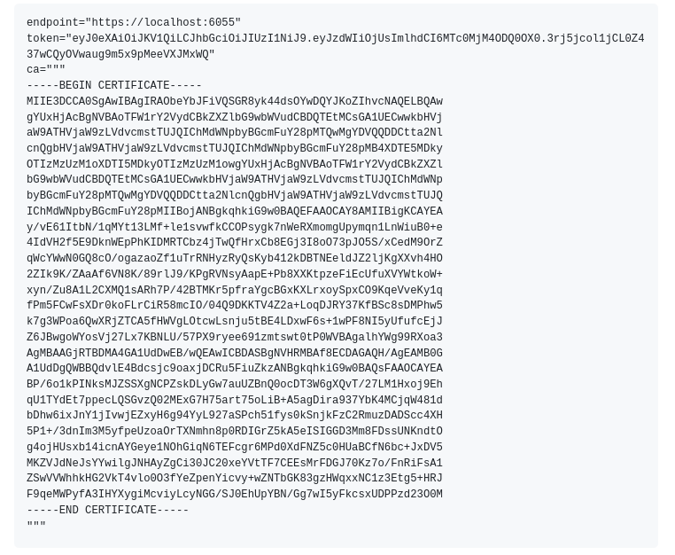

# taosX 支持 TLS/SSL - FS

## 1. 背景

TDengine 组件中，taosX/Agent 的安全配置缺失，需补充。

## 2. 变更历史

| 日期 | 版本 | 负责人 | 主要修改内容 |
| --- | --- | --- | --- |
| 2025.03.19 | 0.1 | 霍琳贺 | 初稿 |
|  |  |  |  |

## 3. 定义

## 4. 行为说明

### 4.1 taosX 服务端配置

新增以下配置：
```toml {wrap}

[serve]

## 5. TLS/SSL certificate

ssl_cert = "/path/to/tls/server.pem"

## 6. TLS/SSL certificate key

ssl_key = "/path/to/tls/server.key"

## 7. TLS/SSL CA certificate

ssl_ca = "/path/to/tls/ca.pem"

```

- `ssl_cert`：表示服务端证书。
- `ssl_key`：表示服务端私钥。
- `ssl_ca`：表示 CA 证书。
配置后，将在 REST API 和 GRPC 启用 HTTPS 。
启用 HTTPS 后，Explorer 需修改配置文件，修改对应的配置项为 HTTPS 连接：
```toml {wrap}
x_api = "https://localhost:6050"
grpc = "https://localhost:6055"
```

### 7.1 Explorer 添加 Agent

Agent 添加流程不变，当启用 TLS/SSL 时，配置页面新增 CA 证书：


Agent 使用证书，并启用 HTTPS ，可正常登录。当配置文件与服务端不匹配时，启动报错。

## 8. 性能

无。

## 9. 兼容性

无。

## 10. 运维

无。

## 11. 使用场景

无。

## 12. 约束和限制

- SSL 私钥仅支持 PKS8

## 13. 常见错误和排查

- 服务端启用 HTTPS，Agent 未启用时，报错：
  ```plaintext {wrap}
  Error: Handshake error with token
  
  Caused by:
      0: Tonic error: status: Unknown, message: "h2 protocol error: http2 error", details: [], metadata: MetadataMap { headers: {} }
      1: status: Unknown, message: "h2 protocol error: http2 error", details: [], metadata: MetadataMap { headers: {} }
      2: transport error
      3: http2 error
      4: connection error detected: frame with invalid size
  ```

- 服务端未启用 HTTPS，Agent 启用时，报错：
  ```plaintext {wrap}
  Error: Unable to connect with endpoint `https://localhost:6055`
  
  Caused by:
      0: transport error
      1: received corrupt message of type InvalidContentType
      2: received corrupt message of type InvalidContentType
  
  ```

## 14. 可观测性

无。

## 15. 安装和卸载

## 16. 文档

## 17. 参考文档

## 18. 附录
