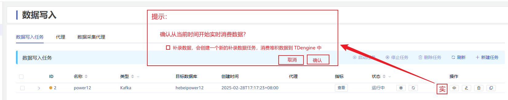
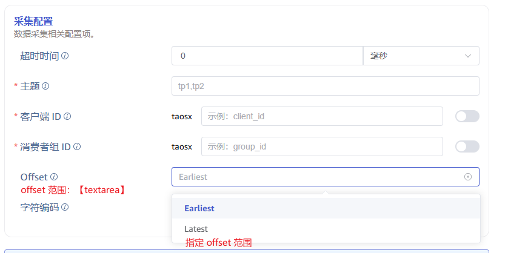

# taosX 配置 kafka offset 区间进行消费

## 1. 背景

taosX 从 Kafka 消费数据过程中，可能由于网络、物理机宕机等不可抗拒因素，造成 kafka 消费堆积。系统恢复后，kafka datain 任务从堆积的起始位置开始消费，堆积量的大小也决定了消除堆积的时间长短，消费完堆积数据可能需要数小时的时间，在这个时间内，上层业务系统就无法获取到实时数据。就无法满足对业务实时性要求高的客户需求。
所以本设计方案主要是为了解决在 kafka 产生堆积后，如何既能保证业务实时性，又能将堆积的数据补录进 TDengine。
详见：
TS-5799

## 2. 变更历史

| 日期 | 版本 | 负责人 | 主要修改内容 |
| --- | --- | --- | --- |
| 2025/03/03 | 0.1 | 周营昭 | 初稿 |
|  |  |  |  |

## 3. 定义

无

## 4. 行为说明

### 4.1 实时消费

如图，kafka 任务上多一个操作按钮“实时消费”，点击后弹出提示框，提示用户是否要实时消费，同时给用户选择是否要补录数据，如果补录则生成一个新的 kafka 任务，进行补录数据，默认勾选。
确认后，将产生以下行为：
1. 生成一个新的 kafka 补录任务
   - 任务名称：${原任务名称}-补录-${now} / ${原任务名称}-recovery-${now}
   - 任务 group：${原group}-${newtaskID}
   - 在数据目录下会有一个 csv 配置文件，记录此补录任务每一个partition 的起止 offset
2. 原 kafka 任务，从最新的 offset 开始消费，并生成补录 csv 文件。
如果不勾选补录，也会将生成补录 csv 文件。如果用户后期要补录这份数据，用户可以上传文件来单独创建补录任务。
<callout emoji="no_entry" background-color="light-orange" border-color="light-orange">
**约束**：
1. 只有在 stop 状态下，才能开启实时消费
2. 如果总体 offset 堆积量小于 “2000 万”，则认为任务无积压，实时消费操作无效。
</callout>

### 4.2 实时消费的流程

1. 

### 4.3 创建补录任务

在创建 kafka 任务时，offset 选项多一个“指定范围”，选择后可以~~上传 csv 范围文件~~输入offset 范围。 输入格式如下，每一行是逗号分割的三个数值，表示一个 partition 的范围，第一列为 partition id, 第二列为起始 offset, 第三列为 结束 offset。
<quote-container>
1,887277262,946237234
2,879736747,940783478
...
50,885823749,940783456
</quote-container>

## 5. 性能

无

## 6. 兼容性

无。

## 7. 运维

无

## 8. 使用场景

### 8.1 Kafka 消费堆积时期望实时消费

1. 停止当前任务
2. 点击“实时消费”，开启从最新时间开始消费，同时补录数据。
   - 当前任务从最新 offset 开始消费，使用 kafka-consumer-console 查看当前任务 group 的 offset，应该没有堆积；
   - 使用 kafka-consumer-console 查看补录任务 group 的 offset，应该在补录范围内；
3. 补录任务 offset 到终点后，自动完成。

## 9. 约束和限制

无

## 10. 常见错误和排查

1. 补录数据的任务完成时，offset 可能会超出终点一个批次之内的数量，属于正常现象。

## 11. 可观测性

无

## 12. 安装和卸载

无

## 13. 文档

无

## 14. 参考文档
