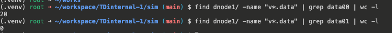
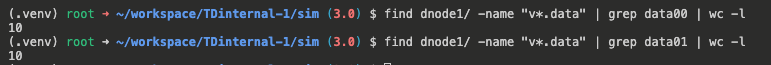

# 优化同一级存储多块盘上的数据分布 TS

## 1. 测试目标

JIRA ：[TS-5794](https://jira.taosdata.com:18080/browse/TS-5794)
问题来源于[ [宁德新能源] 3.3.2.12 0级存储两块盘，数据分布极度不均匀](https%3A%2F%2Fjira.taosdata.com%3A18080%2Fbrowse%2FTS-5769)。在该用户场景下，data 文件多数被分配到了同一块硬盘上，由于 data 文件大小是不断增长的，因此可能导致磁盘占用不均衡，造成数据倾斜。本测试是为了验证新的多级存储硬盘分配方案可以将 data 文件均匀分布在不同的硬盘上，避免 data 文件的过渡集中在同一块硬盘上形成数据倾斜现象。

## 2. 变更历史

| 日期 | 版本 | 作者 | 备忘 |
| --- | --- | --- | --- |
| 2024/02/11 | 1.0 | @程洪泽 | 初始版本 |
|  |  |  |  |

## 3. 测试范围

<quote-container>
1. 多级存储
2. 数据文件分布
</quote-container>

## 4. 测试结论

<quote-container>
- 未优化前，在极端情况下，data 文件只存在于一块硬盘上，而另一块硬盘上一个 data 文件也没有，形成严重的数据倾斜。
- 经 TS-5794 优化后，在极端情况下，data 文件也被均匀分布在不同的硬盘上。
</quote-container>

## 5. 已知问题和限制

无

## 6. 测试环境

- OS: Linux

## 7. 测试数据（可选）

无。

## 8. 测试用例

### 8.1 功能

测试用例文件：system-test/0-others/retention_test2.py
测试用例说明：
- 一个节点，在 0 级挂载 2 块硬盘
- 连续创建 db，写入数据，使得在创建 data 文件时，Round-Robin 总是回到一块盘上，导致数据文件倾斜。
测试结果：
- 优化前：

全部的 20 个数据文件全部分配到了一个硬盘上，另一个硬盘上一个 data 文件也没有
- 优化后：

可以看到，优化后的 20 个 data 文件均匀分布到了两块硬盘上。

### 8.2 可用性

无。

### 8.3 可靠性

无。

### 8.4 性能

无。

### 8.5 安全性

无。

### 8.6 兼容性

无。

### 8.7 本地化

无。

## 9. 待讨论（可选）

无。

## 10. 测试计划（可选）

无。

## 11. 风险评估

无。

## 12. 测试备忘（可选）

无

## 13. 参考文档（可选）

无
