# 性能分析----可怕的 page fault

## 1. 概述    

Page Fault : page fault（页错误）是当代计算机内存管理中的一个重要概念，是虚拟内存管理中的关键，对于实现提供更大连续存储空间错觉的虚拟内存系统至关重要。 当程序试图访问其地址空间中但当前未位于系统RAM中的数据或代码时，就会发生页面错误，这是操作系统必须通过将所需数据从辅助存储器加载到RAM中来管理错误。
Linux 内核中的 page fault  异常处理很复杂，涉及到的细节也很多，具体信息见参考资料，此处不再展开。
下面通过具体分析用户【宁德时代】数据同步中性能瓶颈问题，揭示出 page fault 这个问题，希望大家对 page fault 有一些了解。

## 2. 数据同步架构

用户环境同步数据架构如下图：

### 2.1 集群描述：

1. 集群1 是用户的生产环境，主要用于接收用户的写入数据。
2. 集群2 是用户的生产环境，主要用于接收用户的读数据情况。
3. 集群3 是为了测试同步性能搭建的测试集群

### 2.2 同步流程描述：

1. 同步流程1 是生产流程，负责把用户写入的数据同步到读集群，对实时性要求高。该流程有两种方式
   - 第一种方式查询方式，通过查询集群1 的数据，然后批量写入到集群2里。该方式速度满足要求，但是实时性相差1-2分钟（生成环境即是该方式）。
   - 第二种方式订阅方式，通过订阅集群1 的数据，实时写入到集群2里。该方式目前速度不满足要求（需要优化该方式），但是该方式实时性高，可以做到秒级。
2. 同步流程2 是一个测试流程，用于测试同步效率（目前的测试即是这个流程）
3. 同步流程3 也是一个测试流程，用于测试和同步流程2 的差异。（同步流程3 通过订阅的方式满足速度的要求，是因为集群2 里的数据是集群1 通过查询每个子表批量写入的，集群1 里的数据是真实数据，每个子表一条数据写入的）
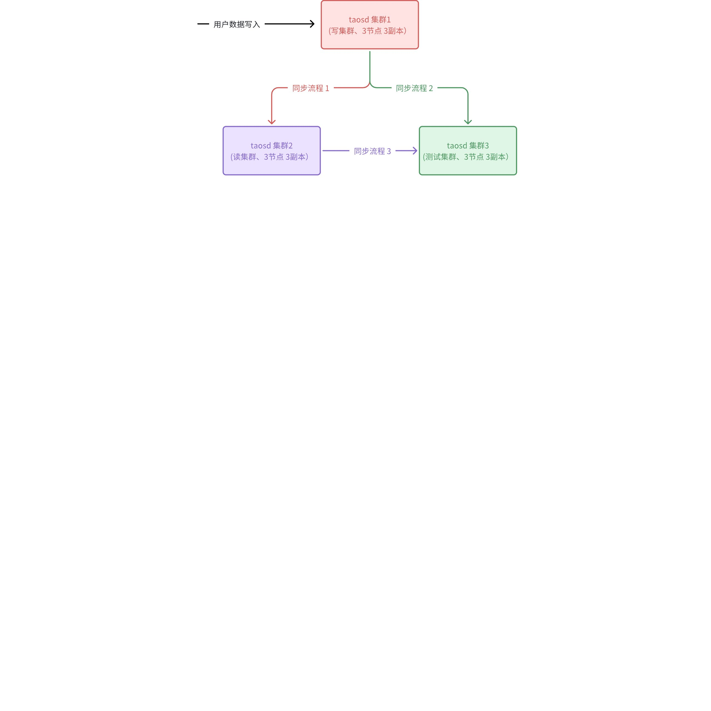

## 3. 性能分析

### 3.1 Perf top

在同步流程 2 上启动订阅方式同步数据，通过 perf top 分析 cpu消耗，如下图
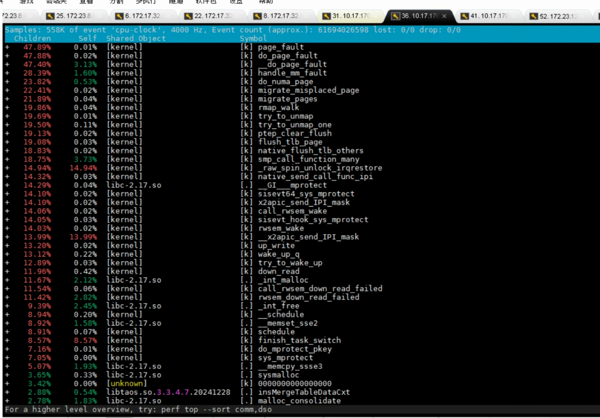

可以看出 page fault 调用占据了大量的 cpu 时间。 page fault 的调用栈是怎样的呢？继续往下通过火焰图来分析。

### 3.2 火焰图

通过 perf top 只能看到 page fault 占用了很大的 cpu 时间，但是是什么导致了 page fault 呢？需要通过火焰图调用栈来分析。
通过 flamegraph 生成火焰图如下（由于 taosx 是 rust 写的，为了加载出符号表，需要安装 rust 使用的 flamegraph ，来自参考资料 1）：
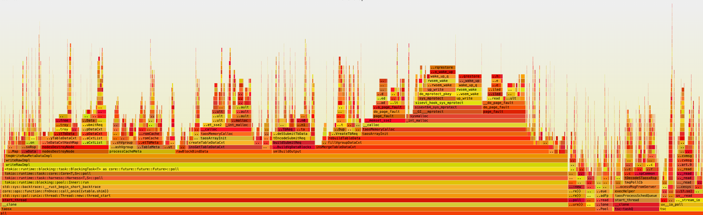

缩放火焰图可以发现，malloc 和 free里大量调用了 page fault。那到底什么是 page fault 呢？如何避免呢？

### 3.3 Page fault

什么是 Page fault 呢？下图是可能出现的 Page fault的情况（来自参考资料3）。通常的 Page fault 是由于进程访问的虚拟内存不在物理内存里时会触发的。针对本文的情况，触发page fault 可能是第一条（首次访问没有分配物理内存的虚拟内存时触发）或者 第三条（内存不足时，触发swap 导致的）。
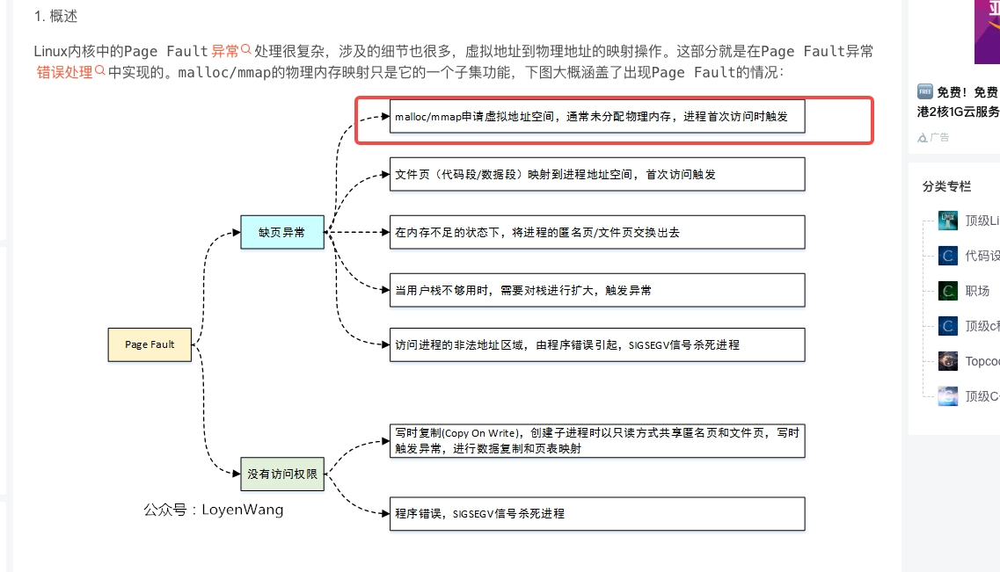

下面继续分析系统的内存情况。

### 3.4 系统内存使用情况

top 命令查看系统，可以看到物理内存有 64G，进程才使用了 740M 左右，所以并非内存不足导致的。注意进程的虚拟内存使用了 35 G。
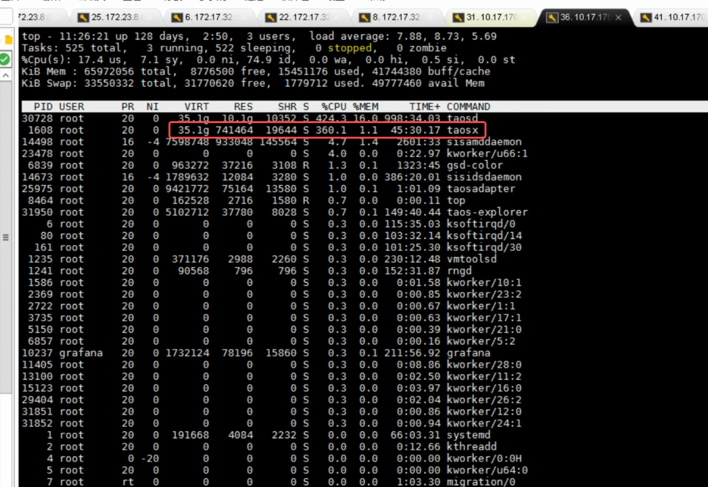

### 3.5 程序逻辑分析

同步数据的时候订阅会对数据做编解码操作需要分配释放内存，每次写数据时候初始化上下文也需要分配释放内存。
同时打开同步日志，发现每次写入耗时200ms-24s 不等。并且每次写入的数据有4000多个块，每个块里的子表都不一样，只有一条，是交叉写入模式。
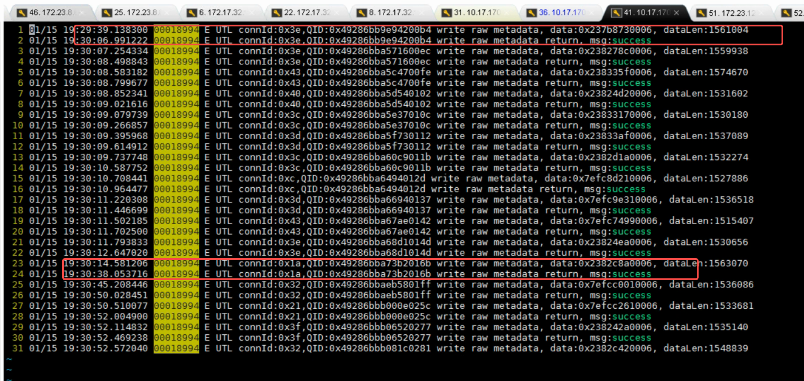

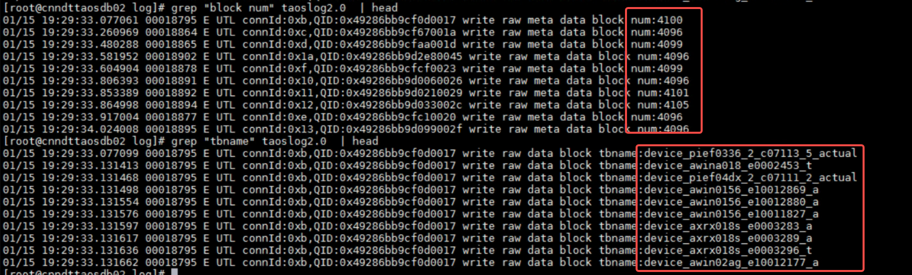

## 4. 初步结论

综合分析火焰图和程序逻辑，可以得出初步结论：
由于频繁的malloc free，导致page fault 了，每次处理都在等待内存操作，cpu 使用率上不来，效率变低。
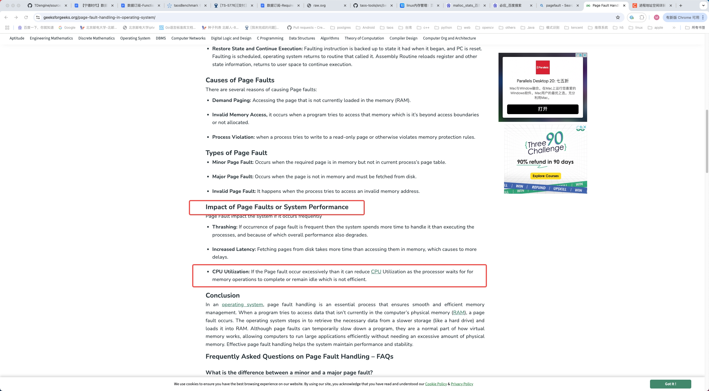

## 5. 尝试本地复现

### 5.1 环境准备

启动两套 taosd 集群，通过 taosBenchmark 向一个集群写数据（10000张子表，每个子表写入10000条数据，通过交叉写入模式 = 1 写入），通过taosx 向另一个集群同步。（机器物理内存 64G）

### 5.2 首次复现失败

通过 perf top 观察taosx cpu使用（见下图），发现并未出现 大量的 Page fault。并且同步速度也很快。
通过 top 查看内存使用量只有 400M，虚拟内存达到了 10G。
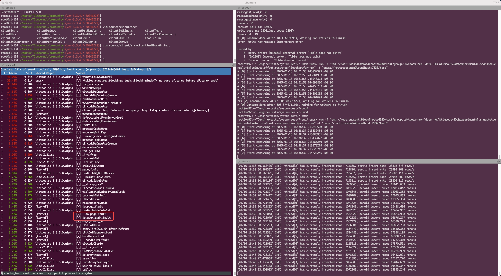

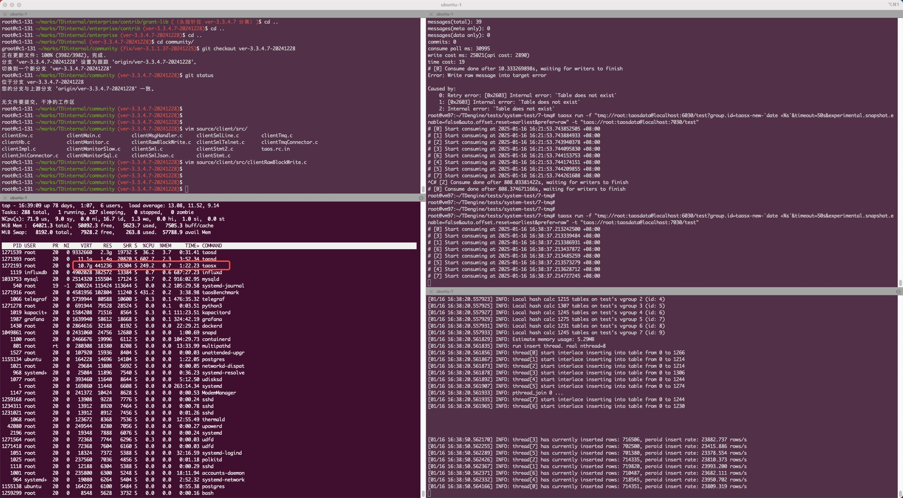

### 5.3 复现关键点分析

之前看过用户的表结构，有一个 16k 大小的字符串，很可能是这个大数据导致每次分配内存量不一样导致的。
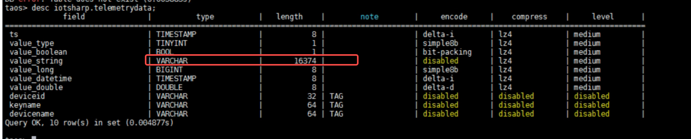

### 5.4 再次复现成功

更改 taosBenchmark 的配置文件，和用户的数据 schema 一样，增加 16k 长度的字符串。再次复现，复现成功。
通过 top 查看内存使用量 6G，虚拟内存达到了 16G。
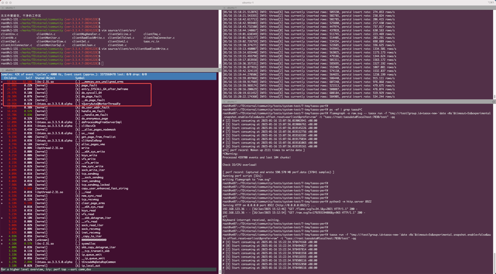

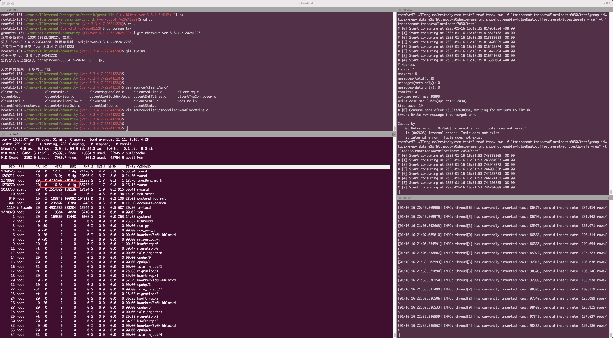

## 6. 结论

1. 确实是由于频繁的malloc free，导致page fault 了。
2. 并非所有频繁的malloc free，都会导致 page fault。
3. 本文中大块的（16k)频繁的malloc free 才触发了 page fault。并且 page fault 的时候，进程的虚拟内存都比较高。
4. 为什么大块的频繁的malloc free 才触发了 page fault？
猜测：大块的内存分配后再释放导致内存回收了，虚拟内存和物理内存的映射也释放了。可是再来大块内存，变成了首次访问。触发了page fault 的第一条（首次访问没有分配物理内存的虚拟内存时触发）。

## 7. 优化及效果

### 7.1 优化方法

1. 消费者增加 msg.consume.rawdata 参数，用于控制消费数据为原始的 submit 消息，这样可以避免 server 端和 client 端的SMqDataRsp 类型的编解码转换，消除大量的 malloc / free 操作。
2. client 端消除 memcpy 相关的操作，避免submit 消息的拷贝，通过指针转移一直保持使用 rpcMsg 里的submit数据，提高数据处理效率。
3. server 端增加 submit 写入数据里建表信息剔除的逻辑（用户全是自动建表写入，通过判断sumit 写入的时间和表建立的时间的大小，不用传递建表信息），降低client 端建表信息的解码，处理逻辑。

### 7.2 测试步骤及结果

1. 测试环境
  192.168.1.97，分别测试用户版本 3.3.4.7 和优化后的版本
1. 测试脚本
   - 老版本 3.3.4.7 版本写入数据并测试速度：
python3 tests/system-test/7-tmq/taosx-performance.py once /root/taosx/taosx/target/release/taosx ~/marks/TDengine/debug/build true 16 1200000 20 /root/taosx_perf
1. 优化后版本用上面写入的数据测试速度：
python3 tests/system-test/7-tmq/taosx-performance.py once /root/taosx/taosx/target/release/taosx ~/TDinternal/community/debug/build false 16 1200000 20 /root/taosx_perf
1. 测试数据结构
用和宁德时代相同的数据结构，16个 vnode，1200000 个子表，每个子表写入 100条数据。具体 json 文件见 taosx-performance.py，其中schema 结构如下（字段 str ： 1/800 比例的5k长度，9/800 比例的短字符串，其余为 NULL）
```java
"columns": [
  {"type": "TINYINT", "name": "current", "max": 128, "min": 1 },
  { "type": "BOOL", "name": "phaseewe" },
  { "type": "BINARY", "name": "str", "len":16374},
  { "type": "BIGINT", "name": "cnt", "max" : 2563332323232, "min":1 },
  { "type": "DOUBLE", "name": "phase", "max": 1000, "min": 0 }
]
```

1. 测试方式
通过 taosBenchmark 写入数据。然后用 taosx 将数据从一个 db 迁移到另一个 db。
1. 测试结果
  对比优化前后的速度提升：优化前迁移用时 978s，优化后用时 239s ，提升4.1倍左右。优化后速度 50w/s ，满足宁德时代 1800w/min（30w/s）的要求。
1. 结果说明
宁德时代机器更好并且两个db 是分开部署的（测试时两个db 是在一台机器上部署的），测试的时间包含前面meta 同步的速度，实际只有 data 同步的耗时会更短。所以在用户环境上性能提升会更好。

## 8. 参考资料：

1. [Rust: 使用 Flamegraph 进行性能分析](https://taosdata.feishu.cn/wiki/UNSxwQ6bri3CShkJaqxcK5HDnwd)
2. https://www.geeksforgeeks.org/page-fault-handling-in-operating-system/
3. https://blog.csdn.net/lianhunqianr1/article/details/124701579
