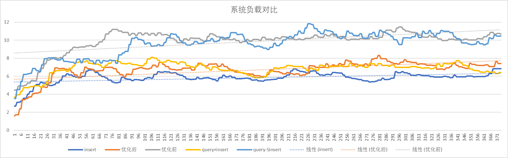
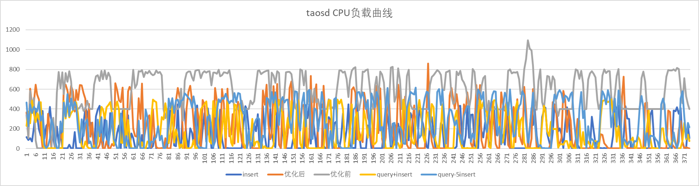
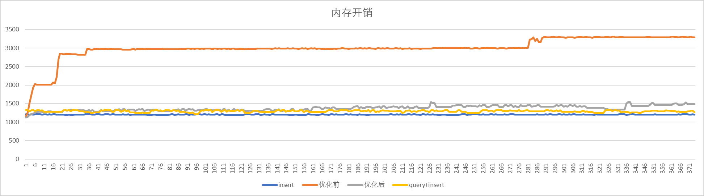
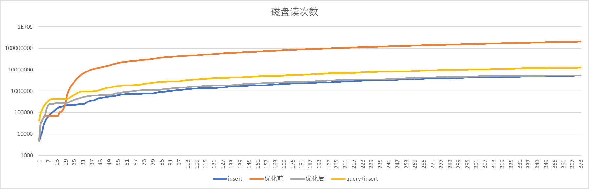
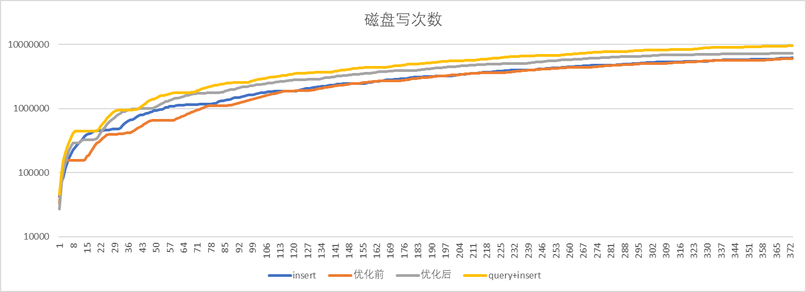
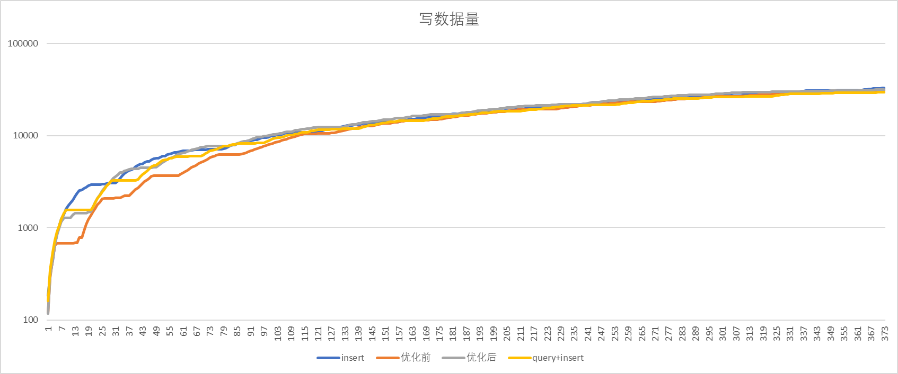

# 流计算模式性能对比

### 1. 概述

针对四种场景下的系统整体负载、taosd  CPU 负载、内存开销、读写次数指标衡量流计算采用优化模式以后的性能对比结果。
系统运行的对比的程序是 community/tests/perf/stream.py 直接运行该脚本即可得到。运行过程中针对系统负载进行每秒1次的持续采样，并将结果绘制出来。
运行环境是一台 12 核的服务器，taosBenchmark 与 taosd 均运行在该服务器上。流计算包含了 5 万个时间线，写入数据中有 20% 比例的数据是乱序数据。
数据记录1秒一条，聚合窗口是 5sec。

五种模式如下：

| 序号 | 运行模式 | 说明 |
| --- | --- | --- |
| 1 | 数据写入 | 系统中运行 taosbenchmark 进行数据写入 |
| 2 | 数据写入+优化后流计算 | 系统中运行 taosbenchmark 的时候，创建了一个流运行（该流未运行重算逻辑） |
| 3 | 数据写入+优化前流计算 | 系统中运行 taosbenchmark 的时候，创建一个未优化运行模式的流 |
| 4 | 数据写入+查询写入结果 | 系统中运行 taosbenchmark 的时候，启动 python 程序查询每个分组的每个时间区间，获得聚合结果后写入到数据库（1个客户端） |
| 5 | 数据写入+（5线程）查询写入结果 | 客户端 5 个线程 |

### 2. 系统负载对比

优化前的系统运行负载显著高于其他三种情况。单纯 insert 的系统负载最低。taosBenchmark 的开销也计算在内，因为在同一台机器上运行。

6 分钟负载均值如下：

| 类型 | insert | 优化后 | 优化前 | query+insert | query+5insert |
| --- | --- | --- | --- | --- | --- |
| 负载值 | 5.83 | 6.70 | 9.87 | 6.87 | 9.55 |
| 倍率 | 1.00 | 1.15 | 1.69 | 1.178 | 1.64 |

query+insert 的负载增加不大，但是其处理的速度很慢。

### 3. CPU 负载开销

5种运行模式下，CPU开销如下：

6 分钟 CPU 负载均值如下：

| 类别 | insert | 优化后 | 优化前 | query+insert | query+5insert |
| --- | --- | --- | --- | --- | --- |
| CPU开销 | 137.2 | 213.2 | 575.8168449 | 172.89278 | 283.7254 |
| 倍率(x/insert) | 1.00 | 1.55 | 4.20 | 1.26 | 2.07 |

优化后，CPU 只有优化前的 50%不到。相对于 5 个vnode，50000个时间线计算，CPU开销增加较小。query+insert 开销很低是因为其处理的进度很慢，并且只有一个客户端线程在处理。

### 4. 内存占用开销

6 分钟内存占用开销均值 (MiB)：

| 类别 | insert | 优化后 | 优化前 | query+insert |
| --- | --- | --- | --- | --- |
| 内存开销（MiB） | 1202.22 | 1373.49 | 2999.11 | 1292.95 |
| 倍率（x/insert） | 1.000 | 1.142 | 2.495 | 1.075 |

优化后，内存相对于insert 增加了 14%，而优化之前是增加了 149%。query+insert 模式不用缓存任何内容，所以内存基本上没有增加。

### 5. 读取开销（次数）

由于 Linux 系统 buffer 的存在，无法统计读取数据量，只统计了读取次数作为读取开销。
读取开销（次数）统计如下图（**指数坐标系**）：可以看到由于未优化流计算由于检测到update导致的过量重算，导致 优化前 磁盘读次数比优化后高超过1个量级。优化后磁盘读取开销与只有 insert 相比，增量可以忽略。还远少于 query+ insert 的模式。

6分钟平均读取次数：

| 类别 | insert | 优化后 | 优化前 | query+insert |
| --- | --- | --- | --- | --- |
| 读取次数 | 2531942 | 2878342 | 93274406 | 6233938 |
| 倍率(x/insert) | 1.00 | 1.13 | 36.80 | 2.46 |

### 6. 写入开销（次数）

6 分钟平均写磁盘次数

| 类别 | insert | 优化后 | 优化前 | query+insert |
| --- | --- | --- | --- | --- |
| 写入次数 | 3143520 | 4077959 | 3008036 | 5050688 |
| 倍率(x/insert） | 1.000 | 1.297 | 0.959 | 1.607 |

优化前写磁盘最优，是因为其过高的负载影响了 taosBenchmark 的写入，6分钟内写入的数据比其他模式都要低，计算的结果也更少，所以反馈出来是磁盘写入量反而少了。

### 7. 写入开销（数据量）

6分钟后数据写入量

| 类别 | insert | 优化后 | 优化前 | query+insert |
| --- | --- | --- | --- | --- |
| 写入量（MiB） | 32881.75 | 31536.49 | 31468.09 | 29712.09 |
| 倍率(x/insert) | 1.000 | 0.959 | 0.957 | 0.904 |

不同模式下，写入量没有显著差别。优化前写入量相对于 insert 更小是因为写入性能有下降导致写入数据+聚合结果更小。
