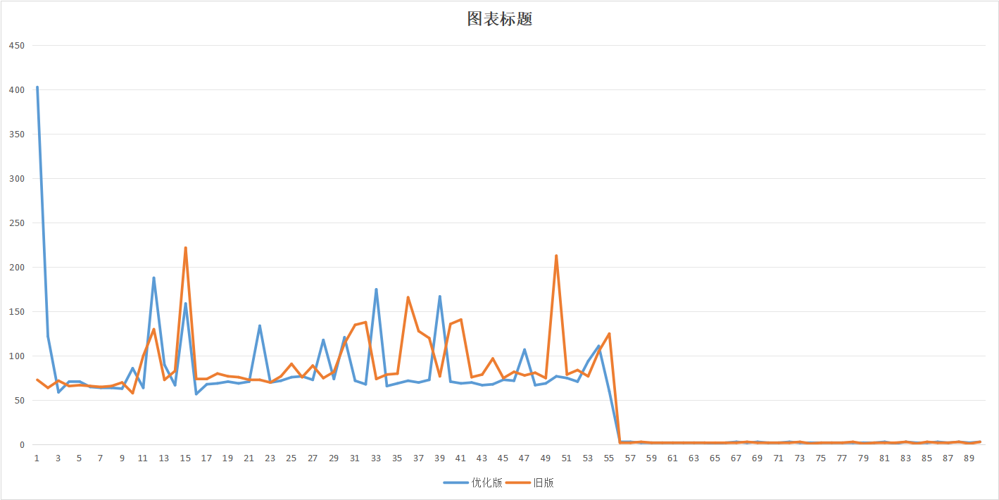
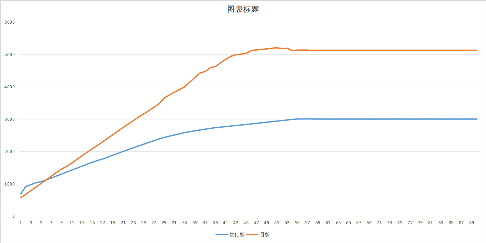
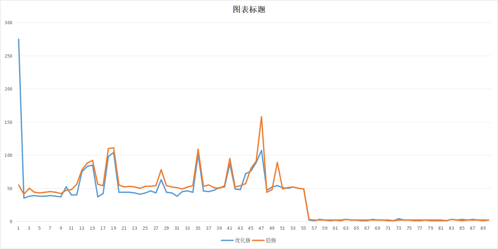
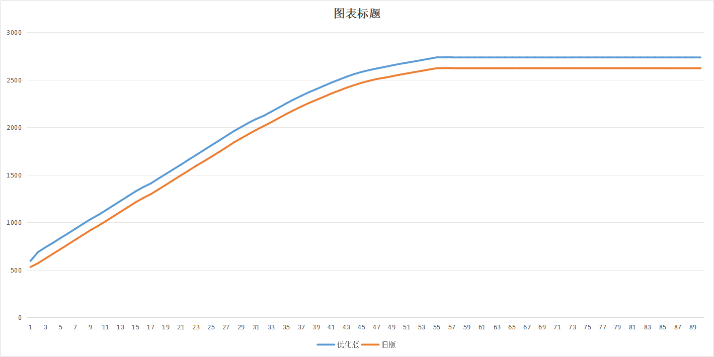
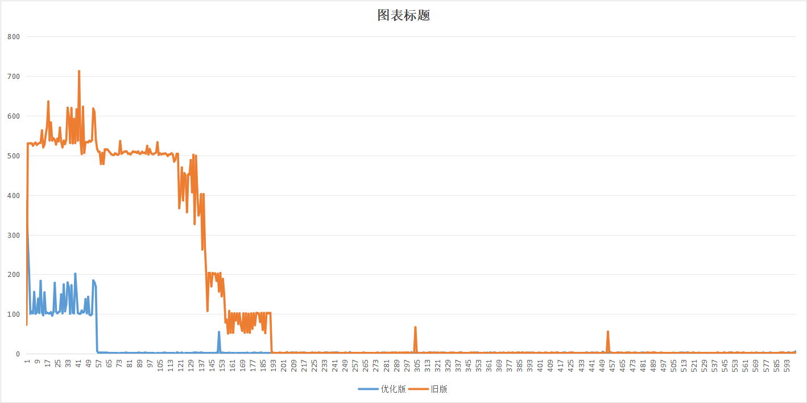
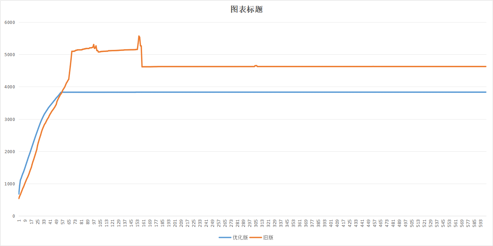
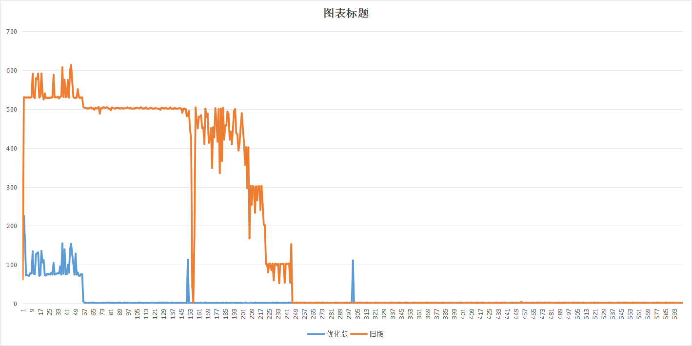
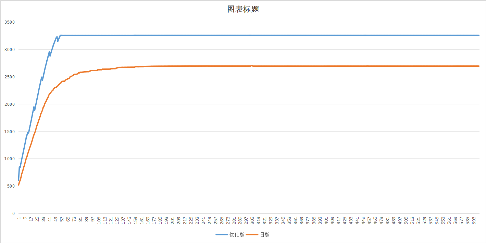

# 流计算计算资源优化 性能测试

## 1. 概述

针对两种场景下的taosd  CPU 负载、内存开销指标衡量流计算采用优化模式以后的性能对比结果。系统运行的对比的程序是 community/tests/perf/stream.py 直接运行该脚本即可得到。运行过程中针对系统负载进行每秒1次的持续采样，并将结果绘制出来。
运行环境是一台 40 核的服务器，taosBenchmark 与 taosd 均运行在该服务器上。500张子表，每个子表有5万行数据，写入数据分种：1.全部顺序写入；2. 30% 比例乱序数据。
数据记录1秒一条，聚合窗口是 5sec。
该测试是对[流计算模式性能对比](https://taosdata.feishu.cn/wiki/BrLkwfAGlihtmfkshCZcL27wnhc)测试的补充，主要是做重算时的性能对比。

## 2. 无乱序场景性能测试

### 2.1 有Partition by tbname

cpu性能对比如下。当taosbenchmark停止写入后，流能立即停止计算。优化的版本需要多建recalculate task，所以一开始需要的cpu多。计算数据使用cpu基本相同。

内存对比如下。优化版本内存较少，是因为只缓存最后一个窗口的状态。

### 2.2 无Partition by tbname

cpu性能对比如下。当taosbenchmark停止写入后，流能立即停止计算。优化的版本需要多建recalculate task，所以一开始需要的cpu多。计算数据使用cpu基本相同。

内存对比如下。相差100MB基本符合预期。待优化版有内存泄漏修复后再验证

## 3. 乱序30%场景性能测试

### 3.1 有Partition by tbname

cpu性能对比如下。旧版是实时重算，所以对于频繁修改的窗口，会多次重复计算，重算导致cpu高。优化版会是定期重算，所以重算消耗的cpu少。优化后，CPU 只有优化前的 20%不到,并且在数据写入结束后，能立即停止计算。

内存对比如下。优化版本内存较少，是因为只缓存最后一个窗口的状态。

### 3.2 无Partition by tbname

cpu对比如下。旧版是实时重算，所以对于频繁修改的窗口，会多次重复计算，重算导致cpu高。优化版会是定期重算，所以重算消耗的cpu少。优化后，CPU 只有优化前的 20%不到,并且在数据写入结束后，能立即停止计算。

内存对比如下。内存泄漏已修复，已在本机验证，待借到服务器后在补充该测试

