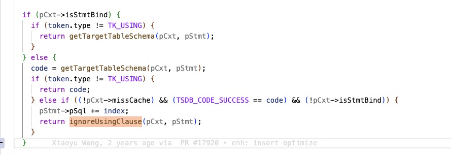

# 自动建表性能问题排查

## 1. 背景

<quote-container>
准备数据库和超级表
create database if not exists test;
use test;
create table if not exists stb (ts timestamp, a int, b float, c binary(10)) tags (e_id int);
提前创建 100万子表，tag 使用自增 id
循环 100 次写入数据，每批 1 万个表，每个表一条数据，每个表数据相同，最终写入 100 万子表，每个子表一条数据。
1. 使用自动建表语句 insert into t1 using stb tags(1) values (x,x,x,x) t2 using stb tags (2) values (x,x,x,x) ... 方式写入耗时 17.35s
2. 使用子表直接写入语句 insert into t1 values (x,x,x,x) t2 values (x,x,x,x) ... 方式写入耗时 8.39s
帮忙排查自动建表性能是否正常，是否需要改进
</quote-container>

Jira: 
TD-33165

## 2. 问题分析

当子表已经存在时，自动建表插入和直接插入性能应该接近，之所以性能差距比较大是由于自动建表流程会多次查询 tdb 获取 uid。

## 3. 优化方法

### 3.1 自动建表时 查询子表缓存

自动建表原有的流程只会查询**超级表**的缓存，使用**超级表**的缓存。为了提升自动建表在表已存在时的执行速度，增加了查询**子表**缓存的逻辑。
1. 自动建表查询子表的缓存 如果命中直接走 direct insert 逻辑。

### 3.2 自动建表时 拉取子表&超级表的缓存

如果自动建表缓存未命中，会尝试从 taosd 拉取 **子表&超级表** 的缓存。此时子表可能还不存在，所以当拉取子表缓存失败时，不应返回错误。

## 4. 测试记录

不是很熟悉 taosBenchmark 的配置，使用 taosBenchmark 测试性能波动比较大，写了一个简单的测试程序。
<view type="2">

  > ⚠ 嵌入文件，需在飞书中查看 (token: JqYUbMDZno2fVkxkwpQcrP2wneg)

</view>

性能对比：
**优化分支：fix/3.0/TD-33165(没有tag解析)**

|  | AutoCreate | DirectInsert | 性能差异 |
| --- | --- | --- | --- |
| 1 | 63.79 | 60.28 |  |
| 2 | 66.09 | 71.32 |  |
| 3 | 70.17 | 63.48 |  |
| 平均 | 66.68 | 65.20 | 2% |

**优化分支：fix/3.0/TD-33165 (包含tag解析)**

|  | AutoCreate | DirectInsert | 性能差异 |
| --- | --- | --- | --- |
| 1 | 75.20 | 67.83 |  |
| 2 | 77.01 | 70.17 |  |
| 3 | 73.85 | 68.36 |  |
| 平均 | 75.35 | 68.78 | 9.2% |

**优化分支：fix/3.0/TD-33165 (包含tag解析和超级表校验)**

|  | AutoCreate | DirectInsert | 性能差异 |
| --- | --- | --- | --- |
| 1 | 82.03 | 71.26 |  |
| 2 | 82.75 | 69.16 |  |
| 3 | 79.32 | 71.58 |  |
| 平均 | 81.36 | 70.94 | 14.6% |

**优化分支：fix/3.0/TD-33165 (包含tag解析和超级表校验，增加了超级表的局部缓存)**

|  | AutoCreate | DirectInsert | 性能差异 |
| --- | --- | --- | --- |
| 1 | 73.56 | 69.56 |  |
| 2 | 78.73 | 71.21 |  |
| 3 | 77.97 | 68.53 |  |
| 平均 | 75.67 | 69.77 | 8.7% |

<view type="1">

  > ⚠ 嵌入文件，需在飞书中查看 (token: LyArbq7yvojKduxqn25cR6Mqnee)

</view>

<view type="1">

  > ⚠ 嵌入文件，需在飞书中查看 (token: SRfBb35o0oHcY3xFaA3cq1SenBe)

</view>

抓了一个火焰图 taosc&taosd 。
可以看到光是解析 tag 就占了全流程 4% ，这代表auto_create 解析 tag 的话肯定会比较慢。
**3.0 分支**

|  | AutoCreate | DirectInsert | 性能差异 |
| --- | --- | --- | --- |
| 1 | 92.93 | 65.52 |  |
| 2 | 89.95 | 70.3 |  |
| 3 | 91.71 | 63.48 |  |
| 平均 | 91.53 | 66.43 | 38% |

## 5. 性能对比

|  | AutoCreate (优化分支) | DirectInsert (优化分支) | auto_create &direct 性能差异 | AutoCreate （3.0） | DirectInsert （3.0） | auto_create &direct 性能差异 |
| --- | --- | --- | --- | --- | --- | --- |
| 1 | 73.56 | 69.56 | 92.93 | 65.52 |
| 2 | 78.73 | 71.21 | 89.95 | 70.3 |
| 3 | 77.97 | 68.53 | 91.71 | 63.48 |
| 平均 | 75.67 | 69.77 | 91.53 | 66.43 |

Auto create 相较于3.0 分支，优化了21%。

## 6. 已知问题

1. 本次优化不包含 stmt 。
2. 需要拉取缓存后，优化才生效，如果每张表只插入一条数据，是没有优化的。
