# Kafka 数据写入任务性能对比测试 - 3.3.4.9 vs 3.3.6.0

## 1. 综述

新版本 3.3.6.0 采用了与之前不同的写库机制，这一改动主要影响了需要自动建表的数据源任务的写入性能。接下来，我将以 Kafka 数据源为例，分别在 3.3.4.9 和 3.3.6.0 两个版本上进行测试，对比两者的写入性能是否存在显著差异。

## 2. 历史版本

| 日期 | 版本 | 负责人 | 主要修改内容 |
| --- | --- | --- | --- |
| 2025/03/19 | 0.1 | @张元湃 | 初稿 |
| 2025/03/19 | 0.2 | @张元湃 | 补充不同版本 taosd & taosx 组合 |
| 2025/03/20 | 0.3 | @张元湃 | 补充更多“子表数量”场景 补充 batchsize 场景 修改测试结论 |

## 3. 测试环境

| --- | **3.3.4.9** | **3.3.6.0** |
| --- | --- | --- |
| **服务器** | 192.168.2.14 | 192.168.2.13 |
| **CPU** | 4 核 Intel(R) Xeon(R) CPU E5-2650 v3 @ 2.30GHz | 4 核 Intel(R) Xeon(R) CPU E5-2650 v3 @ 2.30GHz |
| **内存** | 16G | 16G |
| **操作系统** | Ubuntu 20.04.6 LTS | Ubuntu 20.04.2 LTS |

## 4. 测试结果

| **测试项** | **192.168.2.14** **taosd 3.3.4.9** **taosx 3.3.4.9** | **192.168.2.13** **taosd 3.3.6.0 (updated)** **taosx 3.3.4.9** | **192.168.2.13** **taosd 3.3.6.0 (updated)** **taosx 3.3.6.0 (updated)** |
| --- | --- | --- | --- |
| 200w 行数据 1 子表 | 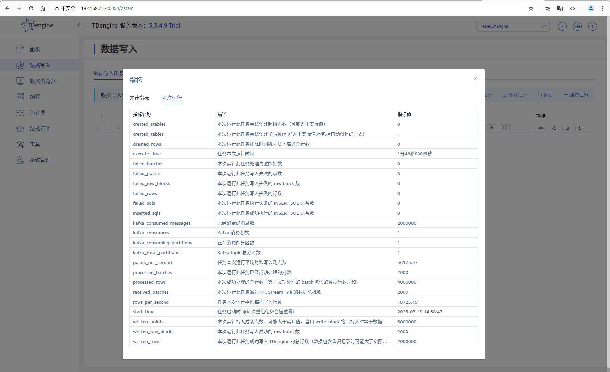 耗时 1 分 46 秒（截图慢了，实际 1 分 30 秒左右） | 略 |  耗时 1 分 29 秒 |
| 200w 行数据 100w 子表 （第一次） （没删表） | 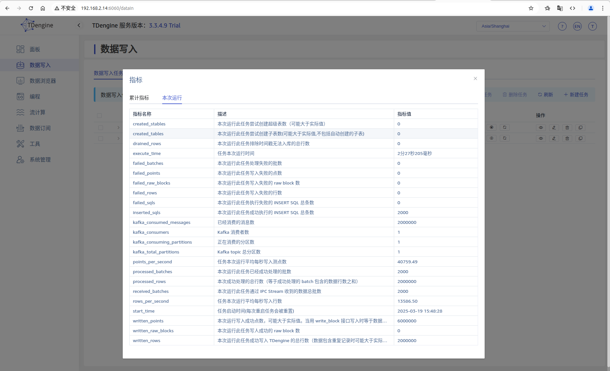 耗时 2 分 27 秒 | 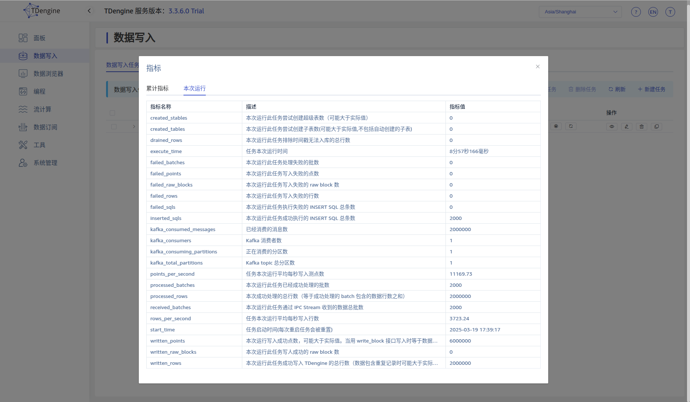 耗时 8 分 57 秒 | 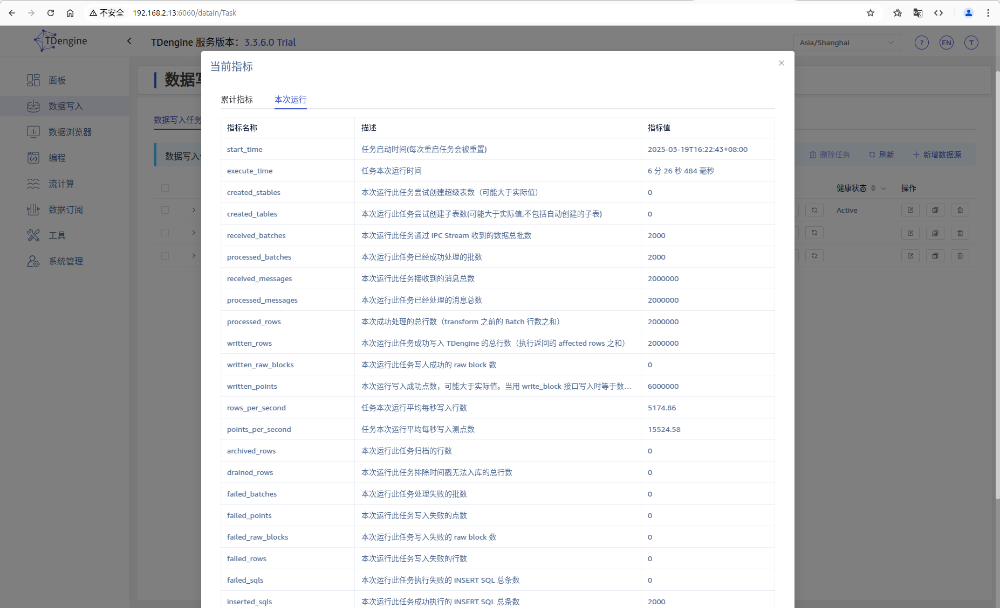 耗时 6 分 26 秒 |
| 200w 行数据 100w 子表 （第二次） （没删表） | 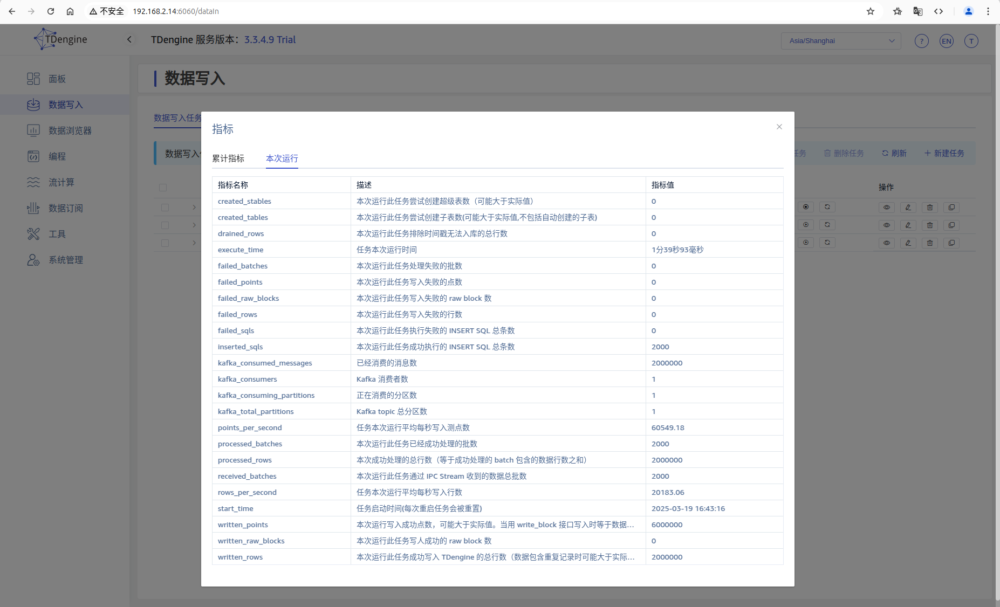 耗时 1 分 39 秒 |  耗时 10 分 6 秒 | 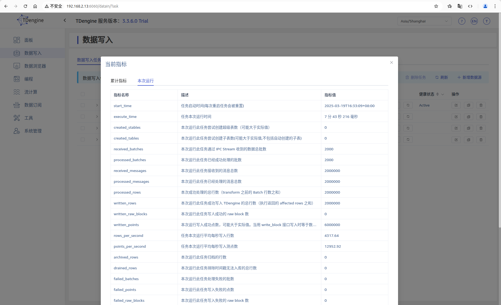 耗时 7 分 43 秒 |
| 200w 行数据 100w 子表 （第三次） | 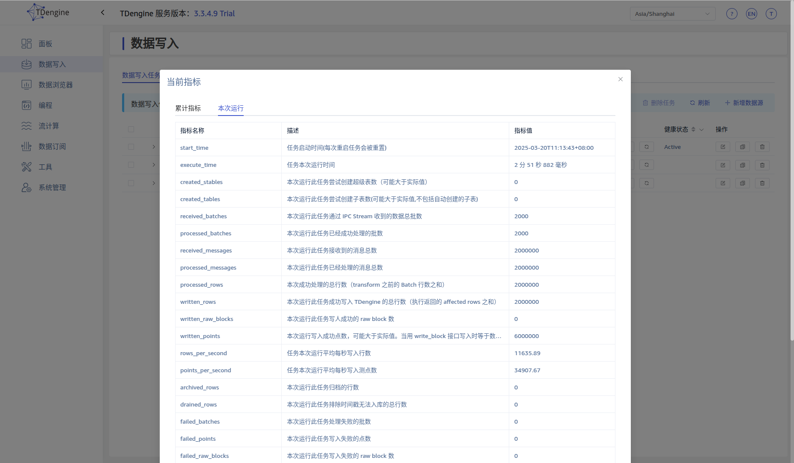 耗时 2 分 51 秒 | 略 | 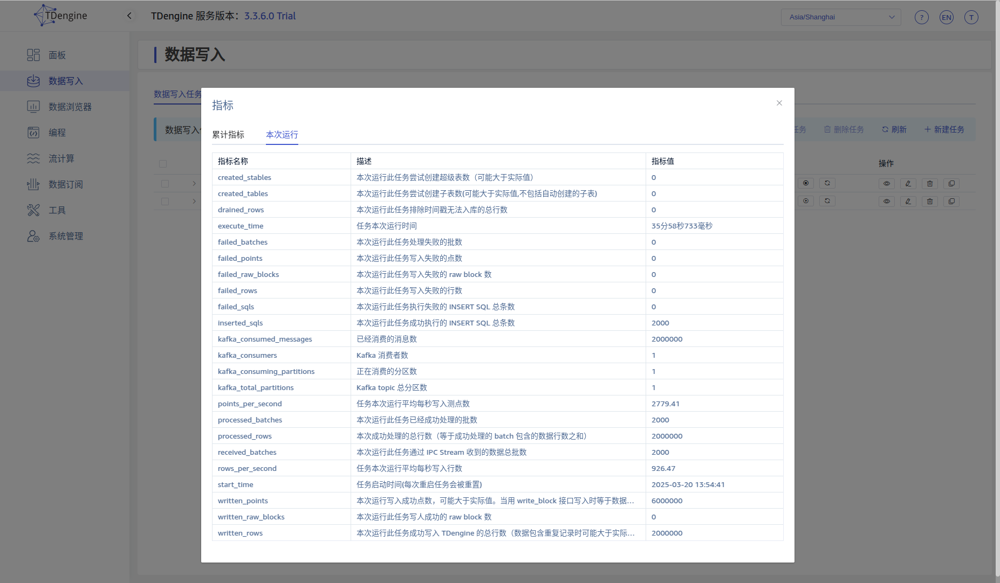 耗时 35 分 58 秒 |
| 200w 行数据 100w 子表 （第四次） | 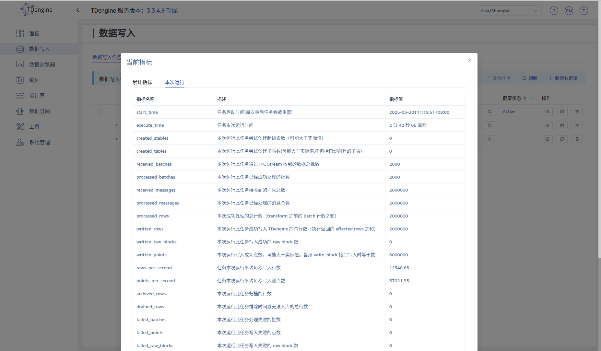 耗时 2 分 42 秒 | 略 |  耗时 35 分28 秒 |
| 200w 行数据 50w 子表 batch=1000 |  耗时 2 分 19 秒 | 略 |  耗时 9 分 59 秒 |
| 200w 行数据 50w 子表 batch=3000 | 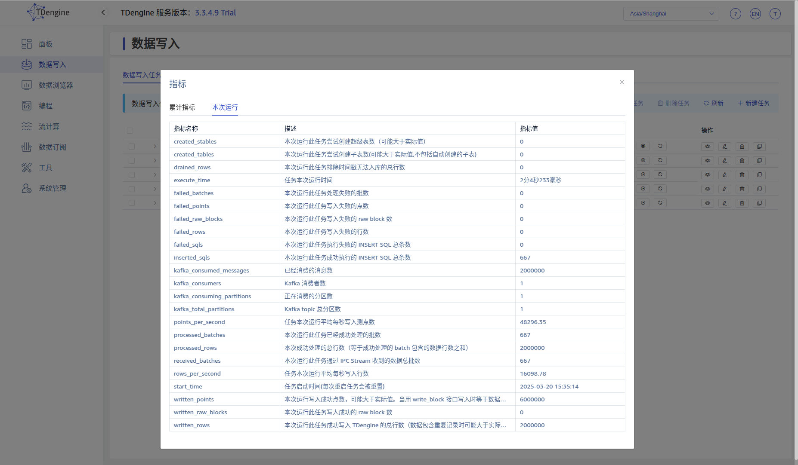 耗时 2 分 4 秒 | 略 | 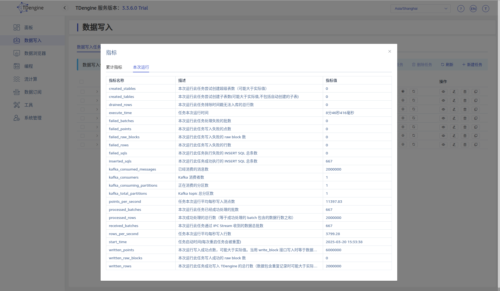 耗时 8 分 46 秒 |
| 200w 行数据 10w 子表 |  耗时 2分 18 秒 | 略 | 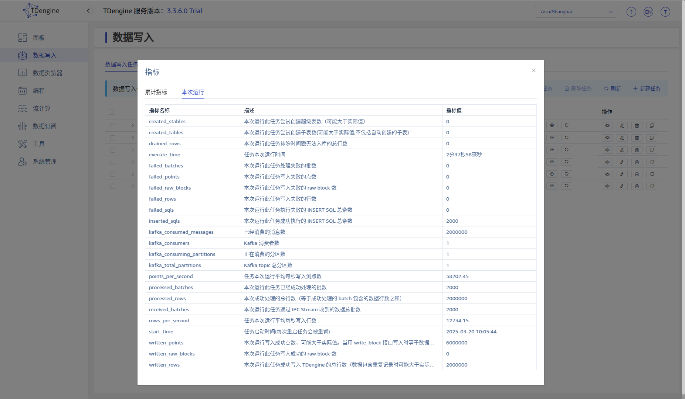 耗时 2 分 37 秒 |
| 200w 行数据 5w 子表 |  耗时 1 分 59 秒 | 略 | 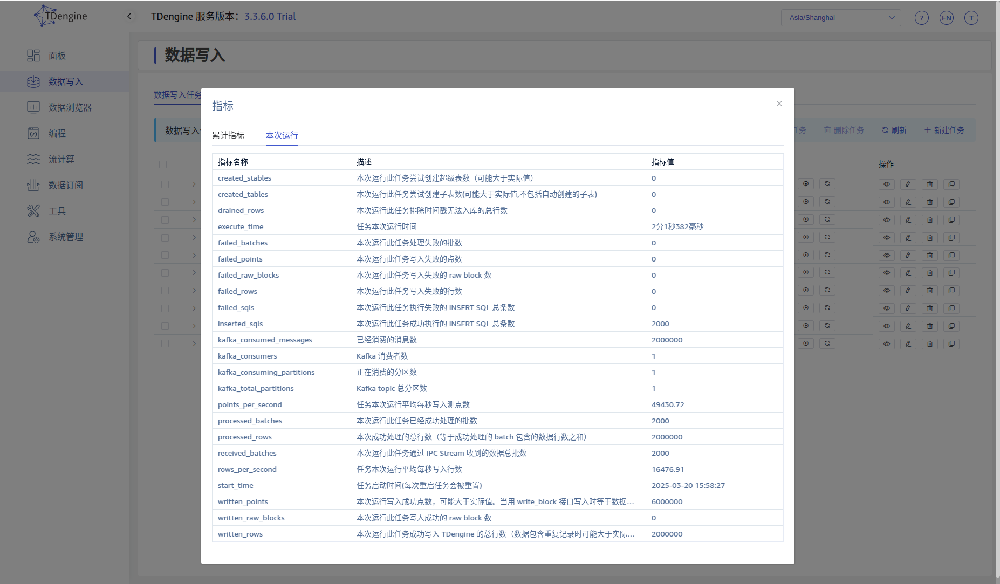 耗时 2 分 1 秒 |
| 200w 行数据 1w 子表 | 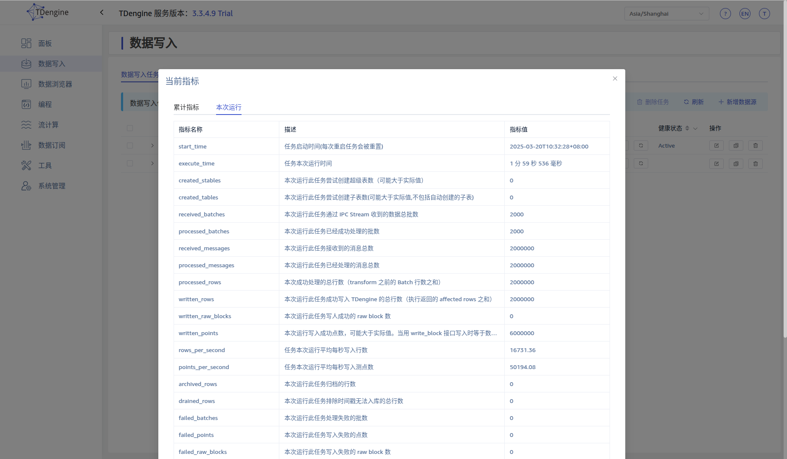 耗时 1 分 59 秒 | 略 | 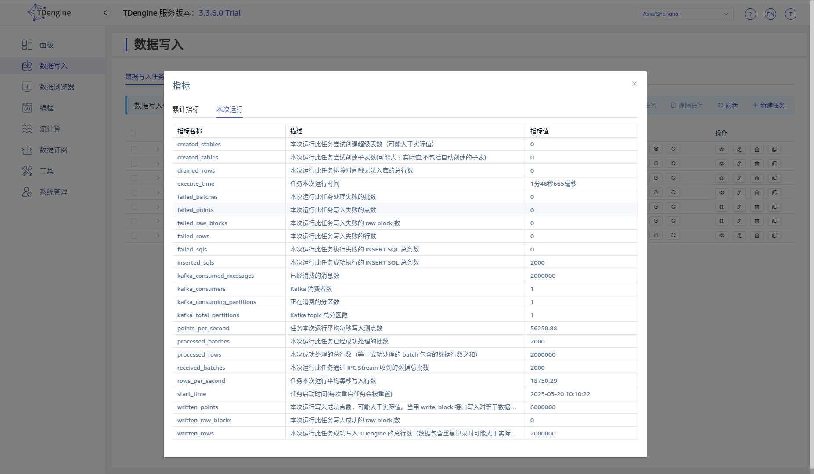 耗时 1 分 46 秒 |
| 200w 行数据 5k 子表 |  耗时 1 分 42 秒 | 略 |  耗时 1 分 36 秒 |
| 200w 行数据 1k 子表 | 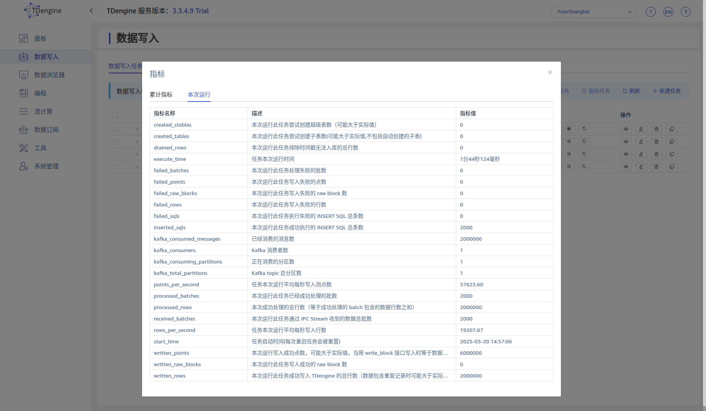 耗时 1 分 44 秒 | 略 |  耗时 1 分 30 秒 |

## 5. 测试结论

<quote-container>
本次测试没有考虑服务器本身的性能差异，但有以下三点供参考：
1. 两台服务器配置相同
2. 任务运行过程中服务器的负载不高，均在 1-2之间
3. 测试 1 子表时性能一致
</quote-container>

在配置相同的两台服务器上分别对两个版本进行测试，结果显示：
1. 子表数量对性能的影响
   - 当子表数量达到 100 万 时，新版本的处理速度显著下降，性能不足旧版本的 1/10
   - 当子表数量为 5 万 时，新旧版本的处理速度接近，差异不明显
   - 当子表数量减少至 1 千 时，新版本的处理速度优于旧版本，性能提升约 10%
2. 单次处理条数对性能的影响
   - 增加单次处理条数（从 1000 提升至 3000）后，新旧版本的性能均提升约 10%
3. 新旧版本性能对比
   - 新版本 taosx 的性能可能略高于旧版本
