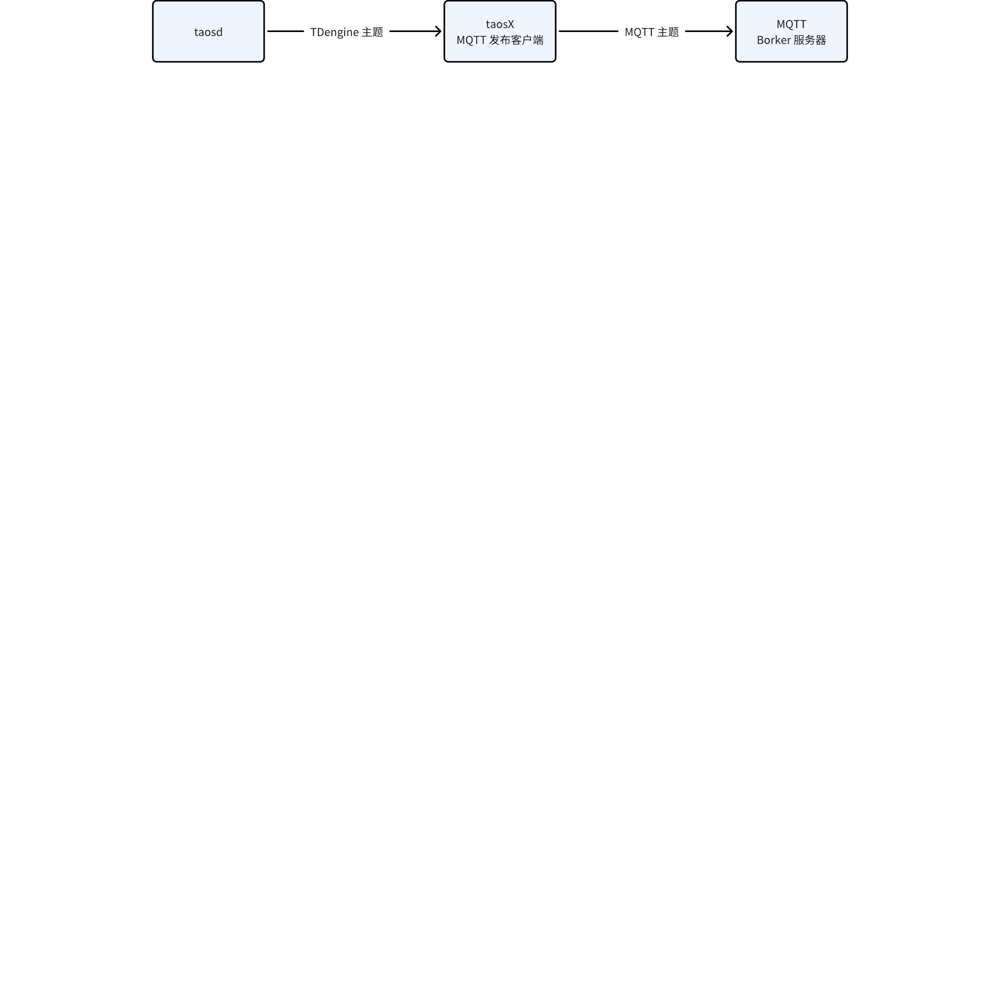
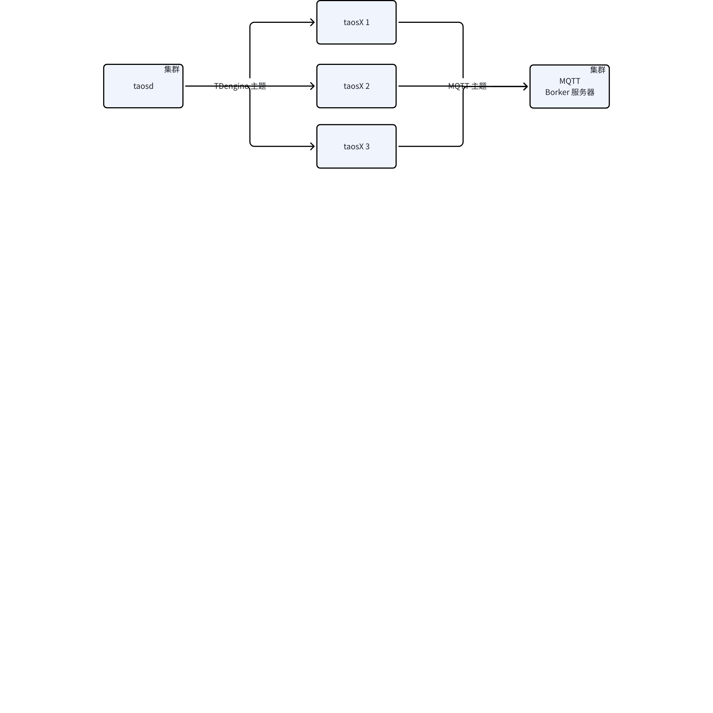
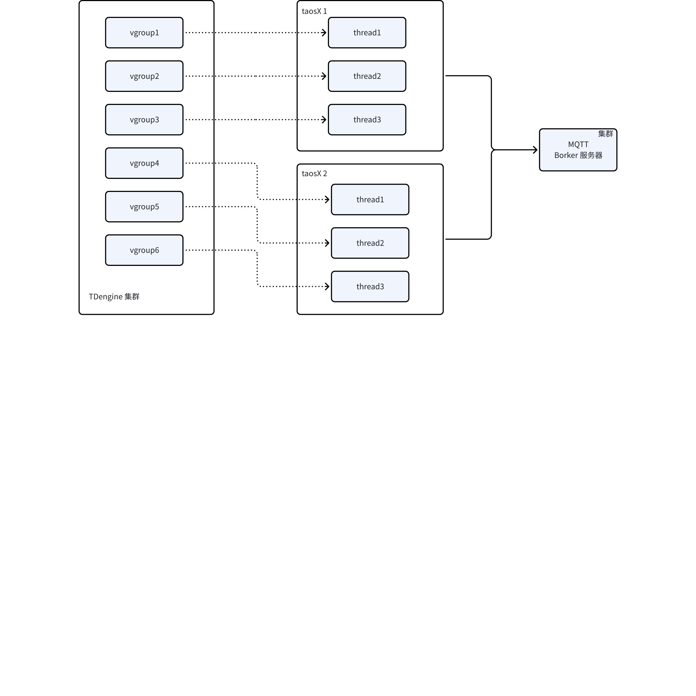

# TDengine 向 MQTT Broker 发布数据 RS

## 1. 引言

### 1.1 术语与缩写名词

1. MQTT Broker：接收客户端发布的消息，根据主题对消息进行过滤，并分发给订阅者
2. MQTT Publisher：发布者向 MQTT Broker 发送消息
3. MQTT Topic：消息主题，用于标识消息的类型或内容，客户端可以发布或订阅一个或多个主题
4. MQTT QOS：发送者与接收者之间消息传递的保证级别（并非发布者和订阅者之间）
5. MQTT 遗嘱消息：WillMessage，在客户端连接时指定的消息，它将在客户端断开连接时自动发布到代理服务器
6. MQTT 保留消息：RetainHandling，当一个客户端向一个主题发布消息时，该消息可以被设置为保留消息。这意味着该消息将被保留在代理服务器上，并在新的订阅者连接到主题时被发送给它们。
7. MQTT 的一些相关概念
   - MQTT 3.1.1，MQTT 5.0
   - MQTT Over TLS/SSL
   - MQTT Over Websocket
   - MQTT Bridging
   - Authentication & ACL
   - Clustering

### 1.2 相关文档资料

1. JIRA [TS-5931](https://jira.taosdata.com:18080/browse/TS-5931)
2. 常见资料可参考 [EMQ 官网](https://docs.emqx.com/zh/)

### 1.3 优先级要求

高，2025 年研发部重点任务

### 1.4 版本要求

在 taosX 中实现，是否开源待定，考虑提供一个功能受限的 taosX 二进制版本

## 2. 变更历史

| 日期 | 版本 | 负责人 | 主要修改内容 |
| --- | --- | --- | --- |
| 2025/02/05 | 1.0 | 关胜亮 | 新建 |
| 2025/02/10 | 1.1 | 关胜亮 | 在 taosX 中实现 |

## 3. 需求目标

在 taosX 中实现，不耦合在 taosd 中，降低引擎代码复杂性。发布消息的主要流程如下所示。


1. 支持基本的消息发布功能
   - 支持基本的身份认证（第一期不支持 TLS/SSL 等安全链接方式）
   - 支持 QOS 0/1/2 三种质量策略
   - 支持 MQTT 5.0 协议、MQTT 3.1.1 协议
   - 支持 TCP 协议、Websocket 协议
   - 支持记录已发布消息的位置，当 taosX 或者 taosd 重启后，继续之前的位置继续发布
   - 支持从头开始发布，也支持从最新数据开始发布
   - 支持同时执行多个发布任务
   - 对于单个发布任务，支持多线程并行发布消息给 Broker，提高发布效率
2. 支持部署多个 taosX，提供消息发布的高可用特性 

## 4. 功能需求

### 4.1 消息发布需求

通过配置文件定义程序行为。在配置文件中，可以定义多个消息发布任务，每个发布任务有如下配置项。
1. MQTT 配置
   - Broker 的用户名、密码、连接地址（应是一个列表）
   - QOS 策略
   - 协议类型
   - 启用 Websocket
   - 启用 TLS/SSL（第一期不支持安全链接方式）
2. TDengine 配置
   - 主题名称
   - 消费者 ID
   - 消费组 ID
   - 订阅位置记录间隔
   - 订阅的初始位置
3. 发布配置
   - 消息的文本格式定义
      - 订阅主题对应的 SQL 语句如下
    ```sql {wrap}
    select ts, voltage, current, tbname from a
    ```

      - 发布消息的文本格式可采用变量定义，例如 `%1`、`%2`、`%3`
    ```sql {wrap}
    # 目标字符串
    {"voltage":30,"current":20,"ts":1596157444170,"tbname":"a"}
    # 定义的文本格式
    {"voltage":%2,"current":%3,"ts":%1,"tbname":"%4"}
    ```

   - 时间类型的格式定义
      - 支持长整型数值
      - 支持格式化字符串，例如 YYYY-MM-DD HH:MM:SS
      - 支持时区定义（或者一律采用 UTC 时间）
   - 发布主题名称定义
      - 有些 MQTT 应用会为每个设备配置一个主题，为应对此类需求，发布主题也需要支持变量
      - 例如 `ocpp/cp/%1/notify`
   - 发布遗嘱消息（第一期不支持）
   - 发布保留消息（第一期不支持）
   - 发布任务的并行度
其他说明
1. 具体实现时，可采用 paho C++ 客户端发送消息给 MQTT Broker
2. 当 QOS=2 时，可能需要在每次把消息发布到 Broker 之后，把 Offset 提交到 taosd
3. 订阅的初始位置，通过 auto.offset.reset 参数实现

### 4.2 高可用需求

taosX 从 taosd 中订阅数据后，按照固定的消息格式向指定 Broker 发布数据。可以同时启动多个发布任务，当这些发布任务消费同一个主题且属于一个消费组时，就构成了一个集群。多个发布任务之间不互相通信，但借助 TDengine 的消费组概念，可以共享消费进度且确保数据在消费者之间均匀分配。当某个 taosX 宕机、启动，或者新增 taosX 后，TDengine 会通过再平衡机制自动完成消费者的重新分配，无须手动干预。


对于单个 taosX，可以为每个发布任务设置并行度（线程数目）
1. 只有一个 taosX 时，建议并行度和任务对应数据库的 VGroup 数目相同
2. 当有多个 taosX 时，建议这些 taosX 的并行度总数和 VGroup 数目相同。


## 5. 性能需求

作为 MQTT 发布客户端，很少有针对此场景的公开性能指标，但我们仍需要发布一些指标来说明发布任务的性能。
1. 测试过程
   - 在一台典型服务器（例如 8 核 16GB）创建 4 个 VGroup 的 DB
   - 使用 taosBenchmark 按 interlace 方式写入 1 万台智能电表，每个电表 10 万条记录，Flush Database
   - 创建读取所有数据的主题，读取超级表的所有数据，包括标签数据和时序数据
   - 设置并行度为 4，以 QOS=1 方式发布到本机 MQTT Broker 中
2. 测试指标
   - 记录 taosX、taosd、MQTT Broker 的 CPU、内存、网络流量等系统指标
   - 记录消息发布总时间，计算出消息发布吞吐量

## 6. 其他需求

1. 可观测性需求（第一期不支持）
   - 可观测性指标采用类似 taosd 的方式，将数据发送到 taosKeeper
2. 可视化界面配置（第一期不支持）
   - 通过 taos-explorer 实现
   - 可能需要配置文件的动态加载
3. 跨平台要求（第一期不支持）
   - 当前版本仅支持标准 linux 64 位服务器
   - 后续看市场情况再考虑支持 windows 以及其他平台
