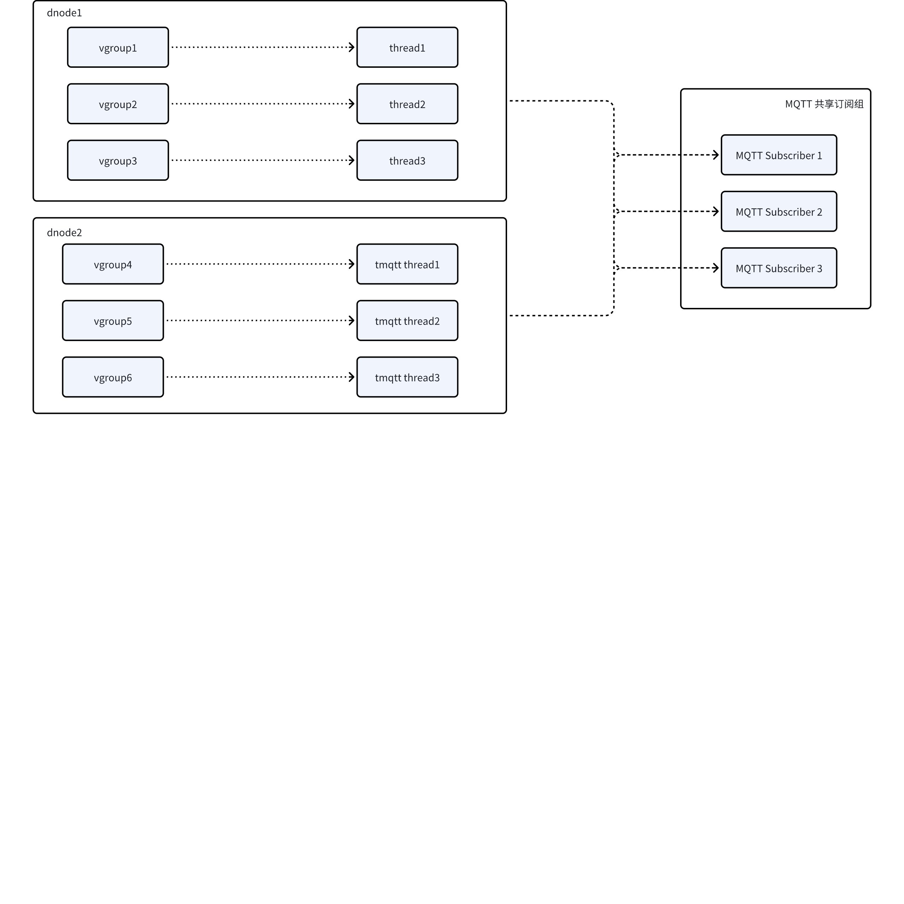

# 数据订阅支持 MQTT 协议 RS

## 1. 引言

### 1.1 术语与缩写名词

#### 1.1.1 背景知识

1. MQTT Broker：接收客户端发布的消息，根据主题对消息进行过滤，并分发给订阅者
2. MQTT Publisher：发布者向 MQTT Broker 发送消息
3. MQTT Subscriber：订阅者从 MQTT Broker 接收消息
4. MQTT Topic：消息主题，用于标识消息的类型或内容，客户端可以发布或订阅一个或多个主题
5. MQTT QOS：发送者与接收者之间消息传递的保证级别（并非发布者和订阅者之间）
6. MQTT 遗嘱消息：WillMessage，在客户端连接时指定的消息，它将在客户端断开连接时自动发布到代理服务器
7. MQTT 保留消息：RetainHandling，当一个客户端向一个主题发布消息时，该消息可以被设置为保留消息。这意味着该消息将被保留在代理服务器上，并在新的订阅者连接到主题时被发送给它们。
8. MQTT 共享订阅：MQTT 5.0 引入了共享订阅特性，它使得 MQTT 服务端可以在使用特定订阅的客户端之间均衡地分配消息负载
9. MQTT 消息持久化：Mosquitto、EMQ 等 Broker 会缓存一些历史消息，订阅者可以获取历史消息
10. MQTT 会话状态
   - 持久化会话：消费者重新上线时，消费离线消息，支持清理会话标志
   - 非持久化会话：消费重新上线时，消费当前消息
11. MQTT 的一些重要概念
   - MQTT 3.1.1，MQTT 5.0
   - MQTT Over TLS/SSL
   - MQTT Over Websocket
   - MQTT Bridging
   - Authentication & ACL
   - Clustering

#### 1.1.2 缩写名词

1. tmqtt：TDengine 提供的 MQTT 订阅
2. sub：MQTT Subscriber
3. subgroup：MQTT 共享消费组
4. offset：vnode 向 MQTT Subscriber 推送数据的进度，通常是 WAL 的版本号

### 1.2 相关文档资料

1. JIRA [TS-5842](https://jira.taosdata.com:18080/browse/TS-5842)
2. MQTT 的技术资料可参考 [EMQ 官网](https://docs.emqx.com/zh/)
3. [TDengine 向 MQTT Broker 发布数据](https://taosdata.feishu.cn/wiki/RUMgwl7KTisvDOk7njYcIEPunxg)

### 1.3 优先级要求

高，2025 年研发部重点任务

### 1.4 版本要求

社区版

## 2. 变更历史

| 日期 | 版本 | 负责人 | 主要修改内容 |
| --- | --- | --- | --- |
| 2025/02/08 | 1.0 | 关胜亮 | 新建 |

## 3. 需求目标

TDengine 的 MQTT 订阅（tmqtt）提供类 MQTT Broker 服务器的功能，从 TDengine 已创建的主题订阅数据，不支持 MQTT 消息发布。
1. 支持基础身份验证，使用 TDengine 的用户名和密码进行认证（第一期不支持 TLS/SSL 等方式）
2. 支持 QOS 0/1 两种质量策略（第一期不支持 QOS 2）
3. 支持 MQTT 5.0 协议（第一期不支持 MQTT 3.1.1 协议）
4. 支持 TCP 协议（第一期不支持 WebSocket 协议）
5. 支持 MQTT 协议的共享消费组功能，允许多个消费者共同分担消息消费任务
6. 支持从数据的起始位置开始推送，也支持从最新的数据位置开始推送
7. 支持记录已推送数据的位置，以便在 dnode 重启后，能够从上次停止的位置继续推送数据
8. 支持多线程并行推送，提升数据传输效率
9. 单个 dnode 的宕机不会导致推送服务的中断

## 4. 功能需求

### 4.1 工作机制

通过 MQTT 协议进行的数据订阅，和常规的数据订阅相同，都需要提前定义主题。为了更简单的定义 MQTT 消息格式，主题不能定义为数据库、超级表，只能是一个查询语句。数据过滤与预处理是由 TDengine 而不是应用程序完成的，可以有效地减少传输数据量与应用程序的复杂度。
TDengine 提供的 MQTT 订阅（tmqtt）和传统 MQTT Broker 方式的数据订阅相比
1. 优点：依据内部的 WAL 实现，天然具备消息持久化的功能
2. 缺点：基于 WAL 的机制可能导致资源消耗稍大，因此创建的 Topic 数目不宜过多，订阅客户端的数目也不宜过多
tmqtt 会为每个共享订阅组（subgroup）维护一个虚拟队列（tmqtt 到 TDengine 的数据订阅任务），下图展示了其基本工作原理


1. MQTT Subscriber（sub）连接到 tmqtt 之后，当 tmqtt 有需要推送的数据时，就发布数据给 sub 
2. tmqtt 会为 subgroup 记录推送进度（offset），每个 vnode 都会为每个 subgroup 分别维护一个 offset 
3. tmqtt 会将当前保持连接的 sub 的信息定期发送给 mnode，对属于同一个 subgroup 的 sub，mnode 会采用再平衡机制，自动完成 sub 在 vnode 之间的重新分配，这一过程对用户是透明的，无须手动干预

### 4.2 消息推送

#### 4.2.1 **通用配置**

1. MQTT 端口
2. 证书配置

#### 4.2.2 主题管理

扩展 TDengine 的 Topic 定义，增加一种 MQTT 类型的主题，以便为每个 Topic 增加如下选项
1. 推送位置记录间隔，默认 3 秒，可设置为每次推送都记录
2. 推送的初始位置（latest、earilest）
3. 推送数据的 QoS 
4. 推送数据的并行度
5. 推送数据的文本格式定义，例如
   - 发布配置
      - 消息的文本格式定义
         - 订阅主题对应的 SQL 语句如下
      ```sql {wrap}
      select ts, voltage, current, tbname from a
      ```

         - 发布消息的文本格式可采用变量定义，例如 `%1`、`%2`、`%3`
      ```sql {wrap}
      # 目标字符串
      {"voltage":30,"current":20,"ts":1596157444170,"tbname":"a"}
      # 定义的文本格式
      {"voltage":%2,"current":%3,"ts":%1,"tbname":"%4"}
      ```

      - 时间类型的格式定义
         - 支持长整型数值
         - 支持格式化字符串，例如 YYYY-MM-DD HH:MM:SS
         - 支持时区定义（或者一律采用 UTC 时间）
1. 推送数据在 subgroup 中的分发策略
2. KeepAlive 等必要的参数
说明：主题不支持通配符，不支持系统主题

#### 4.2.3 **会话管理**

可以使用 SQL 查看连接到 tmqtt 的 subgroup，可以查看当前 offset、sub 分配、持久化设置、qos 策略等
1. QOS=0 时，当有 sub 到达，tmqtt 仅推送数据，“推送初始位置”选项不起作用
2. QOS=1 时
   - tmqtt 为每个 subgroup 启动一个推送数据任务，确保每个 subgroup 都能读取到历史数据
   - 对于设置了持久会话的 sub，还需记录推送位置（offset），以便会话重启后继续之前的订阅进度
说明： 以上 QOS 的取值由MQTT 消息的 QOS 值和“推送数据的 QOS”选项共同决定

### 4.3 高可用

tmqtt 支持共享订阅，为 MQTT 消费端带来水平扩展能力，也提供了 MQTT 消费端的高可用性
1. 仅向 subgroup 中的其中一个 sub 发送消息
2. 支持两种分发策略，轮询和按某一字段哈希
借助 TDengine 的消费组概念，同一个 subgroup 的 sub 可以共享推送进度且确保数据在 sub 之间均匀分配。当某个 dnode 宕机、重启后，自动完成 sub 间的负载重分配，无须手动干预。
如下图所示，启动属于同一 subgroup 的多个 sub，每个 sub 都订阅 TDengine 集群内的所有 dnode。任一 sub 或 dnode 宕机，MQTT 订阅服务仍能继续运行。


## 5. 性能需求

MQTT Broker 有很多指标，但由于 tmqtt 不支持 MQTT 发布客户端，仅选择与 MQTT 订阅客户端相关的指标。
1. 测试过程
   - 在一台典型服务器（例如 8 核 16GB）创建 4 个 VGroup 的 DB
   - 使用 taosBenchmark 按 interlace 方式写入 1 万台智能电表，每个电表 10 万条记录，Flush Database
   - 创建读取所有数据的主题，读取超级表的所有数据，包括标签数据和时序数据，设置并行度为 4，以 QOS=0/1/ 方式推送数据
2. 测试指标
   - 记录 taosd、sub 的 CPU、内存、网络流量等系统指标
   - 1 对 1 模式的消息吞吐量、连接响应时间（发布者和订阅者的数量相等）
   - 1 对多模式的消息吞吐量、连接响应时间（1 个发布者，10 个订阅者）
   - 消息接收成功率
   - 连接速度
3. 其他参考测试场景
   - 在写入数据的同时订阅数据，查看 latency
   - TCP、Websocket 方式的比较
   - 测试出不同 QOS 策略下连接数目的极限值
TDengine 每秒可以写入百万乃至千万条记录，MQTT 订阅者消费这些消息的时候，如果是单条传送，一定会产生消息堆积的情况。因此，必须**在 subscribe 的 response 返回多条消息**，单个 response 包含消息的最大数目在 topic 或者客户端中配置（此处需要调研）。

## 6. 其他需求

1. 测试要求
   - 监控测试覆盖率，目标和 TDengine 相同，为 70%
   - 测试用例需要集成到 CI
2. 跨平台要求（第一期不支持）
   - 当前版本仅支持标准 linux 64 位服务器
   - 后续看市场情况再考虑支持 windows 以及其他平台
3. 其他明确不支持的 MQTT 功能
   - 遗嘱消息
   - 保留消息
4. 第一期实现核心功能，第二期开发辅助功能
   - TTL/SSL
   - 可视化界面
   - 多平台支持
   - 可观测性
   - MQTT 3.1.1 协议
   - Websocket 支持

## 7. 附录：和标准 Broker 产品的差异

本节简单罗列和标准 Broker 产品的差异，待编写 FS 时给出更加详细的说明。

|  | EMQ | Mosquitto | tmqtt |
| --- | --- | --- | --- |
| 性能相关 |  |  |  |
| 主题数 | 百万级别 | 十万级别 | 不建议过多主题，一般在 100 个以内 |
| 连接数 | 单节点 400 万连接 | 单节点小于10 万连接 | 不建议过多消费者，一般在 1000 个以内 |
| 吞吐量 | Qos0: 2000k 消息/秒 Qos1: 800k Qos2: 200k | Qos0: 120k 消息/秒 Qos1: 80k Qos2:620k | Qos0: 2000k 消息/秒 QOS1: 800k 单个客户端处理消息量大，而标准 Broker 单个需要处理的消息较少，通常定时收发消息 |
| 延迟 | 1-5毫秒 | 1-1000 毫秒 | 1-1000 毫秒 |
| 基础功能和消息类型 |  |  |  |
| QoS0, QoS1 | 支持 | 支持 | 支持 |
| QoS2 消息支持 | 支持 | 支持 | 第二期支持 |
| 持久会话与离线消息支持 | 支持 | 支持 | 支持 |
| Willing Message | 支持 | 支持 | 不支持 |
| Retain Message | 支持 | 支持 | 不支持 |
| $SYS/# 系统主题支持 | 支持 | 支持 | 不支持 |
| 消息订阅 | 支持 | 支持 | 支持 |
| 消息发布 | 支持 | 支持 | 不支持 |
| 主题别名 | 支持 | 支持 | 不支持 |
| 主题通配符 | 支持 | 支持 | 不支持 |
| 消息过期时间间隔 | 支持 | 不支持 | 不支持 |
|  |
| MQTT 3.1/3.1.1 | 支持 | 支持 | 第二期支持 |
| MQTT 5.0 | 支持 | 支持 | 支持 |
| MQTT Shared Subscription | 支持 | 支持 | 支持 |
| MQTT Add-ons | 支持 | 不支持 | 不支持 |
| MQTT over TCP | 支持 | 支持 | 支持 |
| MQTT over Wbesocjket | 支持 | 支持 | 第二期支持 |
| MQTT over TLS | 支持 | 支持 | 第二期支持 |
| MQTT over QUIC | 支持 | 不支持 | 不支持 |
| LB(Proxy COntrol) | 支持 | 支持 | 不支持 |
| IPv6 Support | 支持 | 支持 | 不支持 |
| Multi-protocol Gateway | 支持 | 不支持 | 不支持 |
| MQTT-SN | 支持 | 不支持 | 不支持 |
| CoAP | 支持 | 不支持 | 不支持 |
| LwM2M | 支持 | 不支持 | 不支持 |
| STOMP | 支持 | 不支持 | 不支持 |
|  |
| TLS/SSL | 支持 | 支持 | 第二期支持 |
| QUIC | 支持 | 不支持 | 不支持 |
| OCSP Stapling | 支持 | 支持 | 不支持 |
| Audit Logs | 支持 | 不支持 | 不支持 |
| Black Duck Analysis | 支持 | 不支持 | 不支持 |
| 认证与鉴权 |  |  |  |
| Username/Password | 支持 | 支持 | 支持 |
| JWT | 支持 | 支持 | 不支持 |
| MQTT 5.0 Enhanced Authentication | 支持 | 不支持 | 不支持 |
| PSK | 支持 | 支持 | 不支持 |
| X.509 Certificates | 支持 | 支持 | 不支持 |
| LDAP | 支持 | 支持 | 不支持 |
| Fine-grained Access Control | 支持 | 支持 | 不支持 |
| Authentication Backends | 支持 | 支持 | 不支持 |
| ACL Database Backends | 支持 | 支持 | 不支持 |
| Flapping Detect | 支持 | 不支持 | 不支持 |
| BlockList | 支持 | 不支持 | 不支持 |
| 数据集成 |  |  |  |
| Webhook | 支持 | 支持 | 不支持 |
| Rule Engine | 支持 | 不支持 | 不支持 |
| Data Bridge | 支持 | 不支持 | 不支持 |
| Others | 支持 | 不支持 | 不支持 |
| 可观测性 |  |  |  |
| 客户端在线状态查询与订阅支持 | 支持 | 支持 | 第二期支持 |
| …… | 支持 | 支持 | 第二期支持 |
| 其他 |  |  |  |
| 可视化界面 | 支持 | 不支持 | 第二期支持 |
| 多平台支持 | 支持 | 支持 | 第二期支持 |
