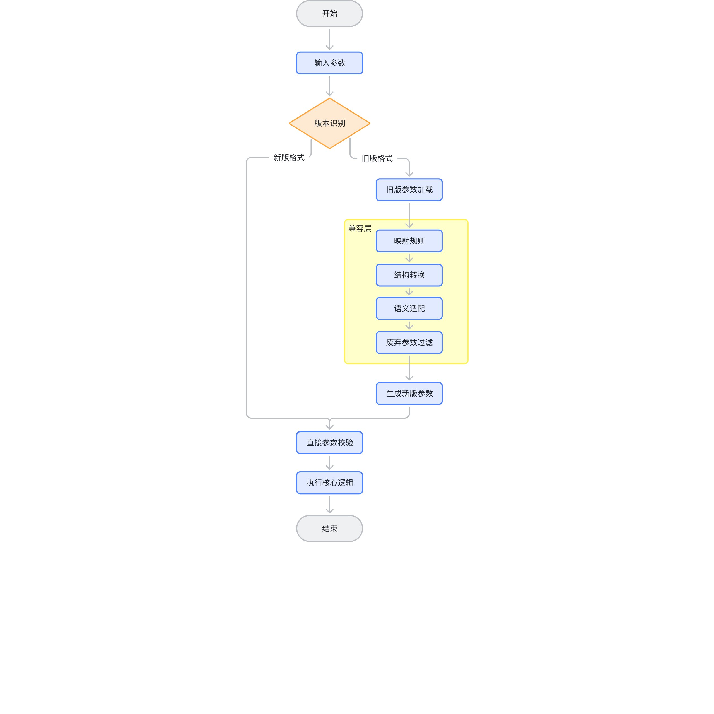
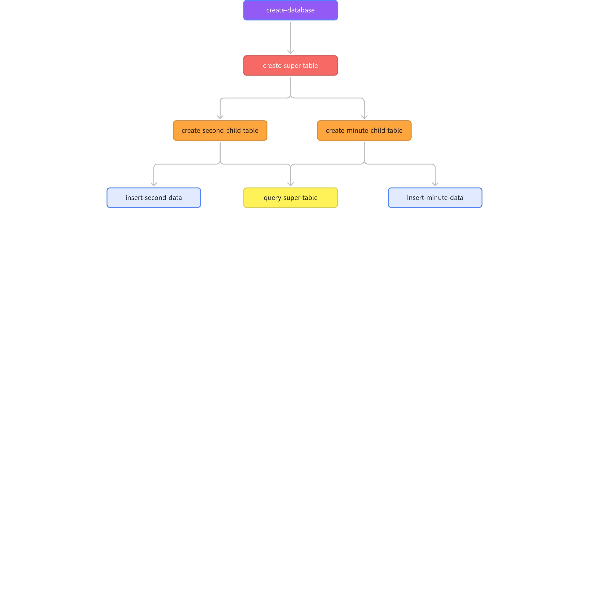

# taosBenchmark 重构 FS

## 1. 背景

随着TDengine时序数据库从v2.x进化至当前的v3.3.6.x版本，系统经历了显著的架构重构和功能增强。然而，作为TDengine性能测试工具的taosBenchmark自v2.x时代开始研发以来，其架构基本保持不变。目前，taosBenchmark主要面临四大挑战：
- 其面向过程式的架构导致模块间耦合严重，增加了维护成本和难度；
- 配置文件参数的组织缺乏清晰逻辑，导致用户在使用过程中难以辨别必要的配置项，增加了使用的复杂性和难度；
- 由于缺乏灵活性和扩展性，添加新功能变得异常困难；
- 现有的写入流程是基于预生成所有数据后再进行重复写入的方式，无法满足模拟实时数据生成的需求；
鉴于上述问题，对taosBenchmark 进行优化的需求日益迫切。此次优化旨在解决现有架构带来的维护难题，通过引入更加模块化、灵活的设计来降低模块间的耦合度，从而提升维护效率和系统的可扩展性。此外，优化还将重点关注改进数据写入流程，使其能够支持实时数据生成，以更准确地模拟真实世界的应用场景，提高性能测试的准确性和实用性。
综上所述，本优化的目标是为用户提供一个更加强大、灵活且易于维护的性能测试工具，助力 TDengine 在各种应用场景中发挥最佳性能。

## 2. 变更历史

| 日期 | 版本 | 负责人 | 主要修改内容 |
| --- | --- | --- | --- |
| 2025/5/12 | 0.1 | 裴亚明 | 初始版本 |
| 2025/5/20 | 0.2 | 裴亚明 | 增加数据生成的流控功能描述 |
| 2025/6/23 | 0.3 | 裴亚明 | 增加数据生成的表达式功能、支持 Kafka、MQTT 目标的描述 |
| 2025/6/25 | 0.4 | 裴亚明 | 目录结构调整 |
|  |  |  |  |

## 3. 定义

**作业（Job）**：作业是用户定义的、用于完成特定任务的一组操作的集合。作业由一个或多个步骤组成，并可通过依赖关系与其他作业连接，形成有向无环图（DAG）式的执行流程。
**步骤（Step）**：步骤是作业的基本组成部分，代表某一类操作的执行阶段。每个步骤通常运行一个或多个行动。
**行动（Action）**：行动是封装好的可复用操作单元，用于完成特定功能。同一类型的行动可以在不同步骤中并行执行，例如创建数据库、写入数据或查询数据等。
**任务（Task）**：任务是最小的调度和执行单元，包含具体的处理逻辑和数据操作，是构成行动的实际工作载体。
**YAML（YAML Ain't Markup Language）**：一种简洁、易读的数据序列化格式，常用于配置文件和数据交换，支持列表、字典等复杂数据结构。

## 4. 作业概述

作业是用户定义的、用于完成特定任务的一组操作的集合。如：写入某 csv文件 input.csv 的数据到超级表 test.stb。作业由一个或多个步骤组成，并可通过依赖关系与其他作业连接，形成有向无环图（DAG）式的执行流程。用户在终端输入 CTRL+C 可以终止所有作业的执行。

### 4.1 作业的通用参数

全部作业的通用参数定义在 global 域下，包含如下属性：
- confirm_prompt：布尔类型，表示写入前是否需要用户确认，默认为 false；
- log_dir (字符串)：作业运行时日志文件的存放目录；
- cfg_dir (字符串)：表示 TDengine 客户端配置文件所在的目录，默认路径是 /etc/taos/；
- connection_info：连接信息参数；
- database_info：数据库信息参数；
- super_table_info：超级表信息参数；

#### 4.1.1 连接信息参数

- connection_info：这是一个包含 TDengine 数据库连接信息的映射结构，可以作为锚点定义（例如：通过 `&db_conn` 标识），允许在其他地方引用此信息。它包括以下属性：
  - host (字符串)：表示要连接的 TDengine 服务端的 FQDN，默认值为 localhost；
  - port (整型)：表示要连接的 TDengine 服务器的端口号，默认值为 6030；
  - user (字符串)：表示用于连接 TDengine 服务端的用户名，默认值为 root；
  - password (字符串)：表示用于连接 TDengine 服务端的密码，默认值为 taosdata；
  - dsn (字符串)：表示云服务的地址，dsn 的优先级要高于的 host、port、user、password 属性。例如：
    - https://gw.cloud.taosdata.com:433?token=617ffdf
  - pool：连接池配置，包含如下属性：
    - enabled (布尔，可选)：表示是否启用连接池功能，默认值为 true，；
    - max_size（整型，可选）：表示连接池的最大容量，默认值为 100；
    - min_size（整型，可选）：表示连接池的最小容量，默认值为 2；
    - connection_timeout（整型，可选）：表示*获取连接超时时间，单位毫秒，默认值为 1000；*

#### 4.1.2 数据格式化参数

- 数据格式化（data_format）
  定义输出数据的格式类型及其相关配置，描述数据以何种格式输出到数据存储介质中；例如：通过 sql 字符串或 schemaless line 协议方式组织创建数据库的请求；
  - format_type (字符串类型，可选)：表示数据格式化的类型，默认值为 sql。可选值包括：
    - sql：以 SQL 语句形式格式化数据；
    - stmt：使用 STMT 接口格式化数据；
    - schemaless：无模式方式格式化数据；
    - csv：以 CSV 协议格式化数据。
  - 相应格式类型的描述信息：根据 format_type 不同而不同：
    - 当 format_type: sql 时，暂无额外配置项；
    - 当 format_type: stmt 时：
      - version (字符串，可选)：表示 STMT 接口版本，默认值为 v2。可选值为 v1 和 v2；
    - 当 format_type: schemaless 时：
      - protocol (字符串，可选)：表示无模式方式的协议，默认值为 line。可选值为 line、telnet、json、taos-json；
    - 当 format_type: csv 时：
      - delimiter (字符串，可选)：指定列分隔符，默认值为 `,`；
      - quote_character (字符串，可选)：用于包裹字段值的字符，防止特殊字符被误解析，默认值为 `"`；（可选实现）
      - escape_character (字符串，可选)：用于转义字段内的特殊字符，默认值为 `\`；（可选实现）

#### 4.1.3 数据通道参数

- 数据通道（data_channel）
  定义数据传输所使用的通信通道或目标路径；
  - channel_type (字符串，可选)：表示数据通道类型，默认值为 websocket。可选值包括：
    - native：使用原生接口与数据库交互；
    - websocket：通过 WebSocket 协议与数据库交互；
    - restful：通过 RESTful API 与数据库交互；
    - file_stream：通过文件数据流方式与文件系统交互；
  - 相应通道类型的描述信息：当前各类型均无额外配置项。
<callout emoji="bulb" background-color="light-orange" border-color="light-orange">
暂时不支持：native、websocket 混合使用！
</callout>

#### 4.1.4 数据库信息参数

- database_info：这是一个包含 TDengine 数据库的实例信息的映射结构，可以作为锚点定义（例如：通过 `&db_info` 标识），允许在其他地方引用此信息。它包括以下属性：
  - name (字符串，必需)：表示数据库名称；
  - drop_if_exists (布尔，可选)：表示数据库已存在时是否删除该数据库，默认为 true ；
  - properties (字符串，可选)：表示 TDengine 数据库支持的创建数据库的属性信息
    - [vgroups|precision|replica|keep] 等：表示 TDengine 数据库的选项；

#### 4.1.5 超级表信息参数

- super_table_info：这是一个包含 TDengine 数据库的超级表信息的映射结构，可以作为锚点定义（例如：通过 `&stb_info` 标识），允许在其他地方引用此信息。它包括以下属性：
  - name (字符串)：表示超级表的名称；
  - columns (列表)：表示超级表的普通列的模式定义；
  - tags (列表)：表示超级表的标签列的模式定义；

##### 4.1.5.1 列配置包含属性

每列包含以下属性：
- name (字符串，必需)：表示列的名称，当 count 属性大于1时，name 表示的是列名称前缀，比如：`name：current，count：3`，则 3 个列的名字分别为 current1、current2、current3；
- type（字符串，必需）：表示数据类型，支持以下类型（不区分大小写，与 TDengine 的数据类型兼容）：
  - 整型：timestamp、bool、tinyint、tinyint unsigned、smallint、smallint unsigned、int、int unsigned、bigint、bigint unsigned；
  - 浮点型：float、double、decimal；
  - 字符型：nchar、varchar（binary）、json；
  - 二进制型：varbinary、geometry；
- primary_key（布尔，可选）：表示列是否为主键列，默认值为 false；
- count (整数，可选)：表示指定该类型的列连续出现的数量，例如 `count：4096` 即可生成 4096 个指定类型的列；
- properties (字符串，可选)：表示 TDengine 数据库的列支持的属性信息，可以包含以下属性：
  - encode：指定此列两级压缩中的第一级编码算法，详细请参见官网创建超级表章节；
  - compress：指定此列两级压缩中的第二级加密算法，详细请参见官网创建超级表章节；
  - level：指定此列两级压缩中的第二级加密算法的压缩率高低，详细请参见官网创建超级表章节；
- gen_type (字符串，可选)：指定此列生成数据的方式，默认值为 random，支持的类型有：
  - random：随机方式生成；
  - order：按自然数顺序增长，仅适用整数类型；
  - expression：根据表达式生成，适用整数类型、浮点数类型 float、double 和字符类型；
- null_ratio (浮点，可选)：表示指定 NULL 值在生成数据中的占比，取值范围为 [0，1] 的小数。例如，0.1 表示 10% 的数据为 NULL；
- none_ratio(浮点，可选)：表示指定 None 值在生成数据中的占比，取值范围为 [0，1] 的小数。例如，0.3 表示 30% 的数据为 None；
**注意**：`null_ratio + none_ratio <= 1.0` 是硬性约束条件。因为数据生成只有三种可能结果：
<quote-container>
- 有效值（valid value）
- `NULL`（空值）
- `None`（本次不更新）
</quote-container>


##### 4.1.5.2 数据生成方式详解

1. **random：随机方式生成**
  - distribution (字符串，可选)：表示随机数的分别模型，目前仅支持均匀分布，后续按需扩充，默认值为 "uniform"；
  - min (浮点数，可选)：表示列的最小值，仅适用整数类型和浮点数类型，生成的值将大于或等于最小值；
  - max (浮点数，可选)：表示列的最大值，仅适用整数类型和浮点数类型，生成的值将小于最大值；
  - dec_min (字符串，可选)：表示指定 decimal 数据类型的列的最小值。当 min 无法表达足够的精度时，使用此字段，生成的值将大于或等于最小值；
  - dec_max (字符串，可选)：表示指定 decimal 数据类型的列的最大值。当 max 无法表达足够的精度时，使用此字段，生成的值将小于最大值；
  - corpus (字符串，可选)：表示字符类型随机数据的语料库，语料库可以包含：姓名集、国家名称集、国家省名集、公路名集、设备名集等；
  - chinese (布尔，可选)：表示生成的字符类型随机数据是否包含中文，默认不包含中文；

**当指定 values 属性，表示在指定的值域范围内随机生成**
- values (列表)：表示该列数据的值域，将从列表中随机选择；

1. **order：****按自然数顺序增长****，仅适用整数类型，达到最大值后会自动翻转到最小值**
  - min (整数，可选)：表示列的最小值，生成的值将大于或等于最小值；
  - max (整数，可选)：表示列的最大值，生成的值将小于最大值；

1. **expression：根据表达式生成**
  - formula：字符串类型，表示生成数据的表达式内容，表达式语法采用 lua 语言，内置变量 `_i` 表示调用索引，从 `0` 开始，如："2 + math.sin(_i/10)"；
为了说明表达式方式的数据描述能力，下面举一个更复杂的表达式样例：
```yaml
(math.sin(_i / 7) * math.cos(_i / 13) + 0.5 * (math.random(80, 120) / 100)) * ((_i % 50 < 25) and (1 + 0.3 * math.sin(_i / 3)) or 0.7) + 10 * (math.floor(_i / 100) % 2)
```

它结合了多种数学函数、条件逻辑、周期性行为和随机扰动，模拟一个非线性、带噪声、分段变化的动态数据生成过程，组成部分（A + B）× C + D。
- 功能分解说明：

| 部分 | 内容 | 类别 | 作用 |
| --- | --- | --- | --- |
| A | math.sin(_i / 7) * math.cos(_i / 13) | 基础信号 | 双频调制，生成复杂波形（拍频效应） |
| B | 0.5 * (math.random(80, 120) / 100) | 噪声 | 添加 80%~120% 的随机扰动（模拟噪声） |
| C | ((_i % 50 < 25) and (1 + 0.3 * math.sin(_i / 3)) or 0.7) | 动态增益调制 | 每 50 次调用切换一次增益（前 25 次高增益，后 25 次低） |
| D | 10 * (math.floor(_i / 100) % 2) | 基线阶跃变化 | 每 100 次调用切换一次基线（0 或 10），模拟阶跃变化，表示高峰/低谷 |


#### 4.1.6 示例

```yaml
global:
  confirm_prompt: false
  log_dir: log/
  cfg_dir: /etc/taos/

  connection_info: &db_conn  # 连接信息锚点
    host: 192.168.1.1
    port: 6030
    user: root
    password: taosdata

  # 公共结构定义（可通过锚点复用）
  database_info: &db_info
    name: testdb
    drop_if_exists: true
    properties: precision us vgroups 20 replica 3 keep 3650

  super_table_info: &stb_info
    name: points
    columns: &columns_info
      - name: latitude
        type: float
      - name: longitude
        type: float
      - name: quality
        type: varchar(50)
    tags: &tags_info
      - name: type
        type: varchar(7)
      - name: name
        type: varchar(20)
      - name: department
        type: varchar(7)

    data_format: &data_format
      format_type: sql
    data_channel: &data_channel
      channel_type: native

concurrency: 3
jobs:
    ......
```


### 4.2 作业的格式

作业（Job）是由用户定义并包含一组有序的步骤（`steps`）。每个作业具有唯一的作业标识符（即键名），并可指定依赖关系（`needs`），以控制与其他作业之间的执行顺序。作业的组成包括以下属性：
- 作业标识符（Job Key）：字符串类型，表示该作业在 `jobs` 列表中的唯一键名，用于内部引用和依赖管理；
- name：字符串类型，表示作业的显示名称，用于日志输出或 UI 展示；
- needs：列表类型，表示当前作业所依赖的其他作业的标识符列表。若不依赖任何作业，则为空列表；
- steps：列表类型，由一个或多个步骤（Step）组成，按顺序依次执行，定义了该作业的具体操作流程。
作业支持复用全局配置（如数据库连接信息等），并通过 YAML 锚点与别名机制减少重复定义，提高配置文件的可读性和可维护性。

#### 4.2.1 示例

```yaml
  Job Key:
    name: Description
    needs: []
    steps:
      ......
```


### 4.3 作业间的依赖

作业中引入“needs”参数，用于在一些场景下实现不同作业间的协调。
例如：多个写作业向同一个超级表的不同子表写入数据（作业的数据源可以相同，也可以不同），并且还有查询作业在同步查询操作，具体来说：
1. 超级表创建作业：超级表的创建必须在一个特定的作业内完成（例如 `"create-super-table"`），以避免重复创建或冲突。
2. 子表创建作业：子表创建作业（如`"create-second-child-table"`）需要等待超级表创建完成后才能开始创建各自的子表。
3. 数据写入作业：数据写入作业（如 `"insert-second-data"`）需要等待相应子表创建作业完成后才能开始写入数据。
4. 查询作业：查询作业（如 `"query-super-table"`）则需等待所有相关子表创建完成后才能开始查询。
一个作业通过属性“needs”的内容，表明其依赖于其他作业的操作的完成，在该作业启动运行时，实现依赖条件的检测，如果某依赖条件不满足，需要等待直到满足为止。

#### 4.3.1 示例

```yaml
global:
  confirm_prompt: false
  log_dir: log/
  cfg_dir: /etc/taos/

  connection_info: &db_conn  # 连接信息锚点
    host: 192.168.1.1
    port: 6030
    user: root
    password: taosdata

concurrency: 3

jobs:
  # 创建超级表作业
  create-super-table:
    name: Create Super Table
    needs: [create-database]
    steps:

  # 创建秒级子表作业
  create-second-child-table:
    name: Create Second Child Table
    needs: [create-super-table]
    steps:

  # 创建分钟级子表作业
  create-minute-child-table:
    name: Create Minute Child Table
    needs: [create-super-table]
    steps:

  # 写入秒级数据作业
  insert-second-data:
    name: Insert Second-Level Data
    needs: [create-second-child-table]
    steps:

  # 写入分钟级数据作业
  insert-minute-data:
    name: Insert Minute-Level Data
    needs: [create-minute-child-table]
    steps:

  # 超级表查询作业
  query-super-table:
    name: Query Super Table
    needs:
      - create-second-child-table
      - create-minute-child-table
    steps:

```


## 5. 步骤概述

### 5.1 概述

步骤（Step）是作业中基础的操作单位，代表某一种具体操作类型的执行过程。每个步骤按顺序运行，并可以引用预定义的 Action 来完成特定功能。步骤的组成包括以下属性：
- name：字符串类型，表示该步骤的显示名称，用于日志输出和界面展示；
- uses：字符串类型，指向要使用的 action 路径或标识符，指示系统调用哪一个操作模块来执行此步骤；
- with：映射（字典）类型，包含传递给该 action 的参数集合。参数内容因 action 类型而异，支持灵活配置。
通过组合多个步骤，作业能够实现复杂的逻辑流程，例如创建数据库、写入数据、查询验证等

### 5.2 示例

```yaml
jobs:
  # 创建数据库作业
  create-database:
    name: Create Database
    needs: []
    steps:
      - name: Create Database
        uses: actions/create-database
        with:
          connection_info: *db_conn             # 继承全局连接信息，默认属性，可省略
          database_info:
            name: testdb
            drop_if_exists: true
            properties: precision us vgroups 20 replica 3 keep 3650
```


## 6. 行动概述

行动（Action） 是封装好的可复用操作单元，用于完成特定功能。每个行动代表一类独立的操作逻辑，可以在不同的步骤（Step）中被调用和执行。通过将常用操作抽象为标准化的行动模块，系统实现了良好的扩展性与配置灵活性。
同一类型的行动可以在多个步骤中并行或重复使用，从而支持多样化的任务流程编排。例如：创建数据库、定义超级表、生成子表、插入数据以及执行查询等核心操作，均可通过对应的行动进行统一调度。
目前系统支持以下内置行动：
- actions/create-database：用于创建数据库；
- actions/create-super-table：用于创建超级表；
- actions/create-child-table：用于基于超级表生成子表；
- actions/insert-data：用于向指定的数据表中插入数据；
- actions/query-data：用于执行数据查询语句，验证数据准确性或性能表现。
- actions/subscribe-data：用于执行数据订阅语句并消费数据；
每个行动在调用时可通过 with 字段传入参数，具体参数内容因行动类型而异。

### 6.1 行动：创建数据库

`actions/create-database` 行动用于在指定的 TDengine 数据库服务器上创建一个新的数据库。通过传递必要的连接信息和数据库配置参数，用户可以轻松地定义新数据库的各种属性，如数据库名称、是否在存在时删除旧数据库、时间精度等。

#### 6.1.1 **使用方法**

该行动需要嵌入在一个步骤（Step）中，并通过 with 参数提供必要的配置信息。它可以继承全局配置中的数据库连接信息，确保配置的一致性和简化配置文件。

#### 6.1.2 **参数说明**

##### 6.1.2.1 connection_info (可选)

同《4.1.1 连接信息参数》章节的描述，通常是一个引用自全局配置部分的锚点（例如 *db_conn）；如果未指定，则默认使用全局配置中的同名参数信息；

##### 6.1.2.2 data_format ( 可选)

同《4.1.2 数据格式化参数》章节的描述，但不支持格式化类型 csv；如果未指定，则默认使用全局配置中的同名参数信息；

##### 6.1.2.3 data_channel (可选)

同《4.1.3 数据通道参数》章节的描述，但不支持通道类型 file_stream；如果未指定，则默认使用全局配置中的同名参数信息；

##### 6.1.2.4 database_info (必需)

包含数据库创建所需的所有细节，具体如下： 
- name (必需，字符串)：
  要创建的数据库的名称。
- drop_if_exists (可选，布尔值)：
  如果目标数据库已存在，是否自动删除旧数据库。默认为 false，即不删除。
- properties (可选，字符串)：
  数据库的额外属性设置，以空格分隔的关键字-值对形式给出。例如，precision ms vgroups 20 replica 3 keep 3650 分别设置了虚拟组数量、副本数及数据保留期限。
  - precision：
    指定数据库的时间精度，可选值为："ms"、"us"、"ns"，默认值为 "ms"；
  - vgroups：
    指定数据库的虚拟组的个数，默认不指定；
  - replica：
    指定数据库的副本格式，默认不指定；

##### 6.1.2.5 示例

```yaml
  # 创建数据库作业
  create-database:
    name: Create Database
    needs: []
    steps:
      - name: Create Database
        uses: actions/create-database
        with:
          connection_info: *db_conn             # 继承全局连接信息，默认属性，可省略
          database_info:
            name: testdb
            drop_if_exists: true
            properties: precision us vgroups 20 replica 3 keep 3650
```


### 6.2 行动：创建超级表

`actions/create-super-table` 行动用于在指定数据库中创建一个新的超级表（Super Table）。通过传递必要的连接信息和超级表配置参数，用户能够定义超级表的各种属性，如表名、普通列和标签列等。

#### 6.2.1 **使用方法**

该行动需要嵌入在一个步骤（step）中，并通过 `with` 参数提供必要的配置信息。它可以继承全局配置中的数据库连接信息，确保配置的一致性和简化配置文件。此外，超级表的信息（包括普通列和标签列）可以通过 YAML 锚点引用，便于复用和管理。

#### 6.2.2 **参数说明**

##### 6.2.2.1 connection_info (可选)

同《4.1.1 连接信息参数》章节的描述，通常是一个引用自全局配置部分的锚点（例如 *db_conn）；如果未指定，则默认使用全局配置中的同名参数信息；

##### 6.2.2.2 data_format ( 可选)

同《4.1.2 数据格式化参数》章节的描述，但不支持格式化类型 csv；如果未指定，则默认使用全局配置中的同名参数信息；

##### 6.2.2.3 data_channel (可选)

同《4.1.3 数据通道参数》章节的描述，但不支持通道类型 file_stream；如果未指定，则默认使用全局配置中的同名参数信息；

##### 6.2.2.4 database_info (必需)

包含目标数据库的相关信息，具体如下： 
- name (必需，字符串)：
  指定要在哪个数据库中创建超级表。

##### 6.2.2.5 super_table_info (必需)

包含超级表创建所需的所有细节，具体如下：
- name (必需，字符串)：
  要创建的超级表的名称。
- columns (必需，锚点引用)：
  普通列定义，通常是预先定义好的一组普通列（例如 *common_columns）。
- tags (必需，锚点引用)：
  标签列定义，通常是预先定义好的一组标签列（例如 *common_tags），用于区分不同的子表，每个子表可以根据其特定的标签值进行标识。

##### 6.2.2.6 示例

```yaml
  # 创建超级表作业
  create-super-table:
    name: Create Super Table
    needs: [create-database]
    steps:
      - name: Create Super Table
        uses: actions/create-super-table
        with:
          connection_info: *db_conn             # 继承全局连接信息，默认属性，可省略
          database_info:
            name: testdb
          super_table_info:
            name: points
            columns: *common_columns            # 锚点引用普通列
            tags: *common_tags                  # 锚点引用标签列
```


### 6.3 行动：创建子表

`actions/create-child-table` 行动用于基于指定的超级表，在目标数据库中批量创建多个子表（Child Tables）。每个子表可以拥有不同的名称和标签列数据，从而实现对时间序列数据的有效分类与管理。该行动支持从生成器（Generator）或 CSV 文件两种来源定义子表名称及标签列信息，具备高度灵活性和可配置性。

#### 6.3.1 **使用方法**

该行动需要嵌入在一个步骤（step）中，并通过 `with` 参数提供必要的配置信息。它既可以继承全局连接信息，也可以自定义数据库与超级表上下文。子表名称与标签列数据支持从生成器动态生成或从 CSV 文件导入，适用于不同场景下的数据建模需求。

#### 6.3.2 **参数说明**

##### 6.3.2.1 connection_info (可选)

同《4.1.1 连接信息参数》章节的描述，通常是一个引用自全局配置部分的锚点（例如 *db_conn）；如果未指定，则默认使用全局配置中的同名参数信息；

##### 6.3.2.2 data_format ( 可选)

同《4.1.2 数据格式化参数》章节的描述，但不支持格式化类型 csv；如果未指定，则默认使用全局配置中的同名参数信息；

##### 6.3.2.3 data_channel (可选)

同《4.1.3 数据通道参数》章节的描述，但不支持通道类型 file_stream；如果未指定，则默认使用全局配置中的同名参数信息；

##### 6.3.2.4 database_info (必需)

包含目标数据库的相关信息： 
- name (必需，字符串)：
  指定要在哪个数据库中创建子表。

##### 6.3.2.5 super_table_info (必需)

包含超级表的信息，用于关联所创建的子表：
- name (必需，字符串)：
  指定基于哪个超级表创建子表。

##### 6.3.2.6 child_table_info (必需)

包含创建子表所需的核心信息，包括子表名称和标签列数据的来源及具体配置：

###### 6.3.2.6.1 **table_name（子表名称）**

- source_type *(字符串，必需)*：
  子表名称的数据来源支持以下两种方式：generator、csv；
- generator：仅在 source_type="generator" 时生效，包含如下属性：
  使用生成器动态生成子表名称列表，需提供以下属性：
  - prefix (字符串)：
    子表名前缀，默认为 "d"；
  - count (整数)：
    要创建的子表数量，默认为 10000；
  - from (整数)：
    子表名称的起始下标（包含），默认为 0。
- csv：仅在 source_type="csv" 时生效，包含如下属性：
  从 CSV 文件读取子表名称列表，需提供以下属性：
  - file_path (字符串)：
    CSV 文件路径。
  - has_header (布尔)：
    是否包含表头行，默认为 true。
  - delimiter (字符串)：
    列分隔符，默认为 ","。
  - tbname_index (整数)：
    指定子表名称所在的列索引（从 0 开始），默认为 0。

###### 6.3.2.6.2 **tags（标签列）**

- source_type *(字符串，必需)*：
  标签列的数据来源支持以下两种方式：generator、csv； 
- generator：仅在 source_type="generator" 时生效，包含如下属性：
  使用生成器动态生成标签列数据，需提供以下属性：
  - schema (列表类型，可选)：
    标签列的 Schema 定义，每个元素表示一个标签列，包含字段名（name）、类型（type）以及生成规则（如随机等）。若未指定，则使用全局作用域中预定义的标签列的 Schema。
- csv：仅在 source_type="csv" 时生效，包含如下属性：
  从 CSV 文件读取标签列数据，需提供以下属性：
  - schema (列表类型，可选)：标签列的 Schema 定义，每个元素表示一个标签列，包含字段名（name）、类型（type）等信息。
  - file_path (字符串)：
    CSV 文件路径；
  - has_header (布尔)：
    是否包含表头行，默认为 true。
  - delimiter (字符串)：
    列分隔符，默认为 ","；
  - exclude_indices (字符串)：
    若文件中同时包含子表名称列和标签列，或者仅想使用部分标签列时，此参数用于指定剔除的子表名称列/无用标签列等的索引（从 0 开始），列索引之间使用英文逗号`,`分隔，默认值为空，表示不剔除；

##### 6.3.2.7 batch (可选)

控制批量创建子表时的行为：
- size (整数)：
  每批创建的子表数量，默认值为 1000。
- concurrency (整数)：
  并发执行的批次数量，提升创建效率，默认值为 10。

##### 6.3.2.8 示例

```yaml
  # 创建秒级子表作业
  create-second-child-table:
    name: Create Second Child Table
    needs: [create-super-table]
    steps:
      - name: Create Second Child Table
        uses: actions/create-child-table
        with:
          connection_info: *db_conn             # 继承全局连接信息，默认属性，可省略
          database_info:
            name: testdb
          super_table_info:
            name: points
          child_table_info:
            table_name:
              source_type: generator            # 子表名称数据来源有两种：generator、csv
              generator:
                prefix: s
                count: 10000
                from: 200
            tags: 
              source_type: csv                  # 标签列数据来源有两种：generator、csv
              csv:
                file_path: /root/meta/cnnc_csv_1s.csv
                has_header: true
          batch:
            size: 1000
            concurrency: 10
```


### 6.4 行动：插入数据

`actions/insert-data` 行动用于将数据插入到指定的子表中。它支持从生成器或 CSV 文件两种来源获取子表名称、普通列和标签列数据，并允许用户通过多种时间戳策略控制数据的时间属性。此外，还提供了丰富的写入控制策略以优化数据插入过程，具备高度灵活性和可配置性。

#### 6.4.1 **使用方法**

该行动需要嵌入在一个步骤（step）中，并通过 `with` 参数提供必要的配置信息。它既可以继承全局连接信息，也可以自定义数据库与超级表上下文。数据源可以是动态生成的数据或是从 CSV 文件导入的数据，适用于不同场景下的数据插入需求。

#### 6.4.2 **参数说明**

##### 6.4.2.1 **source (必需)**

包含了需要插入的数据的所有相关信息：

###### 6.4.2.1.1 **table_name（子表名称）**

描述同：《6.3.2.6.1 table_name（子表名称）》中的同名配置项的描述。

###### 6.4.2.1.2 **tags（标签列）**

仅当自动建表模式，需要提供此项配置。描述同：《6.3.2.6.2 tags（标签列）》中的同名配置项的描述。

###### 6.4.2.1.3 **columns（普通列）**

###### 6.4.2.1.4 source_type (字符串，必需)

普通列的数据来源支持以下两种方式：generator、csv；

###### 6.4.2.1.5 generator

仅在 source_type="generator" 时生效，包含如下属性：
使用生成器动态生成普通列数据，需提供以下属性：
- schema (列表类型，必须)：
  普通列的 Schema 定义，每个元素表示一个普通列，包含字段名（name）、类型（type）以及生成规则（如随机等）。
- timestamp_strategy (时间戳列策略，可选)：
  generator 类型数据源下的时间戳列策略仅有一种类型，即是生成的，包含如下属性：
  - start_timestamp (整数或关键字 "now"，可选)：表示子表的时间戳列的起始值，默认值为 "now"；
  - timestamp_precision (字符串，可选)：
    表示时间戳列的时间精度，可选值为："ms"、"us"、"ns"，默认与数据目标中的时间戳列的精度一致；
  - timestamp_step (整数，可选)：表示子表中插入数据的时间戳步长，单位与时间精度一致，默认值是 1；

###### 6.4.2.1.6 csv

仅在 source_type="csv" 时生效，包含如下属性：
从 CSV 文件读取普通列数据，需提供以下属性：
- schema (列表类型，可选)：
  普通列的 Schema 定义，每个元素表示一个普通列，包含字段名（name）、类型（type）。若未指定，则使用全局作用域中预定义的普通列的 Schema。
- file_path (字符串，必需)：
  CSV 文件路径，支持单个文件或目录路径。
- has_header (布尔，可选)：
  是否包含表头行，默认为 true。
- delimiter (字符串，可选)：
  列分隔符，默认为 ","。
- tbname_index （整数，可选）：
  指定子表名称所在的列索引（从 0 开始），默认值为 -1；-1 表示不包含子表名数据，此时所有子表写入相同数据。
- timestamp_strategy (时间戳列策略，必需)：用于控制时间戳的生成逻辑；
  - strategy_type (字符串，必需)：时间戳生成策略类型，默认为 original，可选值包括：
    - original：使用原始文件中的时间列作为时间戳；
    - generator：根据用户规则 start_timestamp 和 timestamp_step 生成时间戳；
   - original (对象，可选)：仅在 strategy_type="original" 时生效，包含以下属性：
    - timestamp_index (整数，可选)：指定原始时间列的索引（从 0 开始），默认值为 0；
    - timestamp_precision (字符串，可选)：表示原始时间列的时间精度，默认与数据目标中的时间戳列的精度一致，可选值为 "s"、"ms"、"us"、"ns"；
    - offset_config (可选)：
      - offset_type (字符串)：表示时间戳偏移类型，可选值为："relative"、"absolute"；
      - value（字符串或整型）：表示时间戳的偏移量（relative）或起始时间戳（absolute）：
        - 时间戳偏移类型为 "relative" 时：字符串类型，格式为 `±[数值][单位]` 组合（示例：`"+1d3h"` 表示加1天3小时），支持以下时间单位：
          - `y`：年偏移量；
          - `m`：月偏移量；
          - `d`：天偏移量；
          - `s`：秒偏移量；
        - 时间戳偏移类型为 "absolute" 时：整型或字符串类型，格式如下：
          - 时间戳数值（精度由 timestamp_precision 参数决定）
          - ISO 8601 格式字符串（`"YYYY-MM-DD HH:mm:ss"`）
   - generator (对象，可选)：仅在 strategy_type="generator" 时生效，包含以下属性：
    - start_timestamp (整数或字符串，可选)：表示子表的时间戳列的起始值，默认值为 "now"；
    - timestamp_precision (字符串，可选)：
      表示时间戳列的时间精度，可选值为："ms"、"us"、"ns"，默认与数据目标中的时间戳列的精度一致；
    - timestamp_step (整数，可选)：表示子表中插入数据的时间戳步长，单位与时间精度一致，默认值是 1；
---

##### 6.4.2.2 **target (必需)**

描述数据写入的目标数据库或其他存储介质信息：

###### 6.4.2.2.1 timestamp_precision （时间戳精度，可选）

字符串类型：表示时间戳列的精度，可选值为："ms"、"us"、"ns"，当数据目标是 tdengine 时，默认为数据库的精度，否则默认为 "ms"；

###### 6.4.2.2.2 target_type (目标类型，必需)

字符串类型，目标数据类型支持以下几种方式：
- tdengine：TDengine 数据库；
- file_system：文件系统，目前仅需支持 csv 文件；
- kafka：分布式消息队列系统；
- mqtt：轻量级的物联网通信协议；

###### 6.4.2.2.3 tdengine

仅在 target_type="tdengine" 时生效，包含如下属性：
- connection_info (锚点引用，必需)：
数据库连接信息，通常是一个引用自全局配置部分的锚点（例如 `*db_conn`）。
- database_info (对象类型，必需)：
包含目标数据库的相关信息：
  - name (字符串，必需)：
数据库名称；
  - precision (字符串，可选)：
数据库的时间精度，与上边 timestamp_precision 的值保持一致；
- super_table_info (必需)：
包含超级表的信息：
  - name (字符串，必需)：
超级表名称。
  - columns (锚点引用，可选)：
引用预定义的普通列 Schema；
  - tags (锚点引用，可选)：
引用预定义的标签列 Schema；

###### 6.4.2.2.4 file_system

仅在 target_type="file_system" 时生效，目前仅需支持本地文件系统的 csv 文件类型，包含如下属性：
- output_dir (字符串，必需)：
  指定生成的 CSV 文件存放的目录路径；
- file_prefix (字符串，可选)：
  设置生成的 csv 文件名称的前缀，默认值为 data；
- timestamp_format (字符串，可选)：
  设置生成的 CSV 文件名称中时间戳字符串的格式。遵循 strftime 标准格式化字符串规则。若未设置，则不会根据时间段切分文件。支持的模式包括：
  - %Y: 年份，四位数表示（例如：2025）；
  - %m: 月份，两位数表示（01 到 12）；
  - %d: 天，两位数表示（01 到 31）；
  - %H: 小时，24 小时制，两位数表示（00 到 23）；
  - %M: 分钟，两位数表示（00 到 59）；
  - %S: 秒，两位数表示（00 到 59）。
- timestamp_interval (字符串，可选)：
  设置生成的 csv 文件名称中时间段间隔，这决定了文件如何基于时间进行分割存储。支持天、小时、分钟、秒级间隔，如 1d/2h/30m/40s，默认值为 1d；
- include_header (布尔，默认值为 true)：
  设置生成的 csv 文件是否包含列头描述，默认值为 true；
- tbname_col_alias (字符串，默认值为 "device_id")：
  设置 csv 文件列头描述中 tbname 字段的别名，默认值为 device_id；
- compression_level (字符串，可选)：
  设置生成 csv 编码数据并自动压缩成 gzip 格式文件的压缩等级。此过程直接编码并压缩，而非先生成 csv 文件再压缩。可选值为：
  - none：不压缩；
  - fast：gzip 1 级压缩；
  - balance：gzip 6 级压缩；
  - best：gzip 9 级压缩；
可选的，当导出 csv 数据文件的同时，还需要一同导出其在 TDengine 的建库语句时，可填写 database_info/super_table_info 对象信息，要求同 TDengine 数据库类型中的同名对象。

###### 6.4.2.2.5 kafka

仅在 target_type="kafka" 时生效，包含如下属性：
- topic (字符串，必需)： 指定要写入的 Kafka Topic 名称；
- bootstrap_servers (字符串，必需，若未在 connection_info 中定义)： Kafka 集群地址列表，格式为 "host:port"，多个地址用逗号分隔；
- timestamp_precision (字符串，可选)： 表示消息时间戳的精度，可选值为："ms"、"us"、"ns"，默认为 "ms"；
- key_serializer (字符串，可选)： 消息 Key 的序列化方式，支持 "str"、"bytes" 等，默认为 "str"；
- value_serializer (字符串，可选)： 消息 Value 的序列化方式，支持 "json"、"str"、"bytes" 等，默认为 "json"；
- acks (字符串，可选)： 生产者确认机制设置，如 "all"、"1"、"0"，默认为 "all"；
- compression (字符串，可选)： 消息压缩类型，支持 "none"、"gzip"、"snappy"、"lz4"、"zstd"，默认为 "none"；

###### 6.4.2.2.6 mqtt

仅在 `target_type="mqtt"` 时生效，包含如下属性：
- host (字符串，可选)： MQTT Broker 主机地址，默认值为 localhost；
- port (整数，可选)： MQTT Broker 端口，默认值为 1883；
- username (字符串，可选)： 登录 Broker 的用户名；
- password (字符串，可选)： 登录 Broker 的密码；
- client_id (字符串，可选)： 客户端唯一标识符，若未指定则自动生成；
- topic (字符串，必需)： 要发布消息的 MQTT Topic；
- compression (字符串，可选)：MQTT 消息发送时使用的压缩算法，默认不压缩，支持的压缩算法有：gzip、lz4、zstd；
- encoding (字符串，可选)：MQTT 消息发送时使用的字符串编码，默认 UTF-8
- timestamp_precision (字符串，可选)： 表示消息时间戳的精度，可选值为："ms"、"us"、"ns"，默认为 "ms"；
- qos (整数，可选)： QoS 等级，取值范围为 0、1、2，默认为 0；
- keep_alive (整数，可选)： 超时没有消息发送后会发送心跳，单位为秒，默认值为 5；
- clean_session（布尔，可选）：是否清除就会话状态，默认值为 true；
- retain （布尔，可选）：MQTT Broker 是否保留最后一条消息，默认值为 false；

---

##### 6.4.2.3 **control (必需)**

用于定义数据写入过程中的行为策略，包括数据格式化（data_format）、数据通道（data_channel）、数据质量（data_quality）、数据生成策略（data_generation）、写入控制策略（insert_control）、时间间隔策略（time_interval）等部分。

###### 6.4.2.3.1 data_format（数据格式化，可选）

同《4.1.2 数据格式化参数》章节的描述；如果未指定，则默认使用全局配置中的同名参数信息；
---

###### 6.4.2.3.2 data_channel（数据通道，可选）

同《4.1.3 数据通道参数》章节的描述；如果未指定，则默认使用全局配置中的同名参数信息；
---

###### 6.4.2.3.3 data_quality（数据质量，可选）

数据质量：用于模拟真实场景下的数据质量问题，如乱序数据。 
- data_disorder (可选)：控制生成数据的时间戳乱序情况：
  - enabled (布尔，可选)：默认值为 false，表示是否启用乱序功能；
  - intervals (列表，可选)：定义多个不重叠的时间区间，每个区间包含：
    - time_start (整型或字符串)：表示区间起点（含），支持时间戳、ISO8601 格式、`now` 或带偏移量的 `now - 30d` 等；
    - time_end (整型或字符串)：表示区间终点（不含），必须大于 time_start；
    - ratio (浮点)：表示该区间内乱序数据占比；
    - latency_range (整数)：表示时间戳延迟范围（单位秒，非负）；
---

###### 6.4.2.3.4 data_generation（数据生成策略，可选）

数据生成策略：定义数据生成的行为相关设置。
- interlace_mode（可选）：控制交错生成子表数据的方式；
  - enabled (布尔，可选)：表示是否启用交错模式，默认值为 false；
  - rows (整数，可选)：表示每个子表单次生成的行数，默认值为 1；
- data_cache （可选）：数据缓存，定义是否启用提起数据加载缓存以及缓存容量；
  - enabled (布尔，可选)：表示是否启用数据缓存，默认值为 false；
  - cache_size (整数，可选)：表示缓存条目数上限，默认值为 1000000；
- flow_control (可选)，控制数据生成的速率和资源占用策略；
  - enabled (布尔，可选)：表示是否启用流量控制，默认值为 false；
  - rate_limit (整数，可选)：若设置为非零值（如 `5000`），则所有线程的总生成速率不超过该值（行/秒）；
- generate_threads (整数，可选)，表示生成数据的线程数量，默认值为 1；
- per_table_rows (整数，可选)，每个子表插入的行数，默认值为 10000；
- queue_capacity (整数，可选)，表示存放生成数据的队列的容量，默认值为 100；
- queue_warmup_ratio（浮点，可选），表示队列中数据预热生成的比例，默认值为 0.5，表示提前生成队列容量 50%的数据；
---

###### 6.4.2.3.5 insert_control（写入控制策略，可选）

写入控制策略：控制实际数据的写入目标数据库或文件的行为细节。
- log_path (字符串，可选)，表示日志文件的存放路径，默认值为 result.txt；
- enable_dryrun (布尔，可选)：默认值为 false，表示是否启用模拟执行（不实际写入）；
- auto_create_table (布尔，可选)：表示是否启动自动建表模式，默认为 false；
- preload_table_meta (布尔，可选)：表示是否提前加载子表的 meta 数据，当表数量非常多时，打开此选项可提高写入速度。默认为 true ；
- per_request_rows (整数，可选)，默认值为 10000，表示每次请求写入的最大行数；
- insert_threads (整数，可选)，默认值为 8，表示并发写入线程数量；
- thread_allocation (字符串，可选)：默认值为 index_range，表示线程分配机制，可选值为：
  - vgroup_binding：按 vgroup 分组绑定线程；
  - index_range：按子表索引范围分配线程；
- failure_handling (可选)：表示失败处理策略：
  - max_retries (整数，可选)：默认值为 0，表示最大重试次数；
  - retry_interval_ms (整数，可选)：默认值为 1000，仅在 max_retries > 0 时有效；
  - on_failure (字符串，可选)：默认值为 exit，表示失败后的行为，可选值为：
    - exit：失败后自动退出程序；
    - continue：失败后警告用户并继续执行；
<quote-container>
- 验证逻辑：如果 on_failure 设置为 "exit"，则强制将 max_retries 设为 0，并在日志中记录警告信息。
```plaintext
if failure_handling["on_failure"] == "exit" and failure_handling["max_retries"] > 0:
    print("Warning: 'on_failure' is set to 'exit'. Forcing 'max_retries' to 0.")
    failure_handling["max_retries"] = 0
```

</quote-container>

---

###### 6.4.2.3.6 time_interval（时间间隔策略，可选）

控制写入过程中时间间隔分布策略。
- enabled (布尔，可选)：默认值为 false，表示是否启用时间间隔控制；
- interval_strategy (字符串，可选)：表示时间间隔策略类型，默认值为 fixed。可选值为：
  - fixed：固定的时间间隔；
  - first_to_first：本次发送数据的首行的时间列 - 上次发送数据的首行的时间列；
  - last_to_first：本次发送数据的首行的时间列 - 上次发送数据的末行的时间列；
  - literal：根据本次发送数据的首行的时间列的值的时间点来发送，模拟实时产生数据的场景；
- fixed_interval：仅在 interval_strategy = fixed 时生效：
  - base_interval (整数，必需)：表示固定间隔数值，单位毫秒；
  - ~~random_deviation (整数，可选)：默认值为 0，表示随机偏移量；~~
- dynamic_interval：仅在 interval_strategy = first_to_first / last_to_first 时生效：
  - min_interval (整数，可选)：默认值为 -1，表示最小时间间隔阈值；
  - max_interval (整数，可选)：默认值为 -1，表示最大时间间隔阈值；
- wait_strategy (字符串，可选)：表示在开启时间间隔控制时，发送写入请求之间的等待策略，默认值为：sleep，可选值为：
  - sleep：睡眠，归还当前线程的执行权给操作系统；
  - busy_wait：忙等待，保持当前线程的执行权；

##### 6.4.2.4 示例

```yaml
  # 写入秒级数据作业
  insert-second-data:
    name: Insert Second-Level Data
    needs: [create-second-child-table]
    steps:
      - name: Insert Second-Level Data
        uses: actions/insert-data
        with:
          # source
          source:
            table_name:
              source_type: generator              # 子表名称数据来源有两种：generator、csv
              generator:
                prefix: s
                count: 10000
                from: 200
            columns:                              # 普通列数据来源有两种：generator、csv
              source_type: csv
              csv:
                file_path: /root/data/cnnc_csv_1s/
                has_header: true

                timestamp_strategy:
                  strategy_type: original
                  original:
                    timestamp_index: 0
                    timestamp_precision: us

          # target
          target:
            target_type: tdengine
            tdengine:
              connection_info: *db_conn           # 继承全局连接信息，默认属性，可省略
              database_info:
                name: testdb
                precision: us
            
              super_table_info:
                name: points
                columns: *columns_info            # 锚点引用普通列
                tags: *tags_info                  # 锚点引用标签列

          # control
          control: &insert_second_control
            data_format:
              format_type: sql
            data_channel:
              channel_type: native
            data_generation:
              interlace_mode:
                enabled: true
                rows: 60
              generate_threads: 8
              per_table_rows: 10000
            insert_control:
              per_request_rows: 10000
              auto_create_table: false
              insert_threads: 8
              thread_allocation: vgroup_binding
            time_interval:
              enabled: true
              interval_strategy: first_to_first
```


### 6.5 行动：查询数据

`actions/query-data` 行动用于从指定的数据库和超级表中查询数据。它支持通过不同的连接信息来访问TDengine 数据库，并允许用户根据需要选择不同的数据格式化方式、数据通道类型以及查询控制策略。此外，还提供了详细的执行模式配置以满足各种查询场景的需求。

#### 6.5.1 **使用方法**

该行动通常嵌入在一个步骤（step）中，并通过 `with` 参数提供必要的配置信息。它可以继承全局连接信息或自定义连接信息，适用于不同场景下的数据查询需求。用户可以根据实际需要设置查询参数，如执行模式、线程数、执行次数等，以优化查询过程或测试各种场景下的性能。

#### 6.5.2 **参数说明**

##### 6.5.2.1 source (必需)

包含了查询所需的数据源相关信息：
- connection_info (可选)：
  同《4.1.1 连接信息参数》章节的描述；如果未指定，则默认使用全局配置中的同名参数信息；

##### 6.5.2.2 control (必需)

控制查询行为的策略集合：

###### 6.5.2.2.1 data_format ( 数据格式化，可选)

同《4.1.2 数据格式化参数》章节的描述，但不支持格式化类型 csv；如果未指定，则默认使用全局配置中的同名参数信息；

###### 6.5.2.2.2 data_channel (数据通道，可选)

同《4.1.3 数据通道参数》章节的描述，但不支持通道类型 file_stream；如果未指定，则默认使用全局配置中的同名参数信息；

###### 6.5.2.2.3 query_control (查询控制，必需)

查询控制策略的配置：
- log_path (字符串，可选)：
  日志文件存放路径，默认值为 result.txt;
- enable_dryrun (布尔，可选)：
  是否启动模拟执行而不是实际执行查询动作，默认值为 false；
- execution (可选)：
  执行控制配置，包含如下属性：
  - mode (字符串，可选)：
    查询的执行模式，默认为 sequential_per_thread，可选项包括：
    - sequential_per_thread：
      - 每个SQL独立启动线程组，线程内顺序执行多次
      - 对应旧版参数组合 mixed=no，batch=no
      - 总执行次数：SQL数 × threads × times
    - sequential_overall：
      - 每个SQL独立启动线程组，所有SQL整体顺序执行，线程间同步循环
      - 对应旧版参数组合 mixed=no，batch=yes
      - 总执行次数：SQL数 × threads × times
    - parallel_per_group：
      - SQL分组并行，组内顺序多次执行
      - 对应旧版参数组合 mixed=yes，batch=no
      - 总执行次数：SQL数 × times
    - parallel_overall：
      - SQL分组并行，循环执行整个序列
      - 对应旧版参数组合 mixed=yes，batch=yes
      - 总执行次数：SQL数 × times
  - threads (整数，可选)：
    表示并发线程数，默认值为 1；
  - times (整数，可选)：
    表示单个 SQL 查询的执行次数，默认值为 1；
  - interval (整数，可选)：
    表示多次执行SQL的时间间隔，单位为毫秒，默认值为 0；
- query_type (字符串，必需)：
  查询场景类型，包括固定 SQL 查询（fixed）或超级表模板查询（super_table）;
   - fixed (当 query_type 为 fixed 时必需)：
    固定 SQL 查询场景的相关配置；
    - queries (列表，必需)：
      指定执行的查询SQL信息，每个元素包含：
      - sql (字符串，必需)：
        执行的查询SQL；
      - output_file (字符串，必需)：
        结果保存文件名称；
   - super_table (当 query_type 为 super_table 时必需)：
    超级表模板查询场景的相关配置；
    - database_name (字符串，必需)：
      表示数据库的名称；
    - super_table_name (字符串，必需)：
      表示超级表的名称；
    - placeholder (字符串，必需)：
      子表的占位符；
    - templates (对象类型，必需)：
      查询 SQL 模板信息，每个元素包含：
      - sql_template (字符串，必需)：
        执行的查询SQL模板；
      - output_file (字符串，必需)：
        结果保存文件名称；

##### 6.5.2.3 示例

```yaml
  # 超级表查询作业
  query-super-table:
    name: Query Super Table
    needs:
      - create-second-child-table
      - create-minute-child-table
    steps:
      - name: query-super-table
        uses: actions/query-data
        with:
          # source
          source:
            connection_info: *db_conn             # 继承全局连接信息，默认属性，可省略
          
          # control
          control:
            data_format:
              format_type: sql
            data_channel:
              channel_type: native
            query_control:
              execution:
                mode: parallel_per_group
                threads: 10
                times: 50
                interval: 100
              query_type: super_table
              super_table:
                database_name: testdb
                super_table_name: points
                placeholder: ${child_table}
                templates:
                  - sql_template: select count(*) from ${child_table}
                    output_file: stb_result.txt
```

### 6.6 行动：订阅数据

`actions/subscribe-data` 行动用于从指定的数据源订阅数据，并根据用户定义的控制策略进行处理。它支持通过不同的连接信息访问TDengine数据库，允许用户选择不同的数据格式化方式和数据通道类型，同时也提供了详细的订阅控制策略配置以满足各种订阅场景的需求。

#### 6.6.1 **使用方法**

该行动通常嵌入在一个步骤（step）中，并通过 `with` 参数提供必要的配置信息。它可以继承全局连接信息或自定义连接信息，适用于不同场景下的数据订阅需求。用户可以根据实际需要设置订阅参数，如并发消费者数量、轮询超时时间、主题列表等，以优化订阅过程或测试各种场景下的性能。

#### 6.6.2 **参数说明**

##### 6.6.2.1 source (必需)

包含了订阅所需的数据源相关信息：
- connection_info (可选)
  同《4.1.1 连接信息参数》章节的描述；如果未指定，则默认使用全局配置中的同名参数信息；

##### 6.6.2.2 control (必需)：

控制订阅行为的策略集合：

###### 6.6.2.2.1 data_format ( 数据格式化，可选)

同《4.1.2 数据格式化参数》章节的描述，但不支持格式化类型 csv；如果未指定，则默认使用全局配置中的同名参数信息；

###### 6.6.2.2.2 data_channel (数据通道，可选)

同《4.1.3 数据通道参数》章节的描述，但不支持通道类型 file_stream；如果未指定，则默认使用全局配置中的同名参数信息；

###### 6.6.2.2.3 subscribe_control (订阅控制，必需)

订阅控制策略的配置：
- log_path (字符串，可选)：
  日志文件存放路径，默认值为 result.txt;
- enable_dryrun (布尔，可选)：
  是否启动模拟执行而不是实际执行查询动作，默认值为 false；
- execution (可选)：
  执行控制配置，包含如下属性：
  - consumer_concurrency (整数，可选)：
    并发消费者数量，默认值为 1；
  - poll_timeout (整数，可选)：
    轮询超时时间，单位为毫秒，默认值为 1000 毫秒；
- topics (列表，必需)：
  订阅主题列表，每个元素包含：
  - name (字符串，必需)：
    主题名称；
  - sql (字符串，必需)：
    创建主题的 SQL 语句；
- commit (对象类型，必需)：
  提交策略，包含如下属性：
  - mode (字符串，默认为 "auto")：
    提交模式，可选项包括：
    - auto：自动提交；
    - manual：手动提交。
- group_id (对象类型，必需)：
  分组配置，包含如下属性：
  - strategy (字符串，必需)：
    Group ID 的生成策略，可选项有：
    - shared：所有消费者共享一个 Group ID；
    - independent：每个消费者生成独立的 Group ID；
    - custom：使用用户自定义的 Group ID；
  - custom_id (字符串，当 strategy 为 "custom" 时必需)：
    用户自定义的 Group ID；
- output (必需)：
  订阅输出配置，包含如下属性：
  - path (字符串，必需)：
    数据文件保存路径；
  - file_prefix (字符串，必需)：
    数据文件前缀；
  - expected_rows (整数，可选)：
    期望每个消费者消费的行数。如果不设置，则会一直消费数据直到结束；
- advanced (可选)：
  高级参数配置，透传给数据订阅的具体实现，详情请查阅 [订阅创建参数](https://docs.taosdata.com/develop/tmq/#%E5%88%9B%E5%BB%BA%E5%8F%82%E6%95%B0) 说明；

##### 6.6.2.3 示例

```yaml
  # 数据订阅作业
  subscribe-data:
    name: Subscribe Data
    needs:
      - create-second-child-table
      - create-minute-child-table
    steps:
      - name: subscribe-data
        uses: actions/subscribe-data
        with:
          # source
          source:
            connection_info: *db_conn             # 继承全局连接信息，默认属性，可省略
          
          # control
          control:
            data_format:
              format_type: sql
            data_channel:
              channel_type: native
            subscribe_control:
              execution:
                consumer_concurrency: 5
                poll_timeout: 500
              topics:
                - name: topic1
                  sql: select * from testdb.points
              commit:
                mode: auto
              group_id:
                strategy: custom
                custom_id: custom_group
              output:
                path: out
                file_prefix: subscribe_data_
                expected_rows: 10000
              advanced:
                client.id: benchmark_client
                auto.offset.reset: earliest
                msg.with.table.name: true

```


## 7. 统计指标

**本文档统计指标暂时采用 json 格式进行描述，以提升其可读性**。
- benchmark_result：本部分是作业的统计指标信息；
  - runtime_info：表示运行时信息层，提供测试过程的可复现性基础数据；
  - throughput：表示吞吐量分析层，反映系统吞吐能力，揭示负载均衡情况；
  - latency：表示延迟分析层，揭示系统稳定性，辅助故障诊断；
  - system_metrics：表示系统资源层，揭示硬件资源瓶颈，验证数据传输效率；
  - realtime_metrics：表示实时指标层，提供时间维度性能波动分析能力；

### 7.1 写入作业统计指标

实时控制台输出：
```plaintext
[05/20 14:30:30] PROGRESS: Global RPS=72.3K/s | Latency(avg)=14.2ms | CPU=78% 
[05/20 14:31:00] PROGRESS: Global RPS=81.2K/s | Latency(avg)=16.8ms | CPU=82%
```


最终的统计指标输出：
- 线程级每秒写入行数：每个线程在单位时间内写入的数据行数，用于评估单个线程的写入能力：
  线程级每秒写入行数 = 线程写入的数据行数 / 统计时间间隔（秒）;
- 总计每秒写入行数：整个系统在单位时间内写入的数据行数，用于评估系统的整体写入吞吐量：
  总计写入行数= 统计时间间隔（秒）/ 总的写入数据行数；
- 单次写入延时：不包括准备数据的时间，仅度量调用数据写入接口的耗时；
- 最小写入延时 (min)：最小写入延时是指所有写入操作中耗时最短的那个写入操作的延时值；
- 最大写入延时 (max)：最大写入延时是指所有写入操作中耗时最长的那个写入操作的延时值；
- 平均写入延时 (avg)：平均写入延时是指所有写入操作延时的算术平均值；
- p50 写入延时：p50 延时是指将所有写入操作延时按从小到大排序后，位于中间位置的延时值（即 50% 的写入延时小于或等于该值）；
- p90 写入延时：p90 延时是指将所有写入操作延时按从小到大排序后，90% 的写入延时小于或等于该值；
- p95 写入延时：p95 延时是指将所有写入操作延时按从小到大排序后，95% 的写入延时小于或等于该值；
- p99 写入延时：p99 延时是指将所有写入操作延时按从小到大排序后，99% 的写入延时小于或等于该值；
- 写入数据总量：在指定时间段内，系统写入的数据总量（单位：行）。这可以反映系统的写入负载规模；
- 写入成功率：成功完成的写入操作占总写入操作的比例，用于评估写入操作的可靠性；
- 写入错误率：失败的写入操作占总写入操作的比例，用于发现潜在的系统问题或瓶颈；

```plaintext
{
    "benchmark_result": {
        "runtime_info": {
            "command": "/usr/bin/taosBenchmark -f insert.json",   // execution command
            "start": "2025-05-20T14:30:00+08:00",                 // test start time
            "end": "2025-05-20T14:35:12+08:00",                   // test end time
            "duration": 312.45                                    // total duration in seconds
        },
        "throughput": {
            "total": 25000000,                                    // total rows inserted
            "global_rps": {
                "avg": 79873.42,                                  // average global RPS
                "min": 45023.11,                                  // minimum instantaneous RPS
                "max": 120345.67                                  // maximum RPS achieved
            },
            "threads": [                                          // per-thread statistics
                {
                    "id": 0,                                      // thread identifier
                    "rows": 4166666,                              // rows written by this thread
                    "rps": 83333.32,                              // avg RPS for this thread
                    "min": 45000.00,                              // min RPS for this thread
                    "max": 115000.00                              // max RPS for this thread
                },
                {
                    "id": 1,
                    "rows": 4166667,
                    "rps": 83333.34,
                    "min": 45050.00,
                    "max": 125000.00
                }
            ]
        },
        "latency": {
            "request_stats": {
                "requests": 834,                                  // total number of requests
                "success_rate": 0.9982,                           // success rate (ratio)
                "errors": {                                       // error code distribution
                    "0x235": 12,                                  // error count per code
                    "0x412": 3
                }
            },
            "distribution": {
                "min": 8.24,                                      // minimum latency (ms)
                "avg": 15.73,                                     // average latency (ms)
                "max": 245.12,                                    // maximum latency (ms)
                "p50": 12.45,                                     // 50th percentile latency
                "p90": 18.76,                                     // 90th percentile latency
                "p95": 22.34,                                     // 95th percentile latency
                "p99": 45.67                                      // 99th percentile latency
            }
        },
        "system_metrics": {
            "cpu": {
                "avg": 78.3,                                     // average CPU usage (%)
                "max": 95.4,                                     // maximum CPU usage (%)
                "min": 65.2                                      // minimum CPU usage (%)
            },
            "memory": {
                "avg": 2048,                                      // average memory usage (MB)
                "max": 3072,                                      // maximum memory usage (MB)
                "min": 1024                                       // minimum memory usage (MB)
            },
            "network": {
                "sent": 5120,                                     // total sent data (MB)
                "received": 128                                   // total received data (MB)
            }
        },
        "realtime_metrics": [                                     // time-series sampled metrics
            {
                "ts": "2024-05-20T14:30:30+08:00",                // timestamp of the sample
                "rps": 72345,                                     // global RPS during this period
                "latency": 14.23                                  // avg latency during this period
            },
            {
                "ts": "2024-05-20T14:31:00+08:00",
                "rps": 81234,
                "latency": 16.78
            }
        ]
    }
}

```


### 7.2 查询作业统计指标

实时控制台输出
```plaintext
[05/20 14:40:30] PROGRESS: Global QPS=45.5K/s | Latency(avg)=22.1ms | CPU=65% 
[05/20 14:41:00] PROGRESS: Global QPS=50.2K/s | Latency(avg)=25.3ms | CPU=70%
```


最终的统计指标输出：
- 线程级每秒查询数：QPS = 线程执行的查询次数 / 统计时间间隔（秒）;
- 总计每秒查询数：QPS = 总的查询次数 / 统计时间间隔（秒）；
- 单次查询延时：不包括准备数据的时间，仅度量调用数据查询接口的耗时；
- 最小查询延时 (min)：最小请求延时是指所有查询中耗时最短的那个查询的延时值；
- 最大查询延时 (max)：最大请求延时是指所有查询中耗时最长的那个查询的延时值；
- 平均查询延时 (avg)：平均请求延时是指所有查询延时的算术平均值；
- p50 查询延时：p50 延时是指将所有查询延时按从小到大排序后，位于中间位置的延时值（即 50% 的查询延时小于或等于该值）；
- p90 查询延时：p90 延时是指将所有查询延时按从小到大排序后，90% 的查询延时小于或等于该值；
- p95 查询延时：p95 延时是指将所有查询延时按从小到大排序后，95% 的查询延时小于或等于该值；
- p99 查询延时：p99 延时是指将所有查询延时按从小到大排序后，99% 的查询延时小于或等于该值；

```plaintext
{
  "benchmark_configuration": {......},


    "benchmark_result": {
        "runtime_info": {
            "command": "/usr/bin/taosBenchmark -f query.json",    // execution command
            "start_time": "2025-05-20T14:40:00+08:00",            // test start time
            "end_time": "2025-05-20T14:45:30+08:00",              // test end time
            "duration_sec": 330.0                                 // total duration in seconds
        },
        "throughput": {
            "total_queries": 1500,                                // total queries executed
            "global_metrics": {
                "qps": 45.45,                                     // global average QPS
                "min_qps": 32.10,                                 // global minimum QPS
                "max_qps": 55.67                                  // global maximum QPS
            },
            "thread_metrics": [                                   // per-thread stats
                {
                    "thread_id": 0,
                    "queries_executed": 500,
                    "qps": 41.67,                                 // thread avg QPS
                    "min_qps": 30.25,                             // thread min QPS
                    "max_qps": 50.33                              // thread max QPS
                },
                {
                    "thread_id": 1,
                    "queries_executed": 500,
                    "qps": 42.32,
                    "min_qps": 31.75,
                    "max_qps": 54.29
                }
            ]
        },
        "latency": {
            "request_stats": {
                "total_requests": 1500,                           // total query attempts
                "success_rate": 0.992,                            // success ratio
                "error_rate": 0.008,                              // error ratio
                "error_codes": {                                
                    "0x701": 8,                                   // auth errors
                    "0xA03": 4                                    // timeout errors
                }
            },
            "distribution_ms": {
                "min": 12.5,                                      // min latency
                "avg": 22.1,                                      // average latency
                "max": 152.3,                                     // max latency
                "p50": 19.8,                                      // 50th percentile
                "p90": 28.4,                                      // 90th percentile
                "p95": 35.7,                                      // 95th percentile
                "p99": 49.2                                       // 99th percentile
            }
        },
        "system_metrics": {
            "cpu_usage": {
                "avg_percent": 78.3,                             // average CPU usage (%)
                "max_percent": 95.4,                             // maximum CPU usage (%)
                "min_percent": 65.2                              // minimum CPU usage (%)
            },
            "memory_usage": {
                "avg_mb": 2048,                                  // average memory usage (MB)
                "max_mb": 3072,                                  // maximum memory usage (MB)
                "min_mb": 1024                                   // minimum memory usage (MB)
            },
            "network": {
                "bytes_sent_mb": 5120,                           // total sent data (MB)
                "bytes_received_mb": 128                         // total received data (MB)
            }
        },
        "realtime_metrics": [                                    // time-series sampled metrics
            {
                "timestamp": "2024-05-20T14:30:30+08:00",        // timestamp of the sample
                "interval_sec": 30,                              // sampling interval (seconds)
                "qps": 72345,                                    // global RPS during this period
                "current_latency_ms": 14.23                      // avg latency during this period
            },
            {
                "timestamp": "2024-05-20T14:31:00+08:00",
                "interval_sec": 30,
                "rows_per_sec": 81234,
                "current_latency_ms": 16.78
            }
        ]
    }
}

```


### 7.3 订阅作业统计指标

实时控制台输出
```plaintext
[05/20 15:00:30] CONSUME: Rate=2.8K rows/s | Latency(avg)=25ms | CPU=65% 
[05/20 15:01:00] CONSUME: Rate=3.1K rows/s | Latency(avg)=28ms | CPU=68%
```


最终的统计指标输出：
订阅指标：
- 每秒数据订阅消费行数：衡量消费者在一秒钟内处理的数据行的数量，Rows Consumed Per Second = 统计时间内消费的数据行数 / 统计时间间隔（秒）;
- 订阅延迟：从数据被写入到数据被消费者成功处理之间的时间差。它可以用来评估消息处理的及时性。
  - 平均订阅延迟：所有消息订阅延迟的平均值；
  - 最小/最大订阅延迟：分别为所有数据订阅延迟中的最小值和最大值；
- 总消费数据块数：在指定时间段内，消费者处理的数据块总数；
- 总消费数据行数：指定时间段内，消费者处理的数据行的总数；
- 消费速率 ：类似于每秒数据订阅消费行数，但更侧重于单位时间内能够处理的数据量大小（例如字节），= 统计时间内消费的数据总量（如字节）/ 统计时间间隔（秒）;

```plaintext
{
  "benchmark_configuration": {......},


    "benchmark_result": {
        "runtime_info": {
            "command": "/usr/bin/taosBenchmark -f subscribe.json", // execution command
            "start_time": "2025-05-20T15:00:00+08:00",            // test start time
            "end_time": "2025-05-20T15:05:30+08:00",              // test end time
            "duration_sec": 330.0                                 // total duration
        },
        "throughput": {
            "total_blocks": 1000,                               // total data blocks consumed
            "total_rows": 1000000,                              // total rows consumed
            "global_metrics": {
                "rows_consumed_per_sec": 3030.30,               // avg rows/s
                "bytes_consumed_per_sec": 155.25,               // avg MB/s
                "min_rows_per_sec": 2500.00,                    // minimum consumption rate
                "max_rows_per_sec": 3500.00                     // maximum consumption rate
            },
            "thread_metrics": [                                 // per-consumer stats
                {
                    "consumer_id": 0,
                    "blocks_consumed": 250,
                    "rows_consumed": 250000,
                    "rows_per_sec": 2525.25                    // consumer-level rate
                },
                ......
            ]
        },
        "latency": {
            "distribution_ms": {
                "min": 12.5,                                      // fastest message delivery
                "avg": 22.1,                                      // average delivery delay
                "max": 152.3,                                     // slowest message delivery
                "p90": 35.4,                                      // 90th percentile delay
                "p95": 45.7,                                      // 95th percentile delay
                "p99": 89.2                                       // 99th percentile delay
            }
        },
        "system_metrics": {
            "cpu_usage": {
                "avg_percent": 78.3,                             // average CPU usage (%)
                "max_percent": 95.4,                             // maximum CPU usage (%)
                "min_percent": 65.2                              // minimum CPU usage (%)
            },
            "memory_usage": {
                "avg_mb": 2048,                                  // average memory usage (MB)
                "max_mb": 3072,                                  // maximum memory usage (MB)
                "min_mb": 1024                                   // minimum memory usage (MB)
            },
            "network": {
                "bytes_sent_mb": 5120,                           // total sent data (MB)
                "bytes_received_mb": 128                         // total received data (MB)
            }
        },
        "realtime_metrics": [                                    // time-series samples
            {
                "timestamp": "2025-05-20T15:00:30+08:00",        // sample time
                "interval_sec": 30,                              // monitoring window
                "rows_per_sec": 2857.14,                         // consumption rate
                "current_latency_ms": 25.7                       // delivery delay
            },
            ......
        ] 
    }
}

```


数据订阅“延迟分析层（latency）”中区别于数据插入和数据查询的统计指标的原因：
- 操作模式不同：订阅是持续的数据流处理，没有明确的单个请求，因此不需要统计每个请求的成功/失败率。而写入和查询每次操作都是独立的请求，需要跟踪每个请求的状态。
- 延迟类型不同：订阅延迟关注的是端到端的传递时间，即数据从生成到被消费的时间。而写入和查询的延迟是服务端处理请求的时间，两者测量的维度不同。
- 错误处理方式不同：订阅更多关注整体数据流的完整性，而不是单个请求的成功与否，因此错误率可能以不同的方式统计，或者包含在系统层面而非每个请求。

数据订阅的延迟指的是从数据从发布到被消费的时间，数据的生成时间如何获取？取时间戳列？

## 8. 命令行参数到 YAML 格式参数的映射

参数的优先级是：命令行参数 > 环境变量 > YAML 配置文件 > 默认值，其中 YAML 配置文件支持参数的全集，满足复杂场景的需求，而命令行参数仅是子集，满足在简单场景下使用；
下表为命令行参数和 YAML 格式参数的映射对照表。

|  | 命令行参数 | YAML 格式参数 |
| --- | --- | --- |
|  | -h, --host=HOST | global->connection_info->host |
|  | -P, --port=PORT | global->connection_info->port |
|  | -u, --user=USER | global->connection_info->user |
|  | -p, --password=PASSWORD | global->connection_info->password |
|  | -W, --cloud_dsn=DSN | global->connection_info->dsn |
|  | -c, --config-dir=CONFIG_DIR | global->cfg_dir |
|  | -y, --answer-yes | global->confirm_prompt 为 false |
|  | -C, --chinese | global->super_table_info->columns|tags[...]->chinese |
|  | -w, --binwidth=NUMBER | global->super_table_info->columns|tags[...]->len |
|  | -s, --start-timestamp=NUMBER | 1. actions/insert-data->source->columns->generator->timestamp_strategy->start_timestamp 1. actions/insert-data->source->columns->csv->timestamp_strategy->generator->start_timestamp |
|  | -S, --time-step=NUMBER | 1. actions/insert-data->source->columns->generator->timestamp_strategy->timestamp_step 1. actions/insert-data->source->columns->csv->timestamp_strategy->generator->timestamp_step |
|  | -B, --interlace-rows=NUMBER | actions/insert-data->control->data_generation->interlace_mode->rows |
|  | -F, --prepared_rand=NUMBER | actions/insert-data->control->data_cache->cache_size |
|  | -A, --tag-type=TAG_TYPE | global->super_table_info->tags[...]->type |
|  | -b, --data-type=COL_TYPE | global->super_table_info->columns[...]->type |
|  | -m, --table-prefix=TABLE_PREFIX | actions/insert-data->source->table_name->generator->prefix |
|  | -n, --records=NUMBER | actions/insert-data->control->data_generation->generator->per_table_rows |
|  | -t, --tables=NUMBER | actions/insert-data->source->table_name->generator->count |
|  | -d, --database=DATABASE | global->database_info->name |
|  | -a, --replia=NUMBER | global->database_info->properties->replica |
|  | -v, --vgroups=NUMBER | global->database_info->properties->vgroups |
|  | -Q, --nodrop | actions/create-database->database_info->drop_if_exists 为 false |
|  | -U, --supplement-insert | 不构建 创建数据库、超级表和子表的作业或任务，直接开始插入数据的作业或步骤 |
|  | -i, --insert-interval=NUMBER | actions/insert-data->control->time_interval->fixed_interval->base_interval |
|  | -I, --interface=IFACE | global/data_format->format_type global/data_channel->channel_type |
|  | -k, --keep-trying=NUMBER | actions/insert-data->control->time_interval->fixed_interval->base_interval |
|  | -z, --trying-interval=NUMBER | actions/insert-data->control->insert_control->failure_handling->retry_interval_ms |
|  | -o, --output=FILE | actions/insert-data->control->insert_control->log_path actions/query-data->control->query_control->log_path actions/subscribe-data->control->subscribe_control->log_path |
|  | -O, --disorder=NUMBER | actions/insert-data->control->data_quality->data_disorder->intervals[0]->ratio |
|  | -R, --disorder-range=NUMBER | actions/insert-data->control->data_quality->data_disorder->intervals[0]->time_start | time_end |
|  | -r, --rec-per-req=NUMBER | actions/insert-data->control->insert_control->per_request_rows |
|  | -T, --threads=NUMBER | actions/insert-data->control->insert_control->insert_threads |


## 9. 性能

- 写入性能：旧版 taosBenchmark 采用过程式架构，提前准备数据，无锁读取只读数据，循环重复写，新版采用异步架构，支持即时生成数据和提前生成数据缓存两种模式：
  - 使能生成数据缓存开关模式，进行对比测试，与旧版 taosBenchmark 性能接近，能达到 98%或以上；
  - 即时生成数据模式，与旧版 taosBenchmark 性能接近，能达到 90%或以上；
- 查询性能/订阅性能：与旧版 taosBenchmark 性能接近，能达到 98%或以上；

## 10. 兼容性

### 10.1 参数的兼容（可选）

参数兼容的原则：
- 透明兼容：旧版参数可被新版工具直接加载，用户无感知
- 无损转换：旧版参数通过映射规则转换为新版参数结构，确保功能等价
- 渐进迁移：通过警告日志引导用户逐步迁移到新版参数格式
参数兼容处理流程：



### 10.2 行为结果的兼容

通过设计和旧版测试用例，保障新版 taosBenchmark 与旧版 taosBenchmark 的行为结果一致。

## 11. 运维

如果本特性有其它方面的影响，比如用户的部署方式，交付团队的客户支持等，在本节进行说明。如果没有则本节内容为无。

## 12. 使用场景

### 12.1 使用场景分类

本工具适用于以下应用场景：
1. TDengine 引擎性能基准测试
支持纵向评估 TDengine 引擎在不同时间段的性能表现，记录并分析其性能变化趋势，为系统稳定性与优化提供数据支撑。
1. POC 最高性能验证测试
在 POC 场景中，借助工具提供的丰富配置选项与详尽的性能指标输出，可对写入性能进行深度调优，从而挖掘和验证系统的最大写入能力。
1. 售前和交付阶段的验证测试
  模拟一个等比例或缩小比例的业务场景负载，观察服务器的资源配置是否能扛得住压力。
1. 跨产品横向性能对比
通过 CSV 格式的数据导出功能，支持与 TSBS 及 TaosX 等同类产品在相同数据集下的性能对比分析，实现多产品间的横向评估与选型参考。

### 12.2 典型场景举例

场景描述：多个数据源写入同一个超级表（无论子表是否有重叠）+ 同时读
例如：中核POC，不同采集频率（秒级和分钟级）的数据，从不同的 CSV 文件读取，写入同一个超级表的不同子表，同时支持并发查询。

```yaml
global:
  confirm_prompt: false
  log_dir: log/
  cfg_dir: /etc/taos/

  connection_info: &db_conn  # 连接信息锚点
    host: 192.168.1.1
    port: 6030
    user: root
    password: taosdata

  # 公共结构定义（可通过锚点复用）
  database_info: &db_info
    name: testdb
    drop_if_exists: true
    properties: precision us vgroups 20 replica 3 keep 3650

  super_table_info: &stb_info
    name: points
    columns: &columns_info
      - name: latitude
        type: float
      - name: longitude
        type: float
      - name: quality
        type: varchar(50)
    tags: &tags_info
      - name: type
        type: varchar(7)
      - name: name
        type: varchar(20)
      - name: department
        type: varchar(7)


concurrency: 3

jobs:
  # 创建数据库作业
  create-database:
    name: Create Database
    needs: []
    steps:
      - name: Create Database
        uses: actions/create-database
        with:
          connection_info: *db_conn             # 继承全局连接信息，默认属性，可省略
          database_info:
            name: testdb
            drop_if_exists: true
            properties: precision us vgroups 20 replica 3 keep 3650


  # 创建超级表作业
  create-super-table:                           # 可与作业 create-database 合并，将步骤追加即可
    name: Create Super Table
    needs: [create-database]
    steps:
      - name: Create Super Table
        uses: actions/create-super-table
        with:
          connection_info: *db_conn             # 继承全局连接信息，默认属性，可省略
          database_info:
            name: testdb
          super_table_info:
            name: points
            columns: *columns_info            # 锚点引用普通列
            tags: *tags_info                  # 锚点引用标签列


  # 创建秒级子表作业
  create-second-child-table:
    name: Create Second Child Table
    needs: [create-super-table]
    steps:
      - name: Create Second Child Table
        uses: actions/create-child-table
        with:
          connection_info: *db_conn             # 继承全局连接信息，默认属性，可省略
          database_info:
            name: testdb
          super_table_info:
            name: points
          child_table_info:
            table_name:
              source_type: generator            # 子表名称数据来源有两种：generator、csv
              generator:
                prefix: s
                count: 10000
                from: 200
            tags: 
              source_type: csv                  # 标签列数据来源有两种：generator、csv
              csv:
                file_path: /root/meta/cnnc_csv_1s.csv
                has_header: true
          batch:
            size: 1000
            concurrency: 10


  # 创建分钟级子表作业
  create-minute-child-table:
    name: Create Minute Child Table
    needs: [create-super-table]
    steps:
      - name: Create Minute Child Table
        uses: actions/create-child-table
        with:
          connection_info: *db_conn             # 继承全局连接信息，默认属性，可省略
          database_info:
            name: testdb
          super_table_info:
            name: points
          child_table_info:
            table_name:
              source_type: generator            # 子表名称数据来源有两种：generator、csv
              generator:
                prefix: m
                count: 10000
                from: 200
            tags: 
              source_type: csv                  # 标签列数据来源有两种：generator、csv
              csv:
                file_path: /root/meta/cnnc_csv_1m.csv
                has_header: true
          batch:
            size: 1000
            concurrency: 10


  # 写入秒级数据作业
  insert-second-data:
    name: Insert Second-Level Data
    needs: [create-second-child-table]
    steps:
      - name: Insert Second-Level Data
        uses: actions/insert-data
        with:
          # source
          source:
            table_name:
              source_type: generator              # 子表名称数据来源有两种：generator、csv
              generator:
                prefix: s
                count: 10000
                from: 200
            columns:                              # 普通列数据来源有两种：generator、csv
              source_type: csv
              csv:
                file_path: /root/data/cnnc_csv_1s/
                has_header: true

                timestamp_strategy:
                  strategy_type: original
                  original:
                    timestamp_index: 0
                    timestamp_precision: us

          # target
          target:
            target_type: tdengine
            tdengine:
              connection_info: *db_conn           # 继承全局连接信息，默认属性，可省略
              database_info:
                name: testdb
                precision: us
            
              super_table_info:
                name: points
                columns: *columns_info            # 锚点引用普通列
                tags: *tags_info                  # 锚点引用标签列

          # control
          control: &insert_second_control
            data_format:
              format_type: sql
            data_channel:
              channel_type: native
            data_generation:
              interlace_mode:
                enabled: true
                rows: 60
              generate_threads: 8
              per_table_rows: 10000
            insert_control:
              per_request_rows: 10000
              auto_create_table: false
              insert_threads: 8
              thread_allocation: vgroup_binding
            time_interval:
              enabled: true
              interval_strategy: first_to_first


  # 写入分钟级数据作业
  insert-minute-data:
    name: Insert Minute-Level Data
    needs: [create-minute-child-table]
    steps:
      - name: Insert Minute-Level Data
        uses: actions/insert-data
        with:
          # source
          source:
            table_name:
              source_type: generator              # 子表名称数据来源有两种：generator、csv
              generator:
                prefix: m
                count: 10000
                from: 200
            columns:                              # 普通列数据来源有两种：generator、csv
              source_type: csv
              csv:
                file_path: /root/data/cnnc_csv_1m/
                has_header: true

                timestamp_strategy:
                  strategy_type: original
                  original_config:
                    timestamp_index: 0
                    timestamp_precision: ms

          # target
          target:
            target_type: tdengine
            tdengine:
              connection_info: *db_conn           # 继承全局连接信息，默认属性，可省略
              database_info:
                name: testdb
                precision: us
            
              super_table_info:
                name: points
                columns: *columns_info          # 锚点引用普通列
                tags: *tags_info                # 锚点引用标签列

          # control
          control: *insert_second_control         # 复用配置


  # 超级表查询作业
  query-super-table:
    name: Query Super Table
    needs:
      - create-second-child-table
      - create-minute-child-table
    steps:
      - name: query-super-table
        uses: actions/query-data
        with:
          # source
          source:
            connection_info: *db_conn             # 继承全局连接信息，默认属性，可省略
          
          # control
          control:
            data_format:
              format_type: sql
            data_channel:
              channel_type: native
            query_control:
              execution:
                mode: parallel_per_group
                threads: 10
                times: 50
                interval: 100
              query_type: super_table
              super_table:
                database_name: testdb
                super_table_name: points
                placeholder: ${child_table}
                templates:
                  - sql_template: select count(*) from ${child_table}
                    output_file: stb_result.txt

```


作业依赖关系示意图：




要点说明：
- 创建数据库、超级表和子表由单独作业完成，且它们之间有依赖关系；
- 插入秒级数据作业 `insert-second-data` 需要等待作业 `create-database` 、`create-super-table`、`create-second-child-table`依次完成后，然后才开始并发写入任务；插入分钟级别作业 `insert-minute-data` 同理；
- 查询数据作业 `query-super-table` 需要等待作业 `create-second-child-table` 和作业 `create-minute-child-table`  完成创建子表，然后才开始并发查询任务；

## 13. 约束和限制

无

## 14. 常见错误和排查

无

## 15. 可观测性

程序启动后可观察到如下输出内容：
1. 启动作业和打印具体信息
  - YAML 配置文件参数或命令行参数的原始输入信息
  - 参数解析模块根据作用域生效机制整理后的信息
1. 连接服务器信息
2. 数据准备过程信息
3. 创建数据库或表等信息
4. 数据写入、数据查询、数据订阅的相关进度等信息
5. 总体指标统计信息

## 16. 安装和卸载

仍然跟随TDengine软件的安装和卸载。

## 17. 文档

需要修改企业版文档
需要修改官网文档

## 18. 参考文档

[taosBenchmark 重构需求大方向研讨](https://taosdata.feishu.cn/wiki/ISR2wFl8biNzfFkKlT8clM8znBg)
[taosBenchmark 重构（Funs Spec）](https://taosdata.feishu.cn/wiki/KVTxwEoooiqZPOkcWfNcHHWInr4)
[【已废弃】taosBenchmark 重构 FS](https://taosdata.feishu.cn/wiki/MUNOwHZhZi1EgekT1CwcRyHnnIc)

## 19. 附录
