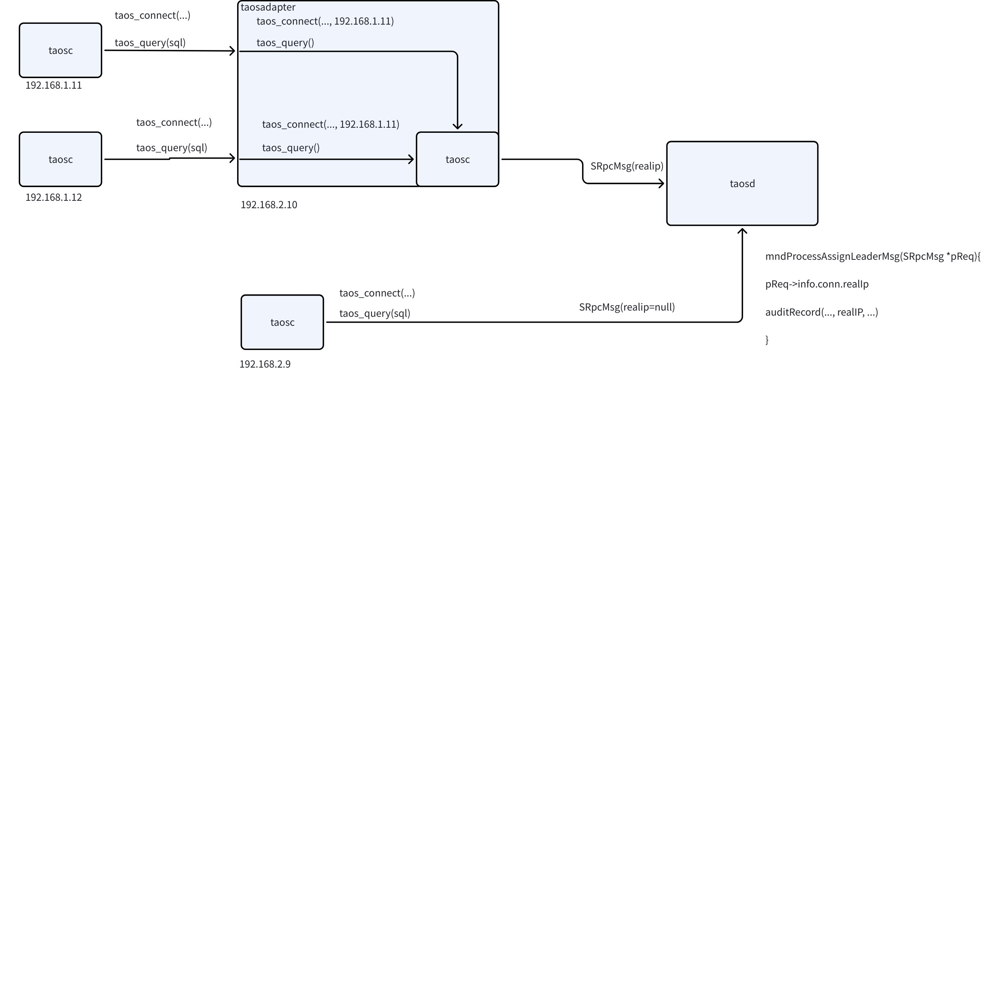

# Audit 库可以记录客户端 IP FS

## 1. 背景

JIRA: [TS-4996](https://jira.taosdata.com:18080/browse/TS-4996?src=confmacro)

## 2. 变更历史

注：版本变更规则，初始版本为 0.1，中间若经过几次较大修改要增加版本号为 0.2， 0.3，最后定稿时的版本号为 1.0，以下为示例

| 日期 | 版本 | 负责人 | 主要修改内容 |
| --- | --- | --- | --- |
| 2023/11/5 | 0.1 | xxx |  |
| 2023/11/8 | 0.2 | xxxx |  |
| 2023/11/20 | 0.3 | xxxx |  |
| 2023/11/21 | 1.0 | xxx |  |

## 3. 定义

文档中所使用的一些并非众所周知的术语的定义。

## 4. 行为说明

## 5. 性能

描述本需求对写入、查询、启动或其它可能的场景中带来的性能影响。如果没有则写无，并简要说明理由。如果为性能优化类，则在本节说明优化后的目标。

## 6. 兼容性

如果新的产品行为对旧有行为产生了破坏，要在本节明确说明，并阐述必须这么做的理由。如果没有则本节标无。

## 7. 运维

如果本特性有其它方面的影响，比如用户的部署方式，交付团队的客户支持等，在本节进行说明。如果没有则本节内容为无。

## 8. 使用场景

对本特性或优化可能被用到的使用场景，即 Use Case，进行详细说明。尽可能穷举所有 use case。

## 9. 约束和限制

约束：使用本特性/优化的约束条件，如果没有的话写无
限制：本特性有哪些限制，在使用中应该尽量避免

## 10. 常见错误和排查

对使用中可能遇到的错误提示以及如何排查故障进行说明。很多小型优化或功能不会有复杂的错误、排查也不困难，可以标无。但对于一些复杂的功能，容易用错、使用中容易出错的，要进行说明。

## 11. 可观测性

对 taos shell, taos Explorer， TDinsight 等基于 UI 或用户交互界面的产品组件是否有影响，如果有则说明清楚这几个组件的行为变化

## 12. 安装和卸载

描述对安装和卸载脚本有什么要求才能够使用户能够顺畅地使用本特性/优化

## 13. 文档

是否需要修改企业版文档
是否需要修改官网文档
如果需要，要在产品发布前准备好相应的文档 PR，发送 Wade Review & Merge

## 14. 参考文档

## 15. 附录

对于关键的实现方案，不想单独再准备一份文档的，可以写在这一节中，目的仍然是让 spec 尽量不出现实现相关的内容，让行为和实现分离。
