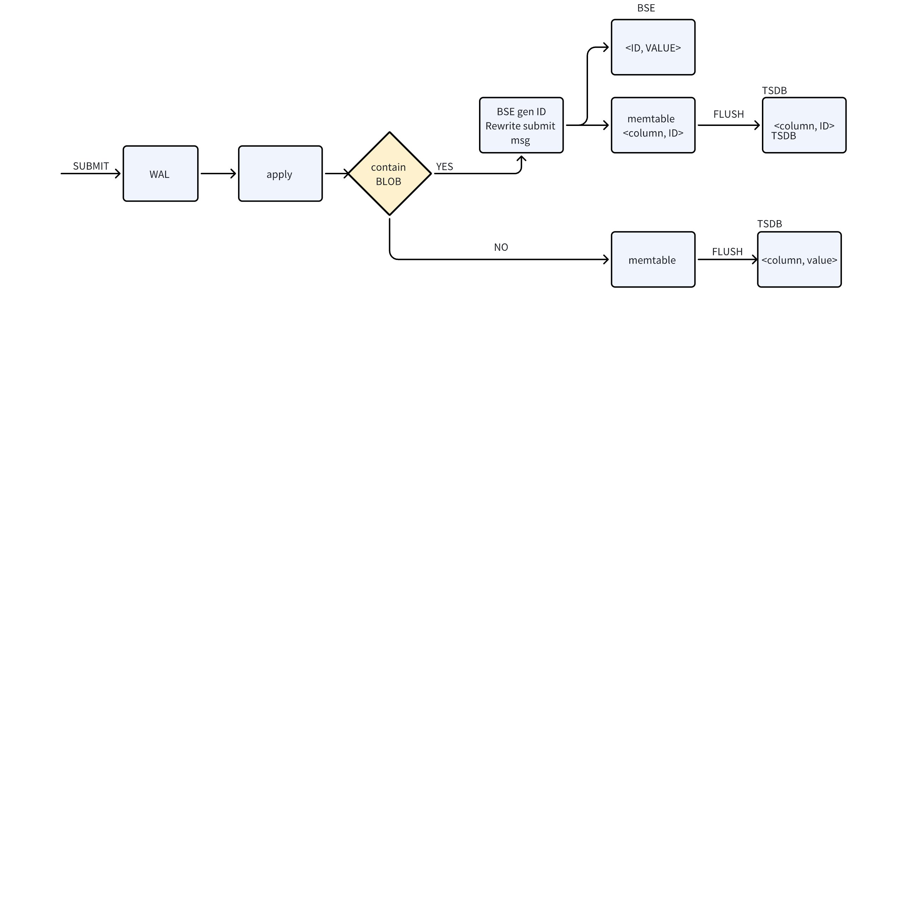
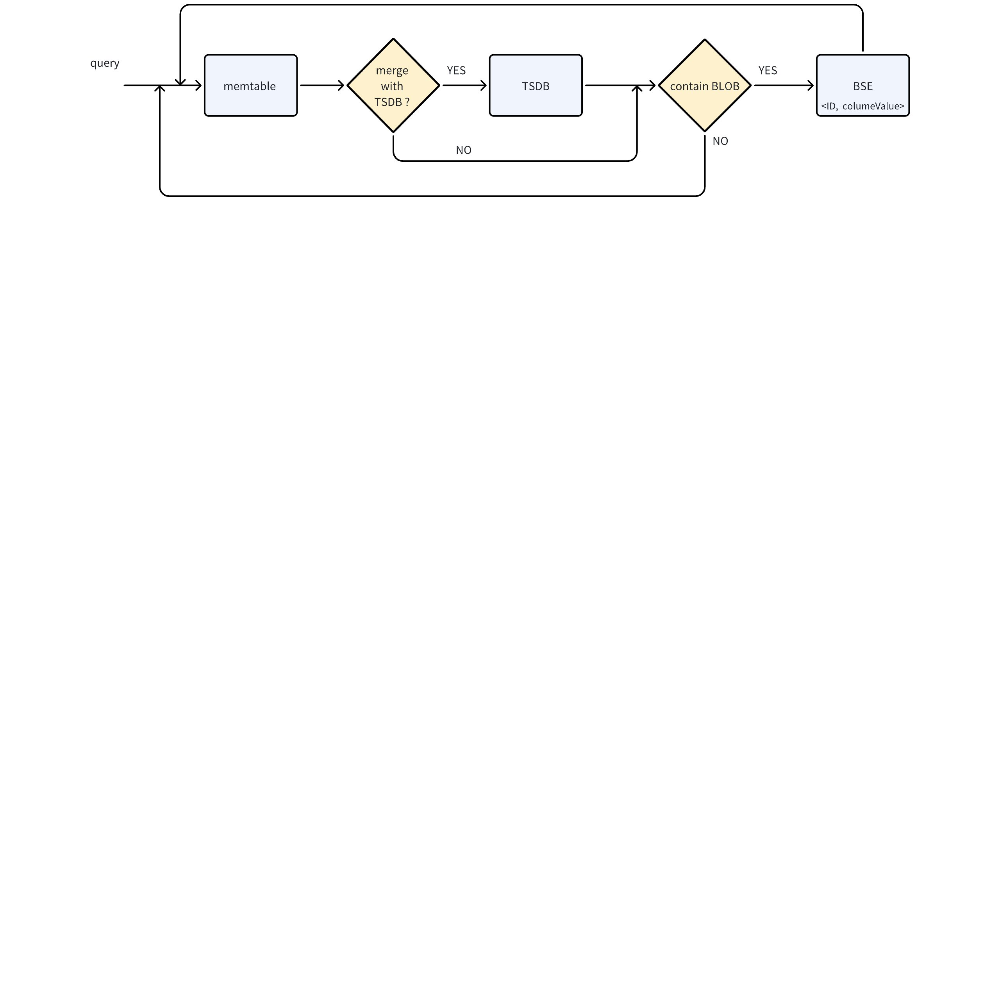
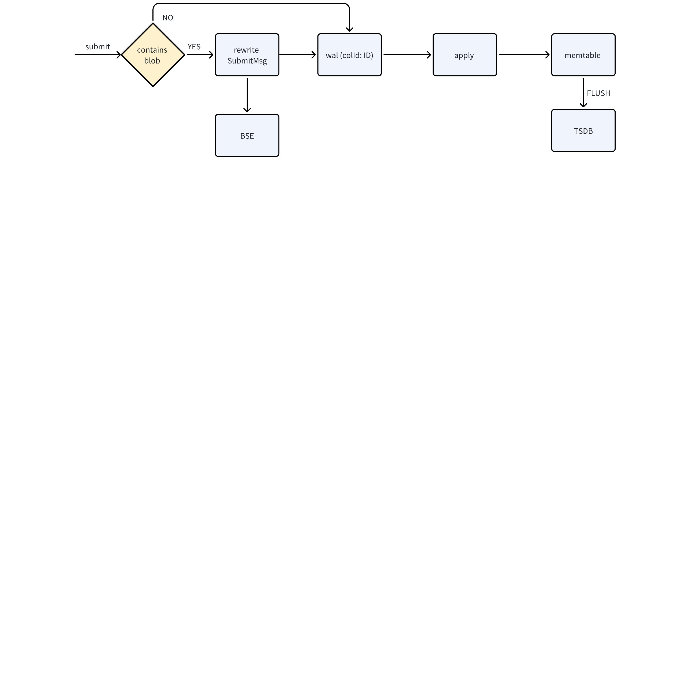
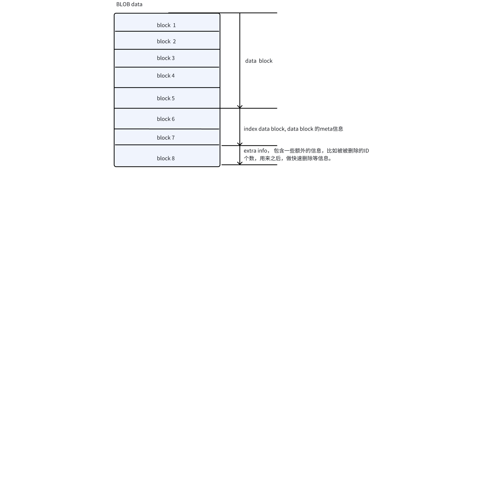
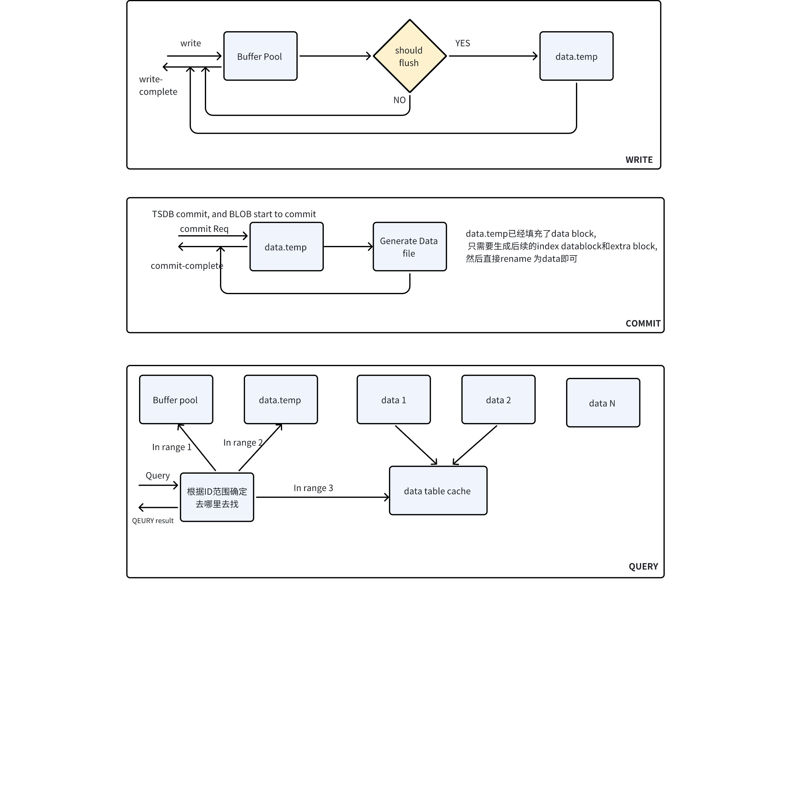

# BLOB FS

## 1. 背景

BLOB 对象，通常是长度很大的的字符串或者二进制数据，比如超过4MB。在数据库中写入、查询、存储管理大量的 BLOB 对象，会对数据库操作效率等带来全新的挑战，包括内存池、写放大、和读放大等等显著问题。
JIRA: [TS-4902](https://jira.taosdata.com:18080/browse/TS-4902)

## 2. 变更历史

| 日期 | 版本 | 负责人 | 主要修改内容 |
| --- | --- | --- | --- |
| 2025/03/05 | 0.1 | 邓怡豪 | 初稿 |

## 3. 定义

| 名词 | 解释 |
| --- | --- |
| BID | 单个BLOB数据的ID |
| BSE | BLOB 存储引擎 |

## 4. 行为说明

### 4.1 建表

支持超级表、普通表的数据列字段定义为 BLOB 类型。 
例如：
```sql
CREATE TABLE t (
    ts TIMESTAMP, 
    data BLOB,
);
```

**约束：**
1. TAG 列不能定义为 BLOB 数据类型。
2. BLOB 字段的压缩和其他类型列的压缩在使用方式完全一样。   
3. 表中的 BLOB 字段的数目不做限制。  
4. 单条 INSERT 语句中，BLOB 字段数据的总长度，设置上限为 8MB。
5. BLOB 字段不能做为primary key
6. 所有表都支持blob 类型
**待确认： **
   不支持支持虚拟表表和视图
   单个SQL长度是否需要放到8M？

### 4.2 写入

#### 4.2.1 SQL 写入

支持 SQL 语句方式写入
- 以 "\x 开头的字符串，为十六进制表示的数据，即HEX字符串，如 VALUES (now, "\x393866343633") 。
- 不以 "\x  开头的字符串，表示原始字符串，如 VALUES (now, "98f46e") 
- 其它方式报错.
- 具体BLOB 的数据格式类似[VARBINARY 数据类型](https://taosdata.feishu.cn/wiki/WWJkwPD6LiKKTxkfihjcclXjnSe)
**注意**：
1. SQL语句长度限制，保持 8MB 不变。
2. 支持 BLOB 字段为 NULL。
例如：
```sql
taos> insert into t values(now, "98f463");
Insert OK, 1 row(s) affected (0.002910s)

taos> select * from t;
           ts            |        v         |
=============================================
 2024-01-10 10:18:25.630 | \x393866343633   |
Query OK, 1 row(s) in set (0.003333s)

taos> insert into t values(now, "\x393866343633");
Insert OK, 1 row(s) affected (0.001338s)

taos> select * from t;
           ts            |        v         |
=============================================
 2024-01-10 10:18:25.630 | \x393866343633   |
 2024-01-10 10:19:04.236 | \x393866343633   |
Query OK, 2 row(s) in set (0.005155s)
```

#### 4.2.2 STMT2

支持 STMT2方式写入。
在 TAOS_STMT2结构中，BLOB 字段以二进制形式表示。

#### 4.2.3 Schemaless

暂不支持（第一期不开发）

#### 4.2.4 文件方式（第一期暂不支持）

支持通过文件写入 BLOB 类型数据（在 REST/Websocket 中不支持）。例如
```sql
taos> insert into t values(now, load_file("/path/to/your/file"));
```

**注意**：
1. LOAD_FILE 中路径，需要为绝对路径方式；路径格式，支持操作系统 Linux 和 Windows 两种。
2. 被加载的文件，被看做是二进制字符串格式。
3. 单条语句中，文件总大小超过 BLOB 类型总长度上限时候， 直接返回并报错，例如：超过 BLOB 类型长度限制。

#### 4.2.5 存储方案

##### 4.2.5.1 方案一：WAL之后， memtable 写入之前，写入BSE

**写入流程**
   客户端在生成submit消息的时候，遇到blob，给BSE预留ID位置（A）（8个字节），BLOB对应的消息填充在SUBMIT后面。消息到达服务端之后，INSERT到memtable之前，用BSE生seq, 并用ID填充A位置，对应的BLOB进入BSE，填充后的submit 进入到memtable， 具体的写入流程如下：    


** 查询流程**
  memtable/tsdb/lastcache只存储<colId, ID>, 遇到blob 消息，都需要通过ID从BSE 查询一次原始的var


 
**数据订阅**
   - 消费WAL，只需要做一些适配即可。 
   - 消费TSDB, 和查询一致，不需要做更改。 
**特性总结： **
优点： 实现相对简单,  特别是多副本和订阅的情况下。
缺点： 多写了一次日志。 

##### 4.2.5.2 方案二： 在进入WAL之前，拆分消息，写入到BSE
  


 优点： 少写一次日志， 独立引擎，和TSDB 互相不影响
 缺点： 实现复杂，多副本/订阅的情况需要反复重组消息，甚至订阅可能无法支持。
 
##### 4.2.5.3 Demo 测试结果

**写入**
 用taosBenchmark 测试， 单副本，写入速度性能（vgroup = 4,  子表1000， 行数1000000）

|  | 128（数据长度） | 512 | 2048 | 4096 | 4096 * 2 | 更大 |
| --- | --- | --- | --- | --- | --- | --- |
| 3.0 | 1 | 1 | 1 | 1 | 1 | 没有做测试 |
| 方案一 | 0.8~0.9 | 1.1~1.4 | 2 ~ 2.5 | 2.5 | 3~4.2 |  |
| 方案二 | 0.9~0.95 | 1.2~1.5 | 2.3~2.7 | 2.6 以上 | 3.5 ~ 4.5 |  |

**查询：**
  当前点查/遍历性能普遍弱于同长度的varbinary，大约是低了1倍到4倍，这是由于BSE当前能力比较弱，只能进行点查，之后可以尽可能优化BSE。尽可能缩减和同长度varbinary 的性能差距。 
**注意：**
1. 当前可以用taosBenchmark 可以大量的写数据和做各类查询。 
2. BSE的实现对测试影响比较大，上述两种方案都是在同一套BSE上做的时候，不同在于调用BSE时机。
3. 当前BSE 的实现很粗糙，优化空间很大。 

##### 4.2.5.4 BSE （blob storage engine ） 

###### 4.2.5.4.1 **数据文件布局** 

    **整体布局： **[文件组x]，[文件组x]，current.json
    **文件组： **按时间划分为文件组，每个文件组包含多个data文件和一个data.temp文件。
    **current：**数据落盘后信息**，**维护所有文件组的信息 
 **data 文件结构：** 


###### 4.2.5.4.2 写入/查询/commit 流程



###### 4.2.5.4.3 **BSE 的落盘机制**

   为了保证操作的原子性，BSE提供了文件事务处理能力， 具体如下：
1. BSE 内部维护落盘功能， 每次落盘将版本ver + 1
2. 落盘过程中修改data.tmp 文件，并rename 的新的文件名，如data-ver2
3. 把落盘后的文件状态，存储在current文件中，包含各个文件的大小和层级等信息。 
4. 落盘过程中，如果出现crash, 再恢复时根据current 文件中存储的状态，将BSE中的文件进行回滚
5. 落盘结束后，将新的文件状态写入到current.tmp 文件中，并用rename 函数将current.tmp重新命名为current.
  **BSE 和TSDB 一致性**
  只有TSDB current 和BSE的current都更新成功，才能算单个vnode commit 的更新成功，如果TSDB 更新current成功, BSE 的current 更新失败，那么TSDB 需要回滚。 

###### 4.2.5.4.4 支持S3

  暂不支持。

###### 4.2.5.4.5 支持多级存储

  支持 

### 4.3 查询

#### 4.3.1 SQL

##### 4.3.1.1 投影

查询时，BLOB 字段在shell中显示为以'\x'开头的大写HEX字符串格式，不管原始数据的写入方式是什么。 例如
```sql
taos> select * from t;
           ts            |        v         |
=============================================
 2024-01-10 10:18:25.630 | \x393866343633   |
Query OK, 1 row(s) in set (0.003333s)
```

##### 4.3.1.2 运算符

BLOB 字段支持如下运算符。
**集合运算符**：UNION ALL，（暂不支持 UNION）
**比较运算符**：IS [NOT] NULL

##### 4.3.1.3 函数

BLOB 字段支持同bianry/varchar/varbinary 
**注意**：
1. BLOB 类型的字符串函数 SUBSTR，把 BLOB 类型当做二进制字符串数据处理，其返回也是 BLOB 类型。
2. CAST 类型转换 BLOB -> VARBINARY 时，如果结果超过 VARBINARY 长度限制时，后面部分将被截断。
3. CAST 类型转换 BLOB -> VARCHAR 时，当遇到'\0'字符或超出 VARCHAR 长度限制时，后面部分将被截断。 

#### 4.3.2 STMT

查询时，BLOB 在 TAOS_FIELD 结构中，以二进制形式表示。
通过函数 taos_print_row 函数输出的 BLOB 字段，显示为以'\x'开头的大写HEX字符串格式。

#### 4.3.3 查询表结构

通过describe查询表结构，可正确显示 BLOB 字段类型。

### 4.4 多副本

支持多副本部署，BLOB 对象在多个副本之间保持一致性，与其它数据类型一样。

### 4.5 BLOB 数据压缩和解压缩

#### 4.5.1 处理阶段

BLOB 数据的压缩和解压缩，均在客户端或查询引擎中完成，存储引擎不进行 BLOB 数据压缩和解压缩处理。
**注意**：BLOB 数据压缩和解压缩，会使用客户端或查询引擎所在节点 CPU 资源。

#### 4.5.2 算法变更

不支持支持 BLOB 字段压缩算法变更。

### 4.6 Compact

时序数据重整，即 compact 操作，后续支持。 

### 4.7 Retention

根据数据库 KEEP 策略，同常规数据相同策略进行删除和移动。

### 4.8 其它功能

1. 订阅支持消费 BLOB 类型数据。
2. taosX 支持写入 BLOB 类型数据。（暂不支持transformer）。
3. taosBenchmark 支持生成 BLOB 类型数据。

## 5. 性能

1. 当 BLOB 数据长度，低于 512 时；写入性能低于VARCHAR，大约是80%左右，点查查询性能低于VARCHAR。 大约是50%。 
2. 当 BLOB 数据长度，写入不低于512且小于64K 性能超过VARCHAR，点查查询性到达80%
3. 当BLOB数据长度，大于64K时候，写入查询性能具体性能为准。

## 6. 兼容性

1. 支持版本升级。
2. 当创建含  BLOB 字段的普通表或超级表后，不支持版本回退。

## 7. 运维 

## 8. 使用场景

与提供 CDN 等网站访问的 BLOB 存储系统访问方式不同，BLOB 时序存储，面向用户需要按照事件发生的时间顺序写入，以及按照时间范围进行过滤批量查询读取的使用场景。这些应用场景，包括与事件发生时间强相关而采集的图片、音频、视频、以及高频传感器采集数据等高速存储，按照时间范围过滤查询高速读取等场景，例如车联网等业务场景。
在适用场景下，高速的存取性能，是 BLOB 时序存储系统相对于竞争方案而言，提供的核心价值。

## 9. 约束和限制

1. BLOB 字 段大小上限，暂定 8 MB。
2. Compact 时候，会对过期数据进行删除。
3. varbianry和blob的类型的取舍，字段实际长度大于2048时候，才考虑用blob类似存储。

## 10. 常见错误和排查

暂无

## 11. 未来可能继续做

   - 支持删除。 
   - 定义了blob字段， 实际存储的是数据都比较小，直接还是按照binary来存储

## 12. 参考文档

## 13. 待确定

   - Raw block 格式
   - SQL长度限制，视情况而定。
