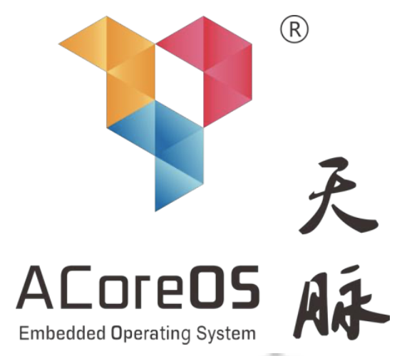
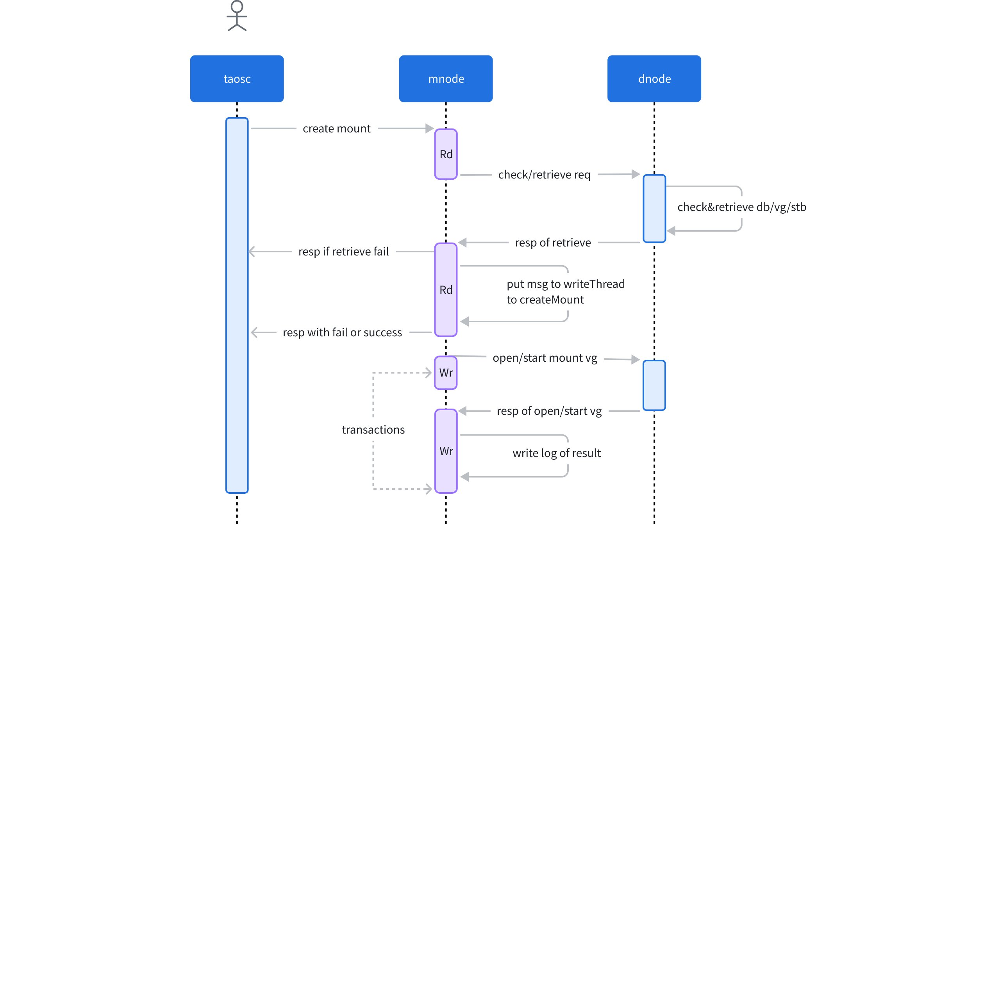
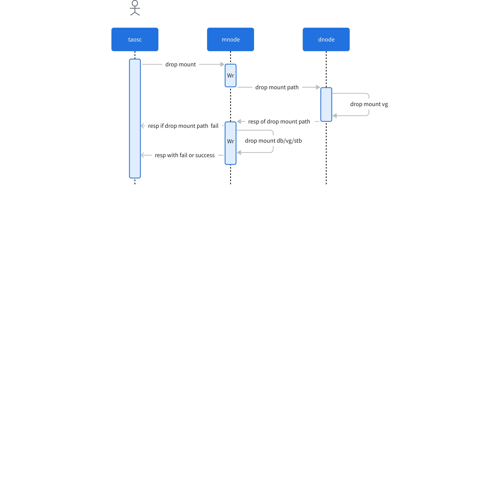

# TDengine 天脉适配 - Functional Spec

## 1. 背景

<grid cols="2">
  <column width="72">
    - **天脉系统（ACoreOS) **是一款由中航工业计算所自主研发的国产机载实时操作系统（RTOS：Real-Time Operating System），专为实时应用和嵌入式系统设计，广泛应用于航空航天、工业控制、智能家居、医疗设备等领域。具有高实时性、稳定性和可靠性，支持定制化开发，具备对 VxWorks 系统的兼容能力。
    - **TDengine **是一种高性能、支持分布式架构的时间序列数据库。可以运行在 Linux、Windows 和 Mac 操作系统上。
    - ACoreOS 不是标准 Linux，因此 TDengine 无法直接在 ACoreOS 上运行。 
  </column>
  <column width="27">
    

  </column>
</grid>

- 为了使 TDengine 单机版运行在机载 ACoreOS，需要对 TDengine 进行适配。

## 2. 变更历史

| 日期 | 版本 | 负责人 | 主要修改内容 |
| --- | --- | --- | --- |
| 2025/01/16 | 1.0 | 徐开礼 | TDengine 适配 ACoreOS |
| 2025/05/12 | 1.1 | 徐开礼 | 数据挂载及授权控制 |

## 3. 定义

1. **天脉系统（ACoreOS)：**是一款由中航工业计算所自主研发的国产机载实时操作系统（RTOS：Real-Time Operating System）。
2. **开发环境（ACoreIDE)：**是一款适用于** **ACoreOS 的集成开发环境。支持主机端与目标机端的通信，支持操作系统及应用软件调试、运行及监控。 
3. **模块支持层（MSL)：**ACoreOS 中，MSL 层是由遵循特定接口规范的专用硬件模块支持软件组成。主要实现硬件与操作 系统层之间的隔离。 
4. **操作系统层（OSL)：**ACoreOS 中，OSL 层主要实现与硬件无关的功能服务，包括操作系统的基本核心功能及满足特定应 用需求的各种可配置组件。 
5. **TDengine**：一种高性能、支持分布式架构的时间序列数据库。
6. **数据节点（dnode）：**dnode 是 TDengine 服务器侧进程 taosd 在物理节点上的一个逻辑运行实例。在一个 TDengine 集群中，至少需要一个 dnode 来确保系统的正常运行。
7. **管理节点（mnode）：**mnode 是 TDengine 集群中的核心逻辑单元，负责监控和维护所有 dnode 的运行状态。作为元数据（包括用户、数据库、超级表等）的存储和管理中心，mnode 也被称为 MetaNode。
8. **数据挂载：**在地面端 TDengine 集群，通过 SQL 命令的方式，将机载端 TDengine 产生的数据文件夹(注：地面端 TDengine 产生的数据文件夹也支持，此处强调机载端 TDengine 是为了说明客户数据挂载的原始需求)挂载到地面端 TDengine，并可以通过地面端 taos 客户端进行展示和查询（注：不支持写入，以防改变机载端产生的原始数据）。

## 4. 行为说明

### 4.1 适配要点和解决思路

- TDengine 单机版要运行在机载版的 ACoreOS，主要适配要点和解决思路如下：
```cpp {wrap}
1）对于 TDengine 与 ACoreOS 不兼容的 API，针对 ACoreOS 现有的 API 进行适配。
2）对于 TDengine 必需但 ACoreOS 无法适配的 API，由 ACoreOS 增加 API，或者由 TDengine 对实现方法进行重构。
3）TDengine 以 32 位模式运行在 ACoreOS OSL 层，需要对 TDengine 中结构体和实现进行字节对齐适配。
4）TDengine RPC 核心通信模块，无法直接运行在 ACoreOS，需要基于 ACoreOS 网络 API 进行整体适配。
5）机载 TDengine 产生的数据文件，要支持快速便捷的被地面端 TDengine 集群读取。机载磁盘，首先挂载至地面端服务器，然后通过运维命令将机载磁盘添加至地面端 TDengine 集群，然后进行读取。
6）为了使适配后的 TDengine 与主分支功能保持同步，适配工作基于 TDengine 3.0，需要在代码中添加 ACoreOS 相关的逻辑。
7）ACoreOS 的编译依赖于 ACoreIDE 及其底层的交叉编译环境，TDengine 的编译目前是基于 cmake，不能直接使用 ACoreOS 的编译环境。因此，并需要编写一套适用于 ACoreOS 编译环境的脚本。
8）现有 TDengine 的测试用例，无法直接在 ACoreOS 上运行。需要同步修改基于 C 语言编写的 tsim，以运行 tsim 脚本。
9）ACoreOS 提供了相对完整的调试工具，但与能用 Linux 调试工具还有差距，并且，出现问题后，只能根据 SP 地址反查代码行数。并且，每次出现 core/exception 后，要 reset 开发板，再次引导 MSL/OSL 层应用进行调试，调试效率相对于通用 Linux 环境差距较大。 
```

#### 4.1.1 编译环境适配

##### 4.1.1.1 编译方法

适用于 ACoreOS 编译环境下，大工程的快速编译方法如下：
```cpp {wrap}
1）基于 ACoreIDE 导入工程，clean project；
2) 关闭杀毒软件；
3）将编译工具链的路径加入到 PATH 环境变量中：e.g. D:\qianshan\QS_ACoreIDE_ACoreOSMP_Windows_x86_V1.0.0.0_20240419\host\gnu\gcc-4.8.1\arm\bin; D:\qianshan\v2\toTaoSi\QS_ACoreIDE_ACoreOSMP_Windows_x86_V1.0.0.0_20240419\host\cygwin\bin; 并移至最前面; 
4) 打开命令行窗口，进入到项目目录，示例：/d/qianshan/v2/toTaoSi/QS_ACoreIDE_ACoreOSMP_Windows_x86_V1.0.0.0_20240419/ft2004workspace/ft2000_4_OS/ft2000aC4_le_hard_mcore。
5）在命令行窗口直接执行 make，例如，make clean; make -j16。
6) 完成。
```

##### 4.1.1.2 编译脚本

编译基于 TDengine 3.0 分支最新代码。新建 ACoreOS/make 目录，适配 ACoreOS 相关的编译脚本，均放置至此目录中。
脚本的编译方式，结合 ACoreIDE 生成的编译脚本，及通用 make 脚本的编译方式。通过添加 ACoreOS/ACoreOS32 相关的编译宏定义，区分仅适用于 ACoreOS 相关的代码。

#### 4.1.2 API 适配

下表中列出部分 API 适配问题及解决思路。
<callout emoji="bulb" background-color="light-orange" border-color="light-orange">
注：下表中，解决方案分为临时方案和最终方案。其中，临时方案在正式发布时，都要替换为正式方案。
</callout>


| 序号 | 名称 | 问题说明 | 解决方案 |
| --- | --- | --- | --- |
| 1 | regex.h | 不存在 | 暂时替换 |
| 2 | iconv | 不存在 | 暂时禁止 nchar 处理 |
| 3 | asm | asm 在添加 -std=c99 后报未定义 | 改为 __asm 或 __asm__ 后可正常通过 __asm("bkpt #0") 加断点调试 |
| 4 | system | 不支持 | 暂时替换 |
| 5 | getpid | 不支持 | 需要使能 posix 接口 |
| 6 | wcsnlen | wchar.h 中有声明，但是不支持 | 暂时基于 wcslen 实现，后续接口可用后替换。 |
| 7 | mbsrtowcs | wchar.h 中有声明，但是不支持 | 改造 |
| 8 | chmod | 主机文件系统不支持，报错 errno 95 目标机文件系统暂未配置，未验证 | 暂时跳过 |
| 9 | lseek | 报权限问题 | 打开时，要显式加上读：O_RDWR 或 O_RDONLY（linux 上 RD/WR 均可） |
| 10 | access | 主机文件系统验证 Exists/RD/WR 均报错 | 暂时跳过 |
| 11 | signal(SIGPIPE,SIG_IGN) | 出现 core，配置了 MMU 相关配置后，运行时应用卡死但是未报错 | 暂时跳过 |
| 12 | fsync | 主机文件系统不支持，报错 errno 95 目标机文件系统暂未配置，未验证 | 暂时跳过 |
| 13 | rename | 如果目标文件已经存在，报错 File Exists。 | 如果老文件存在，暂时先删除。 |
| 14 | ... |  |  |

#### 4.1.3 字节对齐适配

- ACoreOS 要求字节分配和访问按照 32 位对齐，否则，会发生各种异常。对于该类问题，可以有如下办法解决：
```cpp {wrap}
1）调整结构体的定义，确保字段按照 32 位对齐。
2）在字段访问时，提供统一的 32/64 位访问接口，例如，taosGetInt64Aligned/taosGetUInt64Aligned，在该类接口，通过 memcpy 代替直接字段访问。
```

#### 4.1.4 测试工具和测试用例

1. TDengine 的测试用例，目前大部分已经使用 python 编写，也有一部分仍然是基于 C 语言工具 tsim 运行的测试用例。因此，在机载环境下，需要将 tsim 进行移植，用来运行 tsim 脚本编写的测试用例。
2. tsim 测试用例，要基于机载 TDengine 支持的接口，进行选择和改造。

#### 4.1.5 RPC 通信模块适配

地面端 TDengine 的 RPC 核心通信模块，无法直接运行在 ACoreOS 上，需要基于 ACoreOS 的网络 API(参照：《ACoreOSMP多核嵌入式实时操作系统网络协议栈参考手册.pdf》)，进行整体适配([TS-5702](https://jira.taosdata.com:18080/browse/TS-5702))。

#### 4.1.6 机载磁盘地面端挂载

##### 4.1.6.1 创建数据挂载

用户可以通过 SQL 命令，在“TDengine 地面端“中挂载“TDengine 机载端”的数据文件夹。
```sql {wrap}
CREATE MOUNT mountName ON DNODE dnodeId FROM TDenginePath
```

参数说明
- mountName：数据挂载的名称，挂载后的数据库名为 mountName_<dbname>，其中 mountName 不能包含下划线，dbname 为机载端 TDengine 中的数据库名称，可能存在多个
- dnodeId：数据文件所在的 dnode
- TDenginePath：数据文件夹的绝对路径，需要用英文单引号或英文双引号括起来
使用限制
- mountName 不能重复
- mountName 不能与已有的数据库重名(该限制实际上也可以去掉，重名暂未冲突)。
- mountName 和 TDenginePath 一 一对应，即只支持单个 dnode 节点
- 机载端数据文件夹，只支持 1 级存储，不支持多副本
- 机载端数据文件夹，包括 sdb/wal/meta/tsdb，不支持加密库
- 挂载 db，只能查询，不能更新元数据，不能写入时序数据，不支持写消息
- 挂载 db，无法针对虚拟表进行查询，但是可以 desc 查看虚拟表的元数据
- 如果存在 mountDb，则不允许创建新的 DB，以简化名字冲突检测逻辑(该限制实际上也可以在增加冲突判断的条件下去掉，必要性不大，保留限制)
- 同一个数据目录，在同一时刻，只能被一个集群挂载
- Host cluster，不能挂载自身的数据目录
- 挂载目录的 dbid，不能与集群中 db 的 dbid 相同
- 挂载的 db：1）支持针对表对象进行“元数据/时序数据”查询; 支持 flush 等操作；2）不支持流/订阅/视图等对象，不支持写入，不支持新建表，compact/trim/redistribute/split 等操作。
使用举例
```sql
create mount mount1 on dnode 1 from "/var/lib/TDengine"
```

##### 4.1.6.2 删除数据挂载

```sql
DROP MOUNT mount1
```

删除数据挂载时
- 清空地面端 TDengine 中与 本次挂载相关的元数据
- 复原机载端 TDengine 数据文件夹中的配置信息，使其能够被机载端 TDengine 继续使用
使用说明
- 删除挂载不会清空 TDengine 文件夹

##### 4.1.6.3 查看数据挂载

```sql
SHOW MOUNTS 
```

支持如下字段展示
- 挂载名称 name
- 挂载的数据节点 dnode
- 挂载的创建时间 create_time
- 挂载的文件路径 path

#### 4.1.7 授权控制

##### 4.1.7.1 授权方案

- 机载 TDengine 版本，无法直接实施授权操作。因此，在数据挂载时，新增数据挂载授权项  data_mount(Data Mount) 进行控制。具体如下：

| 方案 | 数据挂载授权项 | 过期行为 | 优缺点 | 备注 | 结论 |
| --- | --- | --- | --- | --- | --- |
| 1 | expireTime 过期时间 mountNums 挂载次数 | 1. `基础授权项`或`数据挂载授权项` 过期：1）无法执行 create/drop mount；2）已经挂载的 db，不限制查询；3）不限制 show mounts。 1. 挂载次数 mountNums 超过授权次数：1）无法执行 create mount。2）已经挂载的 db，不限制查询；3）不限制 show mounts。 | **优点**：实现简单，只需要记录总的挂载次数，不需要标识唯一集群，不需要在地面端集群记录不同的集群标识。 **缺点**：1）只限制了总的挂载次数，不限制唯一集群个数。2）如果机载数据不挂载，直接通过修改数据目录查看，无法限制。 | 1. 试用集群的默认值为 10 次 1. 每次挂载操作都记录被挂载实例的机器码、ClusterId，并累加次数 | 采用该方案 |
| 2 | ~~expireTime 过期时间~~ ~~mountUniqueClusters 挂载唯一集群个数~~ | 1. ~~同方案 1 中，过期行为第 1 条。~~ 1. ~~挂载唯一集群次数 mountUniqueClusters 超过授权次数：同方案 1 中，过期行为第 2 条。~~ | ~~**优点**~~~~：除限制过期时间，也可以限制挂载的唯一集群个数。~~ ~~**缺点**~~~~：1）唯一集群的标识，需要记录在地面端集群中，实现相对复杂，记录信息较多。2）同方案 1 ， 如果机载数据不挂载，直接通过修改数据目录查看，无法限制。~~ |  |  |

##### 4.1.7.2 机载端的机器码

- 结论：通过地面端针对挂载次数进行限制，暂未采用该方案。
```sql {wrap}
1）提供 license.a 或者 .o/.so 文件，封装机器码生成方法
2）机器码保存在集群的数据文件中
3）不同集群/机载设备的机器码是不同的（区分集群数据文件拷贝的情况，启动时，如果实时获取的机器码与保存机器码不一致，更新集群保存的机器码）
4）机器码不采用与 TDengine Enterprise 相同的方法
5）机器码能够进行自校验，确保不是用户随意给出的字符串
```

###### 4.1.7.2.1 ~~生成机载端机器码需要的信息~~

- ~~ 主板序列号/型号/CPU型号（咨询客户，由商务出面沟通？）~~
```sql
1）vxCpuIdGet // 待验证
用于获取 CPUID。 函数原型: 
cpuid_t vxCpuIdGet (void) 
功能描述: 
该服务用于获取 CPUID。 
2）mainboard SN/type // TODO 咨询客户，由商务出面沟通？
```

### 4.2 TDengine 语法

机载 TDengine 语法手册参照：[航空时序数据库-TDengine 语法手册](https://taosdata.feishu.cn/wiki/TjGswbWWXilBFekkYQacij0MnOe)

### 4.3 TDengine 接口

机载 TDengine 接口规范参照：[航空时序数据库-TDengine 用户手册](https://taosdata.feishu.cn/wiki/FrUkwcU6Bi7g5wkqiUJcFywBnae)

### 4.4 TDengine 示例代码

机载 TDengine 示例代码参照：[航空时序数据库-TDengine 应用端示例代码 ](https://taosdata.feishu.cn/wiki/GoavwlIkYibThdkmbUAcJoIMnId)

## 5. 性能

机载 TDengine 性能指标参照：[航空时序数据库-TDengine 性能测试指标](https://taosdata.feishu.cn/wiki/PQLRw6GwJiyuockRUlBc4KrJnrh)

## 6. 兼容性

1. 支持升级，尽可能支持降级。如果不支持降级，在 taosd 启动时退出，并给出明确的错误提示。

## 7. 运维

无

## 8. 使用场景

1. 第一交付阶段，只支持机载应用内部集成数据库。第二交付阶段，支持机载应用访问独立的数据库服务。
2. 机载磁盘挂载地面端服务器后，通过 TDengine 运维命令使机载磁盘被 TDengine 集群识别并访问。

## 9. 约束和限制

1. 机载 TDengine 只支持单机版的功能，不支持流计算、订阅等复杂功能。

## 10. 常见错误和排查

用户操作失败，错误码对照表

| Error code | description | note |
| --- | --- | --- |
|  |  |  |
|  |  |  |

## 11. 可观测性

无

## 12. 安装和卸载

无特殊要求

## 13. 文档

无

## 14. 参考

- [[千山航空] 天脉系统进行初步适配](https://taosdata.feishu.cn/wiki/Mt0gwBQu0itcaQkeMXHc4hOGnVd)
- [航空时序数据库-TDengine 语法手册](https://taosdata.feishu.cn/wiki/TjGswbWWXilBFekkYQacij0MnOe)
- [航空时序数据库-TDengine 用户手册](https://taosdata.feishu.cn/wiki/FrUkwcU6Bi7g5wkqiUJcFywBnae)
- [航空时序数据库-TDengine 性能测试指标](https://taosdata.feishu.cn/wiki/PQLRw6GwJiyuockRUlBc4KrJnrh)
- [航空时序数据库-TDengine 应用端示例代码 ](https://taosdata.feishu.cn/wiki/GoavwlIkYibThdkmbUAcJoIMnId)
- [航空时序数据库-TDengine 接口文件](https://taosdata.feishu.cn/wiki/SF33wq8SaitO4oknPFUcfwrJnhe)

## 15. 附录

### 15.1 TDengine 数据挂载处理

#### 15.1.1 基本实现原理

- 将机载集群(mount cluster)的所有数据目录 mnt 到 地面端集群(host cluster)服务器的一个目录。 
- 在 host cluster 执行 create mount 时，检索挂载目录的 db/vnode/stb 信息，并将 db/vnode/stb 信息在 host cluster 的 mnode 重新创建一份。其中，在 host cluster 创建的 vnode 的 vgId 是基于 host cluster 的 vnode 数量递增的， 与挂载的 vnode vgId  有可能不同。host cluster 在 vnode 文件夹，是通过 symbol link 的方式，链接至 mount vnode。
- 在 host cluster 执行 drop mount 时，会清理 SDB 信息，并会删除 host cluster 的 vnode 文件夹，mount vnode 的 vnode 文件夹不会被删除。
- 因为 host cluster 与 mount cluster 的 vgId 有可能不一致，因为需要进行 vgId 与 mountVgId 的映射，在 sync 模块处理时，有部分转换逻辑。

#### 15.1.2 create mount



<callout emoji="bulb" background-color="light-orange" border-color="light-orange">
1）在处理数据目录检查及响应时，遇到了放在 mnode 事务中执行失败时，一直无法结束的问题；2）因此，将检查过程提取到事务前，如果想同步返回检查结果，又可能导致 mnode write 线程卡顿。3）最终，计划分两阶段执行，第一阶段在 mnode read 线程做数据目录检查及获取挂载信息，第二阶段，在 mnode write 线程进行 mount 挂载的事务处理。
</callout>

#### 15.1.3 drop mount


