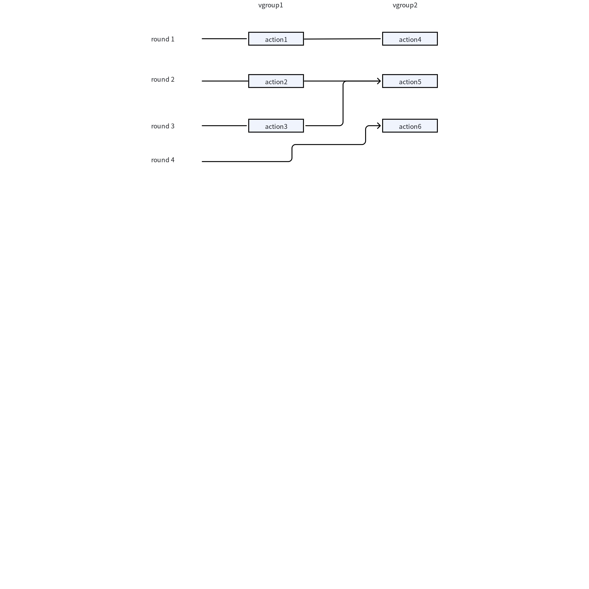
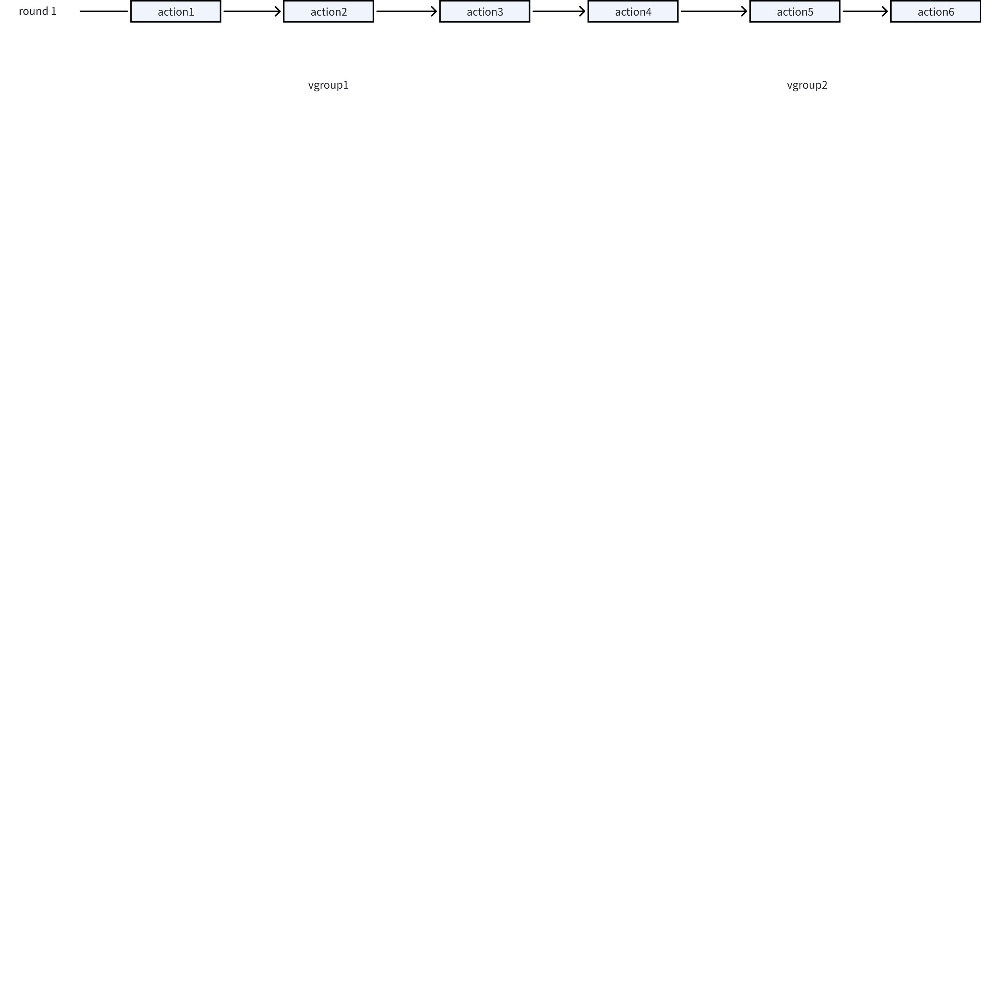
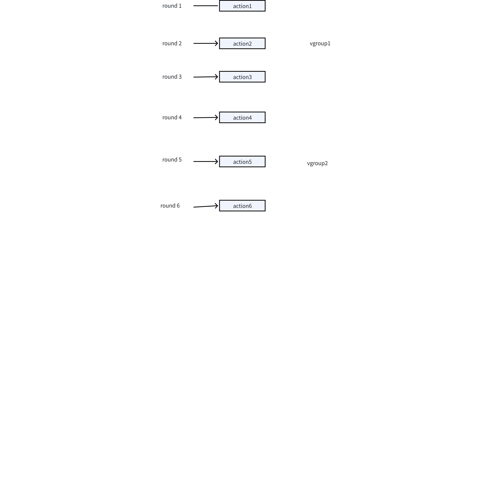
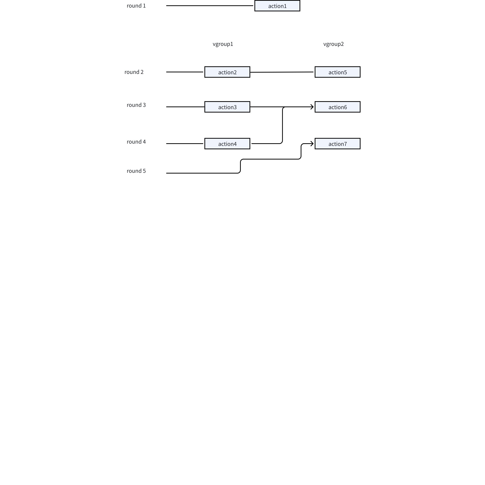

# 优化事务机制以提升节点恢复和副本变更的性能 FS

## 1. 背景

在客户场景中，涉及 vnode 数据恢复的 SQL 语句通常执行缓慢。例如
1. restore dnode
2. alter database replica
3. drop dnode
分析发现，单个 vnode 的恢复速度不是瓶颈，也没有太多提升空间。如果改造单个 vnode，开发成本较高。
因此，决定对事务机制进行改造，让多个 vnode 可以并行执行恢复操作，当所有 vnode 恢复完成后，事务结束。
相对于之前 vnode 串行执行的方式，效率会有大的提升。
https://jira.taosdata.com:18080/browse/TS-6089

## 2. 变更历史


| 日期 | 版本 | 负责人 | 主要修改内容 |
| --- | --- | --- | --- |
| 2025/5/10 | 0.1 | 陈东明 |  |
|  |  |  |  |
|  |  |  |  |
|  |  |  |  |

## 3. 定义

无。

## 4. 行为说明

### 4.1 影响的命令

下列命令变成按照vgroup维度并发执行。
1. restore dnode
2. alter database replica
3. drop dnode

### 4.2 执行方式变化

新增加一种执行模式：按组并发执行



对比原有的并发执行模式


对比原有的串行执行方式


## 5. 性能

单个vgroup执行性能与之前相比没有变化，性能提升来自vgroup的并发执行，并发执行的速度受限于节点资源。

## 6. 兼容性

restore dnode、alter database replica、drop dnode几个事务在升级前后不兼容，所以在升级前，restore dnode、alter database replica、drop dnode几个事务必须执行完成。在升级前，如果有残留的事务，在升级后，事务会执行失败。

## 7. 运维

无。

## 8. 使用场景

无。

## 9. 约束和限制

约束：无
限制：无

## 10. 常见错误和排查

无。

## 11. 可观测性

无

## 12. 安装和卸载

无

## 13. 文档

无

## 14. 参考文档

## 15. 附录

### 15.1 数据结构

增加一种并发执行模式
```plaintext
TRN_EXEC_PARALLEL = 0,
TRN_EXEC_SERIAL = 1,
TRN_EXEC_GROUP_PARALLEL = 2, 新增
```

Action增加groupId
```plaintext
typedef struct {
  int32_t   id;
  int32_t   errCode;
  int32_t   acceptableCode;
  int32_t   retryCode;
  ETrnAct   actionType;
  ETrnStage stage;
  int8_t    reserved;
  int8_t    rawWritten;
  int8_t    msgSent;
  int8_t    msgReceived;
  tmsg_t    msgType;
  SEpSet    epSet;
  int32_t   contLen;
  void     *pCont;
  SSdbRaw  *pRaw;

  int64_t mTraceId;
  int64_t startTime;
  int64_t endTime;
  int32_t groupId; 新增
} STransAction;
```


### 15.2 使用新模式的事务

如果一个事务需要按组并发执行，需要设置执行模式，并且添加action时需要添加到group组。groupId设置成vgroupId。
```plaintext
void mndTransSetGroupParallel(STrans *pTrans)
int32_t mndTransAppendGroupRedolog(STrans *pTrans, SSdbRaw *pRaw, int32_t groupId)
```

### 15.3 vgroup间共用的action

对于一些事务，在事务的开始要执行一些所有vgroup共用的action，也是不属于任何vgroup。类似与如下的执行


对于这样的action需要将groupId设置成-1
```plaintext
STransAction action = {
      .epSet = *pCreateEpSet,
      .pCont = pReq,
      .contLen = contLen,
      .msgType = TDMT_DND_CREATE_MNODE,
      .acceptableCode = TSDB_CODE_MNODE_ALREADY_DEPLOYED,
      .groupId = -1,
  };
```
