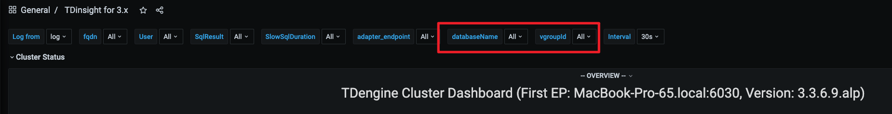
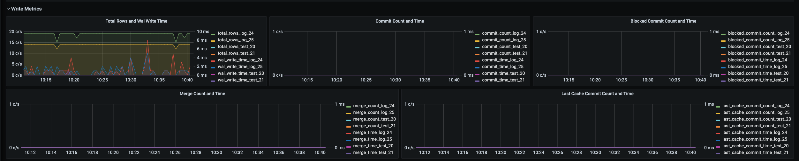
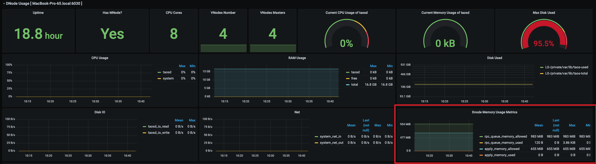

# 全链路的数据写入诊断工具 FS

## 1. 背景

在用户支持中，经常有客户提出写入性能太慢，达不到客户业务要求。或是写入有异常，需要立刻诊断，目前这种问题经常需要研发支持分析才能给出结论，研发是否可以提供一些方法，或脚本工具等，能够让交付也可以得到结论。
相关 jira :
1. TS-5615 [[交付] 提供全链路的数据写入诊断工具](https%3A%2F%2Fjira.taosdata.com%3A18080%2Fbrowse%2FTS-5615)
2. TS-225 [[公共需求]写入诊断工具](https%3A%2F%2Fjira.taosdata.com%3A18080%2Fbrowse%2FTX-225)
3. TX-329 [[交付] 在客户巡检时，taosd/taosc/taosadapter/taoskeeper提供日志分析的工具](https%3A%2F%2Fjira.taosdata.com%3A18080%2Fbrowse%2FTX-329)

## 2. 变更历史

| 日期 | 版本 | 负责人 | 主要修改内容 |
| --- | --- | --- | --- |
| 2025/03/19 | 0.1 | 鲍之骁 | 初稿 |
| 2025/05/28 | 0.2 | 鲍之骁 | 根据 review 意见修改文档 |
| 2025/06/20 | 0.3 | 鲍之骁 | 增加 dbname 和 last 缓存监控 |

## 3. 定义

全链路的数据写入工具的监控范围是从 taosd 收到写入请求开始，其中包含了，客户端拉取元数据缓存，对写入请求进行预处理，写入 wal 日志，日志复制，写入状态机，数据写入文件，一直到最终文件组进行 merge 结束。

## 4. 行为说明

### 4.1 增加系统参数 

#### 4.1.1 `enableMetrics`

为了尽可能避免写入诊断工具对性能的影响，写入诊断工具的全部行为由系统参数 `enableMetrics` 控制。
`enableMetrics` 
作用范围：sever
默认值为 false ，表示关闭写入诊断
局部配置参数
支持动态修改

#### 4.1.2 `metricsInterval`

写入诊断工具的采样周期由系统参数 `metricsInterval` 控制。
`metricsInterval` 
作用范围：sever & clinet 
默认值为 5 单位为秒
局部配置参数
支持动态修改

#### 4.1.3 metricsFlag

写入诊断工具的采样的采样等级由系统参数 `metricsFlag` 控制。
`metricsFlag` 
作用范围：sever
默认值为 0。0：仅采样重要指标；1：采样全部指标。
局部配置参数
支持动态修改

### 4.2 核心结构体

#### 4.2.1 SRawDnodeMetrics 

```c
typedef struct {
  int64_t rpcQueueMemoryAllowed;
  int64_t rpcQueueMemoryUsed;
  int64_t applyMemoryAllowed;
  int64_t applyMemoryUsed;
} SRawDnodeMetrics;
```

#### 4.2.2 SRawWriteMetrics

```c
typedef struct {
  char    dbname[TSDB_DB_NAME_LEN];  // Database name
  int64_t total_requests;
  int64_t total_rows;
  int64_t total_bytes;
  int64_t fetch_batch_meta_time;
  int64_t fetch_batch_meta_count;
  int64_t preprocess_time;
  int64_t wal_write_bytes;
  int64_t wal_write_time;
  int64_t apply_bytes;
  int64_t apply_time;
  int64_t commit_count;
  int64_t commit_time;
  int64_t memtable_wait_time;
  int64_t blocked_commit_count;
  int64_t blocked_commit_time;
  int64_t merge_count;
  int64_t merge_time;
  int64_t last_cache_commit_time;
  int64_t last_cache_commit_count;
} SRawWriteMetrics;
```

#### 4.2.3 SDnodeWriteMetrics

```c
typedef struct {
  int64_t rpcQueueMemoryAllowed;
  int64_t rpcQueueMemoryUsed;
  int64_t applyMemoryAllowed;
  int64_t applyMemoryUsed;
} SRawDnodeMetrics;
```

### 4.3 定期将结果写入 log 库

#### 4.3.1 新增系统表

1. taosd_write_metrics
```go
// Metric name definitions following monFramework.c pattern
#define WRITE_TABLE                   "taosd_write_metrics"
#define WRITE_TOTAL_REQUESTS          WRITE_TABLE ":total_requests"
#define WRITE_TOTAL_ROWS              WRITE_TABLE ":total_rows"
#define WRITE_TOTAL_BYTES             WRITE_TABLE ":total_bytes"
#define WRITE_FETCH_BATCH_META_TIME   WRITE_TABLE ":fetch_batch_meta_time"
#define WRITE_FETCH_BATCH_META_COUNT  WRITE_TABLE ":fetch_batch_meta_count"
#define WRITE_PREPROCESS_TIME         WRITE_TABLE ":preprocess_time"
#define WRITE_WAL_WRITE_BYTES         WRITE_TABLE ":wal_write_bytes"
#define WRITE_WAL_WRITE_TIME          WRITE_TABLE ":wal_write_time"
#define WRITE_APPLY_BYTES             WRITE_TABLE ":apply_bytes"
#define WRITE_APPLY_TIME              WRITE_TABLE ":apply_time"
#define WRITE_COMMIT_COUNT            WRITE_TABLE ":commit_count"
#define WRITE_COMMIT_TIME             WRITE_TABLE ":commit_time"
#define WRITE_MEMTABLE_WAIT_TIME      WRITE_TABLE ":memtable_wait_time"
#define WRITE_BLOCKED_COMMIT_COUNT    WRITE_TABLE ":blocked_commit_count"
#define WRITE_BLOCKED_COMMIT_TIME     WRITE_TABLE ":blocked_commit_time"
#define WRITE_MERGE_COUNT             WRITE_TABLE ":merge_count"
#define WRITE_MERGE_TIME              WRITE_TABLE ":merge_time"
#define WRITE_LAST_CACHE_COMMIT_TIME  WRITE_TABLE ":last_cache_commit_time"
#define WRITE_LAST_CACHE_COMMIT_COUNT WRITE_TABLE ":last_cache_commit_count"
```

1. taosd_dnodes_metrics
```java
#define DNODE_TABLE                    "taosd_dnodes_metrics"
#define DNODE_RPC_QUEUE_MEMORY_ALLOWED DNODE_TABLE ":rpc_queue_memory_allowed"
#define DNODE_RPC_QUEUE_MEMORY_USED    DNODE_TABLE ":rpc_queue_memory_used"
#define DNODE_APPLY_MEMORY_ALLOWED     DNODE_TABLE ":apply_memory_allowed"
#define DNODE_APPLY_MEMORY_USED        DNODE_TABLE ":apply_memory_used"
```

### 4.4 系统库中指标定义

#### 4.4.1 write_metrics

| 名称 | 单位 | 含义 | 等级 |
| --- | --- | --- | --- |
| total_requests | - | vnode 处理的写入请求数量。 | low |
| total_rows | - | vnode 处理的写入行数。 | high |
| total_bytes | byte | Vnode 处理的写入字节数。 | low |
| fetch_batch_meta_time | ms | vnode 处理元数据拉取耗时。 | low |
| fetch_batch_meta_count | - | vnode 处理元数据的请求数量。 | low |
| preprocess_time | - | vnode 进行预处理的耗时。 | low |
| wal_write_bytes | byte | vnode 写入 wal 请求字节数。 | low |
| wal_write_time | ms | vnode 写入 wal 耗时。 | high |
| apply_bytes | byte | vnode 处理的 apply 请求的字节数。 | low |
| apply_time | ms | vnode 处理 apply 请求的耗时。 | low |
| commit_count | - | vnode 处理commit 请求的次数。 | high |
| commit_time | ms | vnode 处理 commit 请求的耗时。 | high |
| memtable_wait_time | ms | vnode 获取 memtable 的等待时间。 | low |
| blocked_commit_count | - | vnode commit 被阻塞的次数。 | high |
| blocked_commit_time | ms | vnode commit 时被阻塞的时间。 | high |
| merge_count | - | vnode 处理 merge 请求的数量。 | high |
| merge_time | ms | vnode 处理 merge 请求的耗时。 | high |
| last_cache_commit_time | ms | vnode处理last落盘耗时。 | high |
| last_cache_commit_count | - | vnode 处理last 落盘次数。 | high |

#### 4.4.2 dnode_metrics

| 名称 | 单位 | 含义 | 等级 |
| --- | --- | --- | --- |
| rpc_queue_memory_allowed | byte | rpc 队列允许使用的最大内存。 | high |
| rpc_queue_memory_used | byte | rpc 队列当前使用的内存。 | high |
| apply_memory_allowed | byte | Apply 队列允许使用的最大内存。 | high |
| apply_memory_used | byte | Apply 队列当前使用的内存。 | high |

### 4.5 观测指标与建议措施

为了交付以及研发可以更快的定位发现写入出现的异常，我增加了如下可观测指标。这些指标大致可以分为两类：通用指标和分析指标。顾名思义，通用指标发生异常，通常反应着对数据库的使用方式或者写入方式不当，观测到通用指标发生的异常后，可以通过修正用法，调节参数来增加写入的性能；还有一部分是分析指标，通常这些指标异常是由于编码问题，架构设计等更深层次问题，需要由研发进一步定位。但无论是哪种指标，都可以反映出写入在哪一个流程发生了异常，给出客户合理的解释。
**为了交付人员以及用户可以直观的观测写入状态，我计划将以下可观测指标显示在 grafana 等可视化工具中，以下为可观测指标的描述，数据来源，异常，建议措施。**

#### 4.5.1 write_metrics

##### 4.5.1.1 Total Rows 

**描述**
Total Rows  用于统计一段时间内一个 vnode 写入的数据条目数。
**异常**
**建议措施**

##### 4.5.1.2 fetch_batch_meta_time [暂时没有加入到 grafana 看板]

**描述**
fetch_batch_meta_time 用于记录写入操作中拉取缓存消耗的时间。在写入过程中如果在客户端没有在缓存中查询到写入对应的元数据，需要发起一个请求，从服务端把元数据的缓存拉取到客户端，如果频繁的拉取缓存，这有可能成为写入的性能瓶颈。
**数据来源**
log 库下的系统表 write_metrics 中的字段{fetch_batch_meta_time}。
**异常**
fetch_batch_meta_time 耗时太长。
**建议措施**
调大参数 metaCacheMaxSize ，指定单个客户端元数据缓存大小的最大值。
```plaintext
ALTER DNODE [dnode_id] 'metaCacheMaxSize value'
```

##### 4.5.1.3 preprocess_time[暂时没有加入到 grafana 看板]

**描述**
preprocess_time 写入请求在进入实际写入流程前的预处理阶段耗时。当 vnode 收到写入数据请求时，首先会对请求进行预处理，以确保多副本上的数据保持一致。预处理的目的在于确保数据的安全性和一致性。
**数据来源**
log 库下的系统表 write_metrics 中的字段{preprocess_time}。
**异常**
preprocess_time 耗时太长。
**建议措施**
**用于研发定位问题。**

##### 4.5.1.4 wal_write_time

**描述**
wal_write_time 代表Write-Ahead Log的写入耗时。
**异常**
wal_write_time 显著增加。
**建议措施**
https://docs.taosdata.com/reference/taos-sql/database/ 参考官方文档调整 wal 参数。

##### 4.5.1.5 apply_rate[暂时没有加入到 grafana 看板]

apply_rate 用于记录写入状态机的速率，也就是写入 tsdb 的速率。
**数据来源**
log 库下的系统表 write_metrics 中的字段{apply_bytes,apply_time}。即 apply_rate = apply_bytes/apply_time。
**异常**
apply_rate 明显下降。
**建议措施**
**用于研发定位问题。**

##### 4.5.1.6 memtable_wait_time[暂时没有加入到 grafana 看板]

memtable_wait_time 用于写入获取 memtable 的平均等待时间。
**异常**
memtable_wait_time 突然升高
**数据来源**
log 库下的系统表 write_metrics 中的字段{memtable_wait_time}。
**解决措施**
通常长查询会导致写入无法获取 memtable 。使用show queries 查看长查询，使用 kill query kill_id 停止长查询。详情可参考[长查询问题解决方案（3.0.3.0)](https://taosdata.feishu.cn/docx/Ts3vdiPvwoNkQ2xJhV3cNHTVnVd)。

##### 4.5.1.7 commit_count

commit_count 用于统计写入在一段时间 commit 的次数。由于 wal 的机制，数据写入 tsdb 时，并不会直接落盘，而是会先写入 tsdb 的memtable 中，从而提高写入速度。
**异常**
commit_count 突然升高
**数据来源**
log 库下的系统表 write_metrics 中的字段{commit_count}。
**解决措施**
对于 commit_count 的突然升高，可能是相较于应用的写入压力 vnode buffer 设置过小，频繁的触发了数据落盘，可以尝试调大vnode buffer。
```plaintext
ALTER DATABASE db_name BUFFER value
```

##### 4.5.1.8 commit_time

commit_time 用于统计写入提交在一段时间内的耗时。
**数据来源**
log 库下的系统表 write_metrics 中的字段{commit_time}。
**异常**
commit_time 突然升高
**解决措施**
对于 commit_time 的突然升高，可能是服务端设置的后台落盘线程数量太小，虽然落盘线程并非越多越好，但对于配置了多块硬盘的服务器可以考虑适当将该参数放大，从而利用多块硬盘的并发 IO 能力。
```plaintext
ALTER DNODE [dnode_id] 'numOfCommitThreads value'
```

##### 4.5.1.9 **blocked_commit_time**

blocked_commit_time 用于记录 commit 被阻塞的时间。为了避免文件组内的文件无限膨胀，服务端限制了一个文件组最多可以存在 stt_trigger * BLOCK_COMMIT_FACTOR（3）的文件数量，如果超过了这个数量，会阻塞 commit ，进一步会阻塞写入。
**数据来源**
log 库下的系统表 write_metrics 中的字段{blocked_commit_time}。
**异常**
 blocked_commit_time 突然升高
**解决措施**
对于 blocked_commit_time 的突然升高，可能是由于写入生成的 stt 文件太多，可以尝试放大 stt_trigger 来减少对写入的阻塞。
```plaintext
ALTER DATABASE db_name STT_TRIGGER value
```

##### 4.5.1.10 merge_time 

avg_merge_time 用于记录 tsdb merge 的平均耗时。当触发数据落盘时，如果 stt_trigger > 1，当 stt 个数达到 stt_trigger 时，触发后台线程将多个 stt 文件进行合并。这并不会直接影响写入速度。
**数据来源**
log 库下的系统表 write_metrics 中的字段{merge_time}。
**异常**
 merge_time 突然升高
**解决措施**
**用于研发定位问题。**

##### 4.5.1.11 last_cache_commit_time

**描述**
vnode 处理 last 缓存落盘时间。
**数据来源**
**异常**
last_cache_commit_time 明显升高。
**建议措施**
调整缓存策略。
```plaintext
ALTER DNODE [dnode_id] 'rpcQueueMemoryAllowed value'
```

#### 4.5.2 dnode_metrics

##### 4.5.2.1 rpcQueueMemoryUsageRate & applyMemoryUsageRate

**描述**
rpcQueueMemoryUsageRate （applyMemoryUsageRate） 用于记录写入请求在RPC队列（apply队列）中当前使用内存占被允许使用的最大内存的百分比。为了避免内存无限制的增长，TDenige 限制了 rpc queue 的大小。如果 rpc 队列已满，会阻塞写入。
**数据来源**
log 库下的系统表 dnode_metrics 中的字段{rpcQueueMemoryAllowed,rpcQueueMemoryUsed,applyMemoryAllowed,applyMemoryUsed}。rpcQueueMemoryUsageRate=rpcQueueMemoryUsed/rpcQueueMemoryAllowed；applyMemoryUsageRate=applyMemoryUsed/applyMemoryAllowed。
**异常**
rpcQueueMemoryUsageRate & applyMemoryUsageRate 接近 100%。
**建议措施**
可以尝试调大参数 rpcQueueMemoryAllowed 增加 rpc 队列的大小
```plaintext
ALTER DNODE [dnode_id] 'rpcQueueMemoryAllowed value'
```

## 5. 性能

开启写入监控后，可能影响写入性能。demo 完成后会测试 tsbs 性能，补充在这里。

## 6. 兼容性

不产生兼容性问题。

## 7. 运维

1. 首先排除硬件发生故障导致的写入阻塞，可以结合巡检工具等检查，磁盘IO，网络收发包速度，磁盘存储空间等因素。
2. 运维人员发现写入发生卡顿时，如果观测到一些写入指标异常，请按照建议调整参数，加快写入速度。
3. 运维人员发现写入发生卡顿时，如果所有写入指标都正常，请保留写入异常时的日志，便于进一步分析。
4. 写入指标的顺序基本是按照一条 sql 语句执行的顺序罗列的，通常底层指标的异常会导致上层的一系列指标异常，所以遇到多个写入指标异常时，请运维人员根据文档建议优先优化底层的写入指标。例如：
merge_time 升高，导致 stt 文件没有办法被及时合并，这就会导致新的写入无法提交，导致 block_commit_time 升高，导致 apply_rate 降低等等。。。

## 8. 使用场景

发现写入性能下降以及写入卡住等问题时，可以通过写入诊断工具提供的写入相关指标，对出现异常的指标，采取对应的调优措施。

## 9. 约束和限制

影响写入性能的指标错综复杂，无法一次添加所有的监控指标，如果在写入卡住时，所有指标都正常，研发会进一步分析问题，并将典型的影响写入性能的因素添加到写入监控指标中。

## 10. 常见错误和排查

## 11. 可观测性

1. 在 grafana 中增加一行 Write Metrics ,并将可观测 4.6 章节中的 write_metrics 可观测指标展示。每个可观测指标为一个折线图，显示指标变化趋势。在顶部增加筛选项，可以筛选展示某一个数据库和 vgroup 的 指标。
  

  

1. dnode_metrics，放在之前有的 Dnode Usage 行，增加一个单独的 panel
  

## 12. 安装和卸载

跟随TDengine一同发布，无需单独安装。

## 13. 文档

## 14. 参考文档

[影响写入性能的因素](https://taosdata.feishu.cn/wiki/V5puwWsGDijtLHkQHHUcwtxDnbe)
[长查询问题解决方案（3.0.3.0)](https://taosdata.feishu.cn/docx/Ts3vdiPvwoNkQ2xJhV3cNHTVnVd)
[写入流程梳理 (vnode)](https://taosdata.feishu.cn/docx/H4WmdmeWZoJLlQx7xwbc9cl3nBh)

## 15. 附录
