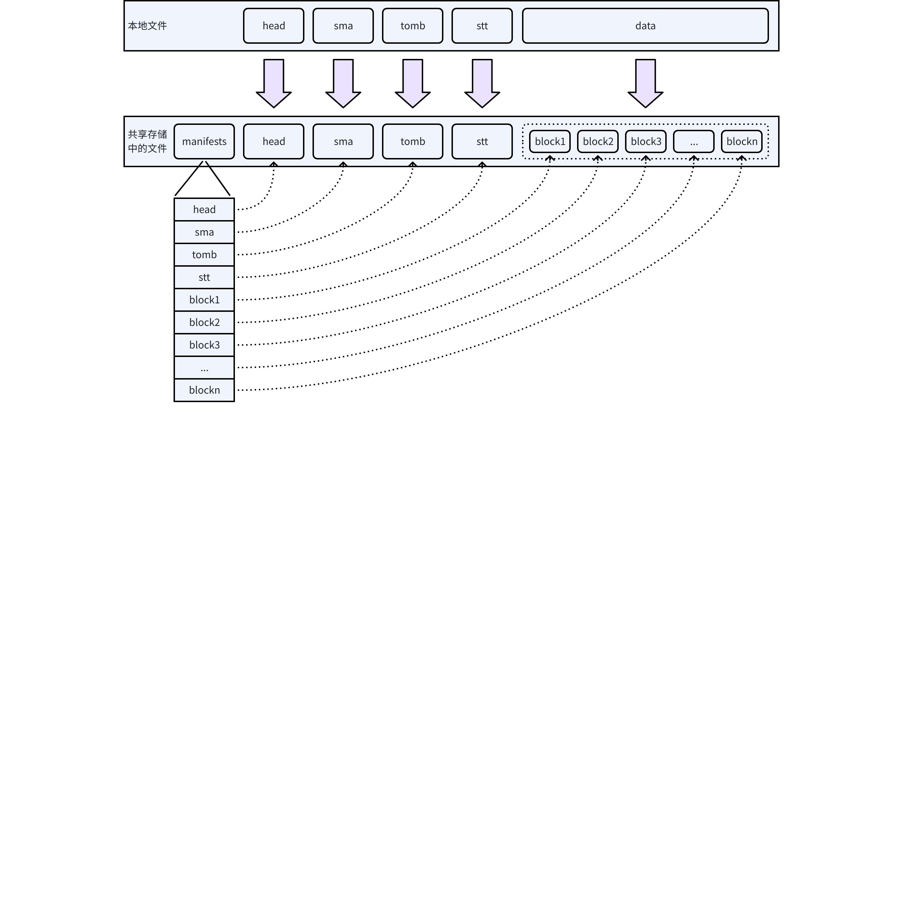
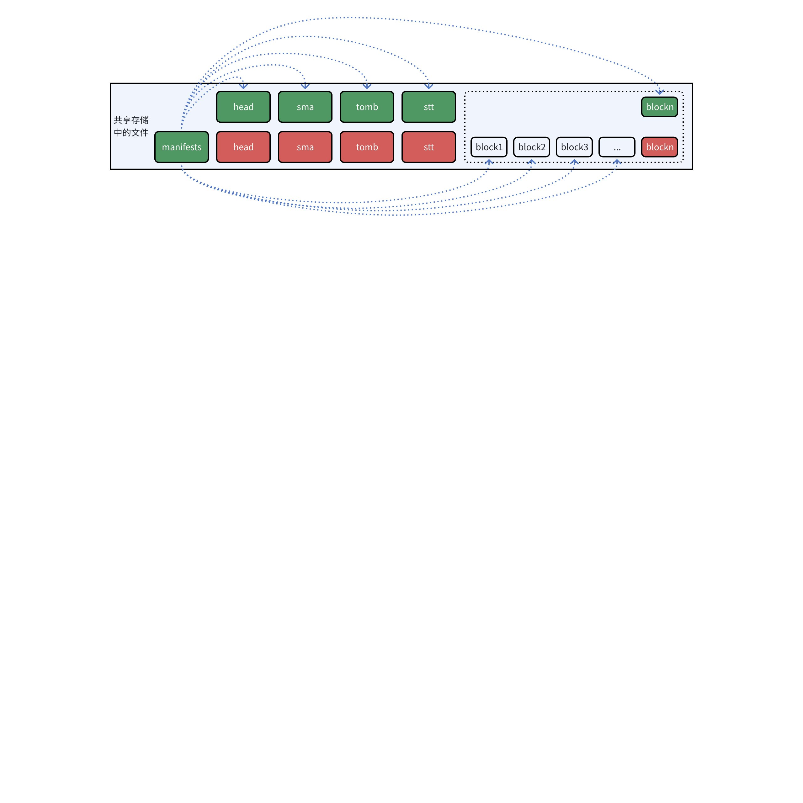
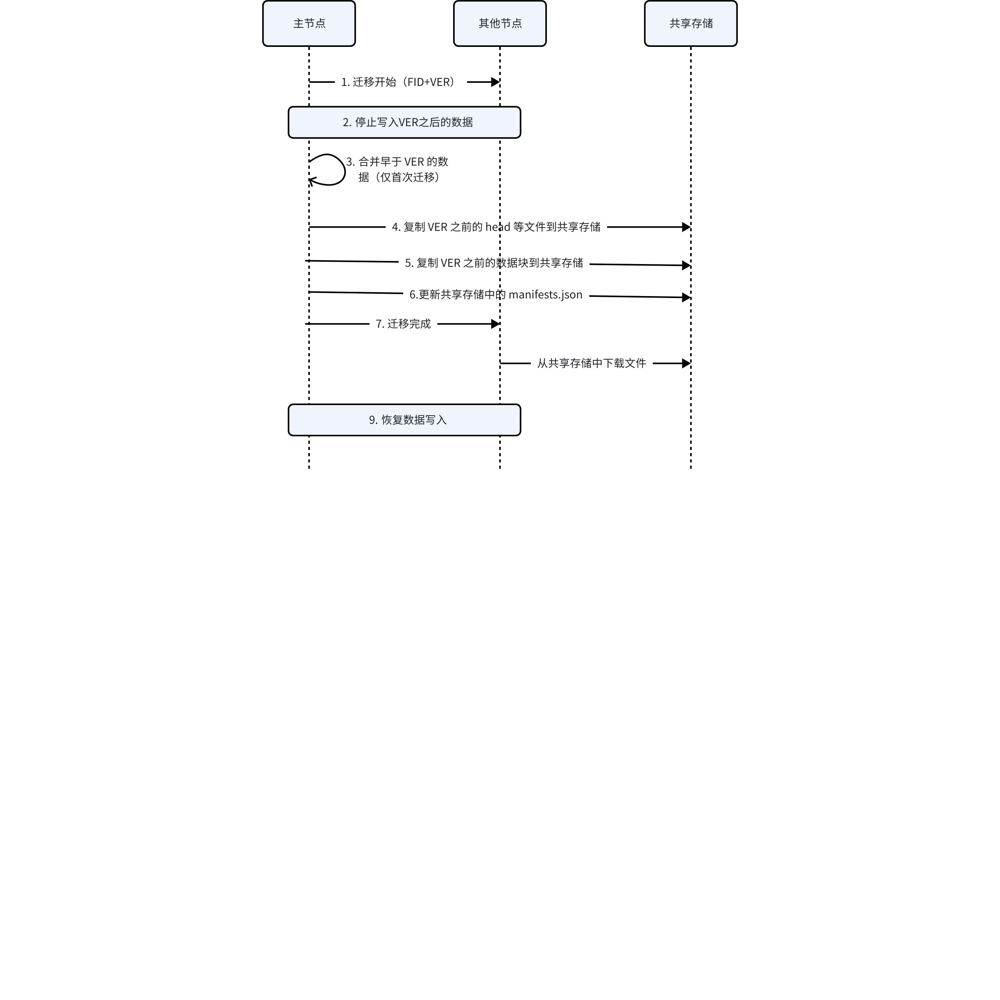
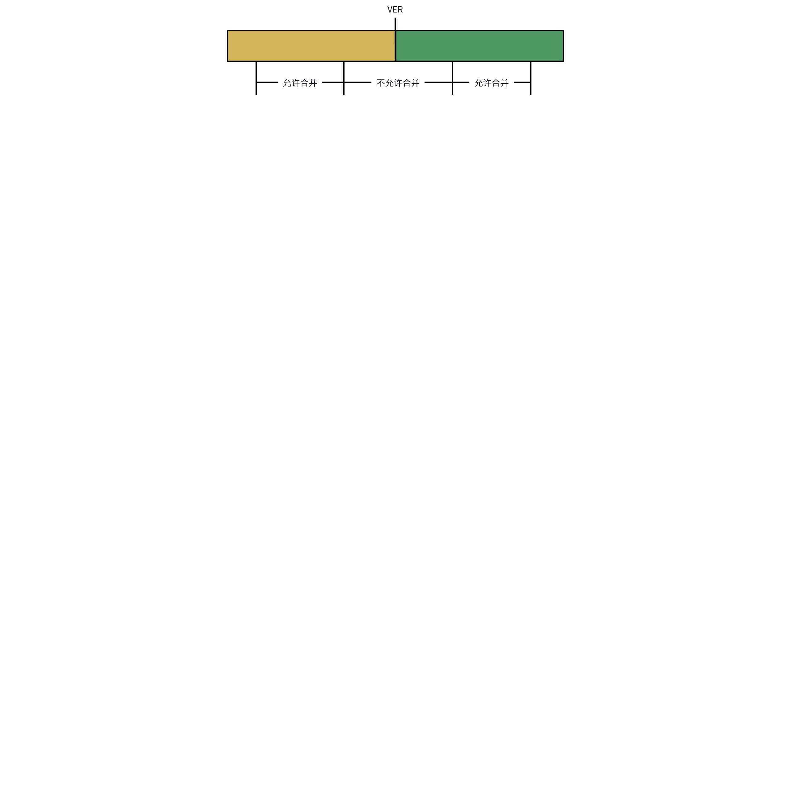
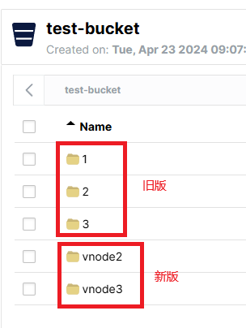

# 共享存储 FS

## 1. 背景

前期版本已经支持使用 S3 等云存储，但在开启三副本时，由于 S3 本身就已经是三副本，会导致实际副本数是九，无谓的增加了用户的成本。[需求说明：支持 S3（修订版）](https://taosdata.feishu.cn/wiki/RFYOwfYq9ibw69k1YeocVE2BnXe)的第 3.3 节已经提出各 vnode 副本应该共享一套 S3 存储资源。[[产品] 多副本的第二、三级存储支持采用共享存储](https%3A%2F%2Fjira.taosdata.com%3A18080%2Fbrowse%2FTS-6107) 则进一步将 S3 存储一般化为共享存储。
JIRA: [TS-6107](https://jira.taosdata.com:18080/browse/TS-6107)

## 2. 变更历史

| 日期 | 版本 | 负责人 | 修改内容 |
| --- | --- | --- | --- |
| 2024/03/25 | 0.1 | 张博民 |  |
| 2024/03/31 | 0.2 | 张博民 | 根据评审意见更新 |
| 2024/04/03 | 0.3 | 张博民 | 根据评审意见，第4.2节修改数据迁移流程；第4.4节修改访问控制参数；第11节，增加1、2、3项。 |
| 2024/07/10 | 0.4 | 张博民 | 将 migrate 文件重命名为 manifests.json； 更新了共享存储和本地垃圾文件的删除逻辑。 |

## 3. 定义

- **S3 对象存储：**一种可扩展的，高可用的分布式存储系统，能够存储大量的非结构化数据对象。
- **共享存储：**由同一个 vgroup 中多个 vnode 共享的存储资源。使用共享存储时，多副本由存储层面负责实现，且共享存储系统一般都实现了某种冗余备份机制（但理论上，共享存储与多副本和冗余备份无关）。使用共享存储后，在 tdengine 层面，多个 vnode 在逻辑上仅维护一个数据副本。

## 4. 行为说明

为支持共享存储，本节定义了将本地文件迁移到共享存储的过程。这一过程，满足以下条件：
- **支持分次迁移：**数据会持续写入，但每次数据迁移只能将本地已有的数据移动到共享存储，所以迁移不可能一次完成，要迁移后续写入的数据，必须再次启动迁移；
- **数据文件只能以追加形式迁移：**数据文件非常大，可能达到数百 GB，故不论是从节约本地存储空间的角度（迁移后，本地数据可以删除），还是节省带宽资源和迁移时间的角度，后续迁移都只能在前次迁移的基础上以追加形式进行；
- **在节点数据物理上不一致的情况下，支持在不同的节点上执行迁移：**节点可能失效，所以前后两次迁移可能由不同节点执行。
总体上，为了满足上述条件，数据迁移机制依赖不同节点在同一文件组中对 “FID + VER” 这一组合的共识，即不同节点具有相同 FID+VER 的数据在逻辑上是一致的。

### 4.1 本地存储与共享存储的文件对应关系

数据迁移以文件组为基本单位，一个文件组中，有 head、sma、tomb、stt、data 等多种文件。如下图所示，在共享存储中，head、sma、tomb、stt 文件与本地文件一一对应，完全一致。但 data 文件过大，为保证更新效率，需拆分为多个数据块。注意，[S3 支持多次写入 - 功能规格](https://taosdata.feishu.cn/wiki/Nvd1wb8iKiw2z6kNhSAcJh9ansb)中所指的数据块是 S3 等对象存储自身的概念，对于其客户端来说，即使一个文件出现了分块，整体上也仍然是一个完整的文件。但为支持跨节点的数据迁移，本文所指的数据块在共享存储中是独立的对象，由 tdengine 负责将数据块整合成 data 文件。


由于迁移过程中可能出现各种意外，为避免出现部分文件迁移完成，部分文件迁移未完成的情况造成数据不一致，共享存储中增加了一个 manifests.json 文件来保证迁移的事务性，其内容始终为最后一次成功迁移后的文件信息。
每次进行数据迁移时，主节点都将本地的 head、sma、tomb、stt 文件复制到共享存储，data文件则只复制更改和新增的数据块。全部复制完成后，更新 manifests.json，让其内容指向新复制的文件，这一步相当于迁移过程的 commit 操作，执行之前，共享存储中保存的是上次迁移完成后的数据，执行之后，保存的是本次迁移完成后的数据。之后，删除被替代的垃圾文件。


### 4.2 数据迁移总体流程

1. 收到 mnode 下发的 rentention 命令后，主节点确定要迁移的文件组的 FID 以及自己当前最新的 VER，将它们作为消息体的一部分，向其他节点发出迁移开始的消息。使用最新的 VER 可以保证在迁移开始的那一刻，所有节点都没有 VER 之后的数据。
2. 对要迁移的文件组，所有节点停止写入 VER 之后的数据。
3. 如果是要迁移的文件组的首次迁移，主节点可以合并早于 VER 的数据；否则不合并。
4. 主节点将 VER 之前的 head、sma、tomb、stt 文件复制到共享存储。
5. 主节点将 VER 之前的 data 文件中被追加过数据的数据块和/或新生成的数据块复制到共享存储。
6. 主节点更新共享存储中的 manifests.json，令其内容指向新复制的文件和数据块。
7. 主节点通知其他节点，到 VER 为止的数据已经迁移到共享存储。
8. 所有从节点从共享存储中下载 head、sma、tomb、stt 和数据文件的最后一个数据块到本地，更新文件组信息后删除之前的文件。
9. 所有节点，重新放开数据写入限制，本次迁移成功完成。


### 4.3 其他需要处理的问题

#### 4.3.1 切主

切主后，新的主节点检测到自己处于数据写入限制状态，则说明前次数据迁移发生意外，可能没有完成，也有可能已经完成但原主节点在发送完成通知前失效。此时：
1. 主节点读取共享存储中的 migrate 文件，确认当前已经完成迁移的 VER。
2. 如果 VER 与迁移开始时的 VER 一致，则迁移已经实际完成，执行第 4.2 节的第 7、8 两步；如果 VER 小于迁移开始时指定的 VER，则迁移并未完成，主节点向其他节点发送取消迁移的消息。
3. 所有节点放开数据写入限制，结束（包括成功和取消两种情况）本次迁移。

#### 4.3.2 本地缓存

继续使用已经实现的 Block Cache，参见[S3 性能优化 - block cache](https://taosdata.feishu.cn/wiki/QviUwUU1QinlTvk1kCNcGYNmnUg)。

#### 4.3.3 垃圾文件

主节点完成迁移后（更新 manifests.json 后），删除共享存储中的垃圾文件。这些文件之前都已经被其他节点下载到本地，故删除它们不会影响正在执行的查询。

#### 4.3.4 过期文件删除

文件组管理 API 已经有了相关实现，过期文件会在更新文件组信息时被自动删除。

### 4.4 配置参数

**访问控制参数：**删除 s3EndPoint, s3AccessKey，s3BucketName，增加 ssAccessString（shared storage access string，仿照数据库的 connection string 命名)。

| # | 参数 | 示例值 | 描述 |
| --- | --- | --- | --- |
| 1 | ~~s3EndPoint~~ | ~~http://cos.ap-beijing.myqcloud.com~~ | ~~用户所在地域的 S3 服务域名~~ |
| 2 | ~~s3AccessKey~~ | ~~AKIDsQmwsfKxTo2A6nGVXZN0UlofKn6JRRSJ:lIdoy99ygEacU7iHfogaN2Xq0yumSm1E~~ | ~~冒号分隔的用户 SecretId:SecretKey~~ |
| 3 | ~~s3BucketName~~ | ~~test0711-1309024725~~ | ~~存储桶名称~~ |
| 4 | ssAccessString | s3:endpoint=192.168.1.52:9000;bucket=ci-bucket;uriStyle=path;protocol=http;accessKeyId=zOgllR6bSnw2Ah3mCNel;secretAccessKey=cdO7oXAu3Cqdb1rUdevFgJMi0LtRwCXdWKQx4bhX;chunkSize=64;maxChunks=10000;maxRetry=5 | 访问参数字符串，第一个冒号之前是存储设备类型，例如 s3、nfs等，后续是具体访问参数，格式由对应的设备类型 api 定义。 |

**DB 参数**（此部分代码里做兼容处理，无需手工修改）**：**

| # | 参数 | 默认值 | 最小值 | 最大值 | 描述 |
| --- | --- | --- | --- | --- | --- |
| 1 | ~~s3_keeplocal~~ 更名为 ss_keeplocal | 365 | 1 | 36500 | 数据在本地保留的时长，即 data 文件在本地磁盘保留多长时间后可以上传到共享存储。必须大于或等于 3 倍的 duration 参数值。支持 m（分钟）、h（小时）和 d（天）三个单位，如不写单位，默认单位为天。 |
| 2 | ~~s3_chunkpages~~ 更名为 ss_chunkpages | 131072 | 131072 | 1048576 | 上传对象的大小阈值，与 tsdb_pagesize 参数均不可修改，单位为 TSDB 页，只能配置为数字。 |
| 3 | ~~s3_compact~~ 更名为 ss_compact | 1 |  |  | 首次上传共享存储前，是否 compact 文件组，0 表示首次迁移不 compact，1 表示首次迁移 compact。 |

**数据上传及缓存参数：**

| # | 参数 | 默认值 | 最小值 | 最大值 | 描述 |
| --- | --- | --- | --- | --- | --- |
| 1 | ~~s3UploadDelaySec~~ 更名为 ssUploadDelaySec | 86400 | 600 | 2592000 (30天） | 默认最后一级存储 data 文件 1 天不再变动后上传至共享存储，单位：秒 |
| 2 | ~~s3PageCacheSize~~ 更名为 ssPageCacheSize | 4096 | 4 | 1024*1024*1024 | 共享存储 page cache 缓存页数目，单位：页 |
| 3 | ~~s3MigrateIntervalSec~~ 更名为 ssAutoMigrateIntervalSec | 3600 | 600 | 100000 | 自动迁移的触发周期，单位：秒 |
| 4 | ~~s3MigrateEnabled~~ |  |  |  | ~~是否开启自动迁移~~ |
| 5 | ssEnabled | 0 | 0 | 2 | 如果值为 0，表示禁用共享存储，为 1，表示启用共享存储但只支持手动迁移，为 2，表示启用共享存储且支持自动迁移。 |

## 5. 性能

对读写性能基本没有影响。

## 6. 兼容性

共享存储导致实际副本数变更，且有 manifests.json 文件等细节变更，支持从之前版本升级，但不与之前版本兼容。具体升级步骤见[本文后半部分](https://taosdata.feishu.cn/wiki/TEWIw8cpBiAYlyk2zWvczJCKn6g#share-JHYndJJsmofbYvxEboyc23tXn5l)。

## 7. 运维

- `s3migrate `命令被重命名为 `ssmigrate`，命令格式和含义不变。
- vgroup 操作，split 操作与优化前一样，暂不支持。其它操作如 DB 的副本变更，增加或减少副本数量, redistribute, compact 均支持。

## 8. 使用场景

存储设备自身支持多副本，需要 tdengine 节约存储资源的场景。共享存储设备需支持以下操作：
- 以文件目录或类似形式管理文件，支持列出目录中的所有文件和子目录。
- 支持创建、删除目录。
- 支持以上传方式创建文件，且创建操作具有原子性（上传未完成，则文件不存在）。
- 支持删除文件，且删除操作具有原子性。
- 支持指定文件范围读取。
- 支持分片数据上传
以上操作，如以 Amazon S3 兼容 API 的形式提供，则 tdengine 直接支持；如 API 不兼容，需定制封装。

## 9. 约束和限制

- 各节点必须配置相同的共享存储，否则，可能出现各节点对哪些数据已经迁移到共享存储缺乏共识的情况，导致混乱。
- 同一文件组的多次数据迁移可由不同节点完成，但由于各节点数据的数据在物理上不一致，故对于单次迁移，切主后无法支持断点续传，只能将当前已经迁移的数据全部作废并由新的主节点重新上传。
- 因系统重启极有可能导致切主，且即使未切主，支持重启后的断点续传的逻辑也比较复杂，故暂不支持重启后的断点续传。

## 10. 常见错误和排查

暂无。

## 11. 未来可能继续做

1. 增加运维命令，清理共享存储中的垃圾文件和过期文件。
2. 首次迁移耗时很长，增加进度信息的显示。
3. 数据迁移过程中，支持被迁移文件组的数据写入。大致方案为：主节点发送数据迁移开始的消息后，所有节点对被迁移的文件组以 VER 为界，停止数据合并。也就是说，迁移开始之后新收到的数据将独立保存，不会与已经存在的数据混在一起。这可以保证迁移完成后，所有节点新收到的数据与已经迁移到共享存储的数据都不存在重叠，即所有节点都可以以追加形式更新共享存储中的数据文件，而不必修改已有的数据块。因为只有同时包含界限前后的数据时才需要禁止合并，如果只包含界限前的数据或只包含界限后的数据，则允许继续合并，故可以支持迁移过程中的数据写入。


1. 将对本地文件访问和对共享存储中的文件访问 API 进行封装，对上层逻辑提供统一的访问接口，以解耦上层逻辑与物理存储，这与 Linux 中的“虚拟文件系统”概念类似，但并不等价。此项改进有助于简化上层逻辑并提供更多的灵活性。此项改进的内容主要包括对下列文件操作的封装：列出文件列表、获取文件信息（stat）、创建文件、删除文件、打开文件、读文件、修改文件（只有追加？）、关闭文件、移动文件指针（seek）、获取当前位置（tell）、文件锁、Flush。由于 tdengine 有非常多的文件操作，且目前的实现未对文件访问进行足够的抽象，故引入此项改进会导致大量代码修改。同时，支持共享存储涉及一些上层业务逻辑，如只有主节点才上传数据、切主后的处理、数据文件分块缓存等。故需考虑分批分步实现。

## 12. 参考文档

[需求说明：支持 S3](https://taosdata.feishu.cn/wiki/HBUqwXZIGiZZ1ukzE4zcpxCanlf)
[需求说明：支持 S3（修订版）](https://taosdata.feishu.cn/wiki/RFYOwfYq9ibw69k1YeocVE2BnXe)
[S3 支持多次写入 - 功能规格](https://taosdata.feishu.cn/wiki/Nvd1wb8iKiw2z6kNhSAcJh9ansb)

TS-6107

[S3 性能优化 - block cache](https://taosdata.feishu.cn/wiki/QviUwUU1QinlTvk1kCNcGYNmnUg)
[S3 对象存储 - 功能规格](https://taosdata.feishu.cn/wiki/JCJkwMhybimdRikjImHcMJtDngc)
[S3 对象存储用户手册](https://taosdata.feishu.cn/wiki/OjmwwCmqdiENPckuo4icjb5fnzc)

## 13. 共享存储升级

3.3.7.0 版发布了共享存储功能，它是对之前 S3 相关功能的增强，但二者并不兼容，故需要手工升级。为便于叙述，下文会将旧版本使用的 S3 相关功能的存储服务和新版本共享存储功能使用的存储服务统称为远端存储。

## 14. 配置文件

### 14.1 远端存储连接参数

旧版本中，远端存储连接参数包括 `s3EndPoint`、`s3AccessKey`、`s3BucketName `三项，以下是一个示例：
```plaintext
s3EndPoint     http://192.168.1.52:9000
s3AccessKey    zOgllR6bSnw2Ah3mCNel:cdO7oXAu3Cqdb1rUdevFgJMi0LtRwCXdWKQx4bhX
s3BucketName   ci-bucket
```

新版本中，为了未来能支持 s3 兼容服务之外的存储设备，将它们合并、增强并一般化为 `ssAccessString`，其值字段的格式为 `<device-type>:<option-name>=<option-value>;<option-name>=<option-value>;...`。目前，`device-type` 只能是 `s3`，以下是一个示例：
```plaintext {wrap}
ssAccessString s3:endpoint=192.168.1.52:9000;bucket=ci-bucket;uriStyle=path;protocol=http;accessKeyId=zOgllR6bSnw2Ah3mCNel;secretAccessKey=cdO7oXAu3Cqdb1rUdevFgJMi0LtRwCXdWKQx4bhX;chunkSize=64;maxChunks=10000;maxRetry=5
```

下表列出了当 `device-type` 是 `s3` 时可以使用的全部参数：

| **参数名** | **参数含义** | **升级说明** |
| --- | --- | --- |
| endpoint | s3 兼容服务的域名或 IP 地址，可包含端口 | `s3EndPoint` 去掉网络协议后的部分，例如 `192.168.1.52:9000` |
| bucket | 存储桶的名字 | `s3BucketName` |
| uriStyle | `virtualHost` 或 `path`，默认是 `virtualHost`。用于指定发送请求时如何使用 `bucket`参数。`virtualHost`表示将其作为域名的一部分，`path`表示将其作为路径的一部分。注意，部分 s3 兼容服务仅支持其中之一 | 新增 |
| protocol | `http` 或 `https`，默认是 `https` | `s3EndPoint` 的网络协议部分 |
| accessKeyId | 用于访问 s3 兼容服务的 access key id | `s3AccessKey` 冒号之前的部分，例如 `zOgllR6bSnw2Ah3mCNel` |
| secretAccessKey | 上述 access key id 对应的密钥 | `s3AccessKey` 冒号之后的部分，例如 `cdO7oXAu3Cqdb1rUdevFgJMi0LtRwCXdWKQx4bhX` |
| chunkSize | 以 MB 为单位的数据片大小，默认值是 64，超过此大小的文件，将使用 multipart 方式上传 | 新增 |
| maxChunks | 单个数据文件的最大分片数量，默认值为 10000 | 新增 |
| maxRetry | 访问 s3 兼容服务时出现可重试错误时的最大重试次数，默认值是 3，负值表示一直重试直到成功为止 | 新增 |

### 14.2 其他参数

- `s3UploadDelaySec` 被重命名为 `ssUploadDelaySec`，含义不变，用于控制 data 文件多长时间不再变动后可以迁移至共享存储；
- `s3PageCacheSize` 被重命名为 `ssPageCacheSize`，含义不变，用于指定共享存储 page cache 缓存页的数量；
- `s3MigrateIntervalSec` 被重命名为 `ssAutoMigrateIntervalSec`，含义不变，用于指定自动迁移的触发周期；
- `s3MigrateEnabled` 被重命名为 `ssEnabled`，且含义发生变化。旧版本中，只用于控制是否开启自动迁移，新版本中，如果值为 0，表示禁用共享存储，为 1，表示启用共享存储但只支持手动迁移，为 2，表示启用共享存储且支持自动迁移。

## 15. 更新应用程序和数据

应用程序和数据的升级方式有两种，下面分别介绍。

### 15.1 第一种方式

1. 升级之前，在旧版本上执行 `compact`，这会将远端存储的数据全部下载到本地。
2. `Compact` 执行成功后，将 TDengine 更新为新版本并准备好新的 `taos.cfg`。
3. 在新版本上执行 `ssmigrate` 命令重新将本地数据迁移到远端存储中。
4. 检查数据的正确性。
这种方式操作步骤简单，不易出错，缺点是升级过程中对本地磁盘空间要求较高、上传下载数据量大，耗时且占用带宽资源。

### 15.2 第二种方式

使用升级工具 `s3toss`，以下是具体步骤：
1. 执行 `flush database XXXX`，确保 wal 中已有的数据已经全部落盘。
2. 将一个节点（以下假设是 dnode 1）停机，然后备份其本地文件（升级工具不会修改和删除远端存储中已经存在的数据，但会修改本地文件，为避免意外，建议备份本地数据文件）。
3. 以 leader 模式在 dnode 1 上执行升级工具：
`s3toss -taoscfg=/path/to/taos.cfg -dnode=1 -mode=leader` 
1. 将 dnode 1 上的 TDengine 更新为新版本并准备好新的 `taos.cfg`。
2. 重新启动 dnode 1，此时 dnode 1 运行的是新版本程序，其他节点是旧版本程序（假设新版本的其他功能也允许以这种方式运行）。
3. 对其他节点依次按以下步骤升级：
   - 停机，然后备份本地文件。
   - 以 follower 模式执行升级工具
`s3toss -taoscfg=/path/to/taos.cfg -mode=follower`
   - 将 TDengine 更新为新版本并准备好新的 taos.cfg。
   - 重新启动。
1. 检查数据的正确性。
这种方式对本地磁盘空间和带宽的要求较第一种方式低，但需要确保升级过程中会被迁移到远端存储的文件组（即已经在旧版本中进行过数据迁移的文件组）没有数据写入，否则，可能导致数据损坏或永久丢失（如果条件允许，建议停机升级）。

## 16. 其他

1. SQL 命令 `s3migrate` 命令被重命名为 `ssmigrate`，语法和含义不变。
2. 数据库参数 `s3_chunkpages` 、`s3_keeplocal` 和 `s3_compact`分别被重命名为 `ss_chunkpages`、`ss_keeplocal` 和 `ss_compact`，语法和含义不变，且代码中做了兼容处理，无需手工修改已有数据库的参数。
3. 在远端存储中，旧版程序的数据保存在以纯数字为名的文件夹中，文件夹名是其对应的 dnode 的 ID；新版程序的数据保存在以 `vnodeX` 为名的文件夹中，`X` 是数字，代表其对应的 vnode 的 ID。升级成功后，旧版数据可按需删除。如下图所示：


1. 如果开启了多级存储，各节点的存储层级和每个层级的挂载点数量必须相同，否则升级过程中和升级成功后，从节点下载数据都可能失败。
2. 已知问题：共享存储的数据迁移（Migration）通过异步任务完成，其中，主节点的 Migration 是从本地将数据上传到共享存储；从节点从共享存储中下载数据到本地。由于系统中 Commit、Merge、Compact、Retention 等也是通过异步任务实现的，而异步任务在不同节点上的执行次序可能不同且无法控制，故为避免数据损坏或丢失，程序检测到以下情况时，会停止迁移：
   - 数据迁移任务已被加入异步任务队列，如在执行之前主节点出现了新的 Commit，则本次迁移会失败。但再次启动迁移会成功（如果不出现其他阻止迁移的情况）；
   - 数据迁移任务已被加入异步任务队列，如在执行之前主节点没有新的 Commit，但从节点有新的 Commit，则主节点上传成功，从节点下载失败；在不出现切主且满足其它迁移条件的情况下，再次启动数据迁移会成功；
   - 如果主节点上传成功但从节点下载失败后出现了切主，则新的主节点无法完成数据上传，迁移会一直失败。将主节点切回可再次成功执行 Migration。
   - 执行 Compact 后，会将远端存储中的数据全部拉回本地，此时，新的 Migration 会一直失败。手动将远端存储中的文件删除后可恢复。

## 17. 附：升级工具的命令行参数

```bash
$ s3toss -h
Usage of s3toss:
  -blocksize int
        Block size of data file in MB, default is 512 (default 512)
  -dnode uint
        ID of the dnode to be processed, required in leader mode
  -fset uint
        ID of the file set to be processed, default is processing all file sets
  -mode string
        Mode of the application, 'leader' or 'follower', required
  -taoscfg string
        Path to the TAOS configuration file, required
  -vnode uint
        ID of the vnode to be processed, default is processing all vnodes
```

其中：
1. `blocksize` 是数据文件切分成的文件块的大小，以 `MB` 为单位，默认是 `512`，此参数必须与升级之前实际使用的参数（即旧版程序在 s3 上的数据块文件的大小）相同。
2. `dnode` 用于指定当前 dnode 的 id，仅 `leader`模式需要此参数。
3. `taoscfg` 用于指定 taosd 使用的 `taos.cfg` 的位置，升级工具会从该配置文件中读取远端存储连接信息、本地文件保存位置等信息。新旧版本远端存储在 `taos.cfg` 中的配置项不同，升级工具同时支持二者，但会优先选择新版配置项。需要注意，升级工具对 `taos.cfg` 的解析逻辑比较粗糙，请务必保证该文件的内容和格式的正确性。
4. `mode` 是升级工具的运行模式，`leader` 模式会将本地文件上传到远端存储，`follower` 模式会将远端存储中的文件下载到本地。只能在一个节点上使用 `leader` 模式，且必须先使用 `leader` 模式后使用 `follower` 模式。
5. `vnode` 是可选参数，如大于 `0`，将只处理该 vnode 上的数据，默认会处理所有 vnode 上的数据。
6. `fset` 是可选参数，如大于 `0`，将只处理该文件组中的数据，默认会处理所有文件组中的数据。
