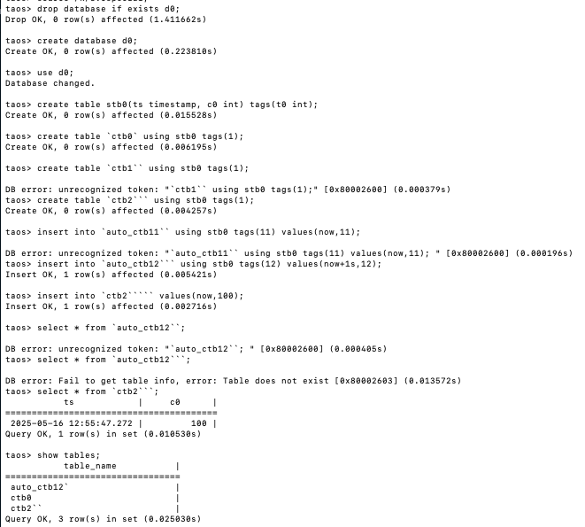
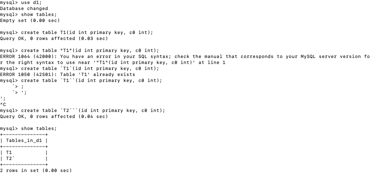
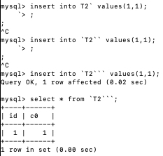
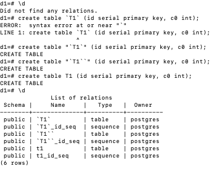
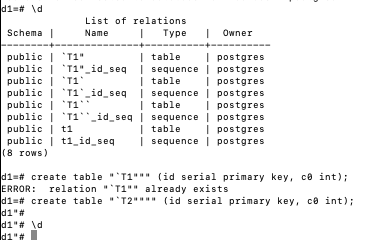
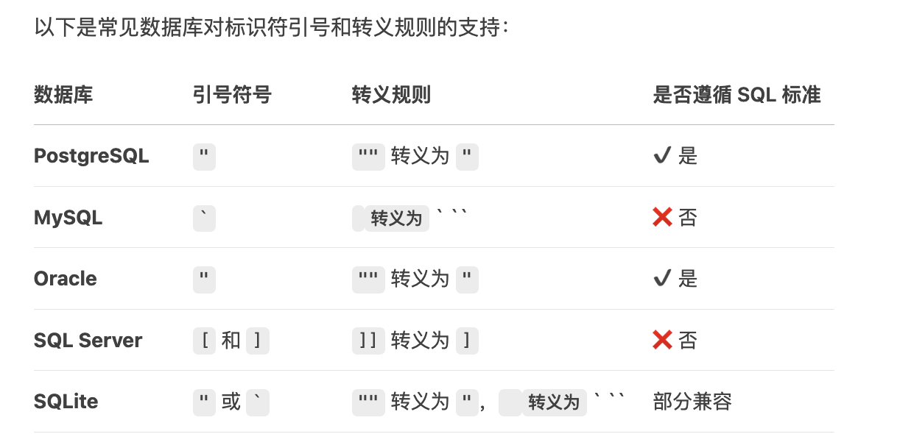

# 数据库表名中关于特殊字符`的处理 FS

## 1. 背景

- 基于 [TS-6532](https://jira.taosdata.com:18080/browse/TS-6532) 的描述，insert 与 create/drop/select 针对 `` 内部的表名处理逻辑不一致，导致通过自动建表创建的表(例如，`ctb```），无法通过 select/drop 进行操作。

## 2. 变更历史

| 日期 | 版本 | 负责人 | 主要修改内容 |
| --- | --- | --- | --- |
| 2025/05/16 | 0.1 | 徐开礼 | 初稿 |
|  |  |  |  |

## 3. 定义

**无**

## 4. 行为说明

### 4.1 ` 的当前行为

#### 4.1.1 TDengine 

在 TDengine 中，[表](https://docs.taosdata.com/reference/taos-sql/table/)的命名规则参照：[命名与边界 | TDengine 文档 | 涛思数据](https://docs.taosdata.com/reference/taos-sql/limit/#%E5%90%8D%E7%A7%B0%E5%91%BD%E5%90%8D%E8%A7%84%E5%88%99)。如果表名包含在 ``中，则`` 之间的部分保持原状。
基于 [TS-6532](https://jira.taosdata.com:18080/browse/TS-6532) 的描述，进行如下验证时发现：
- insert 语句中的表名，`` 之间的 `，奇数个时报错，偶数个时不报错，连续 2 个 ``在表名中会解析为 1 个 ` 。
- create/drop/select 语句中的表名， `` 之间的 `，奇数个时报错，连续偶数个时正常，且 `` 的个数保持原状，不像 insert 语句，2 个变为 1 个。
```plaintext {wrap}
drop database if exists d0;
create database d0;
use d0;
create table stb0(ts timestamp, c0 int) tags(t0 int);
create table `ctb0` using stb0 tags(1);       // 正常执行
create table `ctb1`` using stb0 tags(1);      // 报错
create table `ctb2``` using stb0 tags(1);     // 正常执行，包含两个 ``

insert into `auto_ctb11`` using stb0 tags(11) values(now,11);     // 报错
insert into `auto_ctb12``` using stb0 tags(12) values(now+1s,12); // 虽然包含两个 ``，但最终自动建表生成的表名中，只包含 1 个 `

insert into `ctb2````` values(now,100); // 可以正常往 ctb2`` 中插入数据。
select * from `auto_ctb12``;            // 报错 
select * from `auto_ctb12```;           // 找不到表名 auto_ctb12``
select * from `ctb2```;                 // 正常执行

show tables;
```

运行示例：


#### 4.1.2 MySQL

- 包含在 `` 中的连续 `` 字符会发生转义，即解析为一个 `。




#### 4.1.3 PostgreSQL

- 包含在 "" 的任何字符，保持原状。"" 中包含的 `` 个数在表名中保持不变，不会发生转义。但是，连续的 "" 会发生转义，解析为一个 "（注：奇数个 "  没报错，但是产生了奇怪的行为，不确定是否为 bug）。


- PG 针对 "" 中连续的 "" 解析为 "


### 4.2 ` 的预期行为

- MySQL 中，因为特殊符是 `，所以连续的 `` 被解析为 `。
- PG 中，因为特殊符是 "，所以连续的 `` 保持原状，连续的 "" 会被解析为 "。
- 因此，TDengine 中，create/drop/select/desc/show create table/show create vtable 中的表名，`` 之间的连续 `` 应该被解析为 `，单个的 ` 应该报错(当前行为)。

## 5. 性能

无

## 6. 兼容性

- 针对表名 `` 之间的连续 ``，无论是保持原状解析为 2 个 ``，或解析为 1 个 `，均会有兼容性问题。对比如下：

| 方案 | insert | query/drop/create | 问题 |
| --- | --- | --- | --- |
| `` 保持 2 个 ` | 升级后，自动建表 `t```，**会重新创建出新的表 t``** | 升级/降级后，均可以通过 t`` 查询或 drop | 不符合 `` 之间的连续 `` 当做 ` 的原则 |
| `` 解析为 一个 `（预期修改行为） | 升级后，自动建表 `t```，仍然会使用原表 t`； | 1）升级后， 1.1）可以通过 `t``` 查询或 drop 1.2）**老版本，通过 `t``` create 的表，需要通过 `t````` 才能查询或者 drop** 2）降级后，无法查询表名 t` | 符合 `` 之间的连续 `` 当做 ` 的原则 |

## 7. 运维

无

## 8. 使用场景

无

## 9. 约束和限制

无

## 10. 常见错误和排查

用户操作失败，错误码对照表

| Error code | description | note |
| --- | --- | --- |
|  |  |  |
|  |  |  |

## 11. 可观测性

无

## 12. 安装和卸载

无特殊要求

## 13. 文档

无

## 14. 参考

- 以下为 DeepSeek 的回答：


## 15. 附录

无
