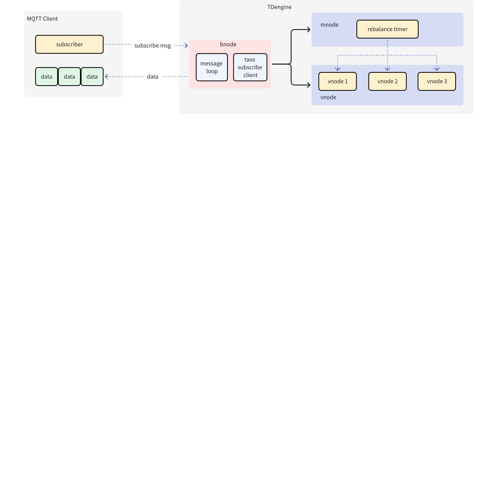
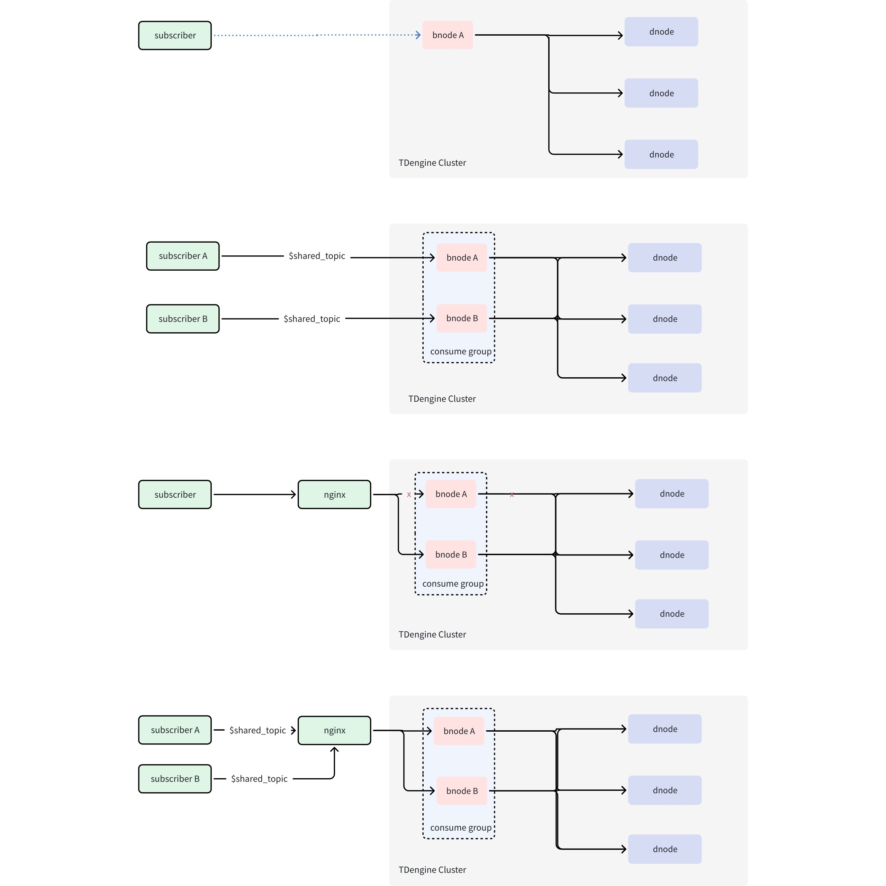

# 数据订阅支持 MQTT  协议 - FS

## 1. 背景

随着工业物联网的快速发展，MQTT 协议因其轻量级、低带宽消耗等特点，已成为工业领域广泛采用的通信协议。目前 TDengine 的数据订阅功能需要用户通过编写程序调用 API 实现，类似于 Kafka 的消费模式，无法实现零代码集成。
为更好地融入工业物联网生态，TDengine 计划支持通过 MQTT 协议进行数据订阅。这将使应用系统能够直接订阅 MQTT Topic 获取数据，显著降低集成复杂度，提升系统易用性。
更多背景情况可以参考需求说明：[数据订阅支持 MQTT 协议 RS](https://taosdata.feishu.cn/wiki/Ij7cwQFasiRNalkPEopc0V4jnue) 
JIRA: [TS-5842](https://jira.taosdata.com:18080/browse/TS-5842)

## 2. 变更历史

| 日期 | 版本 | 负责人 | comment |
| --- | --- | --- | --- |
| 2025-02-26 | v0.1 | 金明磊 | 初版 |
| 2025-03-05 | v0.2 | 金明磊 | 根据线下 review 意见修改，新增 xnode |
| 2025-06-20 | v0.3 | 金明磊 | xnode 修改为 bnode；支持元数据（超级表，库）；增加 rawblock 二进制格式 |
| 2025-03-07 | v1.0 |  |  |

## 3. 定义

1. **MQTT Broker**：消息代理服务器，负责接收、过滤和分发消息
2. **MQTT Publisher**：消息发布客户端
3. **MQTT Subscriber**：消息订阅客户端
4. **MQTT Topic**：消息主题标识符
5. **MQTT QoS**：消息传输质量等级
6. **MQTT 系统主题**：以 $SYS 开头的主题，由 Broker 创建，应用客户端不能创建
7. **MQTT 共享订阅**：MQTT 5.0 特性，支持消息负载均衡
8. **MQTT 遗嘱消息**：客户端异常断开时自动发布的消息
9. **MQTT 保留消息**：持久化存储的最新消息
10. **MQTT 消息持久化**：Broker 的历史消息缓存机制
11. **MQTT 持久化会话**：支持离线消息消费的会话模式
12. **MQTT 非持久化会话**：仅消费实时消息的会话模式
13. **MQTT Bridging**：Broker 间的消息桥接机制
14. **MQTT Over Websocket**：基于 Websocket 的 MQTT 连接
15. **MQTT Over TLS/SSL**：基于 TLS/SSL 的安全连接
16. **MQTT 协议版本**：v3.1, v3.1.1, v5.0

## 4. 行为说明

### 4.1 xnode 节点

**所有 xnode 改为 bnode (broker node)**
在 TDengine 集群中新增 xnode 节点，对外提供 MQTT 数据订阅功能。后续开发的“数据订阅支持 OPC 协议” 也将采用 xnode。对于 xnode 的管理，用户需要通过 TDengine 的命令行接口 taos 进行。因此下述介绍的管理命令都需要先打开 taos, 连接到 TDengine 集群。

#### 4.1.1 创建 xnode

```sql {wrap}
create xnode on dnode {dnode_id} protocol {protocol};
```

1. 一个 dnode 上只能创建一个 xnode。xnode 创建成功后，会自动启动 xnode 子进程 taosmqtt，对外提供 mqtt 订阅服务。例如：`create xnode on dnode 1 protocol 'mqtt'`  。
2. protocol 为可选配置项，不提供时，默认为 “mqtt”，后续可扩展 “opc” 等其它协议。

#### 4.1.2 查看 xnode

```sql {wrap}
taos> show xnodes;
 id |     endpoint         |   protocol |   create_time           | 
===================================================================
  1 | 192.168.0.1:6083     | mqtt       | 2024-11-28 18:44:27.089 |
Query OK, 1 row(s) in set (0.037205s)
```

#### 4.1.3 删除 xnode

```sql {wrap}
drop xnode on dnode {dnode_id};
```

删除 xnode 将把 xnode 从 TDengine 集群中移除，同时停止 taosmqtt 服务。

### 4.2 工作机制

由 xnode 提供 MQTT 数据订阅功能，与原有数据订阅采用相同的主题管理模式，用户需预先创建订阅主题。与标准 MQTT Broker 的发布时创建主题不同，xnode 不支持发布客户端（Publisher），因此无法通过发布消息动态创建主题，所有主题必须预先定义。
下图展示了其基本工作原理：


工作流程如下：
1. **连接建立**：MQTT 订阅客户端与 xnode 建立连接
2. **订阅请求**：客户端发送 SUBSCRIBE 请求，指定目标主题
3. **主题验证**：xnode 根据订阅的主题名称向 TMQ 校验主题是否存在
4. **订阅结果**：若主题存在，返回成功的 SUBACK；若主题不存在，则在返回的 SUBACK 中指定失败原因
5. **数据推送**：当有新数据到达时，xnode 主动将数据推送至订阅客户端

### 4.3 MQTT 版本支持

当前实现优先支持 MQTT v5.0 协议，主要考虑因素包括：
1. **协议先进性**：最新协议标准，有大量客户端支持此版本
2. **场景适配性**：专为物联网场景优化设计，支持共享订阅等高级特性
3. **功能完善性**：提供更完善的错误处理机制和扩展能力
技术实现细节：
1. **传输协议**：基于 TCP/MQTT 协议提供订阅服务
2. **端口配置**：默认监听端口为 6083，支持通过配置文件自定义
3. **版本支持**：当前仅支持 v5.0，暂不支持 v3.1/v3.1.1（下期支持）
<callout emoji="bulb" background-color="light-orange" border-color="light-orange">
MQTT v5.0 由 OASIS 在 2019 年发布，是最新版本，针对物联网场景增加了大量的支持，如共享订阅等。
</callout>

### 4.4 身份验证

采用 TDengine 原生认证机制，具体流程如下：
1. 客户端发起 CONNECT 请求，携带用户名和密码
2. xnode 接收请求并通过 TDengine 验证用户凭证
3. 验证成功：返回 CONNACK 成功响应
4. 验证失败：返回 CONNACK 失败响应
**限制说明**：首期仅支持用户名/密码认证，不支持 TLS/SSL 等加密认证方式（实现 MQTT Over TLS/SSL 后可支持）

### 4.5 **消息订阅**

##### 4.5.0.1 订阅流程

1. 首先，客户端需要成功连接 xnode
2. 然后，发送 SUBSCRIBE 请求，指定目标主题
3. xnode 接收到请求后，校验主题是否存在
  - 主题存在：订阅成功，返回成功的 SUBACK
  - 主题不存在：订阅失败，返回失败的 SUBACK

##### 4.5.0.2 主题管理特点及与标准 MQTT 的差异

由于 xnode 不存在发布客户端，因此主题管理机制与标准 MQTT 协议存在以下区别：
1. 主题必须预先创建，无法通过发布消息动态创建
2. 订阅时主题不存在会直接返回失败，而非等待主题创建
3. 主题不支持通配符（如 +, #），不支持 MQTT 系统主题
4. 支持订阅查询主题，超级表主题，及库主题

#### 4.5.1 共享主题

共享订阅是 MQTT v5.0 的核心特性之一，xnode 通过以下方式支持共享订阅：
- **共享主题标识**：订阅以 `$share/` 开头的主题被视为共享订阅，否则就是普通订阅，例如 `$share/iot-data` 就是一个共享订阅
- **消息分发机制**：xnode 会把共享订阅的数据均匀分发给同一组内的所有订阅客户端
- **应用场景**：适用于需要负载均衡和高可用性的场景，如多客户端并行消费

#### 4.5.2 服务质量（QoS）

xnode 支持两种服务质量等级，客户端在订阅时可指定 QoS 级别：

##### 4.5.2.1 支持的 QoS 级别

1. **QoS 0（至多一次）**
   - 特点：消息可能丢失，但不会重复
   - 适用场景：对数据完整性要求不高的场景，如实时监控
2. **QoS 1（至少一次）**
   - 特点：消息不会丢失，但可能重复
   - 适用场景：对数据完整性要求较高的场景，如告警系统

##### 4.5.2.2 限制说明

1. 目前只有自发布消息，仅支持 QoS 0, 1，QoS 2 会降级为 1；其它值会导致订阅失败
2. 本期不支持 QoS 2（有且仅有一次）

#### 4.5.3 消息格式

xnode 推送的消息遵循 MQTT v5.0 协议规范，消息格式如下：

##### 4.5.3.1 消息属性

1. **Payload Format Indicator**
  - 值固定为 `1`，表示消息负载由 Content Type 指定
1. **Content Type**
  - 值为 `TDengineJsonV1.0`，表示消息内容遵循 TDengine UTF-8 编码的 JSON 格式规范
  - 值为 `TDengineRawblockV1.0`，表示消息内容为二进制格式，详见：[Raw block 结构说明](https://taosdata.feishu.cn/wiki/TsBrwAGRxi1lsyktsEFcOzPVnWg)
  - 后续可扩展其它格式，比如压缩文本，Protobuf 等，**并通过用户自定义属性在发起订阅请求时指定协议**

##### 4.5.3.2 消息内容示例

比如，用户创建下面的订阅主题：
```sql {wrap}
create topic if not exists topic_meters as select ts, current, voltage, phase, groupid, location, tbname from test.meters;
```

客户端订阅之后，会接收到下面的消息：
```json
{
"topic": "topic_meters",
"rows": [
  {
    "ts": 1596157444170,
    "current": 1.2,
    "voltage": 5,
    "phase": 0.31,
    "groupid": 2,
    "location": "California.SanFrancisco",
    "tbname": "d1001"
  },
  {
    "ts": 1596157444171,
    "current": 1.3,
    "voltage": 3,
    "phase": 0.21,
    "groupid": 1,
    "location": "California.SanFrancisco",
    "tbname": "d1001"
  }
]}
```

##### 4.5.3.3 数据格式说明

1. **数据列**：与创建主题时指定的 SQL 查询字段一一对应
2. **数据类型**：与 TDengine 原生 API `taos_print_row` 返回的格式保持一致
3. **JSON 结构**：
   - `topic`：主题名称
   - `rows`：数据行数组，每行包含查询字段的具体值
4. **二进制消息实现方式**：在订阅请求中增加 MQTT 用户自定义属性
   - 属性名：`proto`
   - 属性值：`"rawblock"`（字符串类型）
通过这种标准化的消息格式，客户端可以轻松解析和处理订阅数据。

#### 4.5.4 起始位置

在订阅主题时，xnode 支持指定数据消费的起始位置，以满足不同的业务需求：

##### 4.5.4.1 默认行为

1. **起始位置**：`latest`
2. **行为说明**：客户端从订阅时刻的最新数据开始消费，不接收历史数据

##### 4.5.4.2 指定起始位置为 earliest

1. **使用场景**：需要消费历史数据的场景
2. **实现方式**：在订阅请求中增加 MQTT 用户自定义属性
   - 属性名：`sub-offset`
   - 属性值：`"earliest"`（字符串类型）
3. **行为说明**：客户端从最早的数据(WAL 最早的)开始消费，确保不遗漏任何历史消息

### 4.6 持久会话与离线消息支持

xnode 支持 MQTT v5.0 的持久会话机制，确保客户端在断开连接后仍能消费离线消息

#### 4.6.1 会话过期时间配置

1. **配置方式**：客户端在 CONNECT 请求中指定会话过期时间
2. **取值范围**：
  - `0-4294967294`：以秒为单位的过期时间，一般客户端默认 0
  - `-1` 或 `4294967295`：表示会话永不过期

#### 4.6.2 行为说明

1. **会话未过期**：
   - 客户端断开连接后，会话仍保留
   - 客户端重新连接后可继续消费离线期间的消息
2. **会话过期**：
   - 客户端断开连接后，会话在指定时间后被清除
   - 重新连接后，客户端无法消费过期期间的消息

#### 4.6.3 应用场景

1. **持久会话**：适用于需要保证消息不丢失的场景，如关键业务数据的消费
2. **非持久会话**：适用于实时性要求高、允许消息丢失的场景，如实时监控

#### 4.6.4 **示例**

1. 配置：客户端 CONNECT 请求中指定会话过期时间为 3600 秒（1 小时）："sessionExpiryInterval": 3600
2. 结果：客户端断开连接后，会话在 1 小时内有效，期间的消息可被消费
通过灵活的起始位置和会话管理机制，xnode 能够满足不同场景下的数据订阅需求，同时确保数据的可靠性和完整性。

### 4.7 高可用性与负载均衡

xnode 通过共享订阅和 TDengine 消费组功能的结合，实现高可用性和负载均衡，确保系统在异常情况下仍能稳定运行。以下是具体实现机制和优势：

#### 4.7.1 共享订阅机制

1. **共享组**：所有订阅同一共享主题的 MQTT 客户端根据指定的组标识组成一个共享组。
2. **消息分发**：共享主题的消息会均匀分发给组内的所有客户端，避免单个客户端负载过高。
3. **水平扩展**：通过增加订阅客户端，可以轻松水平扩展消费能力，适应高吞吐量场景。
**示例**：
1. 共享主题：`$share/<group_id>/iot-data`
2. 行为：消息会轮询分发给订阅该主题的所有客户端，确保负载均衡。
---

#### 4.7.2 消费组功能

1. **进度共享**：订阅同一共享主题的客户端共享消费进度，确保数据不会重复或遗漏。
2. **负载均衡**：消息在组内客户端之间均匀分配，避免单个客户端成为性能瓶颈。
3. **自动重平衡**：当客户端或 dnode 发生故障时，系统自动重新分配负载，无需人工干预。
**示例**：
1. 客户端 A、B、C 订阅 `$share/<group_id>/iot-data`
2. 客户端 B 宕机后，其负载会自动转移给客户端 A 和 C
---

#### 4.7.3 高可用性设计

xnode 通过以下机制确保服务的高可用性：
1. **多 xnode 支持**：
   - 客户端可以连接集群中的任意 xnode
   - 当某个 dnode 不可用时，客户端可自行切换到其他 dnode
2. **故障容错**：
   - 单个 xnode 宕机不会影响整体服务
   - 单个客户端宕机不会影响共享组内其他客户端的消费
3. **无缝切换**：
   - xnode 或客户端故障时，系统自动完成负载重分配
   - 客户端无需重新订阅或手动干预
---

#### 4.7.4 预期效果

通过共享订阅和消费组功能的结合，xnode 实现了以下关键优势：
1. **服务连续性**：
   - 单个 dnode 宕机不会导致推送服务中断
   - 客户端可自动切换至其他可用 dnode
2. **消费端高可用**：
   - 共享组内单个客户端宕机不影响其他客户端的消费
   - 消息会重新分配给组内其他客户端
3. **弹性扩展**：
   - 通过增加订阅客户端，可轻松扩展消费能力
   - 系统自动处理负载均衡和故障转移


xnode 的共享订阅和消费组功能为 MQTT 数据订阅提供了强大的高可用性和负载均衡能力，能够有效应对节点故障和高并发场景，确保服务的稳定性和可靠性。

### 4.8 配置选项

##### 4.8.0.1 ~~**mqtt**~~

- ~~说明：是否在 xnode 中启动 mqtt 服务~~
- ~~类型：整数；0：不启动，1：启动~~
- ~~默认值：0~~
- ~~最小值：0~~
- ~~最大值：1~~
- ~~动态修改：支持通过 SQL 修改，重启生效~~
- ~~支持版本：从 v3.3.7.0 版本开始引入~~
- 在 xnode 中通过 protocol 参数指定，此配置项去掉

##### 4.8.0.2 mqttPort

- 说明：xnode 监听 MQTT 协议的端口
- 类型：整数
- 默认值：6083
- 最小值：1
- 最大值：65056
- 动态修改：不支持
- 支持版本：从 v3.3.7.0 版本开始引入

### 4.9 功能进度划分

#### 4.9.1 本期实现的功能

1. MQTT v5.0
2. MQTT QoS 0/1 
3. MQTT 共享订阅

#### 4.9.2 后续考虑实现的功能

1. MQTT Over TLS/SSL
2. MQTT Over Websocket
3. MQTT v3.1, v3.1.1
4. QoS 2

## 5. 性能

#### 5.0.1 测试环境

1. 服务器：8核16GB
2. 数据库：4 VGroups
3. 数据量：1万设备 × 10万记录

#### 5.0.2 性能指标

1. 连接速度：<3秒
2. 消息成功率：满足指定 QoS
3. 并发能力：100主题 × 1000订阅者
4. 吞吐量：
  - QoS 0：2000k msg/s
  - QoS 1：800k msg/s
1. 延迟：1-1000ms

#### 5.0.3 其它

1. 需要做与原有数据订阅的性能对比。
2. 在测试规格文档中可增加 CPU、内存、网络流量等系统指标，并明确给出具体详细的指标项。

## 6. 兼容性

1. 与现有版本完全兼容
2. 支持平滑升级和回退（v3.3.5.0 以前的版本不支持回退）

## 7. 可观测性

本期兼容原有的 SHOW SUBSCRIPTIONS; SHOW TOPICS; 等观测命令，其中包括消费状态，进度，是否 MQTT等信息。
更完善观测指标及观测方式，包括可视化界面在第二期开发。

## 8. 文档

在官网提供用户手册。

## 9. 运维

高可用场景中，订阅客户端可以通过 LB 把连接均匀分配到各个 dnode 节点，避免负载过于集中某一个节点，导致系统负载不均衡。

## 10. 使用场景

### 10.1 工业设备实时监控

在工业物联网场景中，MQTT 订阅功能可用于实时监控设备运行状态。通过订阅设备传感器数据（如温度、压力、电流等），系统能够实时获取设备运行指标，及时发现异常情况并触发告警。例如，在智能制造场景中，工厂可以通过订阅生产线设备的实时数据，实现设备状态的可视化监控和预测性维护。

### 10.2 智能交通数据采集

在智能交通系统中，MQTT 订阅功能可用于采集交通流量、车辆状态等实时数据。例如，订阅交通信号灯、摄像头、车载传感器等设备的数据，能够为交通管理部门提供实时路况信息，优化交通流量分配。同时，车联网场景中，订阅车辆电池状态、行驶数据等信息，可为新能源汽车的运营管理提供数据支持。

### 10.3 能源管理与环境监测

在能源管理领域，MQTT 订阅功能可用于实时采集电力、水务、燃气等能源数据，支持能源消耗的精细化管理和优化。例如，订阅智能电表、水表等设备的实时数据，能够实现能源使用的实时监控和异常检测。此外，在环境监测场景中，订阅空气质量、温湿度等传感器数据，可为环境保护决策提供数据支持。

### 10.4 智慧城市与楼宇自动化

在智慧城市建设中，MQTT 订阅功能可用于集成各类城市基础设施数据，如路灯、停车场、安防系统等。通过订阅这些设备的实时数据，能够实现城市资源的智能化管理。在楼宇自动化场景中，订阅 HVAC（暖通空调）、照明、安防等系统的数据，可实现楼宇能源的优化管理和舒适度调控。

## 11. 约束与限制

### 11.1 明确不支持的 MQTT 功能

1. 消息发布
2. 主题别名
3. 遗嘱消息，保留消息

### 11.2 其它限制

1. 当前实现仅支持标准 linux 64 位服务器，后续再根据需求情况考虑对 windows 以及其他平台的支持。
2. 现有数据订阅确保 at least once 消费，但当消费速度过慢，远远小于数据生产速度的情况下，TMQ 无法继续保证 at least once，在这种情况下 QoS 1 的服务质量可能无法得到保证。
3. 其它限制请参考第四部分各小节的说明

## 12. 常见错误与排查

客户端连接或订阅 xnode 失败时，可通过响应中的 Reason string 字段判断失败的原因。

## 13. 参考文档

[数据订阅支持 MQTT 协议 RS](https://taosdata.feishu.cn/wiki/Ij7cwQFasiRNalkPEopc0V4jnue) 
[数据订阅原理使用及实现](https://taosdata.feishu.cn/wiki/R0ofwcyNIim1PKkmHj5ckSajnhe)
[Raw block 结构说明](https://taosdata.feishu.cn/wiki/TsBrwAGRxi1lsyktsEFcOzPVnWg)
[TDengine 向 MQTT Broker 发布数据 RS](https://taosdata.feishu.cn/wiki/RUMgwl7KTisvDOk7njYcIEPunxg)
[方案讨论](https://taosdata.feishu.cn/wiki/MtPsww7JJiQiuIkBHgkc3skknib)
[数据订阅性能测试说明](https://taosdata.feishu.cn/wiki/Y5nmwuAsZikY63khJPWcWJPGn4g)
[如何评判数据订阅的性能？——抓住关键，简化问题](https://taosdata.feishu.cn/wiki/WgdrwlVFQidX59kQdECcUJt5nyd)
MQTT 5.0 MQTTX bench sub: https://mqttx.app/docs
https://www.altoroslabs.com/blog/a-collection-of-mqtt-broker-performance-benchmarks-2020-2023/
https://docs.taosdata.com/advanced/subscription/
https://docs.taosdata.com/develop/tmq/
https://docs.taosdata.com/tdinternal/topic/
https://docs.oasis-open.org/mqtt/mqtt/v5.0/mqtt-v5.0.html
http://docs.oasis-open.org/mqtt/mqtt/v3.1.1/os/mqtt-v3.1.1-os.html

TS-5842
